# Live Ninja — Product Requirements Document

**Version:** 1.1 · **Date:** 2026-07-17 · **Owner:** Jeremy Proffitt · **Status:** Draft

## Executive Summary

Live Ninja is a personal, always-available speech-to-speech AI assistant delivered across three Login-with-Amazon-gated surfaces — an Android app that becomes the phone's default voice assistant, a responsive web application, and an ambient M5Stack Tab5 embedded voice terminal on the desk — all sharing a single serverless AWS backend built on Go-Fiber (Lambda Web Adapter, arm64/Graviton) and OpenAI's GPT Realtime engine. The backend's core responsibilities are to broker short-lived OpenAI Realtime ephemeral tokens so the API key never touches a client, run the LWA OAuth exchange and mint first-party session credentials with surface-specific lifetimes (30 days for web/Android, 10 years for the M5Stack), persist users/devices/sessions/wake-word configs/usage in a single-table DynamoDB with strict Query/GetItem-only access, and serve the web UI and device config assets. Wake-word detection is always on-device on every surface — a hard architectural privacy invariant — and is user-programmable ("Hey Live Ninja" by default). This document specifies the vision, personas, functional and non-functional requirements per surface, UX rules, system architecture, voice experience, authentication, data model, security/privacy posture, KPIs, risks, and the baked-in decision for every open question.

**Version 1.1 additions (fully specified below).** Beyond the three core surfaces, the platform adds: (1) a **Deliverables Store** — the assistant can create files, zip them, and deliver them as separate, durable, per-user downloadables on S3 (indexed in DynamoDB), reachable identically from the website Download Center and the Android Files tab (see FR-DLV-01..06, milestone M9); (2) a **Memory Layer** — a structured personal memory organized by **people, places, and information** with **organizational** (projects/lists) and **planning** (goals/tasks) capabilities, backed by a DynamoDB entity/relationship graph + S3 Vectors semantic recall with an optional local RAG sidecar (see FR-MEM-01..06, milestone M10); and (3) **Guide Entities** — standing guidance injected into *every* session on every surface, shipping with a default guide that treats AI as a fast-moving field and prefers sources published/updated within the last 30 days or the official technical docs of leading AI providers such as Anthropic and OpenAI (see FR-MEM-07..09).

| Metadata | Value |
|---|---|
| Document version | 1.0 |
| Date | 2026-07-17 |
| Owner | Jeremy Proffitt |
| Status | Draft |
| Product | Live Ninja |
| Domain | `live.jeremy.ninja` (aliases `web.live.ninja` / `auth.live.ninja`) |
| AWS account / region | `759775734231` · `us-east-1` |
| Repo | `JeremyProffittOrg/live-ninja` |
| Cost center | `voice-ai` |

---

## 1. Vision & Goals; Non-Goals

### 1.1 Vision

Live Ninja is a single, coherent voice assistant that follows the user across every context of their day — pocket (Android), desk (M5Stack Tab5), and browser (web) — with identical persona, memory, and capabilities regardless of surface. It is private by construction (wake detection never leaves the device), cheap to run (serverless, cost-guarded, no scans, no secrets managers), and conversationally instant (direct client↔OpenAI audio, sub-second first response, barge-in). It is a personal product for a production-only, single-operator shop, engineered to the same rigor as a commercial platform.

### 1.2 Goals

| Goal | Description |
|---|---|
| G-1 | One shared backend and one persona/settings contract across all three surfaces. |
| G-2 | Speech-to-speech conversation with barge-in and server-side tool execution. |
| G-3 | On-device, user-programmable wake word on every surface; no always-on cloud audio. |
| G-4 | LWA identity front-door with first-party sessions (30-day web/Android, 10-year M5Stack). |
| G-5 | OpenAI API key never reaches any client; ephemeral tokens only. |
| G-6 | Strict cost discipline: Query/GetItem-only DynamoDB, on-demand billing, per-user metering/quotas, budget alarms. |
| G-7 | Production-grade security/privacy: encrypted-at-rest, revocable credentials, deletion rights, threat-modeled. |
| G-8 | OIDC-only GitHub Actions deploys; no local deploys, no static keys, mandatory cost tags. |

### 1.3 Non-Goals

- **N-1:** No multi-tenant SaaS, org/team management, or billing/subscription system (personal product).
- **N-2:** No telephony/SIP surface.
- **N-3:** No on-device ASR/LLM/TTS — all conversation runs through OpenAI Realtime (with a server-side chained fallback).
- **N-4:** No staging/dev environment — production-only, guarded by local smoke tests, alarms, and canary rollouts.
- **N-5:** No third-party analytics SDKs (privacy + cost); analytics derive from the self-hosted Athena event lake.
- **N-6:** No relaying of any surface's audio (web, Android, or M5Stack) through AWS — all audio is direct client↔OpenAI; AWS is never in the media path.
- **N-7:** No secrets manager (SSM Parameter Store SecureString / KMS only).

---

## 2. Personas & Primary Use Cases

### 2.1 Phone-primary-assistant user (Ava)

Ava has made Live Ninja her phone's default digital assistant. She invokes it hands-free by saying "Hey Live Ninja" (on-device Porcupine wake), by the assist gesture, by long-press power, or from her Bluetooth headset — even over the lock screen. Primary use cases: dictate and send an email while driving, set timers/reminders, ask quick questions, control her M5Stack, all with barge-in so she can interrupt mid-answer.

### 2.2 Desktop / web user (Wei)

Wei uses Live Ninja in the browser at his desk. He signs in with Amazon, clicks the large mic button (or optionally enables in-browser WASM wake word), and has a speech-to-speech conversation with a live transcript and audio visualizer. He manages persona, voice, and wake-word settings from a schema-driven settings page. Primary use cases: longer working conversations, reviewing/exporting transcripts, tuning settings that then sync to his other surfaces.

### 2.3 Ambient M5Stack-on-desk user (Maya)

Maya has an M5Stack Tab5 sitting on her desk, paired once via its config page and persisting for years. It shows an idle "Say 'Hey Live Ninja'" screen. She speaks to it hands-free; the device does on-device wake + AEC, fetches a short-lived ephemeral token from the broker Lambda, connects directly to the OpenAI Realtime API (WebRTC on the ESP32-P4, WSS + Opus/PCM16 fallback), and plays the response back with instant local barge-in. IoT Core carries only control/telemetry, never audio. Primary use cases: glanceable ambient assistant, quick questions/timers/device actions without touching a phone, a persistent household terminal.

---

## 3. Functional Requirements by Surface

Acceptance criteria (AC) are testable. IDs are stable references.

### 3.1 Backend

| ID | Requirement | Acceptance Criteria |
|---|---|---|
| FR-B01 | Single Go-Fiber app on Lambda Web Adapter behind HTTP API Gateway v2, arm64. | Same binary runs locally on `:8080` and in Lambda; `$default` route forwards to Fiber; deployed via SAM. |
| FR-B02 | `realtime-broker` mints OpenAI ephemeral client secrets from the SSM-held key. | `GET /api/v1/realtime/session` returns an `ek_...` token + session/persona/tool manifest; standing key never in response or client. |
| FR-B03 | Single-table DynamoDB `live-ninja`, on-demand, Query/GetItem only. | No `Scan` on any serving path (code review + `ConsumedReadCapacityUnits` alarm); two GSIs cover inverse lookups. |
| FR-B04 | S3 presigned upload/download with content-type allowlist, size cap, owner-namespaced keys. | `POST /api/v1/uploads` returns a presigned PUT with pinned `Content-Type`/`Content-Length`; download authorizes key prefix == caller `userId`. |
| FR-B05 | SES transactional email off the request path via SQS → `email-dispatch`. | Source is a DKIM-verified `@jeremy.ninja` identity, Reply-To `proffitt.jeremy@gmail.com`; idempotency prevents duplicate sends. |
| FR-B06 | IoT Core MQTT control-plane ingest for device telemetry/heartbeat. | IoT Rule → `iot-ingest` writes `PutItem` (never Scan) updating `DEVICE#` lastSeen/telemetry. |
| FR-B07 | `usage-rollup` aggregates raw usage logs into daily rollups hourly. | Dashboards read `ROLLUP#` items via Query; no raw-log fan-out. |
| FR-B08 | Secrets in SSM SecureString, cached in-memory with TTL; broker IAM-scoped to the OpenAI key. | Broker role has `ssm:GetParameter` on one ARN + `kms:Decrypt` only; secrets never logged. |
| FR-B09 | Per-user rate limiting and budget gate at token mint. | Over-quota mint returns `402`/`429`; token-bucket enforced via DynamoDB conditional writes. |
| FR-B10 | Server-side tool execution via `POST /api/v1/tools/invoke` under LN-JWT. | Tool calls authorized against the calling user; side-effecting tools carry idempotency keys and audit records. |

### 3.2 Voice / GPT-Realtime

| ID | Requirement | Acceptance Criteria |
|---|---|---|
| FR-V01 | Speech-to-speech via `gpt-realtime`, config-bound session at mint. | Session object (model, voice, instructions, tools, `semantic_vad`, audio format) fixed server-side; client cannot escalate tools/persona. |
| FR-V02 | Direct client↔OpenAI audio on every surface (WebRTC web/Android; WebRTC or WSS+Opus/PCM16 fallback for the M5Stack). | AWS is never in the media path for any surface; the M5Stack connects directly to OpenAI with a broker-minted ephemeral token, never through an AWS audio relay. |
| FR-V03 | Barge-in via `interrupt_response`. | On `speech_started`, client stops/flushes playback within ≤150 ms; the M5Stack stops its DAC locally and issues `response.cancel` + buffer clear on its own direct session. |
| FR-V04 | Tool/function calling routed server-side. | All surfaces (web, Android, M5Stack) forward `function_call`s over HTTPS to `POST /v1/tools/invoke`; `function_call_output` returned to the session. |
| FR-V05 | Transcript capture both directions. | User ASR and assistant transcripts persisted as `TURN#`/`LOG#` items with TTL; rendered as labeled turns, never raw JSON. |
| FR-V06 | Per-session usage metering from `response.done`. | Atomic `UpdateItem ADD` on `USAGE#`/monthly counters; EMF metrics emitted; enforced pre-spend at mint. |
| FR-V07 | Fallback cascade on Realtime failure. | Retry+backoff → chained STT→LLM→TTS → text-only → graceful failure with side-effects queued; tools still function. |
| FR-V08 | Idle/duration caps. | Session auto-closes after inactivity and at the OpenAI session cap; no billing on abandoned sessions. |

### 3.3 Auth

| ID | Requirement | Acceptance Criteria |
|---|---|---|
| FR-A01 | LWA Authorization Code + PKCE, backend as confidential client/BFF. | Code exchanged server-side with client secret from SSM; clients never hold LWA client secret. |
| FR-A02 | Token-substitution defense. | Backend validates `aud == our client_id` via `/tokeninfo` and derives identity (`user_id`) from `/user/profile`. |
| FR-A03 | First-party hybrid session: stateless ES256 access JWT (15 min) + stateful rotating refresh token. | JWT verified at edge with no DB read; refresh stored hashed, rotated on use with reuse detection. |
| FR-A04 | Web 30-day sliding session in `__Host-` HttpOnly cookie. | Refresh cookie `Secure; HttpOnly; SameSite=Lax`; access JWT in memory only; TTL slides on each rotation. |
| FR-A05 | Android 30-day session, refresh in Keystore-backed EncryptedSharedPreferences. | PKCE via Custom Tabs + App Link; backend confidential exchange; refresh in memory/Keystore split. |
| FR-A06 | M5Stack device-hosted pairing, 10-year silently rotated credential lineage. | Device-generated PKCE + pairing nonce; backend-completed exchange; device claims via poll presenting verifier; 10-year family TTL reset on each rotation. |
| FR-A07 | Revocation: logout, logout-everywhere, device revoke. | Session row delete kills refresh immediately; `tokensValidAfter` bump kills all JWTs within the 60 s authorizer cache; device revoke detaches IoT cert + family. |
| FR-A08 | New-sign-in SES tripwire. | New device/surface login sends a security-alert email out-of-band. |

### 3.4 Android

| ID | Requirement | Acceptance Criteria |
|---|---|---|
| FR-N01 | Implement `VoiceInteractionService`/`Session` assistant contract and acquire `ROLE_ASSISTANT`. | Manifest declares the services with `BIND_VOICE_INTERACTION`; role requested via `RoleManager` with OEM-aware guided fallback; `isRoleHeld` re-checked each launch. |
| FR-N02 | Own on-device wake engine (Porcupine primary, openWakeWord fallback) in a `microphone` FGS. | "Hey Live Ninja" + custom words detected on-device; persistent listening notification shown; works regardless of role or OEM DSP. |
| FR-N03 | GPT Realtime via WebRTC using backend-brokered ephemeral key. | Mic track + `oai-events` datachannel; SDP exchange with `Bearer ek_`; API key never on device. |
| FR-N04 | AEC-backed barge-in. | Platform + WebRTC AEC; on user speech mid-playback, fade-stop ≤50 ms, flush jitter buffer, start new turn. |
| FR-N05 | Locked-screen session gating. | Non-sensitive replies proceed over keyguard; sensitive actions gated behind `requestDismissKeyguard()`. |
| FR-N06 | Battery discipline. | VAD pre-gate before neural model, no continuous wakelock, thermal/battery-saver duty-cycling; target <2%/hr screen-off idle. |
| FR-N07 | Boot restart of wake FGS when user-enabled. | `BOOT_COMPLETED` starts the mic FGS if enabled and permissions granted; graceful deferral to first unlock if blocked. |

### 3.5 Web

| ID | Requirement | Acceptance Criteria |
|---|---|---|
| FR-W01 | Go-Fiber server-rendered HTML + progressive-enhancement ES modules (no SPA framework). | Unauthenticated users get server-rendered login with no app-chrome flash; one deployable serves HTML + `/api/*`. |
| FR-W02 | WebRTC directly to OpenAI via ephemeral token. | `POST /api/realtime/session` mints token (persona resolved server-side from ID); browser establishes peer connection; key never client-side. |
| FR-W03 | Click-to-talk always works; optional WASM wake word off by default. | Mic state machine functions without wake word; wake word (openWakeWord WASM / Porcupine) opt-in, lazy-loaded in AudioWorklet; degrades to `unsupported`. |
| FR-W04 | Live transcript + visualizer. | Incremental deltas rendered via text nodes only (XSS-safe); `role="log" aria-live="polite"`; canvas visualizer `aria-hidden`. |
| FR-W05 | Schema-driven settings, zero blind text boxes. | Every enumerable field is a populated control; persona sent as ID; voice from enum with preview. |
| FR-W06 | PWA with network-first HTML service worker. | HTML `no-cache` + network-first SW; hashed assets `immutable` stale-while-revalidate; versioned cache purged on activate; API/OpenAI traffic never intercepted. |

### 3.6 M5Stack

| ID | Requirement | Acceptance Criteria |
|---|---|---|
| FR-M01 | ESP-IDF firmware on ESP32-P4 with C6 `esp-hosted` radio link; LVGL 9 UI. | Pinned IDF tag; framebuffers in PSRAM with PPA dirty-rect flushes; touch via GT911. |
| FR-M02 | On-device wake: ESP-SR WakeNet primary, microWakeWord fallback for custom phrases. | AFE (AEC/NS/VAD) precedes the tap; shadow `wakeword.engine` selects one active engine; custom models hot-loaded from S3 with SHA-256 verify. |
| FR-M03 | Direct audio to OpenAI Realtime with a broker-minted ephemeral token (WebRTC via esp-webrtc-solution on the P4; WSS + Opus/PCM16 fallback). | Device fetches the ephemeral token from the same broker Lambda as web/Android and opens the OpenAI session directly; IoT Core carries control/telemetry/shadow only, never audio. |
| FR-M04 | Instant local barge-in. | Local VAD stops the DAC immediately and the device issues `response.cancel` + `input_audio_buffer.clear` on its own direct OpenAI session. |
| FR-M05 | Device-hosted config: SoftAP WiFi onboarding + browser LWA pairing. | SSID chosen from a scan list (no blind box); LWA runs in the phone browser; bind result delivered over mTLS IoT channel. |
| FR-M06 | Secure storage + 10-year identity. | Flash encryption + Secure Boot v2 + NVS encryption; key in DS peripheral (optional ATECC608B); 10-year cert auto-rotated at year 8; refresh rotated every 24h/boot. |
| FR-M07 | OTA via IoT Jobs with A/B partitions and rollback. | Signed images, anti-rollback eFuse, mark-valid-after-check-in, canary group first; coordinated P4↔C6 version gating. |

### 3.7 Wake-word

| ID | Requirement | Acceptance Criteria |
|---|---|---|
| FR-K01 | Wake detection always on-device on all surfaces. | No audio leaves the device before a wake trigger; verified architecturally and disclosed in-product. |
| FR-K02 | User-programmable keywords with a shared catalog. | Wake-word control is a combobox over catalog + user models; default "Hey Live Ninja"; never a blind free-text phrase box that silently does nothing. |
| FR-K03 | Backend training pipeline (AWS Batch arm64 for openWakeWord; Picovoice Console for Porcupine). | `POST /api/v1/wakewords` validates phrase (length/phonemes/profanity/collision); job concurrency ≤2, 20-min timeout, ≤3/day/user; output to S3, `status=ready`, SES notify. |
| FR-K04 | Per-platform, content-addressed model distribution + SHA-256 verified hot-swap. | `GET /api/v1/wakewords/{id}/model?platform=` → presigned/CloudFront-signed URL; client verifies SHA before swap; unsupported format → default model + report. |
| FR-K05 | M5Stack constraint: select from curated flashable WakeNet set + oWW-ESP fallback. | Device selects, never trains; list-select UI with position indicator; no on-screen keyboard for wake phrase. |
| FR-K06 | Tunable sensitivity. | Bounded slider (0–1, default 0.5/"medium"); never a text field. |

### 3.8 Settings

| ID | Requirement | Acceptance Criteria |
|---|---|---|
| FR-S01 | One canonical versioned settings doc per user (`SETTINGS#v<n>`). | Monotonic `version`; writes are `UpdateItem` with `ConditionExpression version=expected`; conflict → 409, client re-reads/re-applies. |
| FR-S02 | Cross-surface sync fan-out. | Web via WebSocket control frame; Android via FCM data message; M5Stack via IoT Device Shadow desired/reported delta; higher version wins. |
| FR-S03 | All controls populated from queryable sources. | voice/persona-preset from enums; wakeWordId combobox; volume slider; retentionDays radio; only `persona.systemInstructions` is free text (capped, with reset-to-preset). |
| FR-S04 | Privacy controls: transcript/audio storage + retention. | `storeAudio` default false; `storeTranscripts` default true 30-day; `retentionDays` enum {0,7,30,90}; TTL enforces deletion. |
| FR-S05 | Right-to-delete. | `DELETE /account` partition-scoped `Query`+`BatchWriteItem` (no Scan), empties S3 prefix, deletes IoT thing/cert, revokes LWA refresh, SES-confirms; per-item deletion also available. |

---

## 4. UX Requirements per Surface

### 4.1 Rich-UI surfaces (Web + Android)

- **UX-R01 — No blind text boxes.** Every enumerable/queryable value is a populated control: wake word (combobox over catalog + user models), voice (radio/segmented from the OpenAI voice enum with inline preview), persona (select over catalog; "Custom" reveals a labeled prompt editor — the sole justified free text, case 6), locale (ISO/IANA picker), mic/output device (populated from `enumerateDevices()`/`getAvailableCommunicationDevices()`), turn detection (radio), theme (segmented), sensitivity (slider 0–1).
- **UX-R02 — Control selection by threshold.** Booleans → toggles; 2–5 mutually-exclusive → radio/segmented; 6–20 → select; 100+/live → async typeahead; multi from a set → checkbox group or multi-select chips; bounded numbers → slider/stepper.
- **UX-R03 — Accessibility (WCAG AA, both themes).** Semantic landmarks, skip-to-content, programmatically associated `<label>`, `<fieldset>`/`<legend>` for groups, errors via `aria-describedby` + `role="alert"`, visible focus rings (never bare `outline:none`), ≥44 px targets, reflow at 200% zoom and minimum width, AA contrast (4.5:1 text / 3:1 large/UI) in light and dark, never state-by-color-alone. Android: Compose Material 3, TalkBack labels, `announceForAccessibility` for state changes.
- **UX-R04 — Data presentation.** Transcripts render as labeled turn bubbles (role label + timestamp), never raw JSON; usage/history in real tables with right-aligned numbers, sticky header, explicit empty/loading/error states, pagination >~50 rows.
- **UX-R05 — Form flow.** Human-order fields, progressive disclosure (Porcupine engine reveals the AccessKey field), preserve valid input on error, inline real-time validation, action-specific button labels, destructive actions subordinate and guarded ("Sign out all devices" confirm).
- **UX-R06 — Voice-first accessible source of truth.** The text status region (`role="status" aria-live="polite"`) mirrors every audio state (Idle/Listening/Thinking/Speaking/Interrupted); the visualizer is decorative `aria-hidden`; `prefers-reduced-motion` respected.
- **UX-R07 — Mandatory agentic design pass.** The web/Android settings forms (non-trivial: ≥2 related fields, dependent reveal, enum-driven, destructive actions) go through the pre-build multi-persona flow-spec review (UX-flow / product / a11y / copy) before implementation.
- **UX-R08 — Android role UX.** Cannot self-assign the role; always a user action; OEM-aware walkthrough (Samsung/Pixel/Xiaomi/OnePlus copy + deep links); `isRoleHeld` polling on `onResume`; core UX works without the role.

### 4.2 M5Stack (LCD / embedded carve-out)

- **UX-L01 — Spirit preserved, form adapted.** No blind free-text except WiFi passphrase and device name (on-screen keyboard, most-constrained variant); everything enumerable is a list-select or segmented control populated from the shadow/firmware enums.
- **UX-L02 — One primary value/decision per screen.** Idle ("Say 'Hey Live Ninja'"), Listening (live level meter + large Cancel), Speaking (orb + large always-visible Stop/Interrupt), Settings (master→detail list-select), Onboarding wizard, Error/reconnect (distinct, not silent).
- **UX-L03 — Touch + rendering constraints.** ~48–64 px targets, no hover affordances, immediate tap feedback + debounce, dirty-rect PPA-accelerated flushes, "N of M" position indicators (no readable scrollbar), shallow widget trees, cheap/skippable animations.
- **UX-L04 — Wake-word on device is select-only.** Full-screen single-column list-select of "Hey Live Ninja" + compilable user models; phrase creation is redirected to web/Android; no on-screen keyboard for wake phrases.
- **UX-L05 — Config page is rich UI.** The device-hosted page, opened in a real phone/laptop browser, follows all rich-UI rules (populated SSID scan list, semantic, WCAG AA) — it is not an LCD UI.
- **UX-L06 — Firmware UI state machine** governs transitions (see §6 state diagram): Boot → Provisioning/Idle → Listening → Thinking → Speaking, with barge-in, Config, and Error recovery paths.

---

## 5. System Architecture Overview

Live Ninja is one Go-Fiber-on-Lambda-Web-Adapter service fronted by HTTP API v2 + CloudFront, with a small set of purpose-split Lambdas (`authorizer`, `realtime-broker`, `iot-ingest`, `usage-rollup`, `email-dispatch`) — fully serverless, with no always-on component. All three surfaces connect audio directly to OpenAI: web and Android via WebRTC, and the M5Stack via WebRTC (esp-webrtc-solution on the ESP32-P4) or a WSS + Opus/PCM16 fallback, each using a short-lived ephemeral token minted by the same `realtime-broker` Lambda. AWS IoT Core carries only the M5Stack control plane — device shadow (config, wake-word sync), heartbeat/telemetry, and OTA — never audio. The following system context diagram shows the three LWA-gated clients, the shared backend, OpenAI Realtime, and the AWS services behind them.

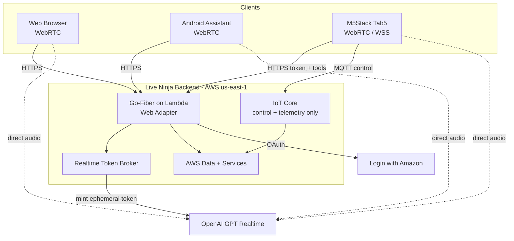

The concrete AWS resource topology — HTTP API + Fiber Lambda, the split-out Lambdas, DynamoDB, S3, SES, IoT Core, SSM, CloudWatch, and the OIDC deploy path — is shown below.

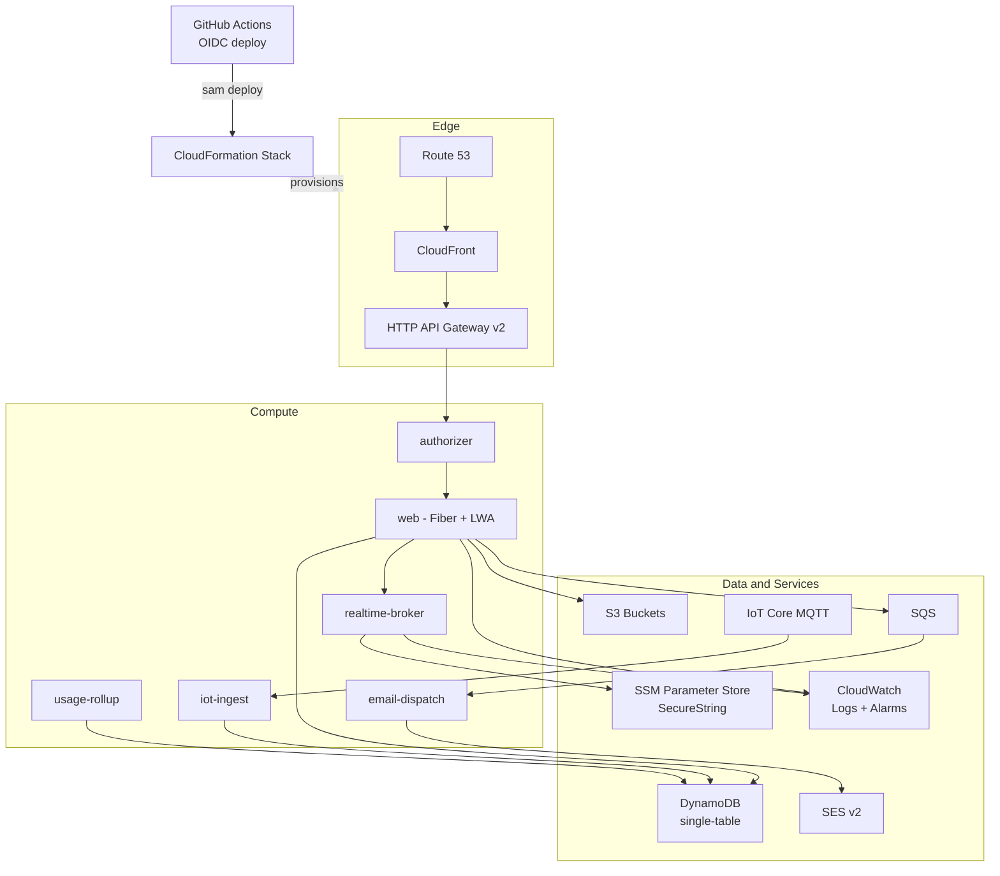

Deployment is push-to-`main` → GitHub Actions (OIDC-assumed `gha-deploy` role, no static keys) → `sam build`/`sam deploy`, arm64 throughout, with the six mandatory cost tags. The pipeline:

```mermaid
flowchart LR
    DEV["Push to main"] --> GHA["GitHub Actions"]
    GHA --> CO["Checkout + setup-go"]
    CO --> BUILD["make build<br/>arm64 all funcs"]
    BUILD --> OIDC["Assume gha-deploy role<br/>via OIDC"]
    OIDC --> SB["sam build"]
    SB --> SD["sam deploy<br/>no-confirm-changeset"]
    SD --> CFN["CloudFormation<br/>update stack"]
    CFN --> PROD["Production<br/>Lambda + IoT"]
    PROD --> WATCH["gh run watch<br/>+ CloudWatch alarms"]
```

Wake-word config propagates across surfaces via push channels and the IoT device shadow:

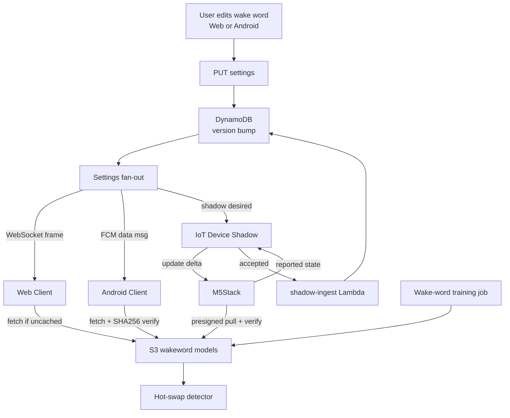

The M5Stack firmware lifecycle from boot/provisioning through the conversational states and error recovery:

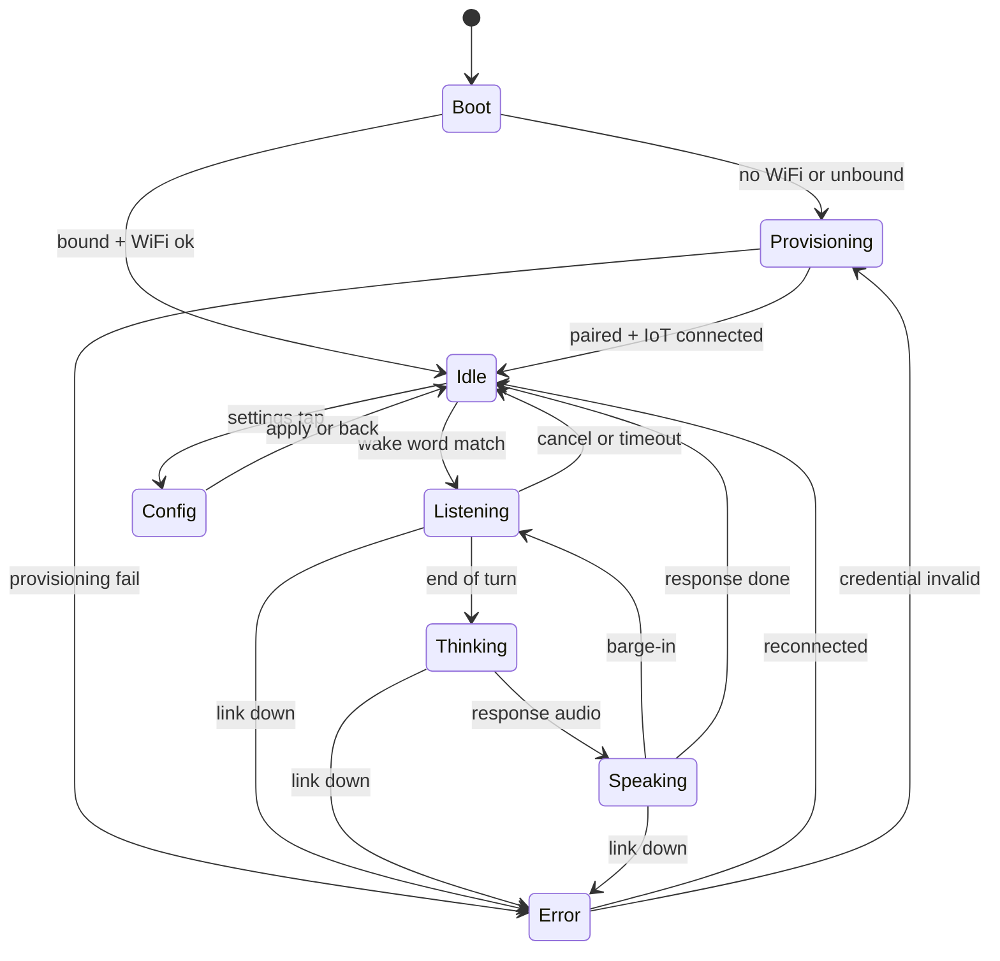

### REST endpoint catalog

Consolidated first-party API surface (path-versioned `/v1`). Auth is the LWA-minted first-party session JWT (Bearer / `__Host-` cookie on web) unless the row is marked **Public**.

| Method | Path | Purpose | Auth |
|---|---|---|---|
| GET | `/v1/realtime/session` | Mint a short-lived OpenAI Realtime ephemeral token (config/persona/guides bound server-side); used by web, Android, **and the M5Stack**. | Session JWT |
| POST | `/v1/uploads` | Presigned S3 PUT (content-type allowlist, size cap, owner-namespaced key). | Session JWT |
| POST | `/v1/tools/invoke` | Server-side tool execution, re-authorized per call; the M5Stack routes tool calls here over HTTPS. | Session JWT |
| POST | `/v1/deliverables` | Create a deliverable (PDF/MD/CSV/JSON/ICS/image/artifact) → S3 object + DynamoDB index item. | Session JWT |
| POST | `/v1/deliverables/zip` | Bundle N deliverables into one ZIP deliverable. | Session JWT |
| POST | `/v1/deliverables/{id}/deliver` | Mint a short-lived presigned URL and surface/deliver the item (optional SES email). | Session JWT |
| GET | `/v1/deliverables` | List the caller's deliverables (Query, never Scan). | Session JWT |
| GET | `/v1/deliverables/{id}/download` | Authorized download (key prefix == caller `userId`). | Session JWT |
| POST | `/v1/memory/search` | Semantic recall over S3 Vectors (`memory.search`). | Session JWT |
| POST | `/v1/memory` | Write a typed memory item (`memory.write`). | Session JWT |
| GET | `/v1/entities/{id}` | Fetch one entity (`entity.get`). | Session JWT |
| POST | `/v1/plans` | Create/update a plan and its tasks (`plan.upsert`). | Session JWT |
| GET | `/v1/guides` | List the caller's Guide Entities. | Session JWT |
| PUT | `/v1/guides/{id}` | Create/edit/enable/prioritize a guide (versioned; synced to devices). | Session JWT |
| GET | `/v1/account` | Account profile, sessions, connected devices. | Session JWT |
| DELETE | `/v1/account` | Right-to-delete: partition-scoped purge across DynamoDB, S3, IoT, LWA refresh. | Session JWT |
| GET | `/healthz` | Liveness/readiness probe. | **Public** |
| GET | `/v1/compat` | Capability negotiation for long-lived clients (10-year M5Stack). | **Public** |

---

## 6. Voice / GPT-Realtime Experience Requirements

### 6.1 Latency & interaction targets

| Metric | Target |
|---|---|
| User stops speaking → first assistant audio | ≤ 800 ms (WebRTC); < 1.2 s (M5Stack direct WebRTC/WSS) |
| Barge-in stop (playback silenced) | ≤ 150 ms |
| Ephemeral token establish window | ~60 s TTL, pre-minted during wake |
| OpenAI session duration cap | ~30 min, transparently re-minted/reconnected |

### 6.2 Requirements

- **Config-bound sessions:** model `gpt-realtime`, `output_modalities:["audio"]`, `pcm16` audio (WebRTC negotiates Opus itself), `turn_detection: semantic_vad` with `interrupt_response:true` and `create_response:true`, `voice` default `cedar` (user-selectable from an enumerated picker), `temperature` 0.7, `max_output_tokens` 4096. Persona = shared base prompt + per-user overrides; never a blind box.
- **Barge-in:** on `input_audio_buffer.speech_started`, clients immediately duck/stop playback and flush buffers before the response-cancel round-trips; M5Stack stops the DAC locally and clears its jitter buffer.
- **Tool calling:** tools are declared at mint (config-bound); execution is always server-side in `fn-tool-router`, re-authorized against the LWA user each call, with enumerated tool args, confirm-before-send for external email, and idempotency keys. Initial catalog: `send_email`, `set_timer`/`set_reminder`, `device_control`, `get_weather`/`web_lookup`, `remember_note`/`recall_note`, `create_calendar_event` (phase 2).
- **Persona:** "You are Live Ninja, a concise, action-oriented voice assistant…" plus user name/timezone/units injected server-side; identical across surfaces.
- **Fallback:** retry+backoff → chained STT (`gpt-4o-transcribe`) → `gpt-4o-mini` → TTS (`gpt-4o-mini-tts`) → text-only → graceful failure with side-effects queued; tools work in the fallback chain.

The end-to-end voice turn — local wake, ephemeral token, Realtime session, tool call, spoken response, and transcript storage:

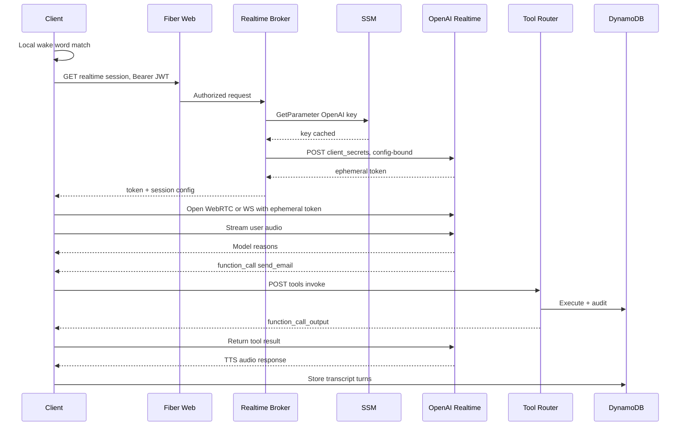

The M5Stack connects directly to OpenAI Realtime with a broker-minted ephemeral token; IoT Core carries only control/telemetry, and tool calls go to the backend over HTTPS — **M5Stack — direct audio to OpenAI Realtime**:

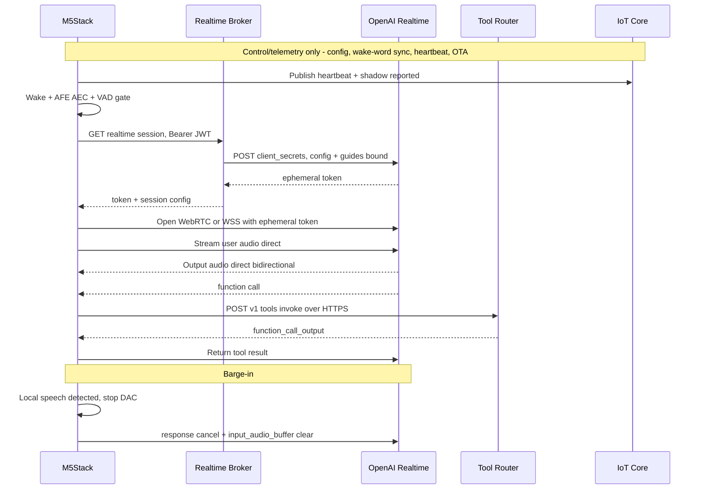

---

## 7. Authentication & Session Requirements

LWA establishes identity only; clients carry first-party credentials. The hybrid model — stateless ES256 access JWT (15 min, verified at the edge with no DB read) plus stateful opaque refresh token (hashed at rest, rotated on every use with reuse detection) — is shared machinery; only lifetime, storage medium, and second factor differ per surface.

| Surface | LWA flow | Refresh lifetime | Refresh storage | Second factor |
|---|---|---|---|---|
| Web | Auth Code + PKCE (server-side confidential) | 30 days, sliding | `__Host-` Secure HttpOnly cookie | SameSite + CSRF state |
| Android | Auth Code + PKCE (public → BFF exchange) | 30 days, sliding | Keystore / EncryptedSharedPreferences | App Links + optional attestation |
| M5Stack | Device-hosted Auth Code + PKCE, backend-completed, device-polled claim | 10 years, silently rotated | Encrypted NVS (flash enc + secure boot) | AWS IoT X.509 client cert (mTLS) |

**Revocation:** logout deletes the session row (refresh dead immediately, JWT dies ≤15 min); logout-everywhere bumps `tokensValidAfter` (all JWTs rejected within the 60 s authorizer cache); device revoke detaches the IoT cert and revokes the family. Reuse of a rotated refresh token revokes the whole `familyId` and fires a security alert.

### Web login — LWA Auth Code + PKCE, 30-day session

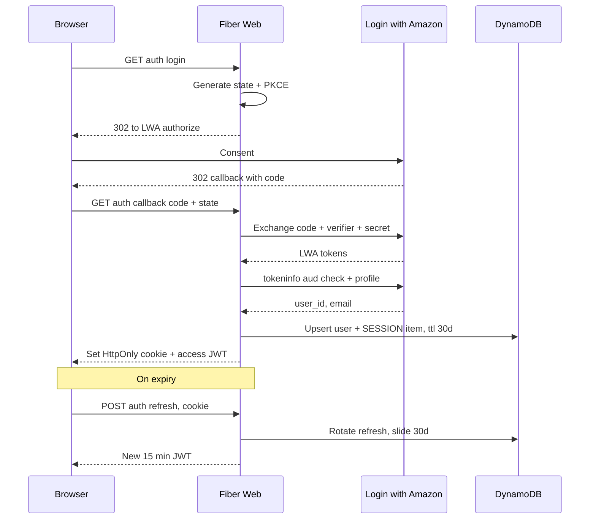

### Android login + primary-assistant wake flow

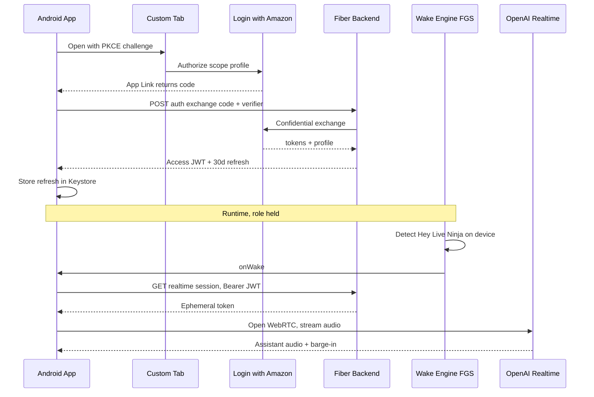

### M5Stack on-device config login + 10-year persistence

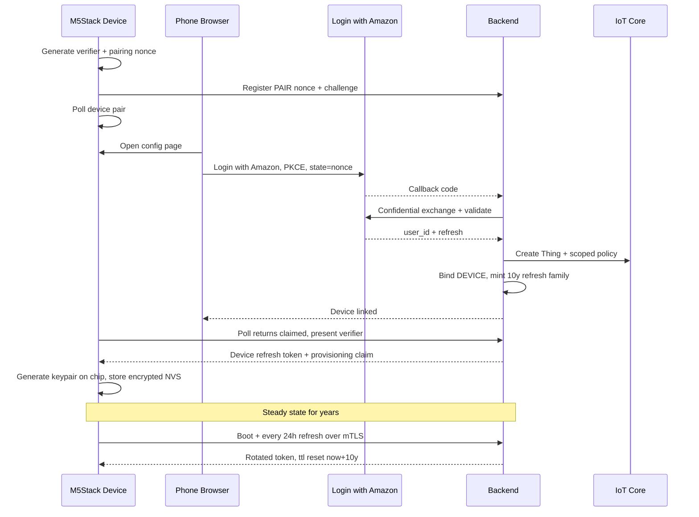

The 10-year "login" is a continuously, silently rotated credential lineage anchored by a hardware-bound X.509 cert (issued 10-year, auto-rotated at year 8), not a static 10-year bearer secret in flash.

---

## 8. Data Model & Storage

### 8.1 DynamoDB — single table `live-ninja`

- **PK** `pk` (S), **SK** `sk` (S), on-demand (`PAY_PER_REQUEST`). **GSI1** (`gsi1pk`/`gsi1sk`) for inverse/external-id lookups (LWA user, device serial, session id, email); **GSI2** (`gsi2pk`/`gsi2sk`) for time-ordered feeds (usage by day, active sessions, device lastSeen). TTL on `ttl` auto-expires sessions/logs. Every access path is a `Query`/`GetItem`; `Scan` is reserved for manual one-off migrations only.

| Entity | PK | SK | GSI1 | GSI2 | TTL |
|---|---|---|---|---|---|
| User | `USER#<userId>` | `PROFILE` | `LWA#<amazonUserId>` | — | — |
| Session | `USER#<userId>` | `SESSION#<sessionId>` | `SESS#<sessionId>` | `SESSACTIVE#<userId>`/`<expISO>` | 30d web/Android |
| Device | `USER#<userId>` | `DEVICE#<deviceId>` | `DEVSN#<serial>` | `DEVSEEN#<userId>`/`<lastSeen>` | — |
| Device cred | `DEVICE#<deviceId>` | `CRED#<credId>` | — | — | 10y |
| WakeWordConfig | `USER#<userId>` | `WAKE#<surface>#<wakeId>` | — | — | — |
| Persona | `USER#<userId>` | `PERSONA#<personaId>` | — | — | — |
| UsageLog | `USER#<userId>` | `LOG#<yyyymmdd>#<ulid>` | — | `USAGE#<userId>`/`<epoch>` | 90d |
| UsageDailyRollup | `USER#<userId>` | `ROLLUP#<yyyymmdd>` | — | `ROLLUPGLOBAL#<yyyymm>` | 400d |
| Settings | `USER#<userId>` | `SETTINGS#v<n>` | — | — | — |
| IdempotencyKey | `IDEMP#<key>` | `IDEMP` | — | — | 24h |

**v1.1 entities (Deliverables Store, Memory Layer, Guides — milestones M9/M10).** These extend the same single table with the same Query/GetItem-only discipline; TTL applies only to `retentionUntil`-bearing memory items.

| Entity | PK | SK | GSI | Notes |
|---|---|---|---|---|
| Deliverable | `USER#<userId>` | `DELIV#<ts>#<deliverableId>` | `GSI1PK=DELIV#<deliverableId>` (share-by-id) | list = Query PK=`USER#<userId>`, SK `begins_with DELIV#`; fetch/share = GetItem or Query GSI1 on `DELIV#<deliverableId>`. |
| Entity (people/places/information) | `USER#<userId>` | `ENTITY#<entityType>#<entityId>` | `GSI2PK=ETYPE#<userId>#<entityType>` (list by type) | fetch one = GetItem; list a type = Query GSI2 on `ETYPE#<userId>#<entityType>`. |
| Edge (relationships) | `USER#<userId>` | `EDGE#<fromId>#<relation>#<toId>` | — | traverse from a node = Query PK=`USER#<userId>`, SK `begins_with EDGE#<fromId>#`. |
| Memory (typed) | `USER#<userId>` | `MEM#<memoryType>#<memoryId>` | — | attrs `vectorId`, `sourceTurnId`, `confidence`, `retentionUntil` (TTL); `memoryType` ∈ {working, episodic, semantic, procedural}. Recall by type = Query SK `begins_with MEM#<memoryType>#`; semantic recall goes through S3 Vectors then GetItem by `memoryId`. |
| Guide | `USER#<userId>` | `GUIDE#<guideId>` | — | attrs `enabled`, `priority`, `version`, `body`; mirrored to the IoT device shadow. Load-all-enabled = Query SK `begins_with GUIDE#`. |
| Plan | `USER#<userId>` | `PLAN#<planId>` | — | attr `status`; fetch = GetItem; list plans = Query SK `begins_with PLAN#`. |
| Task | `USER#<userId>` | `TASK#<planId>#<taskId>` | — | attr `status`; list a plan's tasks = Query SK `begins_with TASK#<planId>#`. |

**Access patterns (no `Scan` anywhere).** Every v1.1 read is a `Query` against a `USER#<userId>` partition with an `SK begins_with` prefix, or a `GetItem` by full key, or a `Query` against `GSI1`/`GSI2` — exactly as the v1.0 entities. Deliverable share-by-id resolves through `GSI1` (`DELIV#<deliverableId>`); entity-by-type lists resolve through `GSI2` (`ETYPE#<userId>#<entityType>`). `Scan` remains reserved for one-off manual migrations only; it never appears on any serving path.

The entity model and GSI lookup relationships:

```mermaid
erDiagram
    USER ||--o{ SESSION : has
    USER ||--o{ DEVICE : owns
    USER ||--o{ WAKEWORD_CONFIG : configures
    USER ||--o{ USAGE_LOG : accumulates
    DEVICE ||--o{ DEVICE_CRED : holds
    USER ||--o{ DELIVERABLE : produces
    USER ||--o{ ENTITY : knows
    USER ||--o{ EDGE : relates
    USER ||--o{ MEMORY : remembers
    USER ||--o{ GUIDE : sets
    USER ||--o{ PLAN : plans
    PLAN ||--o{ TASK : contains

    USER {
        string partition_key "USER#userId"
        string sk "PROFILE"
        string gsi1pk "LWA#amazonUserId"
        string email
        string defaultPersona
    }
    SESSION {
        string partition_key "USER#userId"
        string sk "SESSION#sessionId"
        string gsi1pk "SESS#sessionId"
        string refreshHash
        string surface
        number ttl "30d"
    }
    DEVICE {
        string partition_key "USER#userId"
        string sk "DEVICE#deviceId"
        string gsi1pk "DEVSN#serial"
        string iotThingName
        string lastSeen
    }
    DEVICE_CRED {
        string partition_key "DEVICE#deviceId"
        string sk "CRED#credId"
        string credHash
        number ttl "10y"
    }
    WAKEWORD_CONFIG {
        string partition_key "USER#userId"
        string sk "WAKE#surface#wakeId"
        string keyword
        string engine
        string modelS3Key
    }
    USAGE_LOG {
        string partition_key "USER#userId"
        string sk "LOG#yyyymmdd#ulid"
        string gsi2pk "USAGE#userId"
        number tokens
        number ttl "90d"
    }
    DELIVERABLE {
        string partition_key "USER#userId"
        string sk "DELIV#ts#deliverableId"
        string gsi1pk "DELIV#deliverableId"
        string s3Key
        string kind
    }
    ENTITY {
        string partition_key "USER#userId"
        string sk "ENTITY#entityType#entityId"
        string gsi2pk "ETYPE#userId#entityType"
        string label
    }
    EDGE {
        string partition_key "USER#userId"
        string sk "EDGE#fromId#relation#toId"
        string relation
    }
    MEMORY {
        string partition_key "USER#userId"
        string sk "MEM#memoryType#memoryId"
        string vectorId
        string sourceTurnId
        number confidence
        number retentionUntil "TTL"
    }
    GUIDE {
        string partition_key "USER#userId"
        string sk "GUIDE#guideId"
        boolean enabled
        number priority
        number version
        string body
    }
    PLAN {
        string partition_key "USER#userId"
        string sk "PLAN#planId"
        string status
    }
    TASK {
        string partition_key "USER#userId"
        string sk "TASK#planId#taskId"
        string status
    }
```

### 8.2 S3 buckets

| Bucket | Purpose |
|---|---|
| `live-ninja-user-<acct>` | user uploads/downloads, exported transcripts (`uploads/<userId>/…`, `transcripts/<userId>/<sid>.json`) |
| `live-ninja-wakewords-<acct>` | custom wake-word model blobs (`.ppn`/`.onnx`/`.tflite`), per-user, per-platform |
| `live-ninja-assets-<acct>` | web static assets + M5Stack config/firmware (CloudFront origin) |
| `live-ninja-logs-<acct>` | access logs / rollup snapshots (lifecycle → Glacier → expire) |
| `live-ninja-analytics-<acct>` | Firehose telemetry lake, date-partitioned, Athena-queried |

All buckets: block-public-access on, SSE-S3/AES256, versioning on assets. Transfers use presigned URLs (15-min PUT, 5-min GET) so bytes never transit Lambda.

### 8.3 Retention

Audio not stored by default (`storeAudio=false`). Transcripts stored if `storeTranscripts=true` (default 30-day) with DynamoDB TTL = now + `retentionDays` {0,7,30,90}; S3 audio (opt-in) uses lifecycle expiration matching retention. OpenAI called with zero-data-retention requested where available. Right-to-delete removes all `USER#<uid>` items, S3 objects, IoT things/certs, and LWA refresh tokens.

---

## 9. Non-Functional Requirements

| ID | Category | Requirement |
|---|---|---|
| NFR-01 | Performance | First assistant audio ≤800 ms (WebRTC) / <1.2 s (M5Stack direct WebRTC/WSS); barge-in ≤150 ms; ephemeral mint p99 within alarm threshold; Android wake <2%/hr screen-off battery. |
| NFR-02 | Security | OpenAI key only in SSM, IAM-scoped to the broker; refresh tokens hashed at rest; JWT signing via KMS (non-extractable); mTLS for IoT; TLS everywhere; strict CSP; XSS-safe rendering. |
| NFR-03 | Privacy | On-device wake as a hard invariant; audio off by default; transcripts TTL'd + user-deletable; ZDR requested; no PII harvesting; consent recorded. |
| NFR-04 | Cost | On-demand DynamoDB, Query/GetItem only; per-user metering enforced pre-spend; daily/monthly quotas; AWS Budgets at $20/$50/$100 on `Project=live-ninja`; CloudFront caching for static; direct-to-OpenAI audio (no AWS in media path). |
| NFR-05 | Reliability | Fallback cascade on Realtime failure; WebRTC ICE-restart; M5Stack reconnect state machine with backoff; A/B OTA with rollback; idempotency on side-effecting operations. |
| NFR-06 | Observability | Structured slog JSON with `requestId`/`userId`/`surface`/`route`/`latencyMs`; CloudWatch EMF metrics; X-Ray on hot-path Lambdas; `live-ninja-ops` dashboard; alarms → SNS → SES. |
| NFR-07 | Scalability | Fully serverless auto-scaling (no always-on relay to autoscale — all audio is direct client↔OpenAI); single-table + GSIs; S3/CloudFront snapshots for global lists; virtualized/paginated large lists. |
| NFR-08 | Compatibility | Path-versioned `/v1`; capability negotiation via `X-LN-Client`/`X-LN-Server`; forward-compatible settings schema; `/v1` kept alive for the 10-year M5Stack field lifetime. |

---

## 10. Security & Privacy

- **Always-listening disclosure:** on-device wake detection is architectural, not just policy — between wakes audio never leaves the device. Android shows a persistent `microphone`-FGS notification; web shows an always-visible mic-status chip and only accesses the mic after explicit `getUserMedia`; the M5Stack shows a persistent on-screen listening indicator. First-run consent (timestamp + version) recorded at `CONSENT#<ts>`; Play data-safety declaration and prominent disclosure required.
- **On-device wake:** the load-bearing privacy control; only the post-wake utterance is streamed to OpenAI.
- **Data retention/deletion:** audio off by default; transcripts TTL'd with user-configurable retention; `DELETE /account` performs a partition-scoped Step Functions purge (no Scan) across DynamoDB, S3, IoT, and LWA refresh tokens with SES confirmation; per-item deletion available.
- **Credential protection:** refresh tokens stored only as hashes; LWA refresh tokens KMS-encrypted server-side; JWT signing key non-extractable in KMS; M5Stack key behind the DS peripheral (optional ATECC608B) with flash encryption + Secure Boot v2 + NVS encryption.

### Threat model summary

| Threat | Mitigation |
|---|---|
| OpenAI key leak to client | Key in SSM, broker-only IAM; 60 s config-bound ephemeral tokens; never in logs/env of `web`. |
| Auth-code interception | PKCE S256 (Android/M5Stack); confidential exchange (web). |
| Token substitution / confused deputy | Validate `aud == our client_id` via `/tokeninfo`; identity from `/user/profile`. |
| Refresh-token theft + replay | Rotation with reuse detection → whole family revoked + SES alert. |
| Access-token theft | 15-min TTL; `sid`/`did` binding; `tokensValidAfter` kill-switch. |
| XSS (web) | Refresh in `__Host-` HttpOnly cookie; JWT in memory; text-node rendering; strict CSP `script-src 'self'`. |
| CSRF (web) | `SameSite=Lax` + login `state` + Origin checks + double-submit token. |
| Device compromise / flash readout | Flash encryption + Secure Boot v2 + optional ATECC608; cert as second factor; rotation caps window; per-device IoT policy. |
| Cert theft / clone | Cert alone insufficient — rotating first-party token also required; reuse detection + IoT anomaly. |
| DynamoDB Scan / read-cost blowout | Query/GetItem only; `ConsumedReadCapacityUnits` alarm; rollups + S3 snapshots. |
| Realtime cost runaway | Pre-spend quota gate; idle/duration caps; anomaly auto-suspend + budget alarms. |
| Pairing hijack | `PAIR#` bound to device-generated nonce + PKCE verifier, 600 s TTL, single-use. |
| SES DMARC drop | Source is DKIM-verified `@jeremy.ninja`; Reply-To gmail; bounce/complaint suppression. |

---

## 11. Success Metrics / KPIs

| ID | KPI | Target |
|---|---|---|
| KPI-01 | First-audio latency (p95) | ≤800 ms WebRTC / <1.2 s M5Stack |
| KPI-02 | Barge-in stop latency (p95) | ≤150 ms |
| KPI-03 | Ephemeral token mint success rate | ≥99.5% |
| KPI-04 | Wake-word FRR @ fixed FAR (per engine, CI-gated) | No regression vs. baseline corpus |
| KPI-05 | Android wake battery draw (screen-off idle) | <2%/hr |
| KPI-06 | Realtime session availability (incl. fallback) | ≥99.9% answered turns |
| KPI-07 | Monthly AWS infra cost (`Project=live-ninja`) | Under budget alarms ($20/$50/$100 tiers) |
| KPI-08 | Per-user OpenAI cost | Within monthly ceiling (default ~$15); zero over-cap sessions |
| KPI-09 | DynamoDB read pattern | Zero `Scan` on serving paths; read units within baseline |
| KPI-10 | Cross-surface settings sync convergence | <5 s for online clients; next-boot/apply for M5Stack |
| KPI-11 | Deploy health | Push-to-main deploy green; alarms catch regressions within minutes |
| KPI-12 | Accessibility | WCAG AA verified (axe/Lighthouse) in light + dark on web/Android |

---

## 12. Assumptions, Dependencies, Risks

### 12.1 Assumptions

- Production-only shop; changes go straight to production guarded by local smoke tests, alarms, and canary rollouts.
- Single operator/user (Jeremy); no multi-tenant scale requirements.
- OpenAI GPT Realtime (`gpt-realtime`) remains available with WebRTC + WebSocket transports and ephemeral client secrets.
- `@jeremy.ninja` SES identity is DKIM-verified; SES production access obtained at launch.
- M5Stack Tab5 hardware (ESP32-P4 + C6) with the documented peripherals is the target device.

### 12.2 Dependencies

- OpenAI Realtime API; Login with Amazon (single Security Profile with registered return URLs); AWS (Lambda, HTTP API, DynamoDB, S3, SES, SSM, KMS, IoT Core, CloudFront, Route 53, EventBridge, SQS, CloudWatch/X-Ray).
- GitHub Actions OIDC `gha-deploy` role (`vars.AWS_DEPLOY_ROLE_ARN`); ACM cert, hosted zone, artifact bucket via `vars`.
- Picovoice Console (Porcupine training) — optional; openWakeWord (Apache-2.0) is the never-blocked fallback.

### 12.3 Risks

| Risk | Impact | Mitigation |
|---|---|---|
| OpenAI API key leakage to clients | Severe (cost/abuse) | Key only in SSM, broker-scoped; short-TTL config-bound ephemeral tokens; never in logs/env of `web`. |
| DynamoDB Scan cost blowout | High (silent bill) | Single-table Query/GetItem; `ConsumedReadCapacityUnits` alarm; rollups + S3 snapshots; Scan only for manual migrations. |
| Realtime audio latency/cost if relayed through AWS | High | Direct client↔OpenAI WebRTC/WS on every surface incl. M5Stack; AWS never in the audio path. |
| ESP32-P4 can't run WebRTC well | Medium (M5Stack fallback) | WebRTC via esp-webrtc-solution on the P4 preferred; graceful WSS + Opus/PCM16 fallback directly to OpenAI (device runs libopus + WSS + esp-sr); ephemeral token from the shared broker either way — no AWS audio relay. |
| 10-year M5Stack credential compromise | High | Store only peppered hash / KMS-encrypted refresh; short-lived working tokens; cert second factor; rotation; instant server-side revoke. |
| SES mail silently dropped (DMARC) | Medium (missed alerts) | DKIM-verified `@jeremy.ninja` Source, Reply-To gmail; never send from gmail identity; suppression list. |
| Runaway OpenAI/AWS cost (abandoned/always-listening) | High | Local wake (no continuous cloud audio); idle/duration caps; pre-spend quotas; org hard limit; budget + cost alarms. |
| Android `ROLE_ASSISTANT` not honored on OEMs | Medium (UX friction) | OEM-aware guided walkthrough + deep links + `isRoleHeld` polling; wake word does not depend on the role. |
| Play Store rejection (background mic + assistant + FGS-mic) | Medium | Default to signed-APK sideload/internal testing; prominent disclosure + consent logging; full declarations only if going public. |
| Session-token theft (30-day web/Android) | Medium | 15-min access JWT + rotating refresh with reuse detection; HttpOnly cookies; new-login SES alert; per-session revoke. |
| Stale HTML after deploy (web) | Low/Medium | Network-first HTML SW + `no-cache` headers + content-hashed immutable assets + versioned cache purge. |
| Settings sync conflicts across 3 devices | Medium | Monotonic `version` + `ConditionExpression` optimistic concurrency; DynamoDB source of truth; higher version wins. |
| Bad OTA bricks the M5Stack | Medium | A/B partitions, signed images, anti-rollback eFuse, mark-valid-after-check-in, canary group, coordinated P4↔C6 gating. |
| OpenAI outage / 429 | Medium | Backoff → chained STT→LLM→TTS → text-only → graceful failure with side-effects queued; alarm on broker error rate. |
| Long-lived M5Stack devices outrun API changes | Medium | `/v1` kept alive for field lifetime; capability negotiation + `/compat`; forward-compatible schema. |
| No staging (production-only) | Medium | `dynamodb-local` + mocked OpenAI/IoT integration tests gate deploy; HIL rig for M5Stack; fast SES-alerting alarms; additive-only API changes. |

---

## 13. Delivery Roadmap

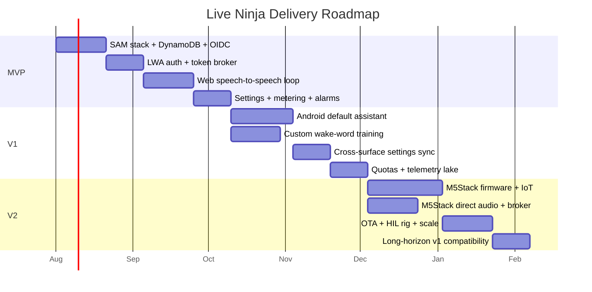

---

## 14. Open Questions with Chosen Defaults

| # | Question | Chosen default (baked in) |
|---|---|---|
| Q-1 | Fiber-on-Lambda via LWA or the proxy adapter? | **Lambda Web Adapter** — one idiomatic Fiber codebase, streaming/SSE support, local/prod parity, native arm64. |
| Q-2 | HTTP API v2 or REST API v1? | **HTTP API v2** — ~70% cheaper, native JWT authorizer, lower latency; `$default` → Fiber. |
| Q-3 | Single-table or multi-table DynamoDB? | **Single table** `live-ninja` with two GSIs; all access by known keys; Query/GetItem only. |
| Q-4 | Audio transport through AWS or direct to OpenAI? | **Direct client↔OpenAI on every surface** (WebRTC web/Android; WebRTC or WSS+Opus/PCM16 for M5Stack); AWS never in the media path. |
| Q-5 | Secrets store? | **SSM Parameter Store SecureString** (+ KMS for signing/refresh encryption); no secrets manager. |
| Q-6 | M5Stack Realtime transport? | **Direct to OpenAI from the device** — WebRTC via Espressif's esp-webrtc-solution on the ESP32-P4, with a WSS + Opus/PCM16 fallback; ephemeral token from the same broker Lambda as web/Android; no AWS audio relay. |
| Q-7 | Are broker/authorizer separate Lambdas from day one? | **Yes** — broker holds the crown-jewel key policy; authorizer is on every hot path (keep tiny for cold-start). |
| Q-8 | Android wake engine? | **Porcupine primary, openWakeWord fallback**, behind a `WakeWordEngine` interface; own FGS engine, not the DSP hotword. |
| Q-9 | Web wake word default state? | **Off by default, opt-in**; openWakeWord WASM default, Porcupine optional; click-to-talk always available. |
| Q-10 | Android distribution? | **Signed-APK sideload / internal-testing** to sidestep Play assistant/always-on-mic review; full declarations only if going public. |
| Q-11 | Web front-end framework? | **Go-Fiber server-rendered HTML + progressive-enhancement ES modules** — no SPA framework. |
| Q-12 | M5Stack custom wake phrases? | **Select-only on device** (curated flashable WakeNet set + oWW-ESP fallback); phrase creation on web/Android. |
| Q-13 | Session signing algorithm? | **ES256 via non-extractable KMS CMK**, JWKS published; access JWT 15 min. |
| Q-14 | Default voice / persona? | Voice **`cedar`** (user-selectable from enum); shared "concise, action-oriented" persona with per-user overrides. |
| Q-15 | Transcript storage default? | **On, 30-day TTL** (assistant needs short-term memory); audio **off** by default. |
| Q-16 | Per-user OpenAI quota? | **~30 min realtime audio/day + monthly token ceiling (~$15)**, enforced pre-spend at mint; 10-min hard session cap; soft-warn at 80%. |
| Q-17 | Confirm-before-send for email tool? | **Yes for external recipients**, with per-user daily send cap and optional allowlist; idempotency keys. |
| Q-18 | M5Stack secure element? | **ATECC608B recommended default** on production units for the 10-year field credential. |
| Q-19 | Telemetry/control transport for M5Stack? | **IoT Core MQTT** (control-plane only — device shadow, wake-word sync, heartbeat, OTA); audio is direct to OpenAI, never over IoT and never through an AWS relay. |
| Q-20 | Cost center tag? | **`voice-ai`**; full mandatory tag set applied once at stack level in `samconfig.toml`. |


---

## UI Wireframe Specifications

Screen-by-screen wireframes and control/data-source specs for every function on each surface.

I'll write the markdown section directly as requested.

### Android (mobile, primary assistant)

*Rich-UI surface. Deep-navy canvas (`#0A1230`), electric-teal/cyan accent (`#22E3D6`), a persistent "listening orb" motif. Full-screen per screen; bottom tab bar (Home · History · Wake Words · Settings) is global once onboarded. All controls are native Android/Material semantic widgets: real `Button`, `Switch`, `Spinner`/`ExposedDropdownMenu`, `Slider`, `RadioGroup`, with visible labels, WCAG-AA contrast in the dark theme, visible focus rings, and ≥48dp touch targets. Login with Amazon gates everything below the onboarding carousel.*

---

#### 1. Onboarding — First-run welcome carousel

Purpose: Introduce Live Ninja as the phone's primary voice assistant and route to sign-in or setup.

```
┌───────────────────────────────┐
│ ●○○                      Skip  │  ← page dots (1 of 3) · Skip (text btn)
│                               │
│           ╭─────────╮         │
│          (  ◕  ORB   )        │  ← hero listening orb (animated glow)
│           ╰─────────╯         │
│                               │
│        Hey Live Ninja         │  ← H1, 28sp
│   Your phone's calm, always-  │
│   ready voice assistant.      │  ← subhead, muted teal
│                               │
│  ◂ swipe · tap dots to jump ▸ │
│                               │
│  ┌─────────────────────────┐  │
│  │      Get started        │  │  ← PRIMARY (filled teal), 56dp
│  └─────────────────────────┘  │
│         Sign in →             │  ← SECONDARY (text btn)
└───────────────────────────────┘
```

- **Carousel** — `ViewPager2`, 3 swipeable slides (What it is / Wake words / Privacy). DATA SOURCE: static slide array. Page dots show `N of 3`.
- **Get started** — primary filled `Button` → Login with Amazon (screen 2).
- **Sign in** — secondary text `Button` → same LWA screen (returning users).
- **Skip** — text `Button`, top-right → LWA.
- States: none (static content).
- A11y: each slide has a heading + `contentDescription`; orb is decorative (`importantForAccessibility="no"`); dots announce "Page N of 3"; swipe has button-equivalent (dots are tappable); focus order top→bottom.

---

#### 2. Login with Amazon

Purpose: Authenticate via LWA only (no email/password), set expectations for the 30-day session.

```
┌───────────────────────────────┐
│           ╭───────╮           │
│          (  ◔ ORB  )          │
│           ╰───────╯           │
│         Live Ninja            │
│   Sign in to continue         │  ← H1
│                               │
│  ┌─────────────────────────┐  │
│  │  a  Continue with Amazon│  │  ← PRIMARY (Amazon-brand btn), 56dp
│  └─────────────────────────┘  │
│                               │
│  🔒 Your session stays active │
│     for 30 days on this phone.│  ← info row
│                               │
│  We use Login with Amazon only│
│  to identify you. We never see│
│  your password.               │  ← privacy note
│                               │
│  By continuing you agree to   │
│  the Terms & Privacy Policy →  │  ← link (opens legal)
└───────────────────────────────┘
```

- **Continue with Amazon** — single primary `Button` launching the LWA OAuth flow. DATA SOURCE: LWA SDK. No email/password fields by design.
- **Terms & Privacy Policy** — text link → in-app browser.
- States: **loading** (button shows spinner + "Connecting to Amazon…", disabled to block double-tap); **error** (inline banner above button: "Couldn't reach Amazon. Check your connection and try again." + Retry, `role="alert"`).
- A11y: button has accessible name "Continue with Amazon"; lock/privacy text is real text (not baked into an image); link is a focusable control with visible focus; error announced via `aria-live`/`announceForAccessibility`.

---

#### 3. Set as Default Assistant

Purpose: Guide the user to grant `ROLE_ASSISTANT` so "Hey Live Ninja" works system-wide.

```
┌───────────────────────────────┐
│ ← Set as default assistant    │  ← top app bar
│                               │
│  Status:  ● Not set           │  ← status badge (amber=Not set /
│                               │     teal=Active) — live from RoleManager
│  Make Live Ninja your phone's │
│  assistant so it answers from │
│  anywhere.                    │
│                               │
│  ┌───────────────────────────┐│
│  │ ✔ 1  Open Android settings ││  ← stepper checklist
│  │ ○ 2  Tap "Digital assistant app" │
│  │ ○ 3  Choose Live Ninja     ││
│  └───────────────────────────┘│
│                               │
│  ┌─────────────────────────┐  │
│  │   Open Android settings │  │  ← PRIMARY (Intent → settings)
│  └─────────────────────────┘  │
│         I'll do this later     │  ← SECONDARY (text)
└───────────────────────────────┘
```

- **Status badge** — read-only chip; DATA SOURCE: `RoleManager.isRoleHeld(ROLE_ASSISTANT)`, refreshed on resume. Values from a fixed enum: `Not set` / `Active`.
- **Stepper checklist** — ordered step list; items auto-check when the role is detected on return. DATA SOURCE: role state.
- **Open Android settings** — primary `Button` firing `ACTION_VOICE_INPUT_SETTINGS` / role-request intent.
- **I'll do this later** — secondary text `Button` → Home (with a reminder chip on Home).
- States: **Active** → badge turns teal, primary swaps to "Done" and steps show all-checked; **Not set** → amber badge persists.
- A11y: badge conveys state with icon + text (not color alone); steps are a labeled list announcing "Step 2 of 3, not done"; live status change announced.

---

#### 4. Permissions

Purpose: Explain and request the three runtime permissions in plain language before asking the OS.

```
┌───────────────────────────────┐
│ ← Permissions                 │
│  Live Ninja needs a few things│
│  to listen for your wake word.│
│                               │
│  ┌───────────────────────────┐│
│  │ 🎙  Microphone            ││
│  │ Always-on listening for   ││
│  │ "Hey Live Ninja". Audio   ││
│  │ stays on-device until wake││
│  │            [   Grant   ]  ││  ← btn → becomes ✓ Granted (Switch-style)
│  └───────────────────────────┘│
│  ┌───────────────────────────┐│
│  │ 🟢 Foreground service     ││
│  │ Keeps listening reliably; ││
│  │ shows a status notice.    ││
│  │            [   Grant   ]  ││
│  └───────────────────────────┘│
│  ┌───────────────────────────┐│
│  │ 🔔 Notifications          ││
│  │ Replies & session status. ││
│  │            [   Grant   ]  ││
│  └───────────────────────────┘│
│  ┌─────────────────────────┐  │
│  │        Continue         │  │  ← PRIMARY (enabled when mic granted)
│  └─────────────────────────┘  │
└───────────────────────────────┘
```

- **Per-permission card** — each pairs a plain-language "why" with a **Grant** `Button` that flips to a `✓ Granted` state (or "Open settings" if permanently denied). DATA SOURCE: `ContextCompat.checkSelfPermission` per permission, live.
- **Continue** — primary `Button`, enabled once Microphone (the hard requirement) is granted; foreground-service + notifications are recommended-but-optional and noted as such.
- States: each card = *Not granted* / *Granted* / *Denied → Open app settings*; mic denied disables Continue with helper text "Microphone is required for wake-word listening."
- A11y: each card is a `fieldset`-style group with heading + description tied to the button via `aria-describedby`; state shown by icon + text; buttons announce result ("Microphone granted"); AA contrast on cards over navy.

---

#### 5. Home / Idle (wake-listening)

Purpose: Primary resting screen — calm proof that the assistant is listening, plus quick entry points.

```
┌───────────────────────────────┐
│ 🎙●  Live Ninja      🛡 Private │  ← mic status dot + privacy shield
│                               │
│                               │
│           ╭─────────╮         │
│          (   ◕ ◕     )        │  ← large calm listening orb
│           ╰─────────╯         │      (slow breathing pulse)
│                               │
│   Listening for "Hey Live     │
│           Ninja"              │  ← status line
│      ┌───────────────┐        │
│      │ ◈ Hey Live Ninja│      │  ← active wake-word chip (tap→Wake Words)
│      └───────────────┘        │
│                               │
│  Try:                         │
│  [ Send an email ] [ Weather ]│  ← quick-suggestion chips
│  [ Set a timer ]  [ What's on?]│
│                               │
├───────────────────────────────┤
│  🏠 Home  🕘 History  ◈ Words  ⚙ │  ← bottom tab bar (Home active)
└───────────────────────────────┘
```

- **Listening orb** — animated status visual; DATA SOURCE: wake-engine state (idle→pulsing). Tap = start conversation manually (barge-in without wake word).
- **Mic status dot / privacy shield** — indicators; DATA SOURCE: mic capture state + on-device-processing flag. Tapping shield opens Privacy settings.
- **Active wake-word chip** — read-only chip showing the current active phrase; DATA SOURCE: wake-word store (active record). Tap → Wake-Word Manager (screen 7).
- **Quick-suggestion chips** — `ChipGroup`; DATA SOURCE: curated capability list + user's recent intents (known set, not free text). Tap runs the suggested action.
- **Bottom tab bar** — 4 destinations, always visible.
- States: **listening** (default), **muted** (orb greyed, "Muted — tap to resume", from mic-mute toggle), **role-not-set** (amber reminder chip → screen 3).
- A11y: orb decorative; status line is the live source of truth (`aria-live="polite"` on state change); mic/shield have text labels; tab bar items have labels + selected state; 48dp targets.

---

#### 6. Active Conversation

Purpose: Show a live, trustworthy conversation with visible tool results and easy interruption.

```
┌───────────────────────────────┐
│ ×          ● Speaking         │  ← close · state pill (Listening/
│                               │     Thinking/Speaking)
│        ╭───────╮              │
│       (  ◔◔ ORB )             │  ← orb in "speaking" state
│        ╰───────╯              │
│ ┌───────────────────────────┐ │
│ │            You:           │ │
│ │  "Email Sarah the report" │ │  ← user bubble (right)
│ └───────────────────────────┘ │
│ ┌───────────────────────────┐ │
│ │ Live Ninja:               │ │
│ │ Sending that now…         │ │  ← assistant bubble (left)
│ └───────────────────────────┘ │
│ ┌───────────────────────────┐ │
│ │ 📧 Email sent via SES  ✓  │ │  ← TOOL-CALL RESULT CARD
│ │ To: sarah@… · "Q3 report" │ │
│ └───────────────────────────┘ │
│                               │
│  💡 Just start talking to     │
│     interrupt (barge-in)      │  ← barge-in hint
│  ┌──────────┐   ┌──────────┐  │
│  │  🔇 Mute │   │  ■ Stop  │  │  ← big controls
│  └──────────┘   └──────────┘  │
└───────────────────────────────┘
```

- **State pill** — read-only status; DATA SOURCE: realtime session state enum (`Listening` / `Thinking` / `Speaking`). Icon + text.
- **Live transcript** — chat-style `RecyclerView`; DATA SOURCE: streaming ASR (user) + model tokens (assistant). User bubbles right, assistant left; auto-scroll with "jump to latest" if scrolled up.
- **Tool-call result card** — structured card (not raw JSON); DATA SOURCE: tool-invocation result payload rendered to labeled fields (channel icon, status ✓/✗, key params). Tap → detail (e.g., open sent email summary).
- **Stop** — primary destructive-weight `Button` ends the turn/session. **Mute** — toggle `Button` mutes mic mid-conversation.
- **Barge-in hint** — static helper text; interruption is by voice or tapping the orb.
- States: **thinking** (orb spins, pill "Thinking", typing indicator bubble); **error** (assistant bubble error style: "That tool failed — want me to retry?" + Retry); **tool running** (card skeleton "Sending…" → resolves to ✓/✗).
- A11y: transcript bubbles labeled by speaker for screen readers; state pill `aria-live="assertive"`; tool card has a text status ("Email sent, success"); Stop/Mute have distinct accessible names and are the largest targets; barge-in hint associated with the orb control.

---

#### 7. Wake-Word Manager

Purpose: Manage the set of programmable wake words; each can be toggled, tested, or edited.

```
┌───────────────────────────────┐
│ ← Wake words          Showing 4│
│  Words that start a conversation.│
│                               │
│  ┌───────────────────────────┐│
│  │ ◈ Hey Live Ninja          ││
│  │ Sensitivity: Balanced     ││  ← sensitivity badge (Low/Balanced/High)
│  │ [ ▶ Test ]      Active ●━ ││  ← Test btn · Active Switch
│  └───────────────────────────┘│
│  ┌───────────────────────────┐│
│  │ ◈ Ninja                   ││
│  │ Sensitivity: High         ││
│  │ [ ▶ Test ]      Active ○━ ││
│  └───────────────────────────┘│
│  ┌───────────────────────────┐│
│  │ ◈ Computer                ││
│  │ Sensitivity: Low          ││
│  │ [ ▶ Test ]      Active ●━ ││
│  └───────────────────────────┘│
│                               │
│  ┌─────────────────────────┐  │
│  │  + Create custom wake word│ │  ← PRIMARY → screen 8
│  └─────────────────────────┘  │
├───────────────────────────────┤
│  🏠 Home 🕘 History ◈Words ⚙   │
└───────────────────────────────┘
```

- **Wake-word list** — `RecyclerView` of cards; DATA SOURCE: wake-word store (user's saved words). Each card: name (label), **sensitivity badge** (fixed enum `Low`/`Balanced`/`High`), **Active** `Switch`, **Test** `Button`. No free-text here — words come from the saved set.
- **Test** — per-item `Button` plays a mic-listen check and shows "Detected ✓ / Not detected" inline.
- **Create custom wake word** — primary `Button` → screen 8.
- **Row overflow** (long-press / ⋮): Edit, Delete (guarded confirm).
- States: **empty** (illustration + "No wake words yet. Create your first one." + primary CTA); **loading** (3 skeleton cards); **test running** (card shows listening spinner).
- A11y: each card is a group; Switch announces "Hey Live Ninja, Active, on/off"; sensitivity badge is text; Test result announced live; header shows count ("Showing 4").

---

#### 8. Create / Train Wake Word

Purpose: Create a wake phrase from suggestions or a novel phrase, tune sensitivity, and train by voice sample.

```
┌───────────────────────────────┐
│ ← New wake word               │
│                               │
│ Choose a phrase               │  ← section label
│ ┌───────────────────────────┐ │
│ │ Search or pick a phrase ▾ │ │  ← autocomplete combobox (case 4)
│ └───────────────────────────┘ │
│   Suggested:                  │
│   ○ Hey Ninja                 │  ← list-select from suggested set
│   ○ OK Ninja                  │
│   ○ Hey Live One              │
│   ✎ Use my own phrase…        │  ← reveals validated text field
│                               │
│ Sensitivity                   │
│ Low ─────●──────── High       │  ← Slider (discrete: Low/Balanced/High)
│         Balanced              │  ← current value label
│                               │
│ Train your voice   (2 of 3)   │  ← stepper w/ progress
│ ┌───────────────────────────┐ │
│ │ ✔ Sample 1  ✔ Sample 2    │ │
│ │ ◉ Sample 3  [ ● Record ]  │ │
│ └───────────────────────────┘ │
│  ┌────────┐   ┌────────────┐  │
│  │ ▶ Test │   │    Save     │  │  ← Test (2ndary) · Save (PRIMARY)
│  └────────┘   └────────────┘  │
└───────────────────────────────┘
```

- **Phrase picker** — autocomplete combobox (Prime Directive case 4): DATA SOURCE = suggested-phrase list; surfaces suggestions *and* accepts a novel phrase. "Use my own phrase" reveals a labeled text field (the one legitimate free-text, for a truly novel value) with inline validation.
- **Suggested phrases** — `RadioGroup` list-select; DATA SOURCE: curated suggestion set + phonetically-safe recommendations.
- **Sensitivity** — discrete `Slider` (3 stops, value label under thumb). DATA SOURCE: fixed enum, defaults to `Balanced`.
- **Train stepper** — 3-sample recorder with `N of 3` progress; each **Record** captures a sample → ✓. DATA SOURCE: on-device training buffer.
- **Test** — secondary `Button` (enabled after ≥1 sample). **Save** — primary `Button`, disabled until phrase valid + 3 samples captured.
- Validation (inline): phrase length 2–4 words, "Too short — use at least two syllables", duplicate-of-existing blocked with message; errors adjacent to field.
- States: **recording** (waveform + "Speak now…"); **sample failed** ("Too quiet, tap to re-record"); **save disabled** with reason text.
- A11y: combobox full keyboard nav (arrows+Enter); slider announces "Balanced"; stepper announces "Sample 3 of 3, recording"; Save disabled reason via `aria-describedby`; all inputs have visible `<label>`.

---

#### 9. Settings

Purpose: Configure persona, voice, volume, privacy, and language — every control populated from a known set.

```
┌───────────────────────────────┐
│ ← Settings                    │
│ ── ASSISTANT ────────────────  │
│ Persona                       │
│ [ Focused & concise      ▾ ]  │  ← select (enum)
│ Custom instructions           │
│ ┌───────────────────────────┐ │
│ │ You are calm and brief…   │ │  ← editable prompt (free-form, labeled)
│ └───────────────────────────┘ │
│ ── VOICE ────────────────────  │
│ Voice   [ Cyan (default) ▾ ] ▶│  ← picker + ▶ sample play
│ Speaking volume               │
│ 🔈 ────────●──────── 🔊        │  ← Slider 0–100
│ ── PRIVACY ──────────────────  │
│ Keep conversation history     │
│ [ 30 days              ▾ ]    │  ← retention select (enum)
│ [ 🗑 Delete my data ]          │  ← DANGER action (guarded)
│ ── LANGUAGE ─────────────────  │
│ [ English (US)         ▾ ]    │  ← ISO language list
├───────────────────────────────┤
│  🏠 Home 🕘 History ◈Words ⚙   │
└───────────────────────────────┘
```

- **Persona** — `Spinner`/dropdown; DATA SOURCE: persona enum (Focused & concise / Friendly / Professional / Playful / Custom). **Custom instructions** — labeled multiline field (legitimate free text) editable when Persona=Custom or to refine any preset.
- **Voice** — dropdown of available TTS voices with an inline **▶ sample** `Button`; DATA SOURCE: GPT-Realtime voice catalog. Shows human-readable names, not IDs.
- **Speaking volume** — `Slider` 0–100 with icons; live-effect setting.
- **Keep history / retention** — `select`; DATA SOURCE: fixed options (Off / 7 days / 30 days / 1 year / Forever), default 30 days.
- **Delete my data** — destructive `Button`, guarded: confirmation dialog requiring typed "DELETE" for irreversible wipe.
- **Language** — `select` from ISO 639 / locale list; DATA SOURCE: supported-locale list, default = device locale.
- States: voice **sample loading/playing** (button spinner→pause); **saved** confirmation toast per change (autosave); delete flow shows pending + explicit success.
- A11y: every control has a persistent visible `<label>`; sections use headed groups; slider/select fully keyboard-operable; destructive action visually subordinate + confirmed; AA contrast for section dividers and danger red on navy.

---

#### 10. Account & Sessions

Purpose: Show the LWA identity, session lifetime, and connected devices with revoke/sign-out.

```
┌───────────────────────────────┐
│ ← Account                     │
│        ╭─────╮                │
│        │ 🙂 │  Jeremy Proffitt │  ← avatar + name (from LWA)
│        ╰─────╯  jeremy@…       │  ← email (from LWA)
│                               │
│  🔒 Session expires in 30 days │  ← info row (from token issue date)
│                               │
│ ── CONNECTED DEVICES ────────  │
│ ┌───────────────────────────┐ │
│ │ 📱 This phone (Pixel)      ││
│ │ Active now · primary       ││  ← current device badge
│ └───────────────────────────┘ │
│ ┌───────────────────────────┐ │
│ │ 🎛 M5Stack (Living room)   ││
│ │ Last seen 2h ago  [Revoke] ││  ← revoke device action
│ └───────────────────────────┘ │
│                               │
│  ┌─────────────────────────┐  │
│  │        Sign out         │  │  ← SECONDARY-danger btn
│  └─────────────────────────┘  │
└───────────────────────────────┘
```

- **Profile** — read-only avatar/name/email; DATA SOURCE: LWA profile response. Avatar has alt text.
- **Session info** — read-only row; DATA SOURCE: token issue time + 30-day policy → computed countdown.
- **Connected devices** — structured list/cards; DATA SOURCE: session registry (this phone + M5Stack). Each shows name, location/last-seen, status badge. Current device marked "Active now · primary" and is not revokable from itself (only sign-out).
- **Revoke** — per-device destructive `Button` with confirm ("Revoke M5Stack? It'll need to sign in again.").
- **Sign out** — danger-weight secondary `Button`, confirm dialog; clears the 30-day session.
- States: **loading** (skeleton profile + 2 device rows); **error** ("Couldn't load account" + retry); **empty devices** (just this phone).
- A11y: status badges are icon+text; revoke buttons have device-specific accessible names ("Revoke M5Stack"); sign-out confirmation traps focus; countdown text is real text, updated `aria-live` politely.

---

#### 11. Conversation History

Purpose: Browse past conversations grouped by date, with snippets, duration, and actions taken.

```
┌───────────────────────────────┐
│ ← History        🔍  Showing 12│
│ ── TODAY ────────────────────  │
│ ┌───────────────────────────┐ │
│ │ Email to Sarah            ▸│ │
│ │ "Send the Q3 report…"      ││  ← snippet
│ │ 0:42 · 📧 Email sent       ││  ← duration · action badge
│ └───────────────────────────┘ │
│ ┌───────────────────────────┐ │
│ │ Weather & timer           ▸│ │
│ │ "What's the forecast…"     ││
│ │ 1:15 · ⏱ Timer set         ││
│ └───────────────────────────┘ │
│ ── YESTERDAY ────────────────  │
│ ┌───────────────────────────┐ │
│ │ Calendar check            ▸│ │
│ │ "What's on tomorrow?"      ││
│ │ 0:28 · 📅 3 events read    ││
│ └───────────────────────────┘ │
│                               │
│         ⌄ Load older          │
├───────────────────────────────┤
│  🏠 Home 🕘 History ◈Words ⚙   │
└───────────────────────────────┘
```

- **Grouped list** — `RecyclerView` with sticky date headers (Today / Yesterday / date); DATA SOURCE: conversation history store, sorted desc, paginated. Each row: title, snippet, duration, and **action badges** (fixed enum of tool types: Email / Timer / Calendar / Search / etc.).
- **Tap row** — expands/opens full transcript detail (user + assistant bubbles, same styling as screen 6, read-only) with the tool-result cards inline.
- **Search** — 🔍 opens a query field (legitimate free-text search over history).
- **Load older** — pagination control; virtualized list, "Showing 12".
- States: **empty** (illustration + "No conversations yet. Say 'Hey Live Ninja' to start."); **loading** (skeleton rows under a date header); **error** ("Couldn't load history" + Retry).
- A11y: date headers are real headings for screen-reader navigation; each row is a single focusable item announcing "Email to Sarah, 42 seconds, email sent"; action badges are icon+text; expand control states announced (collapsed/expanded); search field has visible label.

### Website (Go-Fiber served)

Full-screen rich-UI surface (Go-Fiber server-rendered templates + progressive JS). Deep-navy canvas, electric-teal/cyan accent, recurring "listening orb" motif. Login with Amazon (LWA, 30-day cookie) gates every route except Landing. Semantic HTML, WCAG AA in the navy theme, visible focus rings, ~44px targets, no blind free-text where a value set is known.

---

#### 1. Landing / Login

**Purpose:** Unauthenticated marketing-lite entry; single conversion goal — sign in with Amazon.

```
┌──────────────────────────────────────────────────────────────┐
│  ◐ Live Ninja                                  [Sign in ▸]    │  ← sticky top bar
├──────────────────────────────────────────────────────────────┤
│                                                                │
│                        ╭───────────╮                          │
│                        │   ◯◯◯◯◯    │   ← hero listening orb   │
│                        │  ◯ pulse ◯ │      (animated, teal)    │
│                        ╰───────────╯                          │
│                                                                │
│              Your calm, always-on voice assistant.            │
│                 Just say  "Hey Live Ninja."                   │
│                                                                │
│              ┌────────────────────────────────┐               │
│              │   a  Continue with Amazon       │  ← PRIMARY    │
│              └────────────────────────────────┘               │
│                Secure sign-in · 30-day session                │
│                                                                │
│   ─────────────────  Why Live Ninja  ─────────────────        │
│   ┌────────┐   ┌────────┐   ┌────────┐                        │
│   │ ◐ Fast │   │ ◑ Calm │   │ ◒ Yours│   ← 3 value cards      │
│   └────────┘   └────────┘   └────────┘                        │
│                                                                │
│   Footer: Privacy · Terms · Status                            │
└──────────────────────────────────────────────────────────────┘
```

- **Continue with Amazon** — `<button>`/branded LWA anchor (PRIMARY). Data source: LWA OAuth endpoint. Same button appears in top bar (secondary emphasis) and hero (dominant). One conversion action, two placements — consistent label.
- **Actions:** Primary = LWA sign-in. Secondary (footer) = Privacy / Terms / Status links.
- **States:** Post-click → button shows pending spinner + disabled (blocks double-submit). OAuth error → inline banner above button: "Sign-in didn't complete. Try again." with retry. Already-authed visitor → redirect to Conversation.
- **Mobile reflow:** Single column; value cards stack vertically; orb scales down (~40vw); top-bar CTA collapses into the hero button only to avoid duplicate targets; hero button spans full width (min 44px height).
- **A11y:** `<main>` landmark, one `<h1>` (value prop), orb is decorative (`aria-hidden`, respects `prefers-reduced-motion` → static). LWA button has accessible name "Continue with Amazon"; visible focus ring; logical tab order (bar CTA → hero CTA → cards → footer).

---

#### 2. Conversation

**Purpose:** The core voice loop — talk, watch state, read transcript, act on tool results.

```
┌──────────────────────────────────────────────────────────────┐
│ ◐ Live Ninja   [Persona: Focused ▾] [Voice: Nova ▾]   ⚙  👤  │  ← header
├───────────────────────────────┬──────────────────────────────┤
│                               │  TRANSCRIPT                   │
│         ╭───────────╮         │  ┌──────────────────────────┐ │
│         │  ◯ ◯ ◯ ◯  │         │  │ You  09:41               │ │
│         │ ‹listening│         │  │ "What's on my calendar?" │ │
│         │   orb›     │        │  ├──────────────────────────┤ │
│         ╰───────────╯         │  │ Ninja 09:41              │ │
│      ▁▃▅▇▅▃▁ visualizer       │  │ "You have 3 events…"     │ │
│                               │  ├──────────────────────────┤ │
│      ( ● Listening )  ← pill  │  │ ┌ TOOL: Calendar ──────┐ │ │
│                               │  │ │ 10:00 Standup        │ │ │
│    ┌───────────────────────┐  │  │ │ 13:00 1:1 w/ Sam     │ │ │
│    │  🎙  Hold to talk     │  │  │ └──────────────────────┘ │ │
│    └───────────────────────┘  │  │  (tool-result card)      │ │
│                               │  └──────────────────────────┘ │
│    Wake word  [ ●───  On ]    │              [ Jump to latest ]│
└───────────────────────────────┴──────────────────────────────┘
```

- **Push-to-talk** — `<button>` "Hold to talk" (press-and-hold / Space-bar hold). PRIMARY action. Immediate visual + pressed state.
- **Wake-word toggle** — toggle switch (live-effect boolean). Data source: user wake-word config (see #3); off → disables always-listening, PTT still works.
- **State pill** — status badge, values from a fixed enum {Idle, Listening, Thinking, Speaking, Error} — color + icon + text label (never color alone).
- **Persona quick-switch** — `<select>` (6–20 range). Data source: personas list from Settings.
- **Voice quick-switch** — `<select>`. Data source: available TTS voice catalog.
- **Tool-result cards** — structured cards (calendar/list/etc.), never raw JSON; each shows source label + human-readable rows.
- **Actions:** Primary = talk (PTT). Secondary = wake toggle, persona/voice switch, "Jump to latest," per-message copy.
- **States:** Empty → orb idle + hint "Hold the button or say 'Hey Live Ninja.'" Loading/Thinking → orb pulse + pill "Thinking…" + skeleton transcript row. Mic-permission denied → inline banner with "Enable microphone" retry. Network drop → pill "Reconnecting…" (distinct error style).
- **Mobile reflow:** Transcript moves below the orb (single column, scroll); header switches persona/voice into a "•••" menu; PTT pinned as full-width bottom bar.
- **A11y:** Transcript is an `aria-live="polite"` log; state pill announced via `aria-live`; PTT operable by keyboard (Space hold) with accessible name; orb + visualizer `aria-hidden`, reduced-motion honored; focus never trapped in the live region.

---

#### 3. Wake-Word Settings

**Purpose:** Manage the set of wake phrases as real data — view, choose the active one, add/edit/remove.

```
┌──────────────────────────────────────────────────────────────┐
│ ‹ Settings / Wake Words                        [+ Add wake word]│
├──────────────────────────────────────────────────────────────┤
│ Active  Name              Sensitivity   Status      Actions   │
│ ─────── ───────────────── ───────────── ─────────── ───────── │
│  (●)    Hey Live Ninja        High       ● Active    Edit ⋯   │
│  ( )    Ninja                  Medium     ○ Ready     Edit ⋯   │
│  ( )    Yo Assistant           Low        ○ Ready     Edit ⋯   │
│                                                                │
│  Showing 3 of 3 wake words                                     │
└──────────────────────────────────────────────────────────────┘

   ── "+ Add wake word" opens dialog ─────────────────────────
   ┌────────────────────────────────────────────────────────┐
   │  Add wake word                                     ✕    │
   │  Phrase *   [ Hey Live Ninja           ▾ ]  ← picker    │
   │             suggests: "Hey Ninja", "OK Ninja"…          │
   │             + type a new phrase (autocomplete)          │
   │  Sensitivity  Low ─────●──────── High   [ Medium ]      │
   │  Mic test    [ 🎙 Test in browser ]  ▁▃▅ detected ✓     │
   │                            [ Cancel ]  [ Save wake word ]│
   └────────────────────────────────────────────────────────┘
```

- **Active** — radio group (mutually exclusive, one active). Data source: the wake-word table rows.
- **Status** — badge from enum {Active, Ready, Training, Error}.
- **Phrase (add form)** — autocomplete combobox: suggests curated phrases from a known preset list **and** allows a novel phrase (case 4 — open-ended but suggestible). Never a bare text box.
- **Sensitivity** — slider (bounded range Low↔High) with visible current value label; per-row shown as read-only badge.
- **Mic test** — `<button>` browser mic capture; shows live meter + detected ✓/✗ against the phrase. Data source: WebAudio + local detector.
- **Actions:** Primary = "Add wake word" / "Save wake word." Row: Edit, Delete (guarded confirm). Radio = set active (autosave).
- **States:** Empty → "No wake words yet. Add one to start talking." + primary CTA. Save pending → disabled button + spinner. Mic denied → inline "Allow mic to test" with retry. Duplicate phrase → inline validation on the field.
- **A11y:** Real `<table>` with `<th scope>`; active radios in a `<fieldset><legend>Active wake word`; dialog traps focus, Esc closes and restores focus; slider has `aria-valuenow/min/max`; mic-test result announced via `aria-live`.

---

#### 4. Settings

**Purpose:** Configure persona, voice, audio, language, privacy — the assistant's behavior.

```
┌──────────────────────────────────────────────────────────────┐
│ ‹ Back    Settings                                            │
├──────────────────────────────────────────────────────────────┤
│  PERSONA ───────────────────────────────────────────────      │
│  Persona *      [ Focused ▾ ]                                  │
│  Instructions   ┌────────────────────────────────────────┐    │
│                 │ You are calm, concise, and proactive… │    │
│                 └────────────────────────────────────────┘    │
│                                                                │
│  VOICE & AUDIO ─────────────────────────────────────────      │
│  Voice *        [ Nova ▾ ]   [ ▸ Preview ]                    │
│  Volume         🔈 ──────●──────── 🔊   [ 70% ]              │
│  Language *     [ English (US) — en-US ▾ ]                    │
│                                                                │
│  PRIVACY ───────────────────────────────────────────────      │
│  Retention *    [ Keep 30 days ▾ ]                            │
│                                                                │
│  DANGER ZONE ───────────────────────────────────────────      │
│  Delete all conversation data …    [ Delete my data ]         │
│                                                                │
│                              [ Cancel ]  [ Save changes ]      │
└──────────────────────────────────────────────────────────────┘
```

- **Persona** — `<select>` (choose preset) + editable `<textarea>` for instructions (select+editable per rule). Data source: persona presets; textarea pre-filled from the selected persona, user-editable.
- **Voice** — `<select>` + "Preview" `<button>` that plays a sample. Data source: TTS voice catalog.
- **Volume** — slider, `min=0 max=100 step=5`, visible % value.
- **Language** — `<select>` from ISO/IANA locale list (e.g. en-US, es-ES). Never free text.
- **Retention** — `<select>` from enum {Keep forever, Keep 90 days, Keep 30 days, Keep 7 days, Don't store}.
- **Delete my data** — destructive `<button>`, subordinate styling; opens typed-"DELETE" confirmation modal.
- **Actions:** Primary = "Save changes." Secondary = Cancel, Preview. Guarded = data deletion.
- **States:** Inline validation on blur (persona name required, textarea non-empty). Save → pending + disabled, then success toast "Settings saved." Preview loading → button spinner. Preserve all input on validation error.
- **A11y:** Every field a visible `<label for>`; sections as `<fieldset>`/`<legend>` on consistent spacing; errors via `aria-describedby` + `role="alert"`; slider keyboard-operable; delete confirm traps focus.

---

#### 5. Account & Devices

**Purpose:** Show the signed-in account and every connected device; revoke sessions; pair new devices.

```
┌──────────────────────────────────────────────────────────────┐
│ ‹ Back    Account & Devices                                   │
├──────────────────────────────────────────────────────────────┤
│  👤  Jeremy P.   ·   signed in with Amazon   ·   [ Sign out ] │
│                                                                │
│  Connected devices                          [ + Pair a device ]│
│  Device            Type      Last seen     Session    Actions │
│  ────────────────  ────────  ──────────    ─────────  ─────── │
│  Living Room M5    M5Stack   2 min ago     10 years    Revoke │
│  Jeremy's Pixel    Phone     1 hr ago      30 days      Revoke │
│  Chrome · Windows  Web       now (this)    30 days      —      │
│                                                                │
│  Showing 3 of 3 devices                                       │
└──────────────────────────────────────────────────────────────┘
```

- **Devices table** — real `<table>`: Device (identity, leftmost), Type badge {M5Stack, Phone, Web}, Last seen (relative, one canonical format), Session/persistence (10 years for M5Stack, 30 days for phone/web), Actions (rightmost).
- **Revoke** — per-row destructive `<button>`; current session row shows "—" (can't revoke self; use Sign out). Guarded confirm: "Revoke Living Room M5? It will need to pair again."
- **Pair a device** — PRIMARY `<button>` → pairing flow (QR + short code). Data source: pairing service.
- **Sign out** — secondary `<button>` (ends current 30-day cookie).
- **Actions:** Primary = Pair a device. Row = Revoke. Header = Sign out.
- **States:** Empty (unlikely — current device always present) → single row + prominent Pair CTA. Revoke pending → row spinner, optimistic removal on success. Error → inline row error with retry.
- **A11y:** `<table>` with `<th scope="col">`; Type/Session as badges not raw values; relative timestamps carry `<time datetime>` with absolute tooltip; revoke buttons have row-specific accessible names ("Revoke Living Room M5"); confirm modal traps focus.

---

#### 6. History

**Purpose:** Browse past conversations; drill into any one's full transcript.

```
┌──────────────────────────────────────────────────────────────┐
│ ‹ Back    History              [ 🔎 Search ]  [ Date ▾ ]      │
├─────────────────────────────────────────────┬────────────────┤
│ Date ▾      Title            Dur.  Actions   │  DETAIL DRAWER │
│ ─────────── ──────────────── ───── ───────── │ ┌────────────┐ │
│ Jul 17 09:41 Calendar check  1:12  📅 ✉      │ │ Calendar   │ │
│ Jul 16 20:03 Timer + music    0:44 ⏱ 🎵     │ │ check      │ │
│ Jul 16 08:15 Weather brief    0:31  🌤       │ │ Jul17 09:41│ │
│ Jul 15 18:22 Add shopping     2:05  🛒 ✉     │ ├────────────┤ │
│ …                                            │ │ You: "…"   │ │
│                                              │ │ Ninja: "…" │ │
│ Showing 1–25 of 214    [ ‹ Prev ][ Next › ] │ │ [tool card]│ │
│                                              │ └────────────┘ │
└─────────────────────────────────────────────┴────────────────┘
```

- **History table** — sortable `<table>`: Date (left, sortable, default sort desc), Title (identity), Duration (right-aligned, m:ss), Actions-taken badges from a known enum {Calendar, Email, Timer, Music, Shopping, Weather, …}. Row click → detail drawer.
- **Search** — `<input type="search">` (genuinely open-ended query — case 6, allowed), debounced 300ms.
- **Date filter** — `<select>`/date-range picker from preset ranges {Today, 7 days, 30 days, Custom}. Not free text.
- **Detail drawer** — master-detail: full transcript + tool-result cards for the selected row; structured, never raw dump.
- **Actions:** Primary = open detail (row). Secondary = sort columns, filter, search, paginate, per-row Delete/Export in drawer (guarded delete).
- **States:** Empty → "No conversations yet." Loading → skeleton rows scoped to the table. Error → distinct banner with retry. Pagination shows "Showing 1–25 of 214" and disables Prev on page 1.
- **Mobile reflow:** Detail becomes a full-screen drawer over the list (not side-by-side); columns collapse to Title + Date + badge summary, duration in row-expand.
- **A11y:** `<table>` with sortable `<th aria-sort>`; badges have text labels/`title` (icon not alone); drawer is a labeled region, Esc closes and restores focus to the originating row; pagination buttons have accessible names and disabled states; live region announces "Showing X–Y of N" on page change.

### M5Stack Tab5 (native LCD firmware + device-hosted config portal)

**Surface:** M5Stack Tab5 — 1280×720 landscape capacitive touch, ESP32-P4. Screens 1–9 are native LCD firmware (embedded rules: one decision per screen, big type, segmented rows / rollers / full-screen list-select, 48–64px targets, "N of M" paging, on-screen keyboard only for WiFi passphrase / device name). Screens 10–12 are rich-UI web pages the device serves over its SoftAP, opened on a phone (semantic HTML, real controls, WCAG AA, visible focus, ~44px targets, populated controls, visible labels). Palette: deep navy `#0B1220` field, electric teal/cyan accent `#22E3D6`, listening-orb motif throughout. Every surface is gated by Login with Amazon.

---

#### 1. Boot / Provisioning (native LCD)
Purpose: First-boot welcome — get the user onto the device SoftAP and into the config page.

```
┌────────────────────────────────────────────────────────────┐
│  ●  Live Ninja                                   Step 1 of 3 │
├────────────────────────────────────────────────────────────┤
│                                                              │
│               ◍   Let's set me up                            │
│                                                              │
│   ┌──────────────┐    1. Join Wi-Fi  "LiveNinja-Setup"       │
│   │              │       (no password)                       │
│   │   QR  ▦▦▦    │    2. Your phone opens the setup page     │
│   │   ▦▦▦ code   │       automatically (or go to             │
│   │              │       http://192.168.4.1)                 │
│   └──────────────┘    3. Continue with Amazon to finish      │
│                                                              │
│      Scan the code, or set up Wi-Fi here on the device       │
│                                                              │
│  [   Set up Wi-Fi on device   ]      [  I've opened it  →  ] │
└────────────────────────────────────────────────────────────┘
```
- **QR block** — control: static QR image (encodes the SoftAP join + `http://192.168.4.1`). Data source: fixed AP SSID `LiveNinja-Setup` + device captive-portal URL baked into firmware.
- **Primary action:** `Set up Wi-Fi on device` → Screen 2 (on-LCD path). **Secondary:** `I've opened it →` (advances the "N of 3" stepper once a phone client hits the portal).
- **States:** *waiting* (default, orb slow-breathes); *client-connected* (banner "Phone connected — continue on your phone", secondary button enabled). No error state here (pre-network).
- **A11y:** single primary decision; step indicator "1 of 3" top-right; 64px buttons; QR paired with human-readable URL text (never QR-only); high-contrast teal-on-navy ≥4.5:1.

---

#### 2. WiFi Setup — on-screen keyboard (native LCD)
Purpose: Join a network directly on the device — full-screen SSID list-select, then the one permitted free-text keyboard for the passphrase.

```
STEP A — Pick a network                              Networks 1–7 of 12
┌────────────────────────────────────────────────────────────┐
│  ← Back                Choose Wi-Fi                          │
├────────────────────────────────────────────────────────────┤
│  ▸  Proffitt-5G                              🔒  ▂▄▆█        │
│  ▸  Proffitt-Guest                           🔒  ▂▄▆        │
│  ▸  ninja-lab                                🔒  ▂▄█        │
│  ▸  CenturyLink9921                          🔒  ▂▄         │
│  ▸  <Join hidden network…>                                  │
├────────────────────────────────────────────────────────────┤
│        ◂  Page 1 of 2  ▸            [ ⟳ Rescan ]            │
└────────────────────────────────────────────────────────────┘

STEP B — Passphrase for "Proffitt-5G"
┌────────────────────────────────────────────────────────────┐
│  Password: ●●●●●●●●●|                        [ 👁 Show ]     │
├────────────────────────────────────────────────────────────┤
│  q  w  e  r  t  y  u  i  o  p                                │
│   a  s  d  f  g  h  j  k  l                                  │
│  ⇧   z  x  c  v  b  n  m   ⌫                                 │
│  [123]      [    space    ]      [  Join →  ]                │
└────────────────────────────────────────────────────────────┘
```
- **SSID list** — control: full-screen single-column list-select (NOT a dropdown). Data source: live Wi-Fi scan results; each row shows lock + signal-bar glyphs. `<Join hidden network…>` row routes to a name-entry keyboard.
- **Passphrase** — control: on-screen keyboard (the ONLY sanctioned free-text field on this surface). 48–64px keys; `⇧` case toggle, `[123]` symbol layer, `👁 Show/Hide` reveal toggle.
- **Primary:** `Join →`. **Secondary:** `⟳ Rescan`, `← Back`, page pager.
- **States:** *scanning* (skeleton rows + "Scanning…"); *empty* ("No networks found — Rescan"); *joining* (spinner "Connecting to Proffitt-5G…"); *auth-error* ("Wrong password — try again", passphrase preserved, field re-focused).
- **A11y:** "Networks 1–7 of 12" + "Page 1 of 2" position indicators; 64px keys; show/hide instead of blind entry; selected SSID echoed in Step B header so the target is never ambiguous.

---

#### 3. Idle — wake-listening (native LCD)
Purpose: Calm ambient home screen — device is armed and waiting for the wake phrase.

```
┌────────────────────────────────────────────────────────────┐
│  📶  ☁ Linked   👤 jeremy                          2:41 PM   │
│                                                              │
│                                                              │
│                        ╭───────╮                            │
│                        │  ◯◯◯  │   ← listening orb          │
│                        │ ◯ ◉ ◯ │      (slow breathe)        │
│                        │  ◯◯◯  │                            │
│                        ╰───────╯                            │
│                                                              │
│                 Say "Hey Live Ninja"                        │
│                                                              │
│                                                              │
│  [ ⚙ Settings ]                        [ ⓘ Device Info ]    │
└────────────────────────────────────────────────────────────┘
```
- **Primary value:** the single large listening orb (breathing animation) + wake-phrase prompt. One decision per screen.
- **Status row** — control: read-only badge strip. Data source: Wi-Fi RSSI (`📶`), AWS IoT link (`☁ Linked`), signed-in account label from on-device LWA (`👤 jeremy`). Clock from NTP/RTC.
- **Actions:** `⚙ Settings` (→ 7), `ⓘ Device Info` (→ 8) — always-visible tap affordances, no hover.
- **States:** *linked* (default); *degraded* (badge turns amber, "☁ Reconnecting…"); *offline* routes to Screen 9 on wake attempt.
- **A11y:** big legible clock/prompt; badges pair icon + word (never color-only); 64px corner buttons.

---

#### 4. Listening (native LCD)
Purpose: Active capture after wake — show we heard you and stream the partial transcript.

```
┌────────────────────────────────────────────────────────────┐
│                                                  Listening…  │
│                                                              │
│                        ╭───────╮                            │
│                        │ ((◉)) │   ← orb pulses with mic    │
│                        ╰───────╯      level                  │
│                                                              │
│   "what's on my calendar tomorrow after                     │
│    the standup and can you move the…"                       │
│         ▏(live partial transcript, large)                   │
│                                                              │
│                                                              │
│                  ┌────────────────────┐                     │
│                  │   ✕  Cancel        │  ← big target       │
│                  └────────────────────┘                     │
└────────────────────────────────────────────────────────────┘
```
- **Primary value:** pulsing orb (amplitude-reactive) = immediate visual feedback that mic is live.
- **Transcript** — control: read-only large streaming text (interim results, caret cursor). Data source: realtime STT partials.
- **Primary action:** `✕ Cancel` — oversized (≥64px) to abort capture and return to Idle.
- **States:** *capturing* (default); *no-speech* (after silence timeout → "Didn't catch that" then back to Idle).
- **A11y:** one dominant action; large transcript type; orb motion is decorative — the "Listening…" label carries the state in text.

---

#### 5. Thinking (native LCD)
Purpose: Single unambiguous processing state between speech and response.

```
┌────────────────────────────────────────────────────────────┐
│                                                              │
│                                                              │
│                        ╭───────╮                            │
│                        │  ◜◝    │   ← orb morphs to         │
│                        │  ◟◞    │      rotating "thinking"   │
│                        ╰───────╯                            │
│                                                              │
│                     Working on it…                          │
│                                                              │
│                                                              │
│                        ✕ Cancel                             │
└────────────────────────────────────────────────────────────┘
```
- **Primary value:** morphing orb + "Working on it…" — minimal chrome, one clear state.
- **Action:** `✕ Cancel` (secondary, still ≥48px) to abandon the request.
- **States:** *thinking* (default); if it stalls >~8s show sub-line "Still working…"; failure transitions to Screen 9.
- **A11y:** state named in text, not color/motion alone; no competing controls.

---

#### 6. Speaking + Transcript (native LCD)
Purpose: Assistant is replying aloud — show the response text, any tool result, and allow barge-in.

```
┌────────────────────────────────────────────────────────────┐
│                                          🔊 Speaking         │
│                        ╭───────╮                            │
│                        │ ◉))))  │   ← orb in speaking state │
│                        ╰───────╯                            │
│                                                              │
│   You have three things tomorrow: standup at                │
│   9, a design review at 11, and I moved the                 │
│   1:1 to 3 PM to clear your afternoon.                      │
│                                                              │
│   ┌──────────────────────────────────────────┐             │
│   │  ✓  Calendar updated — 1:1 → 3:00 PM      │  ← tool line│
│   └──────────────────────────────────────────┘             │
│                                                              │
│              ⟲  Tap anywhere to interrupt                   │
└────────────────────────────────────────────────────────────┘
```
- **Primary value:** speaking-state orb + large assistant response text. Data source: realtime TTS transcript stream.
- **Tool-result line** — control: read-only badge card ("✓ Email sent", "✓ Calendar updated"). Data source: tool-call outcome from the agent. Rendered as a badge, never raw JSON.
- **Barge-in:** entire screen is a tap target — "Tap anywhere to interrupt" → jumps back to Listening (Screen 4).
- **States:** *speaking* (default); *tool-pending* (badge shows spinner "Sending…" then resolves to ✓); *interrupted* (orb snaps to listening).
- **A11y:** big legible type; full-screen interrupt affordance is always visible and always available (no hover); tool status uses icon + words.

---

#### 7. Settings — embedded controls (native LCD)
Purpose: Change device behavior on-device using embedded controls only — no dropdowns anywhere.

```
┌────────────────────────────────────────────────────────────┐
│ [ Voice ] [ Wake word ] [ Persona ] [ Audio ] [ Display ]   │  ← segmented tabs
├────────────────────────────────────────────────────────────┤
│  AUDIO                                                       │
│                                                              │
│  Volume                                                      │
│  🔈 ─────────────●───────────────── 🔊     72%              │
│                                                              │
│  Brightness                                                  │
│  ◐ ──────────●──────────────────── ☀     55%              │
│                                                              │
│  ───────  Wake word (tab view)  ───────                     │
│  ▸ Hey Live Ninja                           ✓               │
│  ▸ Hey Ninja                                                │
│  ▸ Computer                                                 │
│  ▸ Ninja, wake up                                           │
│                                    Options 1–4 of 6  ◂ ▸    │
│                                                              │
│  Voice (tab view)   ◂   Cyan (calm, neutral)   ▸   3 of 8   │
│                                                              │
│                                          [  Save changes  ] │
└────────────────────────────────────────────────────────────┘
```
- **Tabs** — control: segmented button row across top (Voice / Wake word / Persona / Audio / Display). No dropdown.
- **Volume, Brightness** — control: large horizontal sliders with live % value and min/max glyph anchors. Data source: current device settings.
- **Wake word** — control: full-screen list-select, current selection ✓, paged "Options 1–4 of 6". Data source: built-in wake-model catalog (fixed enum). NOT free text.
- **Voice** — control: roller / prev-next stepper with "3 of 8" position. Data source: TTS voice catalog.
- **Persona** — control: list-select (built-in personas). Data source: persona presets (novel/custom persona is a rich-UI-only affordance — see Screen 11).
- **Primary:** `Save changes` (persists to NVS). **Secondary:** per-tab defaults remembered.
- **States:** *loaded* (reflects stored values); *saving* (button → "Saving…"); *saved* (toast "Saved ✓").
- **A11y:** every value has a visible label and printed numeric/label readout (no orphaned sliders); segmented tabs + "N of M" paging replace all dropdowns; 64px targets.

---

#### 8. Device Info / Account (native LCD)
Purpose: At-a-glance device health and account, plus OTA and the guarded factory reset.

```
┌────────────────────────────────────────────────────────────┐
│  ← Back                 Device Info                          │
├────────────────────────────────────────────────────────────┤
│  Account        👤 jeremy (jeremy@…)     Login persisted 10y│
│  Device         Live Ninja — Tab5                           │
│  Thing name     liveninja-tab5-9F3A2C                       │
│  Chip / MAC     ESP32-P4 · 9F:3A:2C:11:08:D4                │
│  Firmware       v1.4.2                                       │
├────────────────────────────────────────────────────────────┤
│  Wi-Fi          🟢 Connected  Proffitt-5G  (-52 dBm)        │
│  AWS IoT        🟢 Connected  (MQTT, last ping 3s)          │
├────────────────────────────────────────────────────────────┤
│  [  ⟳ Check for updates  ]                                  │
│                                                              │
│  [  ⚠ Factory reset…  ]   ← danger, guarded                │
└────────────────────────────────────────────────────────────┘
```
- **Account / IDs / firmware** — control: read-only labeled key/value list (definition list, not prose). Data source: on-device LWA profile, provisioned Thing name, eFuse MAC, firmware build string.
- **Health badges** — control: status badges (icon + word + detail). Data source: Wi-Fi link state/RSSI, AWS IoT MQTT connection.
- **Primary action:** `⟳ Check for updates` (OTA). **Danger action:** `⚠ Factory reset…` — subordinate styling, opens a confirm sheet requiring an explicit hold-to-confirm ("Hold 3s to erase & reset") since a physical keyboard for typing "DELETE" is impractical here.
- **States:** OTA — *idle* / *checking…* / *up to date ✓* / *update available → Install*. Health — green/amber/red badges.
- **A11y:** every value labeled; connection state shown by icon + text (not color alone); destructive action visually separated and guarded by a deliberate hold gesture.

---

#### 9. Error / Offline (native LCD)
Purpose: A distinct, unmistakable failure state — plain language, one big recovery action.

```
┌────────────────────────────────────────────────────────────┐
│                                                              │
│                          ⚠                                  │
│                                                              │
│              Can't reach Live Ninja cloud                   │
│                                                              │
│      Your device is online but couldn't connect to          │
│      the assistant. This is usually a brief hiccup.          │
│                                                              │
│              ┌──────────────────────────┐                   │
│              │        ⟳  Retry          │  ← big primary    │
│              └──────────────────────────┘                   │
│                                                              │
│   Hint: If this keeps happening, check Wi-Fi in Settings.    │
│                                                              │
│  [ ⚙ Wi-Fi settings ]                    [ ⓘ Device Info ]  │
└────────────────────────────────────────────────────────────┘
```
- **Primary value:** warning icon + plain-language cause. Data source: connection subsystem error class (Wi-Fi down vs. cloud unreachable vs. auth expired) — message text is selected per class, not a raw error dump.
- **Primary action:** `⟳ Retry` (oversized). **Secondary:** `⚙ Wi-Fi settings` (→ 2), `ⓘ Device Info` (→ 8).
- **Variants:** *Wi-Fi down* → "Not connected to Wi-Fi"; *cloud unreachable* → shown above; *session expired* → "Please sign in again" routing to the config portal.
- **A11y:** visually distinct from all normal states (amber warning field, dedicated icon); message is specific and actionable; retry is the single dominant control.

---

#### 10. Login with Amazon — device-served web page (rich UI, phone)
Purpose: The setup page the device hosts over SoftAP; opened on a phone — gate every surface behind LWA.

```
╔══════════════════════════════════════╗   (phone width, ~390px)
║  ●  Live Ninja — Device Setup         ║
╟──────────────────────────────────────╢
║  Setting up:                          ║
║  ┌──────────────────────────────────┐║
║  │ Live Ninja — Tab5                 │║
║  │ Device ID: liveninja-tab5-9F3A2C  │║
║  └──────────────────────────────────┘║
║                                       ║
║  Sign in to link this device to your  ║
║  Amazon account.                      ║
║                                       ║
║  ┌──────────────────────────────────┐║
║  │   🅰  Continue with Amazon        │║ ← big primary <button>
║  └──────────────────────────────────┘║
║                                       ║
║  🔒 This device will stay signed in   ║
║     for 10 years so you won't need    ║
║     to log in again.                  ║
║                                       ║
║  Step 2 of 3                          ║
╚══════════════════════════════════════╝
```
- **Device identity card** — control: read-only labeled card. Data source: firmware-reported device name + Thing/device ID.
- **Primary action:** `Continue with Amazon` — real semantic `<button>`, launches the LWA authorization flow (on-device token exchange). Full-width, ~48px min height, dominant.
- **Persistence note:** static helper text — "signed in for 10 years" (refresh-token longevity).
- **States:** *ready* (default); *authorizing* (button → spinner "Opening Amazon…", disabled to block double-submit); *error* (inline alert "Couldn't reach Amazon — Try again", `role="alert"`).
- **A11y:** semantic `<h1>` header; device card is labeled key/value, not prose; visible focus ring on the button; WCAG AA teal-on-navy; icon-button has accessible name; page reflows at 320px.

---

#### 11. Configure — device-served config form (rich UI, phone)
Purpose: One structured form (served by the device) to set wake word, voice, persona, volume, timezone — populated controls, visible labels, no blind text boxes.

```
╔══════════════════════════════════════╗
║  ●  Live Ninja — Configure            ║
║  linked as jeremy@…                    ║
╟──────────────────────────────────────╢
║  Wake word *                          ║
║  ┌──────────────────────────────────┐║
║  │ Hey Live Ninja            ▾ / ⌨  │║ ← combobox: known set
║  └──────────────────────────────────┘║   + allow novel value
║  Choose a preset or type your own.    ║
║                                       ║
║  Assistant voice *                    ║
║  ┌──────────────────────────────────┐║
║  │ Cyan — calm, neutral        ▾    │║ ← <select> (8 voices)
║  └──────────────────────────────────┘║  [ ▶ Preview ]
║                                       ║
║  Persona *                            ║
║  ┌──────────────────────────────────┐║
║  │ Focused Assistant           ▾    │║ ← select + "Custom…"
║  └──────────────────────────────────┘║
║  ▸ (Custom) Persona instructions      ║
║  ┌──────────────────────────────────┐║
║  │ Be concise, techy, and calm…      │║ ← textarea (only when
║  └──────────────────────────────────┘║    "Custom" chosen)
║                                       ║
║  Default volume                       ║
║  🔈 ────────●─────────── 🔊   70%     ║ ← range slider
║                                       ║
║  Timezone *                           ║
║  ┌──────────────────────────────────┐║
║  │ America/Denver              ▾ 🔍  │║ ← searchable combobox
║  └──────────────────────────────────┘║   (IANA list)
║                                       ║
║  [        Save configuration        ]║ ← primary <button>
╚══════════════════════════════════════╝
```
- **Wake word** — control: autocomplete combobox (known presets surfaced, novel value allowed per open-ended-but-suggestible rule). Data source: built-in wake-model catalog; default = "Hey Live Ninja".
- **Assistant voice** — control: `<select>` (8 options, in the 6–20 range) with `▶ Preview`. Data source: TTS voice catalog.
- **Persona** — control: `<select>` with a `Custom…` option that progressively discloses a `<textarea>` for instructions. Data source: persona presets; custom = the sole free-text field, justified (genuinely open natural language).
- **Default volume** — control: `<input type="range">` min 0 / max 100 / step 5 with live % readout.
- **Timezone** — control: searchable combobox (typeahead, LIMIT-ed results). Data source: IANA tz database — never free text; default pre-filled from device locale/geo-IP guess.
- **Primary:** `Save configuration`. **Persistence:** account already known from Screen 10 — not re-asked.
- **States:** *loaded* (defaults pre-selected); *validating* (inline, on blur); *saving* (button pending + disabled); *error* (field-adjacent messages + summary banner, all valid input preserved).
- **A11y:** every field has a persistent `<label for>` (`*` marks required, legended once); helper text via `aria-describedby`; errors `role="alert"`; logical tab order; visible focus; native controls so mobile keyboards/pickers work; reflows at 320px.

---

#### 12. Success — device-served confirmation (rich UI, phone)
Purpose: Confirm setup completed, echo the chosen settings, and hand off to voice use — preserving entered values.

```
╔══════════════════════════════════════╗
║               ✓                       ║
║        Your device is ready           ║
╟──────────────────────────────────────╢
║  Here's how Live Ninja is set up:     ║
║                                       ║
║  Account        jeremy@…              ║
║  Wake word      Hey Live Ninja        ║
║  Voice          Cyan (calm, neutral)  ║
║  Persona        Focused Assistant     ║
║  Volume         70%                   ║
║  Timezone       America/Denver        ║
║  Stays signed in   10 years  🔒       ║
║                                       ║
║  ┌──────────────────────────────────┐║
║  │  Just say "Hey Live Ninja"        │║  ← callout
║  └──────────────────────────────────┘║
║                                       ║
║  [            Done            ]       ║ ← primary <button>
║  [ ← Edit settings ]                  ║ ← secondary
║                                       ║
║  Step 3 of 3                          ║
╚══════════════════════════════════════╝
```
- **Settings summary** — control: read-only labeled key/value list (definition list, structured — not a prose dump). Data source: the values just saved in Screen 11 + the linked account from Screen 10.
- **Primary action:** `Done` (releases the phone; device drops to Idle / Screen 3). **Secondary:** `← Edit settings` returns to Screen 11 with all values preserved (never cleared).
- **Persistence line:** "Stays signed in — 10 years" reaffirms the long-lived session.
- **States:** *success* (default); if a value failed to persist, an inline warning on that row with a `Retry` affordance rather than a silent success.
- **A11y:** success announced (`role="status"`); summary is labeled rows (no orphaned values); explicit confirmation of completion; primary action dominant, edit path subordinate; reflows at 320px; step "3 of 3" closes the provisioning stepper started on Screen 1.


---

## UI Prototypes — Full-Screen Clickable Mockups

Every function has a self-contained, offline HTML prototype under `mockups/`, all sharing one design system (deep-navy + electric-teal dark theme, listening-orb motif). Open **[`mockups/index.html`](mockups/index.html)** for the gallery. Screens are wrapped in device frames (phone bezel, browser chrome, or the 1280×720 M5Stack LCD).

### Android app (mobile · primary assistant)

- [Onboarding](mockups/android/01-onboarding.html)
- [Login Lwa](mockups/android/02-login-lwa.html)
- [Set Default Assistant](mockups/android/03-set-default-assistant.html)
- [Permissions](mockups/android/04-permissions.html)
- [Home Idle](mockups/android/05-home-idle.html)
- [Conversation](mockups/android/06-conversation.html)
- [Wakeword Manager](mockups/android/07-wakeword-manager.html)
- [Wakeword Create](mockups/android/08-wakeword-create.html)
- [Settings](mockups/android/09-settings.html)
- [Account Sessions](mockups/android/10-account-sessions.html)
- [History](mockups/android/11-history.html)

### Website (Go-Fiber served)

- [Landing Login](mockups/web/01-landing-login.html)
- [Conversation](mockups/web/02-conversation.html)
- [Wakeword Settings](mockups/web/03-wakeword-settings.html)
- [Settings](mockups/web/04-settings.html)
- [Account Devices](mockups/web/05-account-devices.html)
- [History](mockups/web/06-history.html)

### M5Stack Tab5 — native LCD firmware

- [Boot Provisioning](mockups/m5stack/01-boot-provisioning.html)
- [Idle Listening](mockups/m5stack/03-idle-listening.html)
- [Listening](mockups/m5stack/04-listening.html)
- [Thinking](mockups/m5stack/05-thinking.html)
- [Speaking](mockups/m5stack/06-speaking.html)
- [Settings](mockups/m5stack/07-settings.html)
- [Device Info](mockups/m5stack/08-device-info.html)
- [Error Offline](mockups/m5stack/09-error-offline.html)

### M5Stack Tab5 — device-hosted config portal

- [Portal Login](mockups/m5stack-portal/01-portal-login.html)
- [Portal Config](mockups/m5stack-portal/02-portal-config.html)
- [Portal Success](mockups/m5stack-portal/03-portal-success.html)


---

## Deliverables Store & Memory Layer (v1.1 additions)

These two capabilities extend the platform. Full analysis and the memory-architecture options/recommendation are in **[LiveNinja-Memory-Deliverables-Whitepaper.pdf](LiveNinja-Memory-Deliverables-Whitepaper.pdf)**. Implementation is planned as milestones **M9** and **M10** (see plan.md); the build is deferred.

### Deliverables Store — Functional Requirements

The assistant can create files, package them, and deliver them as separate, durable downloadables stored per-user on S3 and indexed in DynamoDB, reachable from the website and the Android app.

| ID | Requirement | Acceptance Criteria |
|---|---|---|
| FR-DLV-01 | `deliverable.create(kind,name,content)` tool produces a file (PDF/MD/CSV/JSON/ICS/image/artifact). | A tool call yields an S3 object under `{userId}/{deliverableId}/{filename}` and a DynamoDB index item. |
| FR-DLV-02 | `deliverable.zip(ids[],name)` bundles N deliverables into one ZIP as its own deliverable. | A Lambda streams member objects into an archive; result stored and indexed. |
| FR-DLV-03 | `deliverable.deliver(id,channels[])` mints a short-lived presigned URL and surfaces the item. | Download works on web and app; optional SES email from an `@jeremy.ninja` identity. |
| FR-DLV-04 | Deliverables list is a Query (never Scan) on `PK=USER#{userId}, SK=DELIV#{ts}#{id}`. | Listing deliverables uses Query; a GSI supports direct id lookup for shares. |
| FR-DLV-05 | Web Download Center and Android Files tab render the same list; every artifact-producing turn logs a deliverable (all transactions). | Identical cross-surface list; each generated artifact appears automatically. |
| FR-DLV-06 | Per-user isolation, SSE (and optional KMS), sha256 integrity, lifecycle retention, type/size allow-listing on uploads. | No public objects; downloads authorized by `userId` key prefix. |

### Memory Layer — Functional Requirements

A structured personal memory organized by people, places, and information, with organizational (projects/lists) and planning (goals/tasks) capabilities, exposed to GPT-Realtime as tools. Recommended design: DynamoDB entity/relationship graph + S3 Vectors semantic recall + optional local RAG sidecar.

**Memory-architecture options considered** (the full analysis also lives in the whitepaper; the decision is captured here so the PRD is self-contained):

| Option | Recall quality | Latency | Monthly cost (1 user) | Privacy | Ops burden | Scales |
|---|---|---|---|---|---|---|
| A · Local RAG on user PC | High | Low (local) | ~$0 | Highest | You run it | Per-machine |
| B · Amazon S3 Vectors | High | Medium | Very low | Cloud (encrypted) | None | Yes |
| C · DynamoDB entity graph only | Low (no ANN) | Low | Lowest | Cloud | None | Structured only |
| D · OpenSearch Serverless | Highest | Low | High (idle floor) | Cloud | Low | Yes |
| E · pgvector / Aurora | High | Low | Medium–High (idle floor) | Cloud | Medium | Yes |

**Recommended:** a hybrid, tiered memory — DynamoDB entity/relationship graph (structured + organizational + planning) + S3 Vectors (semantic recall) + an OPTIONAL local-RAG sidecar (graceful fallback). Avoid the always-on cost floors of OpenSearch Serverless and Aurora unless scale later justifies them.

| ID | Requirement | Acceptance Criteria |
|---|---|---|
| FR-MEM-01 | Entity graph in DynamoDB for people, places, information, projects, tasks, plans and relationships. | Entities/edges stored as items; retrieval by keys/GSIs, no Scan. |
| FR-MEM-02 | Semantic recall tier via S3 Vectors (embeddings of notes/transcripts/facts). | `memory.search(query,entityTypes)` returns ranked hits from the vector index. |
| FR-MEM-03 | Optional local RAG sidecar on the user PC; platform falls back to S3 Vectors when it is absent/offline. | Retrieval works with the sidecar present or absent; no hard dependency. |
| FR-MEM-04 | Memory tools: `memory.search`, `memory.write`, `entity.get`, `plan.upsert`; session bootstrap primes the persona with relevant memory. | Tools callable mid-turn; connect-time retrieval injects a relevant slice. |
| FR-MEM-05 | Memory browser (web/app) lists every person/place/fact/plan with edit and forget; forget removes from DynamoDB and the vector index; export is itself a Deliverable. | User can view/edit/delete; deletion propagates to both stores. |
| FR-MEM-06 | Avoid always-on cost floors (OpenSearch Serverless, Aurora/pgvector) unless scale justifies. | Default design uses only serverless S3 and DynamoDB tiers. |


### Guide Entities (always-injected system guidance)

A **Guide Entity** is a special memory entity that is injected into the system instructions of **every** GPT-Realtime session, on every surface — unconditionally, not by relevance retrieval. Guides encode standing operating policy for the assistant (defaults, tone, sourcing rules). Users can create, edit, prioritize, and enable/disable multiple guides; a set of platform default guides ships enabled. Guides are stored in DynamoDB (`entityType=GUIDE`), versioned, and synced to devices (IoT shadow for the M5Stack). Directives inside a guide can also steer tool use — e.g., a recency rule constrains the web-search / research tool.

**Seeded default guide — "AI is an emerging technology":**

> Treat AI as a fast-moving, emerging field. When answering AI or technical questions, prefer technical documents and articles **published or updated within the last 30 days**; when recent sources are unavailable or authority is needed, defer to the **official technical documentation of leading AI providers (e.g., Anthropic and OpenAI)**. Always cite sources with their publication/update dates, and flag when the best available source is older than 30 days.

| ID | Requirement | Acceptance Criteria |
|---|---|---|
| FR-MEM-07 | Guide Entities are injected into every session's system instructions on all surfaces; user-managed (create/edit/enable/priority); versioned; device-synced. | Every new session includes all enabled guides verbatim in its system instructions; toggling a guide takes effect on the next session across web, app, and M5Stack. |
| FR-MEM-08 | A guide can carry sourcing directives that constrain tools: a recency filter (default 30 days) and an authoritative-source allow-list (e.g., Anthropic, OpenAI docs). | The web-search / research tool respects the active recency window and prefers allow-listed sources; responses cite source dates. |
| FR-MEM-09 | Ship a default-enabled guide "AI is an emerging technology" (30-day recency; defer to Anthropic/OpenAI official docs; cite dates). | New accounts have the guide enabled; it appears in the Guide Manager and is editable. |
