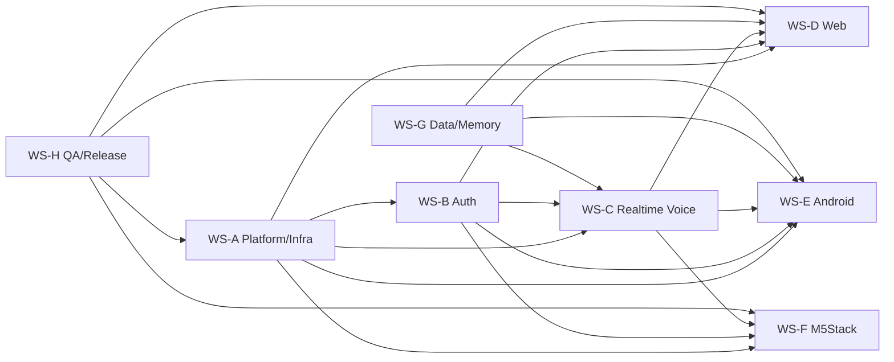
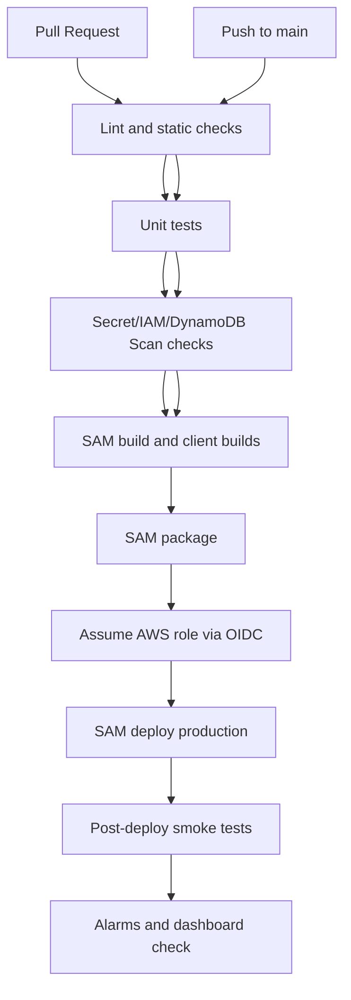
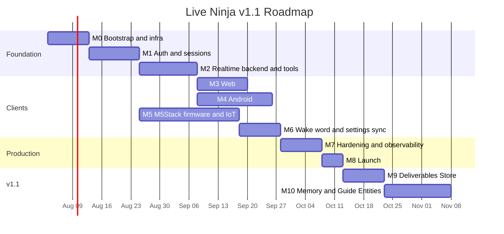
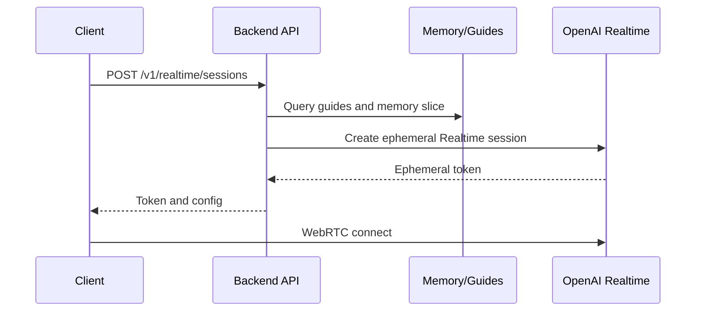
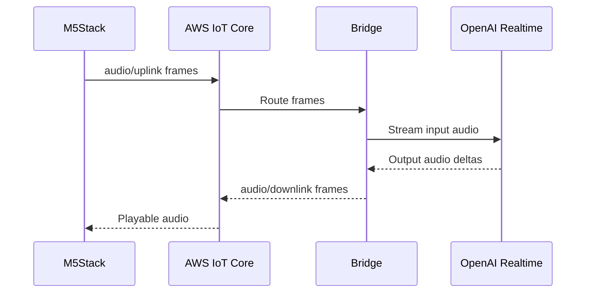
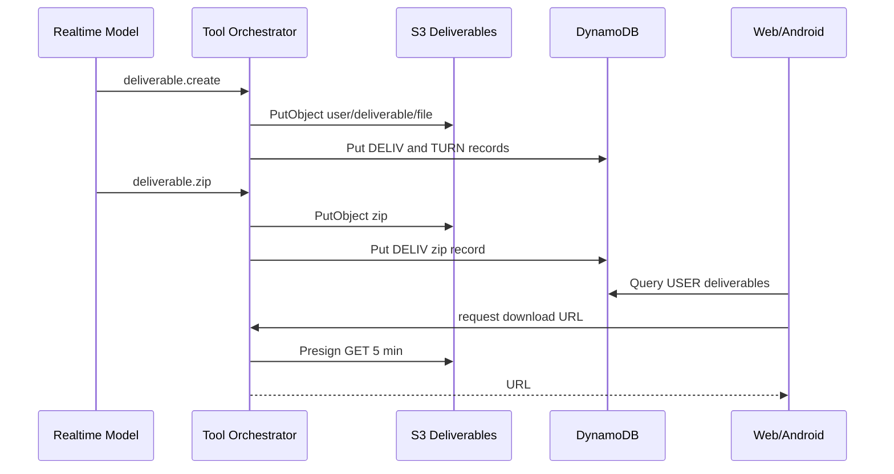
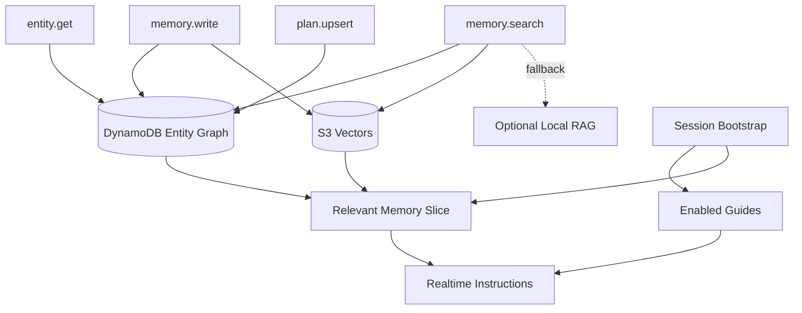
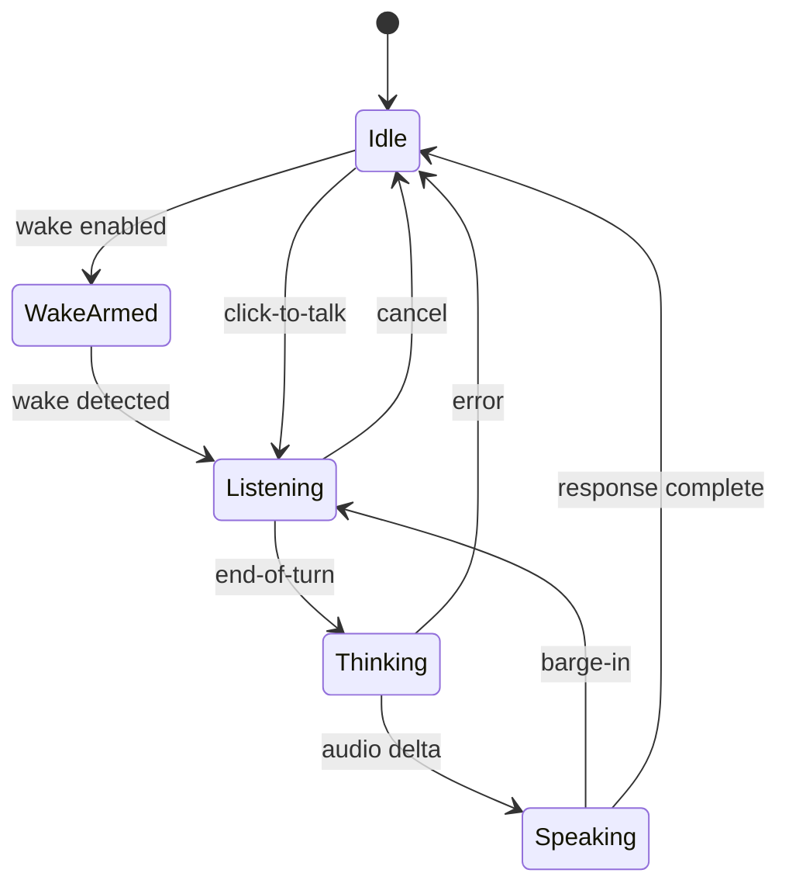

# Live Ninja Implementation Plan

## Planning Defaults

- Delivery path: production-only AWS SAM deploy by GitHub Actions OIDC on push to `main`; no local deploys.
- Branching: short-lived feature branches into `main`; production deploy triggered by merge/push to `main`.
- Status markers: `[ ]` todo, `[~]` in progress, `[x]` done, `[!]` blocked.
- Model routing annotations use the cheapest capable default per task: `gpt-5-mini` for routine implementation/docs/tests, `gpt-5-codex` for multi-file code changes, `gpt-5` for architecture/security/realtime/embedded decisions.
- Production stack tags: `Project=LiveNinja`, `CostCenter`, `Environment=prod`, `ManagedBy=sam`, `DeployedVia=github-actions`, `Owner`.

## Workstream Map

| Workstream | Scope | Lead Profile | Primary Milestones |
| --- | --- | --- | --- |
| WS-A Platform/Infra | SAM, GitHub OIDC, tags, SSM, DynamoDB, S3, SES, IoT, observability | Cloud engineer | M0, M1, M2, M5, M7, M8 |
| WS-B Auth/Identity | LWA PKCE, first-party sessions, rotation, revocation, device pairing | Backend/security engineer | M1, M5, M7 |
| WS-C Realtime Voice | OpenAI session broker, WebRTC config, VAD, barge-in, tool execution | Realtime engineer | M2, M3, M4, M5 |
| WS-D Web | Go-Fiber app, voice UI, settings, Download Center, Memory Browser | Full-stack engineer | M3, M6, M9, M10 |
| WS-E Android | Assistant role, foreground wake service, WebRTC, Files tab | Android engineer | M4, M6, M9, M10 |
| WS-F M5Stack | ESP-IDF/LVGL, SoftAP, LWA pairing, IoT audio, secure storage | Embedded engineer | M5, M6, M7 |
| WS-G Data/Memory | DynamoDB graph, S3 Vectors, deliverables, guides, memory tools | Backend/data engineer | M2, M9, M10 |
| WS-H QA/Release | Test automation, accessibility, load, security, launch runbooks | QA/release engineer | All milestones |

## CI/CD Pipeline

## Roadmap Gantt

## Architecture Diagrams Used During Implementation

## Milestones

### M0 - Bootstrap and Infrastructure

Definition of Done: repository has production SAM scaffold, CI validates builds/tests/security, OIDC deployment role is referenced through GitHub variables, required tags are enforced, and no local deployment path exists.

- [ ] `[model: gpt-5-codex]` Create SAM project layout: `cmd/api`, `cmd/bridge`, `internal/auth`, `internal/realtime`, `internal/store`, `web`, `android`, `firmware/m5stack`.
- [ ] `[model: gpt-5]` Define AWS architecture, IAM boundaries, cost tags, and no-static-key policy.
- [ ] `[model: gpt-5-codex]` Add `template.yaml` with Go arm64 Lambdas, API Gateway, DynamoDB, S3, SES permissions, IoT resources, SSM parameter references, and CloudWatch alarms.
- [ ] `[model: gpt-5-mini]` Add GitHub Actions workflow for lint, unit tests, SAM build/package/deploy, smoke tests, and alarm check.
- [ ] `[model: gpt-5-mini]` Add CI guard that fails on `dynamodb.Scan` in serving packages.
- [ ] `[model: gpt-5-mini]` Add build docs that state deploys happen only by push to `main`.

Verification: `sam validate`, Go tests, workflow syntax check, IAM policy lint, tag assertions, static search for static AWS keys and DynamoDB `Scan`.

### M1 - Auth and Sessions

Definition of Done: web, Android, and device pairing can complete LWA PKCE; backend mints first-party sessions; refresh rotation, revocation, and token-family reuse detection work.

- [ ] `[model: gpt-5]` Finalize LWA redirect URI and PKCE state model for web, Android app links, and M5Stack pairing.
- [ ] `[model: gpt-5-codex]` Implement `/auth/lwa/start`, `/auth/lwa/callback`, `/v1/auth/refresh`, `/v1/auth/logout`.
- [ ] `[model: gpt-5-codex]` Implement JWT ES256 access tokens, hashed refresh tokens, 30-day web/Android families, and 10-year device family schema.
- [ ] `[model: gpt-5-codex]` Implement session/device revocation checks shared by all middleware.
- [ ] `[model: gpt-5-mini]` Add DynamoDB conditional writes for token rotation and reuse detection.
- [ ] `[model: gpt-5-mini]` Add auth tests for expired state, invalid verifier, refresh reuse, revoked device, and LWA identity mismatch.

Verification: auth integration tests with mocked LWA, DynamoDB local tests, cookie flag checks, Android app-link callback test, M5 pairing happy path test.

### M2 - Realtime Voice Backend and Tools

Definition of Done: authenticated clients can request ephemeral Realtime sessions; session instructions include persona, enabled guides, and memory slice; tool calls execute through backend with audit.

- [ ] `[model: gpt-5]` Define Realtime session contract: model alias `gpt-live`, voice, VAD mode, tool schemas, persona, memory, guide injection.
- [ ] `[model: gpt-5-codex]` Implement `POST /v1/realtime/sessions` with OpenAI ephemeral token minting through SSM-stored API key.
- [ ] `[model: gpt-5-codex]` Implement tool orchestrator with authz, timeout, idempotency key, audit event, and allowlist.
- [ ] `[model: gpt-5-codex]` Add initial no-op/stub tools for `deliverable.create`, `deliverable.zip`, `deliverable.deliver`, `memory.search`, `memory.write`, `entity.get`, `plan.upsert`.
- [ ] `[model: gpt-5-mini]` Add barge-in and VAD config propagation fields to session response.
- [ ] `[model: gpt-5-mini]` Add contract tests for session bootstrap and tool-call payload validation.

Verification: mocked OpenAI Realtime tests, tool authz tests, latency budget instrumentation, redaction checks proving OpenAI key never reaches clients.

### M3 - Web Client

Definition of Done: Go-Fiber web app supports login, WebRTC voice, click-to-talk fallback, optional browser wake, settings, WCAG AA baseline, and production cache headers.

- [ ] `[model: gpt-5-codex]` Build authenticated `/app` shell and route guards.
- [ ] `[model: gpt-5-codex]` Implement browser Realtime WebRTC connection using backend ephemeral token.
- [ ] `[model: gpt-5-mini]` Implement voice console states: idle, waking, connecting, listening, thinking, speaking, interrupted, error.
- [ ] `[model: gpt-5-mini]` Add optional Web Audio + WASM wake detector and click-to-talk fallback.
- [ ] `[model: gpt-5-mini]` Build structured settings UI using pickers/lists/segmented controls.
- [ ] `[model: gpt-5-mini]` Add accessibility pass: semantic controls, focus, contrast, keyboard, responsive layout.

Verification: Playwright login/voice mock tests, axe checks, keyboard-only tests, cache header check for HTML `no-cache`, WebRTC session mock.

### M4 - Android Client

Definition of Done: Android app logs in with LWA, requests assistant role, runs wake-word foreground service, starts Realtime WebRTC sessions, supports lock-screen restricted mode, and includes Files/settings scaffolds.

- [ ] `[model: gpt-5]` Define assistant-role compatibility matrix and lock-screen privacy rules.
- [ ] `[model: gpt-5-codex]` Implement LWA PKCE app-link login and encrypted token storage.
- [ ] `[model: gpt-5-codex]` Implement `VoiceInteractionService`, `VoiceInteractionSession`, role request, assist gesture, and launch-from-lock entry.
- [ ] `[model: gpt-5-codex]` Implement foreground wake service with Porcupine and openWakeWord feature flag.
- [ ] `[model: gpt-5-codex]` Implement WebRTC audio/data channel connection to OpenAI using ephemeral token.
- [ ] `[model: gpt-5-mini]` Build Files tab and structured settings scaffolds.

Verification: Android unit tests, instrumentation tests for auth callback and role flow, foreground service lifecycle test, WebRTC mock session, lock-screen sensitive-action test.

### M5 - M5Stack Firmware, IoT, and On-Device 10-Year Login

Definition of Done: M5Stack boots, configures Wi-Fi, completes device pairing, stores 10-year credential securely, connects to IoT, streams audio frames to backend bridge, and plays downlink audio.

- [ ] `[model: gpt-5]` Finalize ESP-IDF partition/security plan: secure boot, flash encryption, encrypted NVS, OTA slots.
- [ ] `[model: gpt-5-codex]` Build LVGL screens: boot, SoftAP, Wi-Fi list, passphrase, pairing QR, listening, speaking, settings, offline.
- [ ] `[model: gpt-5-codex]` Implement SoftAP captive portal and Wi-Fi credential storage.
- [ ] `[model: gpt-5-codex]` Implement backend-assisted LWA device registration and polling/accepted result flow.
- [ ] `[model: gpt-5-codex]` Implement IoT Core mutual TLS connection, topic publish/subscribe, reconnect, and shadow client.
- [ ] `[model: gpt-5-codex]` Implement Opus 16 kHz mono audio pipeline with PCM16 fallback.
- [ ] `[model: gpt-5-codex]` Implement Go Realtime bridge for MQTT audio/control to OpenAI Realtime and TTS downlink.
- [ ] `[model: gpt-5-mini]` Add device telemetry, crash counters, and offline recovery states.

Verification: ESP-IDF build, LVGL screenshot checks, Wi-Fi setup test, encrypted NVS test, IoT policy simulation, bridge integration test, end-to-end audio loopback.

### M6 - Programmable Wake Word and Settings Sync

Definition of Done: users can configure wake words and key settings globally/per-device; Android, web, and M5Stack apply settings without scans; M5Stack shadow converges.

- [ ] `[model: gpt-5]` Define supported wake-word catalogs and training constraints per surface.
- [ ] `[model: gpt-5-codex]` Implement `WAKE` config records and device override access patterns.
- [ ] `[model: gpt-5-codex]` Implement settings API and sync revision numbers.
- [ ] `[model: gpt-5-codex]` Implement M5Stack named shadow desired/reported/delta handling.
- [ ] `[model: gpt-5-codex]` Implement Android foreground service model reload and web wake detector reload.
- [ ] `[model: gpt-5-mini]` Add settings UI controls across web/Android/M5Stack with no blind free-text for known values.

Verification: settings API tests, DynamoDB query tests, IoT shadow convergence test, Android wake reload test, web wake fallback test, M5 model reload test.

### M7 - Hardening, Observability, Cost, and Privacy

Definition of Done: production has useful alarms/dashboards, audit logs, quotas, privacy export/delete, security review, and cost controls.

- [ ] `[model: gpt-5]` Run threat model review for auth, IoT, Realtime, tools, deliverables, memory, and M5 credential theft.
- [ ] `[model: gpt-5-codex]` Add structured logging, trace ids, metrics, and CloudWatch dashboards.
- [ ] `[model: gpt-5-codex]` Add alarms for auth failures, Realtime mint failures, bridge latency, IoT disconnects, DynamoDB throttles, S3 errors, SES bounces.
- [ ] `[model: gpt-5-codex]` Add per-user quotas and rate limits for sessions, tools, deliverables, memory writes, and device traffic.
- [ ] `[model: gpt-5-codex]` Implement privacy export and delete/forget orchestration.
- [ ] `[model: gpt-5-mini]` Add cost dashboard and lifecycle policies for audio, uploads, exports, and old logs.
- [ ] `[model: gpt-5-mini]` Add CI checks for secret leakage, static AWS keys, missing stack tags, and serving-path scans.

Verification: alarm simulation, quota tests, privacy export/delete dry run, IAM least-privilege review, dependency scan, load test, cost estimate.

### M8 - Launch

Definition of Done: production deploy is green from GitHub Actions, smoke tests pass, runbook is complete, rollback plan is documented, and launch KPIs are visible.

- [ ] `[model: gpt-5]` Approve launch readiness checklist and known-issues list.
- [ ] `[model: gpt-5-mini]` Freeze v1 API contracts and client compatibility matrix.
- [ ] `[model: gpt-5-codex]` Push release commit to `main` and watch GitHub Actions production deploy.
- [ ] `[model: gpt-5-mini]` Run post-deploy smoke tests: auth, session mint, web load, Android mock, M5 IoT connect, SES sandbox/prod status.
- [ ] `[model: gpt-5-mini]` Validate dashboards, alarms, cost tags, and support runbook.

Verification: green deploy workflow, smoke-test report, alarm dashboard screenshots/links, production tag audit, rollback rehearsal notes.

### M9 - Deliverables Store

Definition of Done: assistant can create, zip, store, index, deliver, browse, download, share, and revoke per-user deliverables from web and Android; every artifact-producing turn is logged.

- [ ] `[model: gpt-5]` Finalize deliverable object contract, MIME allowlist, quotas, lifecycle, and share policy.
- [ ] `[model: gpt-5-codex]` Implement S3 writer for `{userId}/{deliverableId}/{filename}` and presigned URL generator.
- [ ] `[model: gpt-5-codex]` Implement DynamoDB `DELIV` records, `GSI1PK=DELIV#{deliverableId}`, turn provenance, and share token records.
- [ ] `[model: gpt-5-codex]` Implement tools `deliverable.create`, `deliverable.zip`, `deliverable.deliver` with idempotency.
- [ ] `[model: gpt-5-codex]` Build web Download Center and Android Files tab using same paged API.
- [ ] `[model: gpt-5-mini]` Add file rendering/generation libraries: `gofpdf` or `unidoc` for PDF decision, `archive/zip`, `encoding/csv`, `encoding/json`, ICS writer, image artifact passthrough.
- [ ] `[model: gpt-5-mini]` Add malware scanning hook/interface and storage quotas.

Verification: S3 path tests, DynamoDB query tests, no-scan proof, presigned URL TTL test, zip integrity test, web/Android browse tests, artifact-producing turn audit test.

### M10 - Memory Layer and Guide Entities

Definition of Done: structured memory, semantic recall, optional local RAG fallback contract, memory browser, guide management, guide injection, and default AI-recency guide are production-ready.

- [ ] `[model: gpt-5]` Finalize memory schemas for people, places, information, projects, lists, documents, goals, tasks, schedules, working, episodic, semantic, and procedural memory.
- [ ] `[model: gpt-5]` Confirm hybrid recommendation: DynamoDB entity graph plus S3 Vectors plus optional local RAG sidecar; defer OpenSearch/Aurora.
- [ ] `[model: gpt-5-codex]` Implement DynamoDB entity, relationship, memory, guide, and plan access patterns.
- [ ] `[model: gpt-5-codex]` Implement S3 Vectors adapter with vector ids, metadata filters, and deletion propagation.
- [ ] `[model: gpt-5-codex]` Implement memory tools: `memory.search`, `memory.write`, `entity.get`, `plan.upsert`.
- [ ] `[model: gpt-5-codex]` Implement guide CRUD, versioning, enablement, priority ordering, and device sync.
- [ ] `[model: gpt-5-codex]` Inject enabled guide entities into every session before relevance-retrieved memories.
- [ ] `[model: gpt-5-mini]` Seed default enabled guide "AI is an emerging technology" for new users.
- [ ] `[model: gpt-5-codex]` Build web Memory Browser/Guide manager and Android memory/guide views.
- [ ] `[model: gpt-5-mini]` Define optional local sidecar API for LanceDB/sqlite-vec/Chroma: search, write, forget, health, sync cursor.

Verification: graph query tests, vector search tests, no-scan proof, forget propagation test, guide injection contract test, memory browser accessibility tests, local sidecar fallback simulation.

## Testing and Verification Strategy

| Milestone | Required Verification |
| --- | --- |
| M0 | `sam validate`, Go unit tests, workflow syntax, IAM lint, stack tag assertions, static key scan, `Scan` guard. |
| M1 | Mocked LWA integration, PKCE state tests, refresh rotation/reuse tests, revocation tests, cookie/security header checks. |
| M2 | Mocked OpenAI session tests, tool schema validation, authz tests, redaction tests, latency instrumentation. |
| M3 | Playwright web flows, mocked WebRTC, axe accessibility checks, keyboard navigation, responsive screenshots, cache headers. |
| M4 | Android unit/instrumentation tests, role request tests, wake service lifecycle, WebRTC mock, lock-screen restrictions. |
| M5 | ESP-IDF build, LVGL UI checks, SoftAP test, encrypted NVS test, IoT policy simulation, audio loopback. |
| M6 | Wake config API tests, shadow convergence, device override query tests, Android/web/M5 reload tests. |
| M7 | Threat model signoff, load tests, quota tests, privacy export/delete, alarm simulations, cost estimate. |
| M8 | GitHub Actions deploy green, production smoke tests, dashboard review, tag audit, rollback rehearsal. |
| M9 | S3 object contract tests, DynamoDB no-scan tests, presigned TTL tests, zip integrity, UI browse/download tests. |
| M10 | Entity graph tests, vector recall tests, guide injection tests, forget propagation, browser edit flows, sidecar fallback tests. |

## Data and Memory Flow Details

## Execution Risks

| Risk | Probability | Impact | Mitigation | Owner |
| --- | --- | --- | --- | --- |
| LWA app-link or redirect constraints delay Android/M5 login | Medium | High | Validate redirect URIs in M1 before client work deepens | WS-B |
| OpenAI Realtime behavior or token contract changes | Medium | High | Isolate provider adapter and add contract tests | WS-C |
| M5Stack CPU cannot sustain wake + Opus + UI | Medium | High | Benchmark early; keep PCM16 fallback and tune LVGL refresh | WS-F |
| IoT MQTT adds unacceptable audio jitter | Medium | High | Use bounded frame sizes, bridge buffering, and regional load tests | WS-C/WS-F |
| DynamoDB schema misses a required query | Medium | High | Access-pattern review at each milestone; add GSI before launch | WS-G |
| Browser wake model hurts battery/CPU | Medium | Medium | Keep opt-in and click-to-talk fallback | WS-D |
| Android OEM blocks assistant behavior | Medium | Medium | Compatibility matrix and graceful non-default mode | WS-E |
| Ten-year M5 credential misuse | Low | High | Device-bound refresh, encrypted NVS, secure boot, revocation UI | WS-B/WS-F |
| Deliverable storage cost grows | Medium | Medium | Quotas, lifecycle policies, compression, user-visible cleanup | WS-G |
| Memory recall returns stale or sensitive content | Medium | High | Provenance, guide policy, user edit/forget, bounded recall | WS-G |
| CI deploy fails after merge to main | Low | High | Pre-merge SAM validation, rollback runbook, smoke tests | WS-A/WS-H |

## Operational Runbooks to Produce

- [ ] `[model: gpt-5-mini]` Auth incident: revoke session family, revoke device, rotate signing key.
- [ ] `[model: gpt-5-mini]` Realtime incident: disable session minting, fall back to text/status, rotate OpenAI key through SSM workflow.
- [ ] `[model: gpt-5-mini]` IoT incident: revoke thing cert, quarantine device, disable bridge topic rules.
- [ ] `[model: gpt-5-mini]` Deliverables incident: revoke share tokens, disable presign, quarantine object prefix.
- [ ] `[model: gpt-5-mini]` Memory/privacy incident: run forget/export audit and vector deletion verification.
- [ ] `[model: gpt-5-mini]` Cost incident: apply quotas, inspect top users/devices, adjust lifecycle policies.

## Definition of Done for the Program

- [ ] `[model: gpt-5]` PRD requirements trace to implemented acceptance tests or explicitly deferred backlog items.
- [ ] `[model: gpt-5-codex]` Code is committed and pushed to `main` through normal review path.
- [ ] `[model: gpt-5-mini]` GitHub Actions production deployment is green and smoke tests pass.
- [ ] `[model: gpt-5-mini]` No serving path uses DynamoDB `Scan`.
- [ ] `[model: gpt-5-mini]` No static AWS keys or secret values are committed.
- [ ] `[model: gpt-5-mini]` Required production tags are present on stack resources.
- [ ] `[model: gpt-5-mini]` Web and Android accessibility checks pass.
- [ ] `[model: gpt-5-mini]` M5Stack secure boot, flash encryption, encrypted NVS, IoT policy, and revocation checks pass.
