# Live Ninja Product Requirements Document

## Executive Summary

Live Ninja is a production-only, Login with Amazon gated speech-to-speech assistant platform built around OpenAI GPT Realtime (`gpt-live`). One common AWS backend serves Android, web, and M5Stack Tab5 clients. Each surface supports programmable wake phrases, backend-brokered ephemeral OpenAI Realtime sessions, barge-in, tool calling, configurable persona, durable deliverables, structured memory, and guide entities injected into every session.

The backend uses AWS SAM, Go Lambda on arm64/Graviton, Go-Fiber for web and HTTP handlers, DynamoDB for KV/session/state/device data with `GetItem` and `Query` only on serving paths, S3 for uploads/downloads/audio, SES for email, SSM Parameter Store for config and secrets, and AWS IoT Core for M5Stack device/audio integration. Deployments happen only through GitHub Actions with AWS OIDC on push to `main`.

## Metadata

| Field | Value |
| --- | --- |
| Product | Live Ninja |
| Version | v1.1 |
| Environment | Production only |
| Primary model | OpenAI GPT Realtime, logical alias `gpt-live` |
| Auth provider | Login with Amazon, Authorization Code + PKCE |
| Backend | AWS SAM, Go, Go-Fiber, Lambda arm64 |
| Data | DynamoDB, S3, S3 Vectors, optional local RAG sidecar |
| Clients | Android Kotlin, Go-Fiber web, ESP-IDF/LVGL M5Stack firmware |
| Deployment | GitHub Actions + AWS OIDC only |
| Required tags | Project, CostCenter, Environment=prod, ManagedBy=sam, DeployedVia=github-actions, Owner |

## Vision, Goals, and Non-Goals

### Vision

Live Ninja gives users a private, programmable, always-available voice assistant that feels consistent across phone, browser, and a dedicated desk device. The product is optimized for fast spoken interaction, durable generated outputs, inspectable memory, and long-lived device trust without exposing provider secrets to clients.

### Goals

- Provide low-latency speech-to-speech interaction with barge-in, VAD, and tool calls.
- Gate every surface with LWA and first-party Live Ninja sessions.
- Make Android capable of becoming the primary/default assistant through `VoiceInteractionService` and `RoleManager.ROLE_ASSISTANT`.
- Provide an accessible web voice UI, Download Center, Memory Browser, Guide manager, and settings.
- Make M5Stack Tab5 a standalone voice appliance with SoftAP setup, on-device LWA, IoT audio, and ten-year revocable login.
- Store every assistant-created artifact as a durable per-user deliverable.
- Implement structured personal memory over people, places, information, organizational entities, and planning entities.
- Inject enabled guide entities into every session unconditionally.

### Non-Goals

- No local deploys and no static AWS keys.
- No unauthenticated assistant mode.
- No DynamoDB `Scan` on serving paths.
- No paid AWS Secrets Manager dependency.
- No cloud processing of ambient wake audio before wake or explicit push-to-talk.
- No OpenSearch Serverless or Aurora pgvector dependency in v1.1 unless scale justifies their cost floors.

## Personas and Use Cases

| Persona | Needs | Surfaces |
| --- | --- | --- |
| Mobile power user | Default assistant, lock-screen launch, fast voice, files tab | Android |
| Desk worker | Hands-free desk device, visible state, reliable Wi-Fi setup, long-lived login | M5Stack |
| Knowledge worker | Browser voice, downloads, memory editing, guide rules | Web |
| Privacy-conscious user | On-device wake, retention controls, export, forget | All |
| Operator | Reliable deploys, observability, cost controls, revocation | Backend |

Core use cases: wake by saying "Hey Live Ninja"; interrupt assistant speech; create PDF/MD/CSV/JSON/ICS/image/artifact/zip deliverables; pair M5Stack to an LWA account for up to 10 years; configure wake phrase, voice, language, locale, timezone, persona, memory, guides, privacy, and device sync; browse/edit/forget memory; prioritize guide entities.

## Functional Requirements

### Backend

| ID | Requirement | Acceptance Criteria |
| --- | --- | --- |
| BE-001 | Implement one AWS SAM backend. | SAM defines Go arm64 Lambdas, API Gateway, DynamoDB, S3, SES permissions, SSM parameter references, IoT resources, CloudWatch alarms, and required cost tags. |
| BE-002 | Use Go-Fiber for web and HTTP handlers. | One shared Go-Fiber app serves web routes and REST APIs through a Lambda adapter. |
| BE-003 | Never use DynamoDB `Scan` on serving paths. | Handlers use `GetItem`, `Query`, conditional writes, transactions, or async/offline admin jobs; CI rejects serving-path `Scan`. |
| BE-004 | Keep OpenAI API key server-side. | Key lives in SSM Parameter Store and is used only by backend session broker/bridge. |
| BE-005 | Mint ephemeral Realtime sessions. | `POST /v1/realtime/sessions` validates Live Ninja auth, builds instructions with guides/memory, and returns short-lived OpenAI ephemeral token plus session config. |
| BE-006 | Route tool calls through backend. | Tool orchestrator authorizes and audits `deliverable.*`, `memory.*`, `entity.get`, `plan.upsert`, and future allowlisted tools. |
| BE-007 | Support M5Stack IoT bridge. | Per-device MQTT topics and IoT policies isolate audio/control/shadow traffic. |
| BE-008 | Use SES for email. | Transactional email jobs send through SES with verified identity and redacted logs. |

### Voice and Realtime

| ID | Requirement | Acceptance Criteria |
| --- | --- | --- |
| VO-001 | Use OpenAI GPT Realtime speech-to-speech. | Web and Android use WebRTC directly to OpenAI with ephemeral tokens; M5Stack streams through backend bridge. |
| VO-002 | Support barge-in. | User speech while TTS is playing triggers cancellation/truncation within 300 ms after VAD detection. |
| VO-003 | Support configurable turn/VAD detection. | Session config exposes standard, sensitive, quiet-room, and push-to-talk modes. |
| VO-004 | Support function calling. | Realtime tool calls are executed by backend and results are returned to the model/session. |
| VO-005 | Support configurable persona. | Persona is user/device configurable and injected at session bootstrap. |
| VO-006 | Bootstrap sessions with memory and guides. | Enabled guides are unconditional; memory slice is relevance-retrieved and bounded. |

### Auth and Sessions

| ID | Requirement | Acceptance Criteria |
| --- | --- | --- |
| AU-001 | Use LWA Authorization Code + PKCE on all surfaces. | Web, Android, and M5Stack pairing use PKCE; LWA client secret never ships to clients. |
| AU-002 | Validate LWA tokens server-side. | Backend validates issuer, audience, expiry, nonce/state, and identity through Amazon token/userinfo flow. |
| AU-003 | Mint first-party credentials. | Backend creates access token plus hashed, rotating refresh family bound to user, device, surface, and session id. |
| AU-004 | Web and Android sessions last 30 days. | Access token TTL is 15 minutes; refresh family has 30-day absolute expiry and rotates every use. |
| AU-005 | M5Stack persists login for 10 years. | Backend mints revocable device refresh credential with 10-year absolute expiry; firmware stores it in encrypted NVS with flash encryption and secure boot. |
| AU-006 | Support revocation. | Revoked credentials fail refresh, Realtime minting, IoT auth, deliverable access, and memory access. |
| AU-007 | Bind devices to users. | Pairing creates `DEVICE`, `DEVICESESSION`, IoT thing/cert binding, and config shadow baseline. |

### Android, Web, and M5Stack

| ID | Requirement | Acceptance Criteria |
| --- | --- | --- |
| AN-001 | Android becomes default assistant when granted. | Implements `VoiceInteractionService`, `VoiceInteractionSession`, assistant role request, assist gesture, and launch-from-lock restricted mode. |
| AN-002 | Android has always-on wake. | Foreground service runs Porcupine by default with openWakeWord feature flag, persistent notification, and battery disclosure. |
| AN-003 | Android uses WebRTC Realtime. | App obtains backend ephemeral token and opens microphone/data channels to OpenAI. |
| AN-004 | Android provides Files and settings. | Files tab uses paged deliverables API; settings use pickers/lists/segmented controls. |
| WE-001 | Web serves responsive voice UI. | `/app` serves authenticated app shell with safe HTML cache headers. |
| WE-002 | Web supports browser WebRTC and optional wake. | Browser gets ephemeral token; Web Audio + WASM wake detector is opt-in; click-to-talk fallback is always present. |
| WE-003 | Web provides Download Center, Memory Browser, Guide manager. | Users can browse/filter/download/share deliverables and view/edit/forget memory/guides. |
| WE-004 | Web meets WCAG AA. | Semantic controls, visible focus, keyboard access, light/dark mode, 44 px targets, and contrast checks pass. |
| M5-001 | M5Stack uses ESP-IDF + LVGL native UI. | 1280x720 landscape, one primary decision per screen, large type, 48-64 px touch targets, `N of M` indicators. |
| M5-002 | M5Stack hosts SoftAP captive portal. | Unconfigured device captures Wi-Fi, then serves local config/login page. |
| M5-003 | M5Stack performs on-device LWA pairing. | Device shows QR/short code for backend-assisted PKCE login and binds to user after callback. |
| M5-004 | M5Stack streams audio over IoT. | Publishes Opus or PCM16 frames to per-device uplink topic and subscribes to TTS/control downlink. |
| M5-005 | M5Stack syncs settings through shadow. | Wake phrase, voice, persona, locale, volume, and privacy state sync through named shadow. |

### Wake Word, Deliverables, Memory, and Guides

| ID | Requirement | Acceptance Criteria |
| --- | --- | --- |
| WW-001 | Default wake phrase is "Hey Live Ninja". | All clients ship with the phrase enabled. |
| WW-002 | Wake words are programmable everywhere. | UI presents supported phrases/models and guided training where available; no blind free-text when the value set is known. |
| WW-003 | Wake detection stays local. | Ambient audio does not leave device/browser/phone before wake or explicit push-to-talk. |
| DS-001 | Assistant can create and zip files. | `deliverable.create` supports PDF, MD, CSV, JSON, ICS, image, artifact; `deliverable.zip` creates archives. |
| DS-002 | Assistant can deliver durable downloads. | S3 key is `{userId}/{deliverableId}/{filename}`; DynamoDB item is `PK=USER#{userId}`, `SK=DELIV#{ts}#{id}`; presigned URL TTL defaults to 5 minutes. |
| DS-003 | Every artifact-producing turn is logged. | Turn provenance and deliverable index are written transactionally where possible. |
| DS-004 | Web and Android browse identically. | Download Center and Files tab use same paged API and share-by-id GSI. |
| ML-001 | Memory models people, places, information, org, and planning. | Entities include provenance, confidence, relationships, projects, lists, documents, goals, tasks, and schedules. |
| ML-002 | Memory supports working, episodic, semantic, procedural types. | Records include type, scope, retention, provenance, and optional vector id. |
| ML-003 | Memory uses hybrid recall. | DynamoDB entity graph is source of truth; S3 Vectors handles semantic recall; optional local RAG sidecar is fallback. |
| ML-004 | Memory tools are exposed. | `memory.search`, `memory.write`, `entity.get`, and `plan.upsert` are callable by Realtime sessions. |
| ML-005 | Forget propagates. | Forget deletes/tombstones DynamoDB content and removes S3 Vectors entries; local sidecar receives deletion queue. |
| GE-001 | Guides are special memory entities. | Guides are versioned records with priority, enabled state, scope, and directive text. |
| GE-002 | Guides are injected into every session. | All enabled guides are included unconditionally, independent of relevance retrieval. |
| GE-003 | Default guide ships enabled. | New users receive "AI is an emerging technology": prefer sources updated within 30 days, otherwise official Anthropic/OpenAI docs; cite dates and flag older sources. |

## UX and Wireframe Notes

### Android

Home shows a large listening/speaking state, transcript strip, interrupt/cancel button, and tool-result cards. Assistant setup uses native role-request steps and launch-from-lock status. Files tab has segmented type filters and rows with title, type, date, size, download, and share. Memory tab uses structured entity lists, relationship chips, edit/merge/forget actions. Settings use pickers and segmented controls for wake word, voice, locale, timezone, persona, devices, privacy, and guides.

### Web

Voice console includes microphone state, wake/click-to-talk toggle, transcript, tool cards, and connection quality. Download Center is a desktop table and mobile card list with type/date filters and presigned download actions. Memory Browser has tabs for People, Places, Information, Projects, Lists, Documents, Goals, Tasks, Schedules, Procedures, and Guides. All controls are semantic, keyboard accessible, WCAG AA, and use structured inputs for known value sets.

### M5Stack LCD

Boot shows one state and one recovery action. Wi-Fi setup uses a full-screen SSID list and an on-screen keyboard only for passphrase. Login shows QR/short code, progress, and `N of M`. Listening shows one primary state, waveform, mute, and cancel. Settings use full-screen list-select, segmented controls, rollers, and keyboard only for passphrase/device name.

## Endpoint Catalog

| Method | Path | Purpose | Auth |
| --- | --- | --- | --- |
| `GET` | `/app` | Serve web shell | Session cookie |
| `GET` | `/auth/lwa/start` | Start LWA PKCE | None |
| `GET` | `/auth/lwa/callback` | Exchange code and create session | PKCE state |
| `POST` | `/v1/auth/refresh` | Rotate refresh and issue access token | Refresh credential |
| `POST` | `/v1/auth/logout` | Revoke current session | Access token |
| `POST` | `/v1/devices/register` | Create pending device registration | Access token or device attestation |
| `POST` | `/v1/devices/{deviceId}/pair` | Bind device to user | Access token/device proof |
| `GET` | `/v1/devices` | List devices | Access token |
| `PATCH` | `/v1/devices/{deviceId}` | Update device settings | Access token |
| `POST` | `/v1/realtime/sessions` | Mint OpenAI ephemeral session | Access token |
| `POST` | `/v1/tools/execute` | Execute allowlisted tool call | Access token/bridge token |
| `GET` | `/v1/deliverables` | Query user deliverables | Access token |
| `POST` | `/v1/deliverables` | Create metadata/upload URL | Access token/tool token |
| `GET` | `/v1/deliverables/{id}` | Resolve metadata | Access/share token |
| `POST` | `/v1/deliverables/{id}/download-url` | Create presigned URL | Access/share token |
| `POST` | `/v1/deliverables/{id}/share` | Create share token | Access token |
| `DELETE` | `/v1/deliverables/{id}/share` | Revoke share token | Access token |
| `GET` | `/v1/memory/entities` | Query entities by type | Access token |
| `GET` | `/v1/memory/entities/{id}` | Get entity | Access token |
| `POST` | `/v1/memory/search` | Hybrid graph/vector search | Access token |
| `POST` | `/v1/memory/write` | Write memory | Access/tool token |
| `DELETE` | `/v1/memory/entities/{id}` | Forget entity | Access token |
| `GET` | `/v1/guides` | List guides | Access token |
| `POST` | `/v1/guides` | Create guide | Access token |
| `PATCH` | `/v1/guides/{id}` | Edit guide | Access token |

## IoT Topics

| Topic | Direction | Purpose |
| --- | --- | --- |
| `live-ninja/{tenantId}/{deviceId}/audio/uplink` | Device to cloud | Opus/PCM microphone frames after wake |
| `live-ninja/{tenantId}/{deviceId}/audio/downlink` | Cloud to device | Assistant audio frames |
| `live-ninja/{tenantId}/{deviceId}/control/uplink` | Device to cloud | Wake, barge-in, cancel, telemetry |
| `live-ninja/{tenantId}/{deviceId}/control/downlink` | Cloud to device | Session start/stop, errors, volume, TTS control |
| `$aws/things/{thingName}/shadow/name/config/update` | Both | Wake, voice, persona, locale, privacy settings |
| `$aws/things/{thingName}/shadow/name/config/delta` | Cloud to device | Desired-state sync |

## System Context

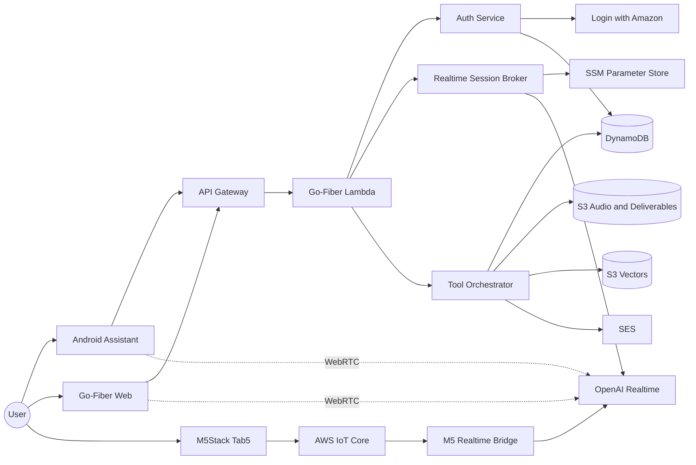

## AWS Deployment

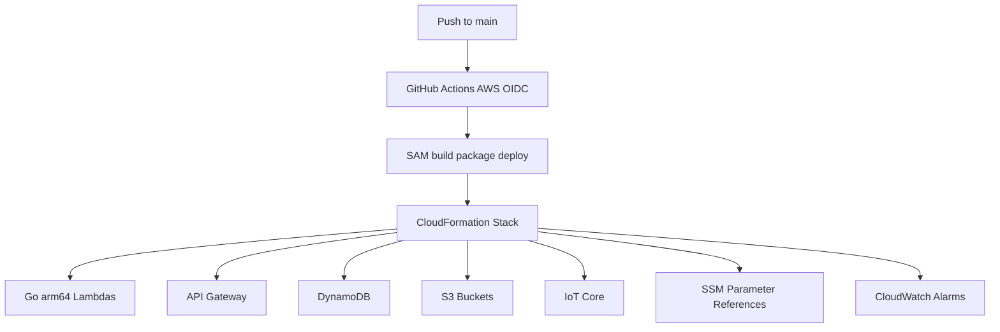

## Voice and Login Flows

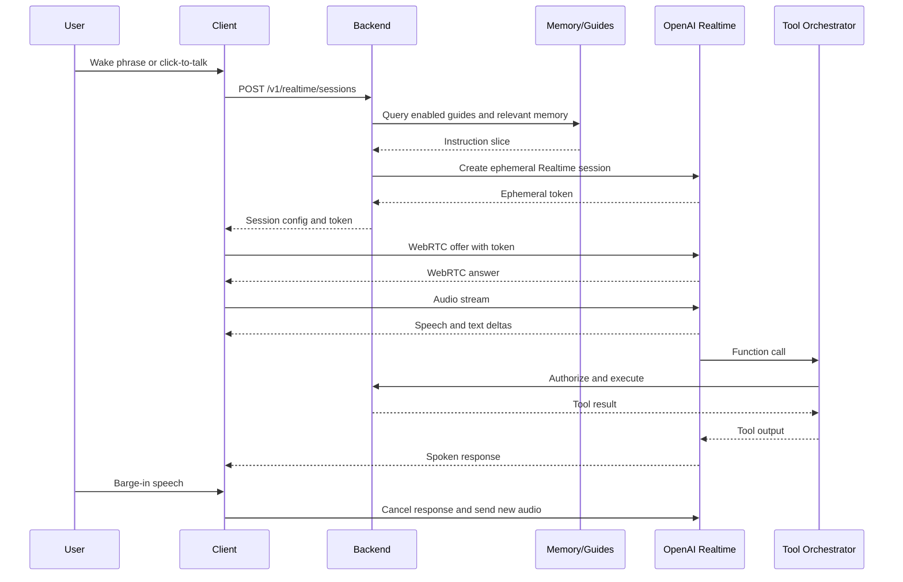

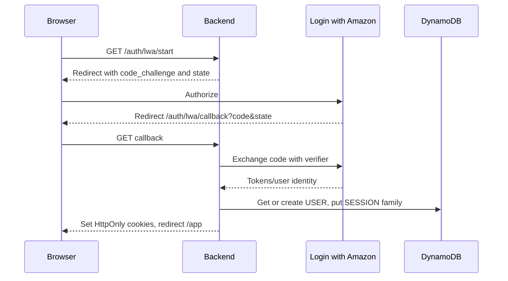

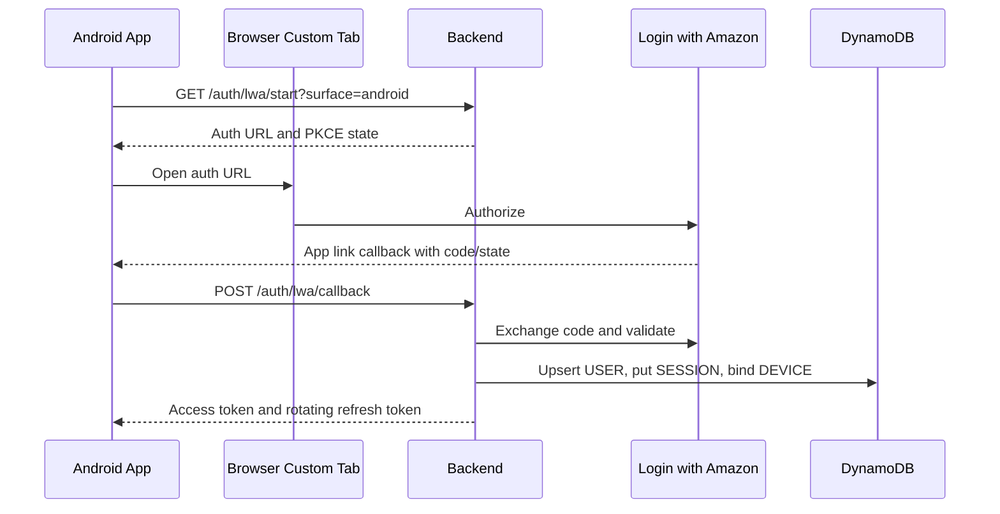

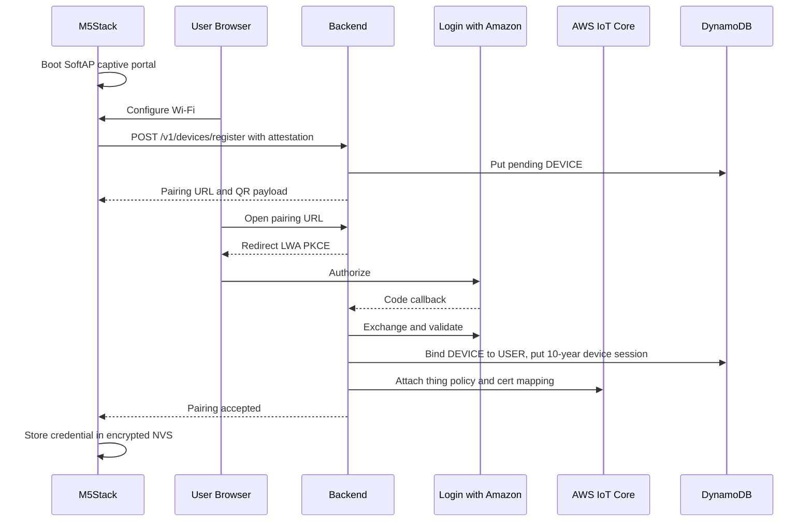

## M5Stack Audio over IoT

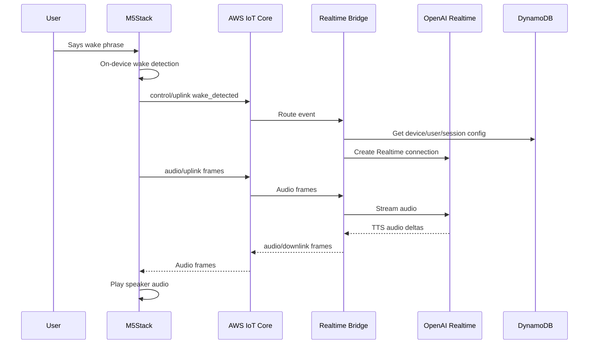

## Data Model

Primary table: `LiveNinjaMain`.

| Entity | PK | SK | GSI1 | GSI2 | Notes |
| --- | --- | --- | --- | --- | --- |
| User profile | `USER#{userId}` | `PROFILE` | `LWA#{lwaSub}` / `USER#{userId}` | - | Amazon identity mapping |
| Session | `USER#{userId}` | `SESSION#{familyId}#{sessionId}` | `SESSION#{sessionId}` / `USER#{userId}` | `DEVICE#{deviceId}` / `SESSION#{sessionId}` | Web/Android 30-day sessions |
| Device session | `USER#{userId}` | `DEVICESESSION#{deviceId}#{familyId}` | `DEVICESESSION#{familyId}` / `USER#{userId}` | `DEVICE#{deviceId}` / `ACTIVE` | M5 ten-year credential |
| Device | `USER#{userId}` | `DEVICE#{deviceId}` | `DEVICE#{deviceId}` / `USER#{userId}` | `THING#{thingName}` / `DEVICE#{deviceId}` | Device binding |
| Wake config | `USER#{userId}` | `WAKE#{scope}#{deviceIdOrGlobal}` | `DEVICE#{deviceId}` / `WAKE` | - | Global and device overrides |
| Deliverable | `USER#{userId}` | `DELIV#{createdAtIso}#{deliverableId}` | `DELIV#{deliverableId}` / `USER#{userId}` | `TURN#{turnId}` / `DELIV#{deliverableId}` | Query-only browse and share |
| Entity | `USER#{userId}` | `ENTITY#{entityType}#{entityId}` | `ENTITY#{entityId}` / `USER#{userId}` | `ETYPE#{entityType}` / `UPDATED#{updatedAt}` | People, places, info, org, planning |
| Relationship | `USER#{userId}` | `REL#{fromEntityId}#{relType}#{toEntityId}` | `ENTITY#{toEntityId}` / `REL#{fromEntityId}` | - | Graph edge |
| Memory | `USER#{userId}` | `MEM#{memoryType}#{createdAtIso}#{memoryId}` | `MEM#{memoryId}` / `USER#{userId}` | `ENTITY#{entityId}` / `MEM#{createdAtIso}` | Working/episodic/semantic/procedural |
| Guide | `USER#{userId}` | `GUIDE#{priorityPadded}#{guideId}` | `GUIDE#{guideId}` / `USER#{userId}` | `GUIDEENABLED#{enabled}` / `PRIORITY#{priorityPadded}` | Injected every session |
| Plan item | `USER#{userId}` | `PLAN#{status}#{dueAtIso}#{planId}` | `PLAN#{planId}` / `USER#{userId}` | `ENTITY#{entityId}` / `PLAN#{dueAtIso}` | Goals/tasks/schedules |

Access patterns use only `Query` and `GetItem`: list deliverables by `PK=USER#{userId}` and `begins_with(SK, DELIV#)`; resolve deliverable by `GSI1PK=DELIV#{deliverableId}`; list devices by `begins_with(SK, DEVICE#)`; list entity type by `GSI2PK=ETYPE#{type}`; get entity by `GSI1PK=ENTITY#{entityId}`; list relationships from entity by `begins_with(SK, REL#{fromEntityId}#)`.

S3 object prefixes: `audio/{userId}/{sessionId}/{turnId}/`, `deliverables/{userId}/{deliverableId}/{filename}`, `uploads/{userId}/{uploadId}/{filename}`, `exports/{userId}/{exportId}/`.

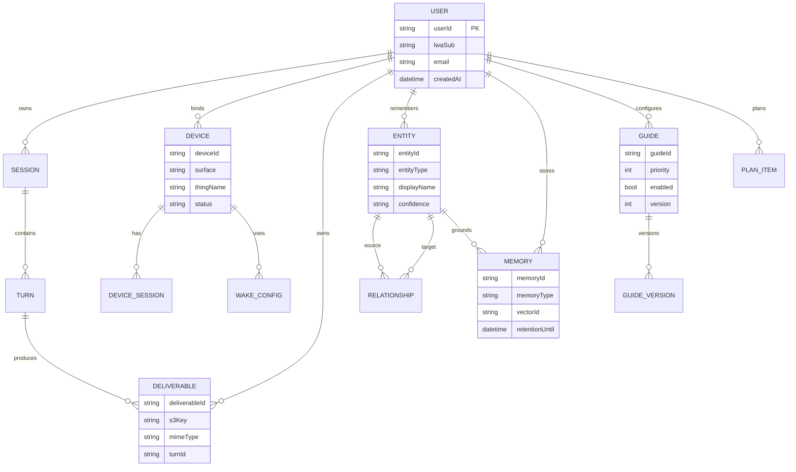

## Wake Sync, UI State, Deliverables, and Memory

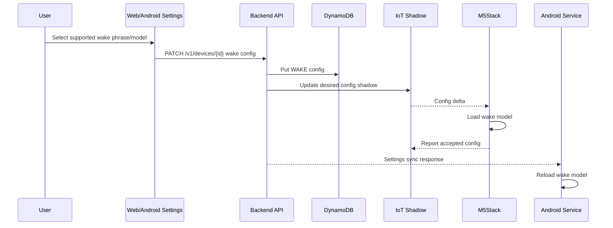

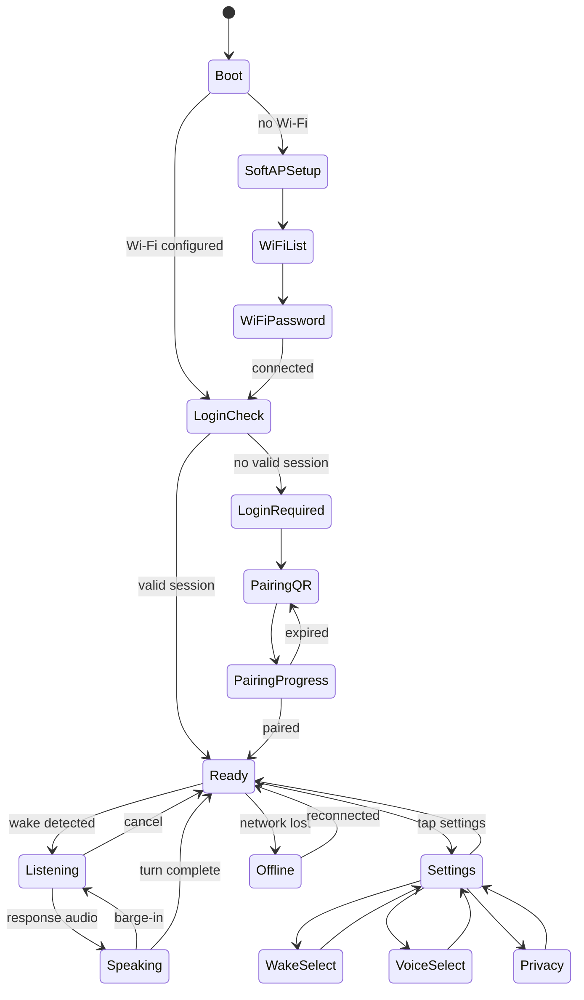

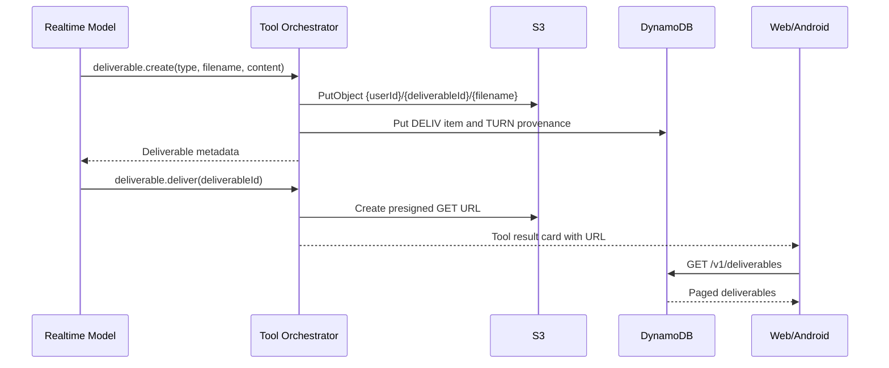

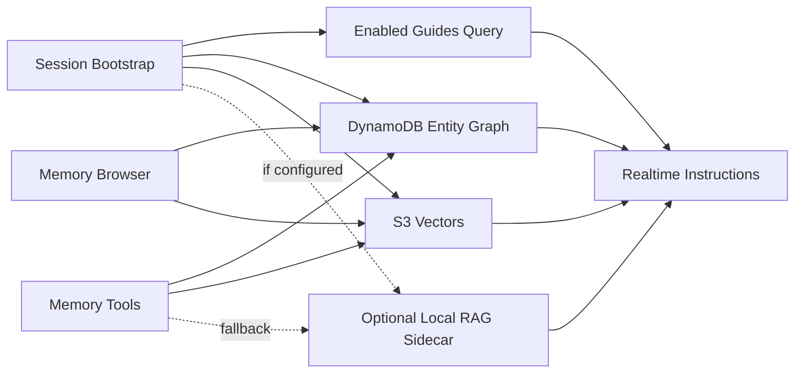

## Token Lifetimes

| Credential | Surface | Lifetime | Storage | Rotation |
| --- | --- | --- | --- | --- |
| LWA authorization code | All | Minutes | Memory only | Single use |
| First-party access token | All | 15 minutes | Web secure cookie or memory; Android encrypted storage; M5 memory cache | On refresh |
| Refresh token | Web/Android | 30 days absolute | HttpOnly Secure SameSite cookie; Android EncryptedSharedPreferences | Every use |
| Device refresh credential | M5Stack | 10 years absolute | ESP32 encrypted NVS | Silent periodic rotation |
| OpenAI ephemeral token | Realtime | 1 minute to initiate, session-scoped | Memory only | Per session |
| Presigned URL | Downloads | 5 minutes default | Not persisted | Per request |

## Non-Functional Requirements

| ID | Category | Requirement |
| --- | --- | --- |
| NFR-001 | Latency | Web/Android first audio response p50 under 1.2 s after end-of-turn; M5Stack under 1.6 s. |
| NFR-002 | Bridge | M5Stack relay overhead under 250 ms p50 excluding model latency. |
| NFR-003 | Availability | Backend monthly availability target 99.5 percent for v1. |
| NFR-004 | Accessibility | Web and Android meet WCAG AA where applicable. |
| NFR-005 | Security | OpenAI key never touches clients. |
| NFR-006 | Privacy | Wake detection stays local until wake or explicit user action. |
| NFR-007 | Cost | Avoid always-on search/vector databases in v1.1. |
| NFR-008 | Observability | Structured logs, metrics, traces, alarms, and audit events cover auth, Realtime, tools, IoT, deliverables, and memory. |
| NFR-009 | Deletion | Export and deletion flows cover profile, sessions, devices, deliverables, memory, vectors, and feasible logs. |

## Security, Privacy, and Threat Model

Controls: LWA PKCE on all surfaces; short-lived audience-scoped access tokens; rotating hashed refresh tokens; device-bound M5 credentials in encrypted NVS with secure boot and flash encryption; OpenAI API key in SSM only; private S3 deliverables with presigned URLs; IoT policies restricted by thing/device; local wake detection; memory view/edit/export/forget.

| Threat | Impact | Mitigation |
| --- | --- | --- |
| Stolen web refresh cookie | Account persistence | HttpOnly Secure SameSite cookies, rotation, reuse detection, revocation |
| Stolen Android token | Account persistence | Android Keystore, rotation, revocation |
| Stolen M5Stack | Long-lived exposure | Encrypted NVS, secure boot, flash encryption, device revocation |
| OpenAI key leak | Platform compromise | SSM only, no client exposure, IAM least privilege, log redaction |
| DynamoDB hot partition | Latency/throttling | User-scoped partitions, pagination, rate limits |
| Deliverable URL forwarding | Data leakage | Short TTL URLs, explicit share tokens, revoke flow |
| Prompt injection through memory | Unsafe actions | Provenance, policy wrapper, confirmation gates for sensitive tools |
| IoT topic spoofing | Device data leakage | Mutual TLS, thing policy variables, cert revocation |

## KPIs

| KPI | Target |
| --- | --- |
| Realtime session creation success | 99 percent |
| First response audio p50 | Under 1.2 s web/Android, under 1.6 s M5Stack |
| Barge-in success | 95 percent within 300 ms after detection |
| Deliverable creation success | 99 percent |
| Memory edit/forget propagation | 99 percent within 60 s |
| Crash-free Android sessions | 99.5 percent |
| M5Stack reconnect after Wi-Fi loss | 95 percent within 30 s |
| Cross-surface 30-day active use | 25 percent after launch |

## Assumptions, Dependencies, Risks, and Defaults

Assumptions: OpenAI Realtime supports WebRTC ephemeral sessions, speech-to-speech, VAD, barge-in, and function calling for `gpt-live`; LWA supports required web, Android, and backend-assisted M5Stack pairing redirects; M5Stack Tab5 can run selected wake-word library; S3 Vectors is available in the production region or falls back to DynamoDB graph plus optional local RAG; GitHub OIDC trust uses `vars.AWS_DEPLOY_ROLE_ARN`; SES production sending is approved.

| Risk | Impact | Mitigation |
| --- | --- | --- |
| Android assistant role varies by OEM | Default assistant unavailable on some devices | Compatibility matrix and normal-app fallback |
| Browser wake support varies | Inconsistent web wake UX | Optional WASM wake and click-to-talk fallback |
| M5 audio bridge latency | Poor voice UX | Opus frames, bounded buffers, regional placement, load tests |
| Ten-year device credential theft | Long-lived exposure | Device-bound refresh, encrypted NVS, secure boot, revocation UI |
| Realtime API changes | Integration breakage | Backend abstraction and contract tests |
| Missing DynamoDB access pattern | Scan temptation | Schema review, GSI additions before launch |
| S3 Vectors quota/region issue | Degraded memory recall | Optional local RAG and graph fallback |
| Deliverable storage abuse | Cost/policy risk | Quotas, type allowlist, lifecycle policy, scanning hook |

| Open Question | Chosen Default |
| --- | --- |
| Android wake engine | Porcupine first, openWakeWord behind feature flag |
| M5Stack wake engine | ESP-SR first if stable, microWakeWord fallback |
| M5 audio codec | Opus 16 kHz mono, PCM16 fallback |
| M5 bridge runtime | Lambda for control, Go container task for long Realtime sessions if needed |
| S3 encryption | SSE-S3 default, SSE-KMS if compliance requires |
| Access token format | JWT ES256 with key id and SSM-backed rotation |
| Refresh token storage | Salted hashes and token family metadata in DynamoDB |
| Memory deletion | Tombstone audit metadata, delete user content and vector entries immediately |
| Guide priority | Lower number injects earlier; latest version wins within guide id |
| Region | `us-east-1` unless latency testing chooses another |
