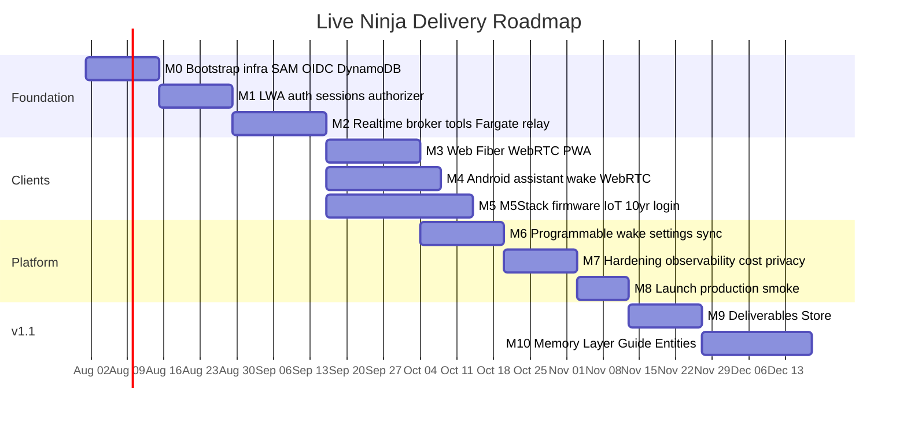
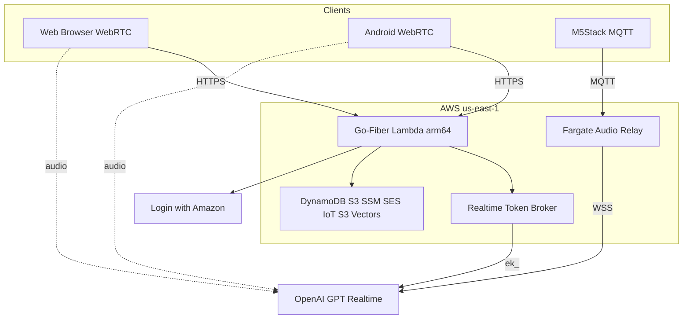
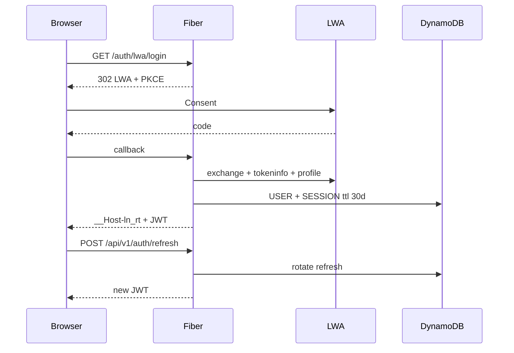
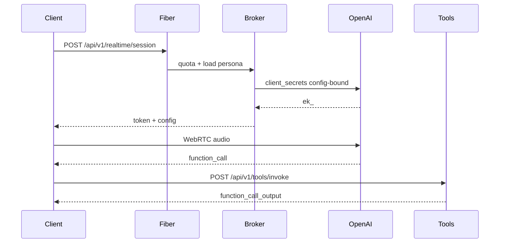
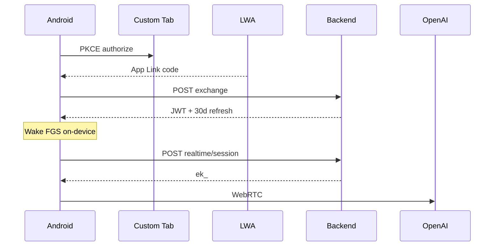
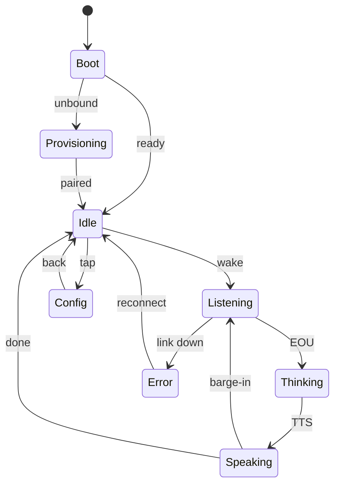
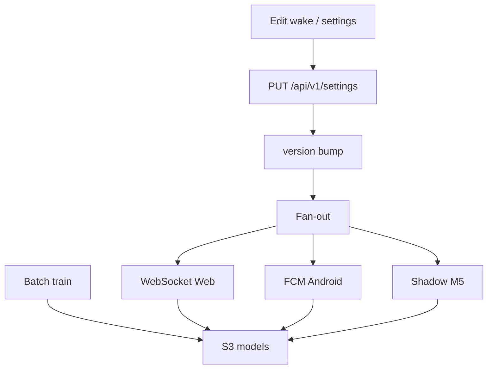
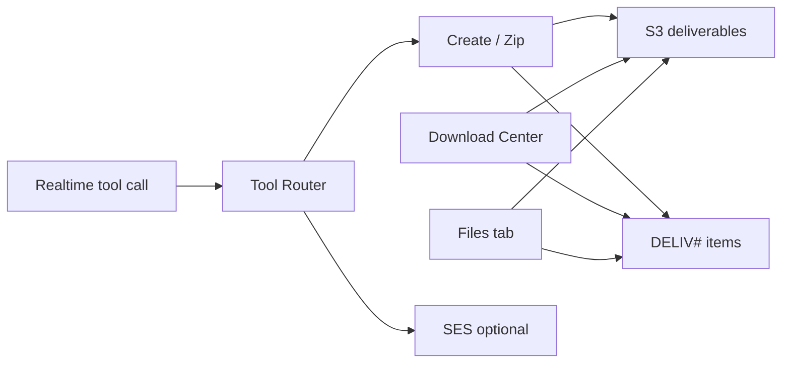
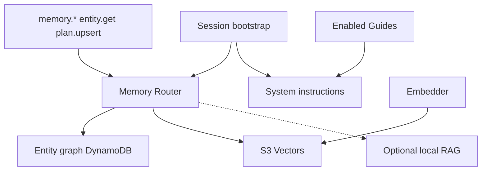

# Live Ninja — Implementation Plan

| Field | Value |
|---|---|
| **Document** | Formal implementation plan |
| **Product** | Live Ninja |
| **Version** | 1.1 |
| **Date** | 2026-07-17 |
| **Owner** | jeremy |
| **Status** | `[ ]` authoring complete / execution not started |
| **Repo** | `JeremyProffittOrg/live-ninja` |
| **Domain** | `live.jeremy.ninja` |
| **AWS** | account `759775734231` · region `us-east-1` |
| **Stack** | AWS SAM · Go 1.22 · `provided.al2023` · **arm64/Graviton** · Go-Fiber + Lambda Web Adapter |
| **PRD** | `prd.md` (FR IDs referenced throughout) |

This plan is **decision-complete and built for autonomy**: every default is baked in (see PRD §13). Execution runs straight through milestones without check-ins. Pause only for genuine blockers not covered by pre-baked fallbacks.

---

## 1. How to read this plan

### 1.1 Structure

- **Parallel workstreams** (WS-A…WS-H) executed by agentic teams.
- **Sequential milestones M0–M10**: M0 bootstrap → M8 launch core → **M9 Deliverables Store** → **M10 Memory Layer + Guide Entities**.
- Each milestone has a **Definition of Done** and ordered tasks.
- Every milestone and task carries a **status marker** and a **model-routing** tag.

### 1.2 Status markers

| Marker | Meaning |
|---|---|
| `[ ]` | todo |
| `[~]` | in progress |
| `[x]` | done |
| `[!]` | blocked (note blocker inline) |

All items start as `[ ]`.

### 1.3 Model-routing legend

Route each task to the **cheapest capable model**. If **Fable** is unavailable, promote to **Opus** — never drop to Sonnet.

| Tag | Model | Use for |
|---|---|---|
| **H** | Haiku | Scaffolding, boilerplate, config, renames, docs wiring |
| **S** | Sonnet | Handlers, CRUD, UI screens, tests, moderate IaC |
| **F** | Fable | Protocol/state, audio/wake pipelines, concurrency, sync |
| **O** | Opus | Security-critical auth, cross-surface contracts, architecture, threat modeling |

### 1.4 Execution rules

- **Production-only.** Push to `main` = production deploy via GitHub Actions + OIDC. No local `sam deploy` / static keys.
- **Secrets:** user sets via `scripts/set-secret.sh` / SSM `put-parameter`; agents never see secret values.
- **DynamoDB:** Query/GetItem only on serving paths.
- **arm64 everywhere:** `GOOS=linux GOARCH=arm64 CGO_ENABLED=0` with `Architectures: [arm64]` together.
- **Cost tags (stack-level `samconfig.toml`):**  
  `Project=live-ninja CostCenter=voice-ai Environment=prod ManagedBy=sam DeployedVia=github-actions Owner=jeremy`
- **Verbose notes:** append under each milestone as work proceeds (§9).
- **Subagent policy:** 6 min inactivity / 30 min completion timeout; ≤2 restarts; then escalate.

---

## 2. Workstream map

| WS | Name | Owns | Primary models | Depends on | Parallel with |
|---|---|---|---|---|---|
| **WS-A** | Platform & Infra | SAM, OIDC pipeline, DynamoDB, SSM, S3, CloudFront/R53, tags, IoT, Fargate infra | O, S, H | — | foundation for all |
| **WS-B** | Identity & Auth | LWA BFF, JWT ES256, rotating refresh, 10-yr device, authorizer | O, S | WS-A M0 | WS-C |
| **WS-C** | Realtime Voice | Token broker, tools, Fargate relay, fallback, metering | O, F, S | WS-A, WS-B | WS-B after M0 |
| **WS-D** | Web Client | Fiber SSR, WebRTC, settings, PWA, WASM wake, Download Center | S, F | WS-B, WS-C | WS-E, WS-F |
| **WS-E** | Android Client | VIS, ROLE_ASSISTANT, wake FGS, WebRTC, Files tab | F, S | WS-B, WS-C | WS-D, WS-F |
| **WS-F** | M5Stack Firmware | ESP-IDF, ESP-SR, IoT audio, SoftAP LWA, 10-yr, OTA | O, F, S | WS-A, WS-B, WS-C relay | WS-D, WS-E |
| **WS-G** | Cross-Cut | Settings sync, wake training, privacy, observability, cost, contracts | O, F, S | WS-A | all |
| **WS-H** | v1.1 Capabilities | Deliverables Store (M9), Memory + Guides (M10) | O, S, F | M2 tools + M3/M4 UI | after M8 preferred; can start M9 after M3 |

### 2.1 Milestone → workstream matrix

| Milestone | WS-A | WS-B | WS-C | WS-D | WS-E | WS-F | WS-G | WS-H |
|---|:--:|:--:|:--:|:--:|:--:|:--:|:--:|:--:|
| **M0** Bootstrap/Infra | ● | | | | | | ○ | |
| **M1** Auth | ○ | ● | | | | | | |
| **M2** Realtime backend | | ○ | ● | | | | ○ | |
| **M3** Web | | | ○ | ● | | | ○ | |
| **M4** Android | | ○ | ○ | | ● | | ○ | |
| **M5** M5Stack + IoT | ○ | ○ | ○ | | | ● | ○ | |
| **M6** Wake + settings sync | | | | ○ | ○ | ○ | ● | |
| **M7** Hardening | ○ | ○ | ○ | ○ | ○ | ○ | ● | |
| **M8** Launch | ● | ○ | ○ | ○ | ○ | ○ | ● | |
| **M9** Deliverables Store | ○ | | ○ | ○ | ○ | | ○ | ● |
| **M10** Memory + Guides | ○ | | ○ | ○ | ○ | ○ | ○ | ● |

● = lead · ○ = contributing

### 2.2 CI/CD pipeline

```mermaid
flowchart LR
    DEV["Push to main"] --> GHA["GitHub Actions"]
    GHA --> CO["Checkout + setup-go"]
    CO --> TEST["go test + golangci-lint"]
    TEST --> BUILD["make build<br/>GOARCH=arm64 all funcs"]
    BUILD --> OIDC["Assume gha-deploy<br/>via OIDC"]
    OIDC --> SB["sam build"]
    SB --> SD["sam deploy<br/>--no-confirm-changeset"]
    SD --> CFN["CloudFormation update"]
    CFN --> PROD["Prod Lambda + IoT + Fargate"]
    PROD --> WATCH["gh run watch<br/>+ CloudWatch alarms"]
```



**Workflow shape (locked):** `id-token: write`, `role-to-assume: ${{ vars.AWS_DEPLOY_ROLE_ARN }}`, region `us-east-1`, no `aws-access-key-id` inputs ever.

### 2.3 Roadmap Gantt



Note: M4 and M5 start after M2 in parallel with M3; M6 starts when Web settings surface exists (after M3) and absorbs Android/M5 clients as they land.

---

## 3. Architecture snapshot (locked decisions)



| Decision | Choice |
|---|---|
| Web framework | Go-Fiber SSR + ES modules (no SPA) |
| Audio path web/Android | Direct WebRTC → OpenAI |
| Audio path M5 | IoT MQTT → Fargate relay → OpenAI WSS |
| Secrets | SSM SecureString + KMS (no Secrets Manager) |
| JWT | ES256 KMS-signed, 15 min |
| Sessions | 30d web/Android; 10y M5 rotating family |
| DynamoDB | Single-table `live-ninja`, Query/GetItem only |
| Memory | DynamoDB graph + S3 Vectors + optional local RAG |
| Deploy | GHA + OIDC only |

---

## 4. Milestones

> Task line format: `[status]` **Model** — task _(FR refs)_

---

### M0 — Bootstrap / Infrastructure  `[ ]`  
**Lead:** WS-A · **Support:** WS-G · **Models:** O/S/H

**Definition of Done:** Empty-but-real SAM stack deploys to `759775734231` via GitHub Actions + OIDC on push to `main`; DynamoDB `live-ninja` with GSI1/GSI2 + TTL exists; SSM parameter *slots* exist (values set out-of-band by user); S3 buckets, CloudFront + Route 53 for `live.jeremy.ninja`, six cost tags in place; `/healthz` returns 200 through CloudFront; DynamoDB RCU alarm + AWS Budgets ($20/$50/$100 on `Project=live-ninja`) armed; Cost Allocation Tags `Project`+`CostCenter` activated in Billing; six integration contracts frozen under `/contracts`.

**Ordered tasks:**

- `[ ]` **O** — Author `template.yaml` skeleton: HTTP API v2 + `web` Fiber Lambda (arm64, LWA layer), per-function least-privilege roles, stubs for `authorizer`, `realtime-broker`, `iot-ingest`, `usage-rollup`, `email-dispatch`, `tool-router`. _(FR-BE-01)_
- `[ ]` **S** — DynamoDB table `live-ninja`: `pk`/`sk`, GSI1 (`gsi1pk`/`gsi1sk`), GSI2 (`gsi2pk`/`gsi2sk`), TTL `ttl`, PAY_PER_REQUEST, PITR on. _(FR-BE-03)_
- `[ ]` **H** — `samconfig.toml` stack tags + arm64 defaults + artifact bucket `vars.CLOUDFORMATION_S3_BUCKET`.
- `[ ]` **H** — `Makefile`: `GOOS=linux GOARCH=arm64 CGO_ENABLED=0 go build -tags lambda.norpc -o bootstrap ./cmd/<fn>` per function.
- `[ ]` **S** — `.github/workflows/deploy.yml` per `deploy.md`: OIDC, `make build` → `sam build` → `sam deploy --no-confirm-changeset --no-fail-on-empty-changeset`; gate on `go test`.
- `[ ]` **H** — SSM parameter slots: `/live-ninja/prod/openai/api_key`, `/lwa/client_id`, `/lwa/client_secret`, `/session/cred_pepper`, `/device/cred_pepper`. Values by user only.
- `[ ]` **O** — KMS CMKs: `alias/live-ninja-auth` envelope + ECC_NIST_P256 SIGN_VERIFY for JWT.
- `[ ]` **S** — S3 buckets (block-public, SSE-S3, versioning): user, wakewords, assets, logs, deliverables, vectors placeholders.
- `[ ]` **S** — Edge: CloudFront `live.jeremy.ninja` (ACM `vars.CERTIFICATE_ARN`), Route 53 alias, cache `/static/*` immutable, pass `/api|/auth` no-cache; HSTS/CSP headers.
- `[ ]` **H** — Fiber `/healthz` + `internal/config` SSM loader (5-min cache) + `internal/observ` slog JSON.
- `[ ]` **S** — IoT Core baseline: Thing Type `liveninja-tab5`, fleet group, claim-cert provisioning template + empty scoped policies.
- `[ ]` **S** — Alarms/Budgets: DynamoDB RCU/WCU/Throttles; Budgets $20/$50/$100; SNS→SES notify.
- `[ ]` **H** — Document one-time manual steps (SSM values; activate Cost Allocation Tags).
- `[ ]` **O** — **Contract freeze** in `/contracts`: settings JSON-schema+version, shadow doc, wake-word manifest, telemetry schema, `X-LN-Client`/`X-LN-Server`, metering/quota gate, tool catalog stub. _(WS-G)_

**Verification:** see §6 table M0.

---

### M1 — Auth (LWA BFF + first-party sessions)  `[ ]`  
**Lead:** WS-B · **Models:** O/S/F

**Definition of Done:** All three surfaces can complete LWA through the backend BFF; backend mints **ES256 access JWT (15 min, KMS)** + **opaque rotating refresh** (hash-only in Dynamo, reuse-detected); web `__Host-` HttpOnly cookie 30-day sliding; Android JWT+refresh 30-day; M5 device 10-year credential lineage APIs work end-to-end (firmware integration in M5); authorizer validates JWKS + `tokensValidAfter`; logout / logout-everywhere / device revoke work; new-sign-in SES alert fires. _(FR-AU-01..09)_



**Ordered tasks:**

- `[ ]` **O** — `internal/auth/lwa.go`: authorize URL + PKCE S256, token exchange, **two-check validation** (`/tokeninfo` aud + `/user/profile`). _(FR-AU-01, FR-AU-02)_
- `[ ]` **O** — `internal/auth/session.go`: ES256 via `kms:Sign`, JWKS `/.well-known/jwks.json` (24h cache), claims set. _(FR-AU-03)_
- `[ ]` **O** — Rotating refresh: 256-bit random, SHA-256 store, `TransactWriteItems` rotate-on-use, reuse → family revoke + SES. _(FR-AU-03)_
- `[ ]` **S** — `store/users.go` + `store/sessions.go`: GSI1 `LWA#`, SESSION items, GSI2 active sessions. _(PRD §7)_
- `[ ]` **O** — `authorizer` Lambda: verify JWT, reject `iat < tokensValidAfter` (60s cache), inject `userId/deviceId/surface`.
- `[ ]` **S** — Web: `/auth/lwa/login` + `/auth/lwa/callback`, `__Host-ln_rt`, OAuth state TTL 10 min Dynamo, CSRF. _(FR-AU-04)_
- `[ ]` **S** — Android exchange: `POST /api/v1/auth/lwa/exchange`. _(FR-AU-05)_
- `[ ]` **O** — Device 10-yr APIs: pair/register, device callback, poll claim, bind + IoT Thing/cert, 10-yr family, silent rotation endpoint. _(FR-AU-06)_
- `[ ]` **S** — Revocation: logout, logout-everywhere, `DELETE /api/v1/devices/{id}`. _(FR-AU-07)_
- `[ ]` **S** — `email-dispatch` + SES templates `new-device-login` / `security-alert`; SQS off-path; `IDEMP#`. _(FR-BE-05, FR-AU-08)_
- `[ ]` **F** — Auth tests: PKCE, aud substitution reject, refresh reuse, tokensValidAfter ≤60s kill, cookie flags, device claim binding (`dynamodb-local` + mocked LWA).

**Verification:** §6 M1.

---

### M2 — Realtime voice backend + tools  `[ ]`  
**Lead:** WS-C · **Support:** WS-G · **Models:** O/F/S

**Definition of Done:** Authenticated client `POST /api/v1/realtime/session` receives **config-bound OpenAI ephemeral token** (~60s) + persona/tool manifest + guide+memory placeholders; OpenAI key only in SSM via broker role; tool router `POST /api/v1/tools/invoke` re-authz + idempotency; metering/quota gate rejects over-cap pre-spend; fallback cascade implemented; **Fargate audio relay** service exists and accepts synthetic device frames. _(FR-BE-02, FR-BE-09..11, FR-VO-01..09)_



**Ordered tasks:**

- `[ ]` **O** — `realtime-broker` Lambda (IAM: single SSM ARN + kms:Decrypt): mint `POST /v1/realtime/client_secrets` with `gpt-realtime`, voice, instructions, tools, `semantic_vad` + `interrupt_response`. _(FR-BE-02, FR-VO-01)_
- `[ ]` **O** — Quota/metering gate: `USAGE#` counters, token-bucket 1 mint/5s burst 3, soft/hard cap 402/429. _(FR-BE-09, FR-VO-06)_
- `[ ]` **O** — Persona resolution: clients send persona **ID** only; server injects base prompt + user overrides + guide stubs. _(FR-VO-09)_
- `[ ]` **S** — Tool router catalog v0: `send_email` (confirm-before-send external), `set_timer`/`set_reminder` (EventBridge Scheduler), `device_control`, `get_weather`/`web_lookup`, `remember_note`/`recall_note`. _(FR-BE-10, FR-VO-04)_
- `[ ]` **F** — **Fargate audio relay** (Go arm64, ALB+WSS): device JWT validate, budget gate, OpenAI WS hold, Opus↔PCM16@24k, barge-in cancel, tool intercept, transcript/usage sink. ECS in SAM. _(FR-BE-11, FR-VO-02, FR-VO-03)_
- `[ ]` **F** — Fallback cascade `fn-fallback-turn`: retry → `gpt-4o-transcribe` → `gpt-4o-mini` → `gpt-4o-mini-tts` → text-only. _(FR-VO-07)_
- `[ ]` **S** — Transcript sink + `usage-rollup` hourly EventBridge → daily/monthly rollups (Query only). _(FR-BE-07, FR-VO-05)_
- `[ ]` **S** — EMF metrics + X-Ray on broker/authorizer/web.
- `[ ]` **F** — Tests: mocked OpenAI REST/WS, quota pre-spend, tool re-authz, confirm-before-send, relay Opus + barge-in.

**Verification:** §6 M2.

---

### M3 — Web client  `[ ]`  
**Lead:** WS-D · **Models:** S/F/H

**Definition of Done:** `live.jeremy.ninja` serves Fiber SSR app; LWA login; conversation with **direct WebRTC to OpenAI**, live transcript, visualizer, barge-in, click-to-talk; schema-driven settings (populated controls, WCAG AA both themes); PWA network-first HTML SW; CSP allows OpenAI + self; optional WASM wake off by default. _(FR-WB-01..06)_

**Ordered tasks:**

- `[ ]` **H** — Templates: `layouts/base`, nav, conversation, settings, error; fingerprinted static assets; HTML no-cache / assets immutable.
- `[ ]` **F** — `realtime.mjs`: RTCPeerConnection, mic AEC/NS/AGC, `oai-events` datachannel, SDP → OpenAI with ek_. _(FR-WB-02)_
- `[ ]` **F** — Barge-in on `speech_started`: stop assistant audio + cancel. _(FR-VO-03)_
- `[ ]` **S** — Mic state machine + primary control (idle → requesting → connecting → listening ⇄ speaking → ending / error).
- `[ ]` **S** — `transcript.mjs` + `visualizer.mjs` (aria-live log; canvas aria-hidden; prefers-reduced-motion). _(FR-WB-04)_
- `[ ]` **S** — Settings page after **mandatory agentic design pass**: wake combobox, engine radio, sensitivity slider, persona select, voice radio+preview, turn-detection radio, theme segmented, locale/tz pickers, sign-out/all. _(FR-WB-05)_
- `[ ]` **S** — Tool client dispatch → `/api/v1/tools/invoke` → `function_call_output`.
- `[ ]` **F** — `wakeword.mjs`: openWakeWord WASM AudioWorklet optional; Porcupine-web alt; fallback click-to-talk. _(FR-WB-03)_
- `[ ]` **S** — PWA `manifest` + `sw.js`: network-first HTML, SWR assets, never cache `/api|/auth`/OpenAI; skipWaiting + clients.claim; bump cache name. _(FR-WB-06)_
- `[ ]` **S** — Playwright e2e (stub LWA, mock OpenAI): login, conversation bootstrap, settings, wake-swap; Lighthouse + axe AA.

**Verification:** §6 M3.

---

### M4 — Android client  `[ ]`  
**Lead:** WS-E · **Models:** F/S/O/H

**Definition of Done:** App installs (sideload/internal), LWA Custom Tabs+PKCE (30-day Keystore session), **own programmable wake** (Porcupine primary / openWakeWord fallback) in microphone FGS, acquires `ROLE_ASSISTANT` via OEM-aware flow (works without role), WebRTC GPT-Realtime + AEC barge-in; lock-screen gating for sensitive actions. _(FR-AN-01..07)_



**Ordered tasks:**

- `[ ]` **H** — Gradle modules (`:app`, `:core-audio`, `:core-realtime`, `:core-auth`, `:feature-*`, `:service-assistant`); minSdk 29 / targetSdk 35; Hilt; Compose M3.
- `[ ]` **S** — LWA Custom Tabs + PKCE + exchange; EncryptedSharedPreferences/Keystore refresh; silent slide on foreground. _(FR-AN-05, FR-AU-05)_
- `[ ]` **F** — `WakeWordEngine` interface; Porcupine `.ppn` + openWakeWord; AudioRecord 16 kHz + VAD pre-gate. _(FR-AN-02, FR-WW-01)_
- `[ ]` **F** — `WakeWordService` FGS microphone type, persistent notification, BOOT_COMPLETED; battery strategy &lt;2%/hr target. _(FR-AN-06, FR-AN-07)_
- `[ ]` **O** — VoiceInteractionService/Session/RecognitionService; RoleManager + OEM deep-link walkthrough; `isRoleHeld` poll; keyguard gating. _(FR-AN-01, FR-AN-05)_
- `[ ]` **F** — WebRTC transport (vendored google-webrtc); `MODE_IN_COMMUNICATION`; platform+WebRTC AEC. _(FR-AN-03)_
- `[ ]` **F** — Barge-in playback path 30–50 ms fade + jitter flush. _(FR-AN-04)_
- `[ ]` **S** — Onboarding, Settings, Wake manager, Live overlay Compose UIs (populated controls, TalkBack).
- `[ ]` **S** — Permissions choreography + mic disclosure consent logging.
- `[ ]` **S** — Tests: JUnit/Robolectric, Espresso, instrumented VIS; wake FRR@FAR harness gated in CI.

**Verification:** §6 M4.

---

### M5 — M5Stack firmware + IoT + 10-year login  `[ ]`  
**Lead:** WS-F · **Support:** WS-A/B/C · **Models:** O/F/S

**Definition of Done:** Tab5 boots ESP-IDF firmware; SoftAP Wi-Fi + device-hosted LWA pairing; IoT Thing + on-chip X.509 (10-yr lineage); on-device ESP-SR wake; Opus over IoT MQTT through Fargate relay to GPT-Realtime with local barge-in; LVGL state-machine UI; settings via device shadow; signed A/B OTA; device recorded in `c:\dev\fleet\esp32.md`. _(FR-M5-01..08, FR-AU-06)_



**Ordered tasks:**

- `[ ]` **O** — ESP-IDF v5.4+ project pinned; P4/C6 esp-hosted bring-up; tasks: audio_rx, ww_infer, net up/down, lvgl, ctrl. _(FR-M5-01)_
- `[ ]` **F** — Audio: PDM mic → AFE → WakeNet “Hey Live Ninja” → Opus 16 kHz 20 ms up; down Opus → I2S + 60–100 ms jitter; local barge-in. _(FR-M5-02..04)_
- `[ ]` **S** — IoT: Fleet Provisioning by Claim, on-chip keypair, topic policy `${iot:Connection.Thing.ThingName}`, topics audio/control/telemetry, classic + `config` shadows. _(PRD IoT topics)_
- `[ ]` **O** — Device-hosted config SoftAP captive portal: SSID list-select, passphrase keyboard only, LWA PKCE browser leg, bind via control/down. _(FR-M5-05)_
- `[ ]` **O** — 10-yr persistence: X.509 10y rotate yr8, encrypted NVS, flash encryption + Secure Boot v2, 24h mTLS refresh. _(FR-M5-06)_
- `[ ]` **F** — `iot-ingest` Lambda + Rules → DEVICE lastSeen PutItem; audio/control routing to relay. _(FR-BE-06)_
- `[ ]` **S** — LVGL UI state machine screens (Idle/Listening/Thinking/Speaking/Settings/Onboarding/Error); 48–64 px targets; list-selects; N of M. _(FR-M5-08)_
- `[ ]` **F** — OTA A/B, esp_https_ota, Secure Boot verify, IoT Jobs canary→fleet, P4↔C6 version gate. _(FR-M5-07)_
- `[ ]` **S** — HIL rig scaffold; update `c:\dev\fleet\esp32.md` (eFuse MAC, role, last COM).

**Verification:** §6 M5.

---

### M6 — Programmable wake-word + settings sync  `[ ]`  
**Lead:** WS-G · **Models:** O/F/S

**Definition of Done:** User creates custom wake phrase on Web/Android; training pipeline produces per-platform models to S3 (SHA-256); settings doc `SETTINGS#v{n}` optimistic concurrency syncs via WebSocket / FCM / IoT shadow (higher-version-wins); clients SHA-verify and hot-swap; M5 selects curated WakeNet + oWW-ESP fallback. _(FR-WW-01..06, settings FR in PRD)_



**Ordered tasks:**

- `[ ]` **O** — Settings schema + version `ConditionExpression`; `GET/PUT /api/v1/settings`; `?since=` reconcile; preserve unknown fields. 
- `[ ]` **F** — Fan-out: WebSocket `settings.updated`; FCM data nudge; IoT config shadow desired.
- `[ ]` **F** — `shadow-ingest` on shadow accepted → Dynamo version bump; higher-version-wins push-down.
- `[ ]` **F** — Training: validate phrase (length/phonemes/profanity/collision); AWS Batch arm64 openWakeWord conc≤2, 20-min, ≤3/day/user; optional Porcupine Console server-side; S3 + `WAKE#` ready + SES. _(FR-WW-03)_
- `[ ]` **S** — `GET /api/v1/wakewords/{id}/model?platform=` signed URL; catalog snapshot on S3+CloudFront (no live Scan). _(FR-WW-04)_
- `[ ]` **F** — Client hot-swap all surfaces; M5 curated list-select only. _(FR-WW-05)_
- `[ ]` **S** — Wake management UIs wired Web + Android.
- `[ ]` **F** — Contract tests: settings round-trip, 409 reconcile, shadow loop, SHA verify fixtures.

**Verification:** §6 M6.

---

### M7 — Hardening / observability / cost / privacy  `[ ]`  
**Lead:** WS-G · **All WS contribute** · **Models:** O/S/F

**Definition of Done:** Full observability (slog, EMF, X-Ray, ops dashboard, Athena lake); cost/quota pre-spend + anomaly auto-suspend; privacy complete (wake disclosure, retention TTLs, `DELETE /account`, ZDR requested); WAF rate rules; capability negotiation `/compat`; load tests prove Query-only; security review signed. _(NFR-*, FR privacy)_

**Ordered tasks:**

- `[ ]` **S** — Observability everywhere: requestId/userId/surface/route/latency; no PII in logs; 30-day log retention; `live-ninja-ops` dashboard.
- `[ ]` **S** — Telemetry lake: `/api/v1/telemetry` batched+sampled + M5 MQTT → Firehose → S3 → Athena (no transcript content).
- `[ ]` **O** — Cost/quota: daily-minute + monthly-token caps, 10-min hard session, hourly-burn anomaly auto-suspend. _(FR-BE-09)_
- `[ ]` **S** — Alarms: Lambda errors/throttles/p99, broker mint errors, HTTP 5xx, SES bounce/complaint, IoT heartbeat gap, DynamoDB runaway.
- `[ ]` **O** — Privacy: CONSENT items; retention TTLs; `DELETE /api/v1/account` Step Functions Query+BatchWrite + S3 purge + IoT delete + LWA revoke + SES confirm; OpenAI ZDR request documented.
- `[ ]` **S** — WAF rate rules; concurrent-session limits; IoT telemetry throttle.
- `[ ]` **S** — Versioning: `/v1` prefix, client/server headers, `GET /compat`, below-min update UX.
- `[ ]` **F** — Load tests k6/Vegeta: RCU flat (no Scan proof), quota holds, relay connection load.
- `[ ]` **O** — Security review: auth/broker/device/tool paths + threat-model checklist sign-off.

**Verification:** §6 M7.

---

### M8 — Launch  `[ ]`  
**Lead:** WS-A + WS-G · **Models:** H/S/O

**Definition of Done:** SES production access; cost tags active; all three surfaces pass production E2E smoke; distribution live (web domain, Android signed APK + assetlinks + updater, M5 firmware channel + fleet provisioning); alarms/budgets email; runbook + `/v1` compatibility commitment documented; go/no-go against risk tables.

**Ordered tasks:**

- `[ ]` **H** — SES production access request; verify DKIM `@jeremy.ninja`; bounce/complaint SNS suppression.
- `[ ]` **H** — Confirm Cost Allocation Tags active; budgets alerting.
- `[ ]` **S** — Production E2E smoke: web voice turn; Android wake→WebRTC+tool; M5 wake→relay+barge-in; summarize `gh run watch` one line.
- `[ ]` **S** — Distribution: web live; Android APK + `.well-known/assetlinks.json` + `GET /v1/app/android/latest`; M5 fleet claim enabled.
- `[ ]` **H** — Runbook: alarm→action, SSM re-put rotation, device kill-switch, `/v1` lifetime commitment.
- `[ ]` **O** — Launch go/no-go vs PRD risks; residual risk acceptances recorded.

**Verification:** §6 M8.

---

### M9 — Deliverables Store  `[ ]`  
**Lead:** WS-H · **Support:** WS-C/D/E · **Models:** O/S/F

**Definition of Done:** Tools `deliverable.create` / `zip` / `deliver` work in Realtime sessions; S3 keys `{userId}/{deliverableId}/{filename}`; DynamoDB `PK=USER#… SK=DELIV#…` Query list; GSI1 share-by-id; 15-min presigned GET; optional SES delivery; **every** artifact-producing turn logs a deliverable; Web **Download Center** and Android **Files tab** show identical lists; quotas + lifecycle enforced. _(FR-DL-01..08)_



**Ordered tasks:**

- `[ ]` **O** — Data model + store package: DELIV items, GSI1 `DELIV#{id}`, attributes name/kind/size/mime/sourceTurnId/sha256/status/expiresAt/keepForever. _(FR-DL-04)_
- `[ ]` **S** — Generators in Go: MD, CSV, JSON, ICS; MD→PDF (pure-Go); image validate; content-type allowlist. _(FR-DL-02)_
- `[ ]` **S** — S3 write path + lifecycle 400d + SSE; IAM prefix conditions. _(FR-DL-03)_
- `[ ]` **F** — Tools registration + invoke paths: create, zip (streaming Zip Lambda), deliver (channels web|app|email). _(FR-DL-01, FR-DL-07)_
- `[ ]` **S** — API: list (Query), get+presign 15m, delete, share token. _(FR-DL-05)_
- `[ ]` **S** — Wire “all transactions” audit: every artifact tool writes DELIV row. _(FR-DL-06)_
- `[ ]` **S** — Web Download Center: sortable table, empty/loading/error, multi-select zip, share, delete. _(FR-WB-07)_
- `[ ]` **S** — Android Files tab: cards + multi-select Zip & share. _(FR-AN-08)_
- `[ ]` **S** — Quotas 100 MB/file, 5 GB/user; CloudWatch size/emit alarm. _(FR-DL-08)_
- `[ ]` **F** — Tests: create/zip/list/presign/authz isolation; SES deliver mock; concurrent creates.

**Verification:** §6 M9.

---

### M10 — Memory Layer + Guide Entities  `[ ]`  
**Lead:** WS-H · **Support:** WS-C/D/E/G · **Models:** O/F/S

**Definition of Done:** DynamoDB entity/relationship graph for people/places/information/projects/lists/docs/goals/tasks; S3 Vectors semantic index + embedder pipeline; optional local RAG sidecar interface with graceful fallback; tools `memory.search` / `memory.write` / `entity.get` / `plan.upsert`; session bootstrap injects memory slice **and** all enabled **Guide Entities** (unconditional); default guide **“AI is an emerging technology”** ships enabled; Memory Browser + Guide manager on Web/Android; forget propagates to DDB + vectors; tool router honors guide constraints (e.g. 30-day recency on web_lookup). _(FR-ME-01..07, FR-GE-01..05)_



**Ordered tasks:**

- `[ ]` **O** — Entity/edge/plan/task key design + store APIs (Query by type GSI2; GetItem by ENTID GSI1). _(FR-ME-01, FR-ME-02)_
- `[ ]` **O** — Vector abstraction interface: `Index` / `Query` / `Delete`; S3 Vectors implementation; brute-force Lambda fallback if service limits. _(FR-ME-03, Q-8 fallback)_
- `[ ]` **S** — Embedder Lambda: `text-embedding-3-small` server-side; enqueue on memory.write / transcript chunks (policy-gated).
- `[ ]` **F** — Tools: `memory.search`, `memory.write`, `entity.get`, `plan.upsert` + schemas + re-authz. _(FR-ME-04)_
- `[ ]` **O** — Session bootstrap: load enabled Guides (priority order) + memory slice (recent entities + top-k vectors, ≤~2k tokens) into instructions. _(FR-ME-05, FR-VO-09, FR-GE-01)_
- `[ ]` **S** — Default Guide seed migration: “AI is an emerging technology” body + enabled + priority 100. _(FR-GE-04)_
- `[ ]` **S** — Guide CRUD API + versioning `GUIDE#{id}#v{n}`; settings/shadow sync of enable/priority. _(FR-GE-02)_
- `[ ]` **F** — Tool router guide constraints: inject recency policy into `web_lookup` (prefer &lt;30d; else Anthropic/OpenAI official docs; cite dates; flag older). _(FR-GE-03, FR-GE-04)_
- `[ ]` **S** — Web Memory Browser + Guides UI (table/cards, edit, forget, priority stepper). _(FR-WB-08, FR-ME-06)_
- `[ ]` **S** — Android Memory + Guides screens parity. _(FR-AN-09)_
- `[ ]` **F** — Forget path: delete entity + edges + vector ids; eventual consistency &lt;60s target.
- `[ ]` **S** — Optional local RAG sidecar contract: HTTPS localhost, auth token, search API; platform falls back to S3 Vectors if unreachable. _(FR-ME-03)_
- `[ ]` **F** — Tests: graph CRUD, vector index/query/delete, bootstrap injection order (guides before memory), forget dual-delete, web_lookup recency policy unit tests.
- `[ ]` **O** — Cost review: confirm no OpenSearch/Aurora introduced; document scale trigger to revisit. _(FR-ME-07)_

**Verification:** §6 M10.

---

## 5. Environments & deploy law

| Rule | Detail |
|---|---|
| Environments | **Production only** — no staging stack |
| Deploy trigger | Push/merge to `main` |
| Auth to AWS | GitHub OIDC → `vars.AWS_DEPLOY_ROLE_ARN` only |
| Forbidden | Local `sam deploy`, `sam sync`, static `AWS_ACCESS_KEY_ID` |
| Architecture | arm64 all Lambdas + Fargate; build flags and `Architectures` flip together |
| Secrets | SSM SecureString + GitHub secrets via `scripts/set-secret.sh` (user types values) |
| Config non-secrets | `gh variable set` |
| DynamoDB | No Scan on serving paths |
| Monitoring GHA | One-line `gh run watch` summary; detail only on failure |
| SES From | `@jeremy.ninja` with Reply-To gmail (DKIM) |

---

## 6. Testing & verification strategy per milestone

| Milestone | Verification (DoD gate) |
|---|---|
| **M0** | OIDC deploy green; `/healthz` 200 via CloudFront; table+GSIs+TTL; buckets/edge; alarms+budgets; tags active; contracts committed. |
| **M1** | dynamodb-local + mock LWA: PKCE all surfaces; aud-sub reject; refresh-reuse revoke; tokensValidAfter ≤60s; cookie flags; device claim bind; SES mock. |
| **M2** | Mock OpenAI: config-bound ek_; quota pre-spend reject; tool re-authz + confirm email + idempotency; relay Opus↔PCM + barge-in cancel; fallback degrades. |
| **M3** | Playwright: login→conversation, barge-in, transcript, settings, wake-swap, click-to-talk; Lighthouse+axe AA both themes; SW network-first HTML. |
| **M4** | Robolectric/Espresso + instrumented VIS; wake FRR@FAR CI gate; OEM role fallback; battery target measurement; on-device barge-in. |
| **M5** | HIL: flash Tab5, wake corpus telemetry assert; cert on-chip; relay audio RT; OTA canary+rollback; shadow loop; fleet registry row. |
| **M6** | Settings 409 reconcile; shadow→Dynamo; wake manifest SHA across fixtures; train job cost bounds. |
| **M7** | k6 RCU flat; quotas hold; account delete purge complete; security checklist signed. |
| **M8** | Prod E2E three surfaces; alarms email; SES out of sandbox; distribution reachable; go/no-go. |
| **M9** | create/zip/list/presign; cross-user isolation; Download Center = Files tab; quota alarm path; SES deliver. |
| **M10** | Graph+vector write/search; bootstrap injects guides+memory; forget dual-store; default guide present; web_lookup recency; local RAG offline fallback. |

**Cross-cutting gates (every milestone):** `golangci-lint` + `go vet` clean; table-driven unit tests; contract JSON-schema in CI; deploy job gated on tests; non-trivial UI forms complete multi-persona design pass before code.

---

## 7. Execution risks

| # | Risk | Impact | Mitigation |
|---|---|---|---|
| 1 | M0 slips blocks all WS | High | Minimal-but-real stack day one; Opus+Sonnet on M0; contract freeze unblocks design |
| 2 | Shared contracts drift | High | `/contracts` frozen M0; CI fixtures; additive-only `/v1` |
| 3 | Fargate relay late blocks M5 | High | Build relay in M2 before any device |
| 4 | Auth complexity on critical path | High | Opus-led M1; shared JWT/refresh machinery once |
| 5 | Production-only bad deploy | High | Local smoke; change-set logs; alarms; canary OTA |
| 6 | M5 hardware/firmware schedule tail | Medium | Parallel after M2; HIL early; risk-front-load esp-hosted |
| 7 | Wake training cost/latency | Medium | Batch conc≤2, timeout, ≤3/day; openWakeWord default |
| 8 | Model-routing mis-assignment | Medium | Tags on every task; Fable→Opus never Sonnet |
| 9 | Settings multi-writer conflicts | Medium | Monotonic version + ConditionExpression; contract tests |
| 10 | DynamoDB Scan sneaks in | High | Review red flag; RCU alarm M0; M7 load proof |
| 11 | S3 Vectors unavailable/limits | Medium | Abstract interface; brute-force fallback for tiny corpora |
| 12 | Deliverable generation runaway | Medium | Size quotas; timeouts; emit alarms |
| 13 | Subagent stall | Medium | 6/30 min timeouts; 2 restarts; partial-output resume |
| 14 | 10-yr field devices vs API change | Medium | `/v1` lifetime; `/compat`; OTA; forward-compatible settings |
| 15 | Guide injection token bloat | Medium | Cap guide chars + priority truncation; measure bootstrap tokens |

---

## 8. Workstream parallelism sketch (execution order)

```text
M0 ─────────────────────────────────────────────►
    M1 ──────────────────────►
        M2 ──────────────────────────►
            M3 ────────────────►
            M4 ──────────────────────►
            M5 ────────────────────────────►
                    M6 ──────────────►
                         M7 ─────────►
                              M8 ────►
                                   M9 ─────►
                                        M10 ─────►
```

- After **M0**: start **M1** and prepare contracts/docs in WS-G.
- After **M1**: **M2** (broker needs auth).
- After **M2**: **M3, M4, M5** in parallel (relay ready for M5).
- After **M3** (+ partial M4/M5): **M6** sync.
- Then **M7 → M8 → M9 → M10**.

---

## 9. Implementation notes (living)

> Append verbose notes here as work proceeds — decisions, files, commands, gotchas — so a fresh agent can resume from this plan alone. Update status markers in §4 in place.

### M0 — Bootstrap / Infrastructure
_(no notes yet)_

### M1 — Auth
_(no notes yet)_

### M2 — Realtime voice backend
_(no notes yet)_

### M3 — Web client
_(no notes yet)_

### M4 — Android client
_(no notes yet)_

### M5 — M5Stack firmware + IoT
_(no notes yet)_

### M6 — Programmable wake-word + settings sync
_(no notes yet)_

### M7 — Hardening / observability / cost / privacy
_(no notes yet)_

### M8 — Launch
_(no notes yet)_

### M9 — Deliverables Store
_(no notes yet)_

### M10 — Memory Layer + Guide Entities
_(no notes yet)_

---

## 10. Traceability matrix (sample)

| Capability | PRD FRs | Milestone |
|---|---|---|
| SAM + OIDC + DynamoDB | FR-BE-01,03,08 | M0 |
| LWA + sessions | FR-AU-01..09 | M1 |
| Realtime broker + tools + relay | FR-BE-02,09..11; FR-VO-* | M2 |
| Web UI | FR-WB-* | M3 |
| Android assistant | FR-AN-* | M4 |
| M5Stack | FR-M5-* | M5 |
| Wake + settings sync | FR-WW-* | M6 |
| Hardening | NFR + privacy | M7 |
| Launch | ops | M8 |
| Deliverables | FR-DL-* | M9 |
| Memory + Guides | FR-ME-*, FR-GE-* | M10 |

---

## 11. Default decisions recap (for autonomous execution)

| Topic | Default |
|---|---|
| Web | Fiber SSR, not SPA |
| Wake default engine | openWakeWord; Porcupine when keyed |
| M5 transport | IoT MQTT + Fargate relay |
| JWT | ES256 KMS, 15 min |
| Web/Android session | 30-day sliding refresh |
| M5 session | 10-year rotating family + X.509 |
| Memory | DynamoDB graph + S3 Vectors + optional local RAG |
| Always-on search DBs | Not used (no OpenSearch/Aurora) |
| Default Guide | AI emerging tech / 30-day recency |
| Deliverable retention | 400 days |
| CostCenter | voice-ai |
| Email From | jeremy@jeremy.ninja |

---

*End of plan. Execute from M0; update markers and §9 notes continuously.*
