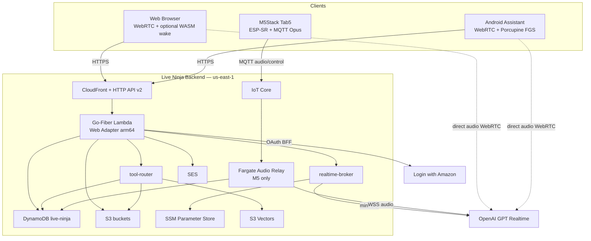
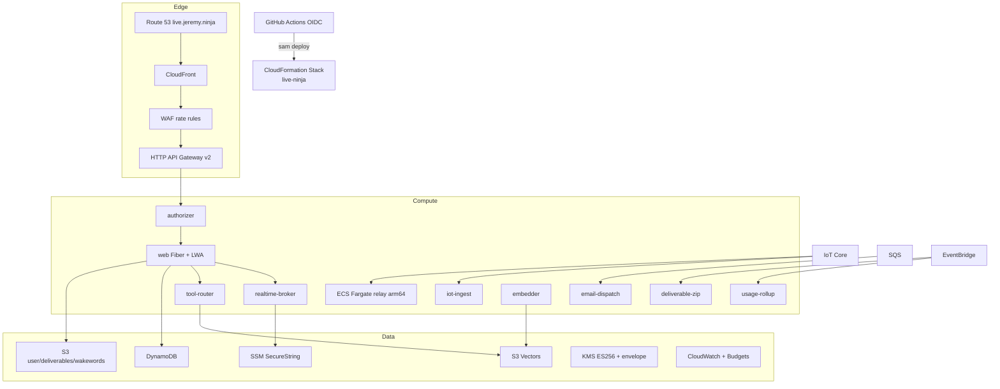
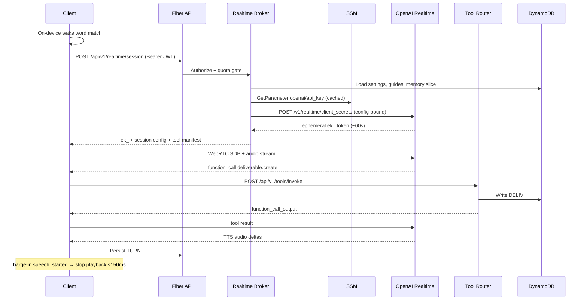
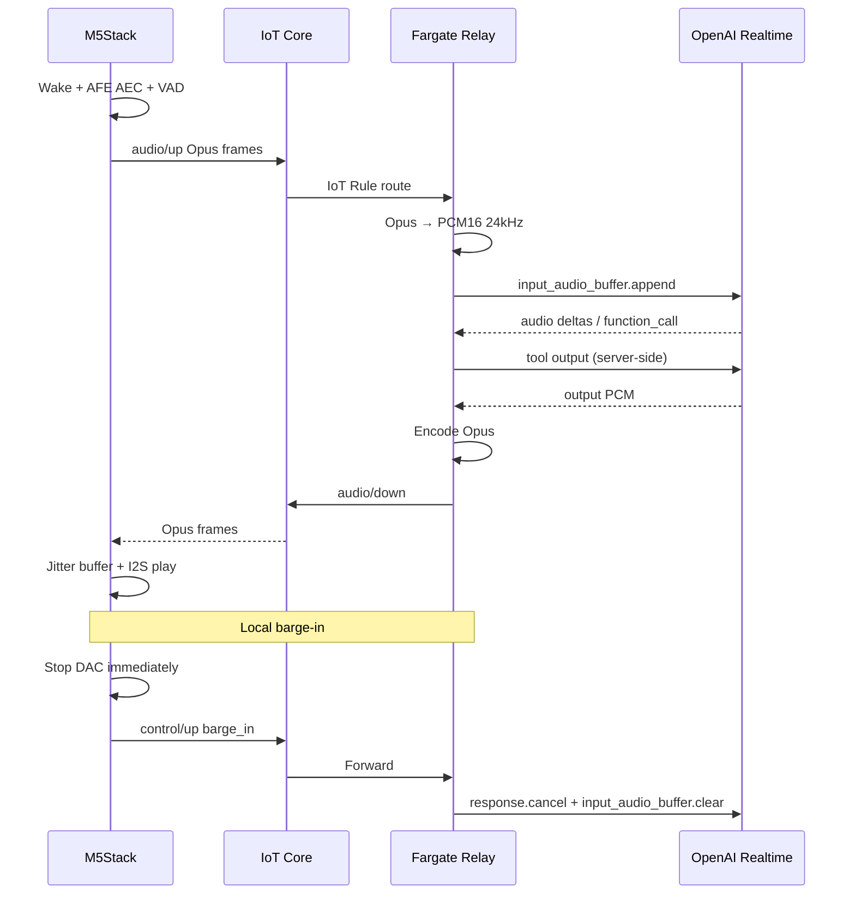
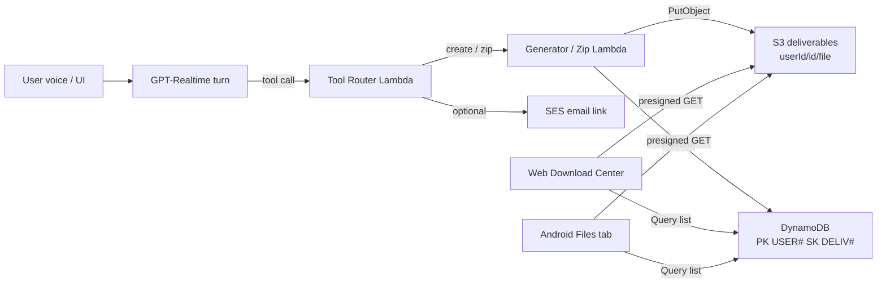
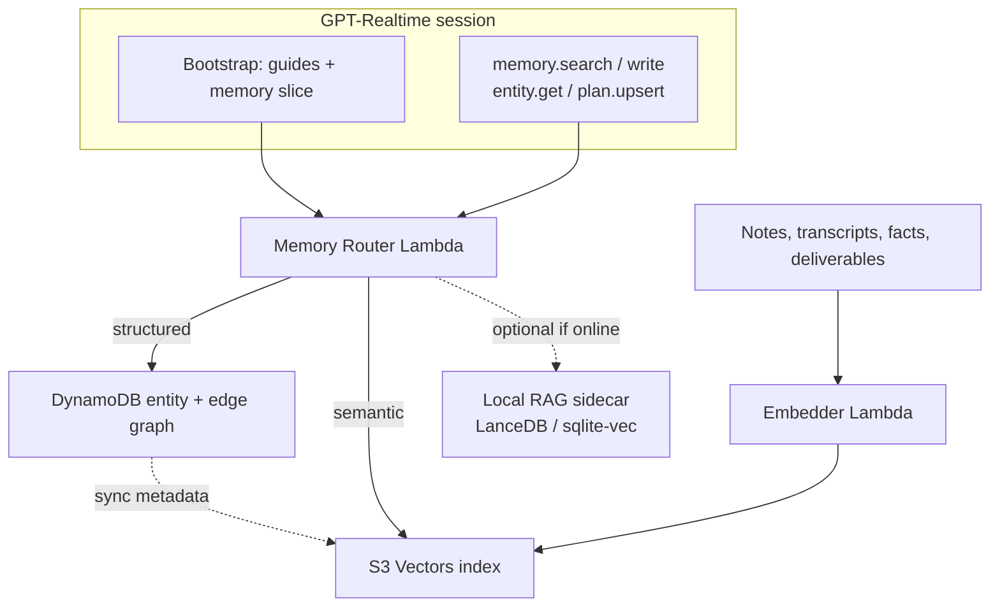
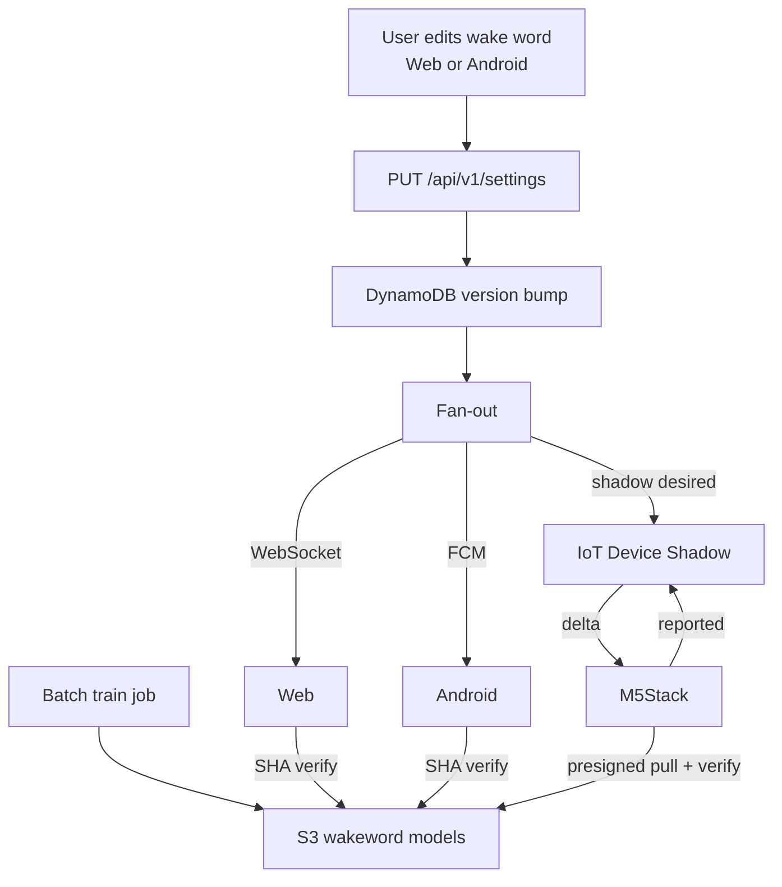
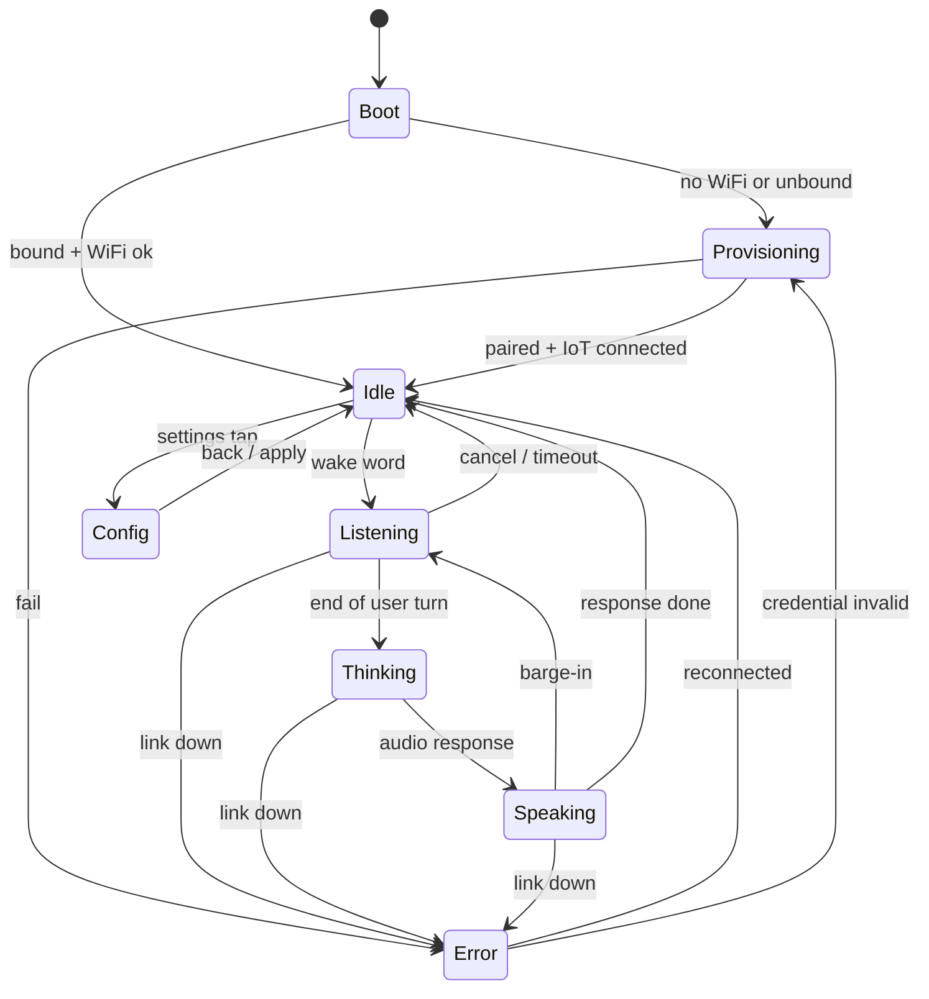
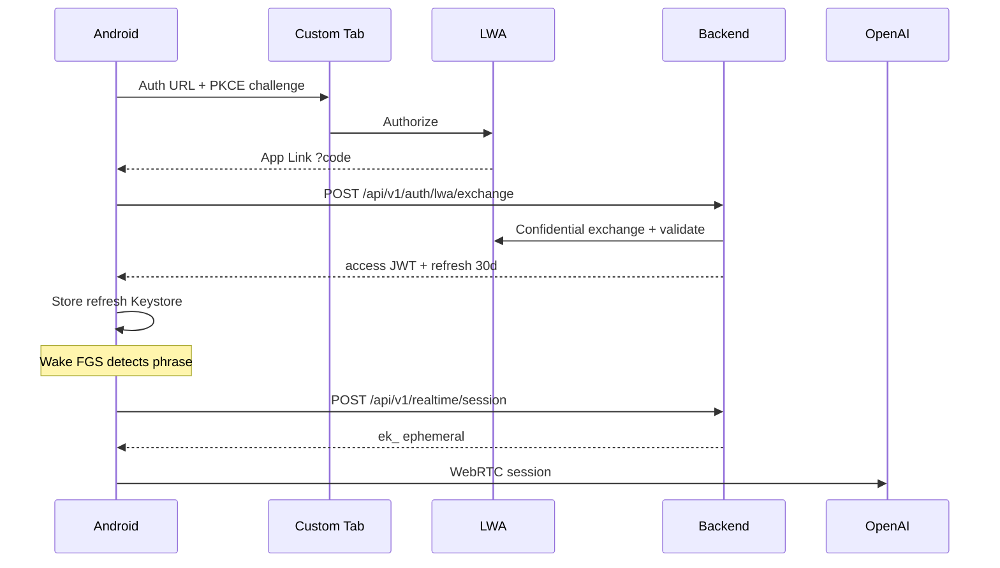

# Live Ninja — Product Requirements Document

| Field | Value |
|---|---|
| **Document** | Product Requirements Document (PRD) |
| **Product** | Live Ninja |
| **Version** | 1.1 |
| **Date** | 2026-07-17 |
| **Owner** | Jeremy Proffitt |
| **Status** | Draft — decision-complete (all open questions resolved with defaults) |
| **Domain** | `live.jeremy.ninja` |
| **Repo** | `JeremyProffittOrg/live-ninja` |
| **AWS account / region** | `759775734231` · `us-east-1` |
| **Cost center** | `voice-ai` |
| **Stack tags** | `Project=live-ninja CostCenter=voice-ai Environment=prod ManagedBy=sam DeployedVia=github-actions Owner=jeremy` |

---

## Executive Summary

Live Ninja is a **GPT-Realtime (“gpt-live”) speech-to-speech voice-assistant platform** with **one shared AWS backend** serving **three Login-with-Amazon (LWA)–gated client surfaces**:

1. **Android** — becomes the phone’s **primary/default voice assistant** (VoiceInteractionService + `ROLE_ASSISTANT`), always-on on-device wake word, WebRTC audio to OpenAI Realtime.
2. **Website** — Go-Fiber–served browser voice UI; WebRTC → OpenAI with backend-minted ephemeral tokens; optional in-browser wake word + click-to-talk.
3. **M5Stack Tab5** — ESP32-P4 + ESP32-C6, 5″ 1280×720 landscape touch LCD; on-device wake; Opus/PCM over **AWS IoT Core MQTT** bridged by a Fargate relay to OpenAI; **device-hosted config portal** for SoftAP Wi-Fi + on-device LWA; **10-year** persistent device login.

The backend (AWS **SAM**, **Lambda Go arm64/Graviton**, **Go-Fiber** via Lambda Web Adapter, **DynamoDB** Query/GetItem-only, **S3**, **SES**, **SSM Parameter Store**, optional **IoT Core**) brokers **short-lived OpenAI ephemeral session tokens** so the OpenAI key never touches a client. Wake phrase default is **“Hey Live Ninja”**; wake words are **user-programmable on every surface**. Sessions: **Web + Android = 30-day** rotating refresh; **M5Stack = 10-year** silently rotated, revocable device credential in encrypted NVS (flash encryption + secure boot).

**v1.1 capabilities (fully specified):**

| Capability | One-liner |
|---|---|
| **Deliverables Store** | Assistant creates files (PDF/MD/CSV/JSON/ICS/image), zips, delivers as durable per-user S3 downloadables, indexed DynamoDB, browsable from Web Download Center + Android Files tab. Tools: `deliverable.create` / `zip` / `deliver`. |
| **Memory Layer** | Structured personal memory: people, places, information + organizational (projects/lists/docs) + planning (goals/tasks/schedules). Hybrid: DynamoDB entity graph + S3 Vectors + optional local RAG sidecar. Tools: `memory.search` / `write`, `entity.get`, `plan.upsert`. |
| **Guide Entities** | Special memory entities **unconditionally injected** into every session’s system instructions (not relevance-retrieved). Ship default **“AI is an emerging technology”** recency guide. |

This PRD is decision-complete: every open question is answered with a chosen default in §15. No implementation is blocked on further product questions.

---

## 1. Vision, Goals, Non-Goals

### 1.1 Vision

A single, coherent personal voice assistant that follows the user from pocket (Android) to desk (M5Stack) to browser (Web) with identical persona, memory, tools, and settings — private by construction (wake detection never leaves the device), cheap to run (serverless, cost-guarded, no DynamoDB Scan on serving paths, no paid secrets manager), and conversationally instant (direct client↔OpenAI audio on web/Android; sub-second first audio).

### 1.2 Goals

| ID | Goal |
|---|---|
| G-1 | One shared backend and one persona/settings/memory contract across all three surfaces. |
| G-2 | Speech-to-speech with barge-in, server-side tool execution, configurable persona. |
| G-3 | On-device, user-programmable wake word on every surface; no always-on cloud audio. |
| G-4 | LWA identity front door + first-party sessions (30-day web/Android, 10-year M5Stack). |
| G-5 | OpenAI API key never reaches any client; ephemeral tokens only. |
| G-6 | Strict cost discipline: Query/GetItem-only DynamoDB, on-demand billing, per-user metering/quotas, budget alarms. |
| G-7 | Production-grade security/privacy: encrypted-at-rest, revocable credentials, deletion rights, threat-modeled. |
| G-8 | OIDC-only GitHub Actions deploys; push to `main` = production; mandatory cost tags. |
| G-9 | Deliverables Store as a complete ledger of every artifact the assistant creates. |
| G-10 | Hybrid Memory Layer + unconditional Guide Entities for durable personal context. |

### 1.3 Non-Goals

| ID | Non-goal |
|---|---|
| N-1 | Multi-tenant SaaS, org/team management, or billing/subscription system (personal product). |
| N-2 | Telephony / SIP surface. |
| N-3 | On-device ASR/LLM/TTS for conversation (only on-device wake + AFE). |
| N-4 | Staging/dev environment — production-only. |
| N-5 | Third-party analytics SDKs; analytics from self-hosted Athena event lake only. |
| N-6 | Relaying WebRTC browser/Android audio through AWS (direct to OpenAI only). |
| N-7 | AWS Secrets Manager / Vault (SSM Parameter Store SecureString + KMS only). |
| N-8 | OpenSearch Serverless or Aurora/pgvector in v1.1 (always-on cost floors rejected unless scale later justifies). |

---

## 2. Personas & Primary Use Cases

### 2.1 Phone-primary-assistant user (Ava)

Ava made Live Ninja her phone’s default digital assistant. She invokes it hands-free (“Hey Live Ninja”), via assist gesture, long-press power, or Bluetooth headset — including over the lock screen. **Use cases:** dictate email while driving; set timers/reminders; quick questions; control M5Stack; barge-in mid-answer; download a PDF the assistant just generated from the Files tab.

### 2.2 Desktop / web user (Wei)

Wei uses Live Ninja in the browser at his desk. He signs in with Amazon, clicks the mic (or enables WASM wake word), and has a speech-to-speech conversation with live transcript. **Use cases:** longer working sessions; settings that sync to other surfaces; Download Center for reports/exports; Memory Browser to edit people/places/plans; manage Guide Entities.

### 2.3 Ambient M5Stack-on-desk user (Maya)

Maya’s Tab5 sits on her desk, paired once via the device config page and persisted for years. Idle screen: “Say ‘Hey Live Ninja’.” **Use cases:** glanceable ambient assistant; quick questions without touching the phone; wake-word + sensitivity pickers on-device (list-select); firmware OTA; never re-login for a decade unless revoked.

### 2.4 Cross-cutting use cases

| UC | Description | Surfaces |
|---|---|---|
| UC-01 | Hands-free wake → S2S conversation with barge-in | All |
| UC-02 | Click/push-to-talk fallback when wake unavailable | Web, Android |
| UC-03 | Programmable wake word create/select/sync | All (create on Web/Android; select on M5) |
| UC-04 | “Make a one-page brief and zip with last week’s notes” | Web, Android (voice); store visible all rich UIs |
| UC-05 | “Remember that Jason’s birthday is March 3” → memory write + later recall | All (tools); browse Web/Android |
| UC-06 | Guide steers web search to sources &lt;30 days old | All sessions |
| UC-07 | Pair M5Stack via SoftAP + LWA once; 10-year silent refresh | M5 |
| UC-08 | Revoke device / logout everywhere | Web, Android |

---

## 3. Functional Requirements

Acceptance criteria (AC) are testable. IDs are stable references for the plan.

### 3.1 Backend

| ID | Requirement | Acceptance Criteria |
|---|---|---|
| FR-BE-01 | Single Go-Fiber app on Lambda Web Adapter behind HTTP API Gateway v2, **arm64**. | Same binary runs locally on `:8080` and in Lambda; `$default` route → Fiber; deployed via SAM. |
| FR-BE-02 | `realtime-broker` mints OpenAI ephemeral client secrets from SSM-held key. | `POST /api/v1/realtime/session` returns `ek_…` token + session/persona/tool manifest; standing key never in response or client. |
| FR-BE-03 | Single-table DynamoDB `live-ninja`, on-demand, **Query/GetItem only**. | No `Scan` on any serving path (code review + `ConsumedReadCapacityUnits` alarm); GSI1 + GSI2 cover inverse lookups. |
| FR-BE-04 | S3 presigned upload/download; owner-namespaced keys. | `POST /api/v1/uploads` → presigned PUT pinned `Content-Type`/`Content-Length`; download authorizes key prefix == caller `userId`. |
| FR-BE-05 | SES transactional email off-path via SQS → `email-dispatch`. | Source DKIM-verified `@jeremy.ninja` (`Jeremy Proffitt <jeremy@jeremy.ninja>`), Reply-To `proffitt.jeremy@gmail.com`; idempotency keys. |
| FR-BE-06 | IoT Core control-plane ingest for device telemetry. | IoT Rule → `iot-ingest` → `PutItem` on `DEVICE#` lastSeen (never Scan). |
| FR-BE-07 | `usage-rollup` aggregates usage logs into daily rollups. | Dashboards Query `ROLLUP#` items; no raw-log fan-out on serving path. |
| FR-BE-08 | Secrets in SSM SecureString, in-memory TTL cache; broker IAM-scoped to OpenAI key ARN. | Broker role: `ssm:GetParameter` one ARN + `kms:Decrypt`; secrets never logged. |
| FR-BE-09 | Per-user rate limit + budget gate at token mint. | Over-quota mint → `402`/`429`; token-bucket via DynamoDB conditional writes. |
| FR-BE-10 | Server-side tool execution `POST /api/v1/tools/invoke` under first-party JWT. | Tools re-authorized per call; side-effecting tools carry idempotency keys + audit. |
| FR-BE-11 | Fargate **audio relay** (arm64) for M5Stack only. | Device JWT + mTLS IoT path; Opus↔PCM16@24k; holds OpenAI WS; barge-in `response.cancel`. |

#### Core HTTP API (method / path / purpose)

| Method | Path | Purpose | Auth |
|---|---|---|---|
| `GET` | `/healthz` | Liveness | Public |
| `GET` | `/compat` | Client capability negotiation | Public |
| `GET` | `/.well-known/jwks.json` | JWT public keys (KMS-backed) | Public |
| `GET` | `/auth/lwa/login` | Start LWA Auth Code + PKCE (web BFF) | Public |
| `GET` | `/auth/lwa/callback` | LWA callback; mint session cookie | Public (state) |
| `POST` | `/api/v1/auth/lwa/exchange` | Android/public client code exchange | Public (PKCE) |
| `POST` | `/api/v1/auth/refresh` | Rotate refresh → new access JWT | Refresh |
| `POST` | `/api/v1/auth/logout` | Kill current session | JWT |
| `POST` | `/api/v1/auth/logout-everywhere` | Bump `tokensValidAfter` | JWT |
| `POST` | `/api/v1/auth/device/pair/register` | M5 registers pairing nonce + PKCE challenge | Public (rate-limited) |
| `GET` | `/api/v1/auth/device/pair/poll` | Device polls claim result | Pairing secret |
| `GET` | `/auth/device/callback` | Browser leg of device LWA | Public (state=nonce) |
| `DELETE` | `/api/v1/devices/{deviceId}` | Revoke device + IoT cert | JWT |
| `POST` | `/api/v1/realtime/session` | Mint config-bound OpenAI ephemeral token | JWT |
| `POST` | `/api/v1/tools/invoke` | Execute tool call server-side | JWT |
| `GET` | `/api/v1/settings` | Get canonical settings doc | JWT |
| `PUT` | `/api/v1/settings` | Optimistic-concurrency settings update | JWT |
| `GET` | `/api/v1/wakewords` | Catalog + user wake models | JWT |
| `POST` | `/api/v1/wakewords` | Request custom wake training | JWT |
| `GET` | `/api/v1/wakewords/{id}/model` | Presigned model URL `?platform=` | JWT |
| `POST` | `/api/v1/uploads` | Presigned PUT for user file | JWT |
| `GET` | `/api/v1/deliverables` | List deliverables (Query partition) | JWT |
| `GET` | `/api/v1/deliverables/{id}` | Metadata + presigned GET | JWT |
| `DELETE` | `/api/v1/deliverables/{id}` | Soft-delete + S3 delete marker | JWT |
| `POST` | `/api/v1/deliverables/{id}/share` | Mint share token (GSI lookup) | JWT |
| `GET` | `/api/v1/memory/entities` | List entities by type | JWT |
| `GET` | `/api/v1/memory/entities/{id}` | Entity + edges | JWT |
| `PUT` | `/api/v1/memory/entities/{id}` | Edit entity | JWT |
| `DELETE` | `/api/v1/memory/entities/{id}` | Forget (DDB + vectors) | JWT |
| `GET` | `/api/v1/guides` | List Guide Entities | JWT |
| `PUT` | `/api/v1/guides/{id}` | Create/edit/enable/priority | JWT |
| `DELETE` | `/api/v1/account` | Full account deletion | JWT + confirm |
| `POST` | `/api/v1/telemetry` | Batched client telemetry (sampled) | JWT |

#### Libraries (backend)

- Go 1.22+, `github.com/gofiber/fiber/v2`, AWS SDK v2 (`dynamodb`, `s3`, `ssm`, `sesv2`, `iot`, `kms`, `sqs`)
- `github.com/golang-jwt/jwt/v5` + KMS ES256 signing
- Lambda Web Adapter (`aws-lambda-web-adapter`)
- Structured logs: `log/slog` JSON; EMF via CloudWatch embedded metrics

### 3.2 Voice / GPT-Realtime

| ID | Requirement | Acceptance Criteria |
|---|---|---|
| FR-VO-01 | Speech-to-speech via `gpt-realtime`, config-bound at mint. | Session object (model, voice, instructions, tools, `semantic_vad`, audio format) fixed server-side; client cannot escalate tools/persona. |
| FR-VO-02 | Direct client↔OpenAI audio (WebRTC web/Android; WSS relay for M5). | AWS never in WebRTC media path; M5: device→IoT→Fargate relay→OpenAI. |
| FR-VO-03 | Barge-in via `interrupt_response` + local stop. | On `speech_started`, client stops playback ≤150 ms; relay `response.cancel` + buffer clear for M5. |
| FR-VO-04 | Tool/function calling routed server-side. | Web/Android forward over HTTPS; relay intercepts for M5; `function_call_output` returned to session. |
| FR-VO-05 | Bidirectional transcript capture. | ASR + assistant text as `TURN#`/`LOG#` with TTL; labeled turns in UI, never raw JSON. |
| FR-VO-06 | Per-session usage metering from `response.done`. | Atomic `UpdateItem ADD` on monthly counters; EMF metrics; enforced pre-spend at mint. |
| FR-VO-07 | Fallback cascade on Realtime failure. | Retry+backoff → STT→LLM→TTS chain → text-only → graceful failure; tools still work. |
| FR-VO-08 | Idle/duration caps. | Auto-close after inactivity; OpenAI session cap ~30 min with transparent re-mint; no billing on abandoned sessions. |
| FR-VO-09 | Session bootstrap primes persona with memory slice + enabled Guides. | Broker loads Guides (unconditional) + memory slice (relevant entities/vectors) into `instructions` before mint. |

#### Session config defaults (locked)

| Parameter | Default |
|---|---|
| Model | `gpt-realtime` |
| Voice | `cedar` (user-selectable enum: alloy, ash, ballad, coral, echo, sage, shimmer, verse, cedar, … as OpenAI exposes) |
| Turn detection | `semantic_vad`, `interrupt_response: true`, `create_response: true` |
| Audio | Client WebRTC negotiates Opus; server config `pcm16` where applicable; M5 Opus 16 kHz 20 ms frames |
| Temperature | 0.7 |
| Max output tokens | 4096 |
| Ephemeral token TTL | ~60 s establish window |
| Access JWT TTL | 15 min |
| Soft session cap | 10 min continuous; hard OpenAI ~30 min |

#### Latency targets

| Metric | Target |
|---|---|
| User stops speaking → first assistant audio (WebRTC) | ≤ 800 ms |
| Same via M5 relay | ≤ 1.2 s |
| Barge-in playback silenced | ≤ 150 ms |
| Local M5 barge-in (DAC stop) | ≤ 50 ms |

### 3.3 Auth & Sessions

| ID | Requirement | Acceptance Criteria |
|---|---|---|
| FR-AU-01 | LWA Authorization Code + PKCE; backend confidential client / BFF. | Code exchanged server-side with client secret from SSM; clients never hold LWA secret. |
| FR-AU-02 | Token-substitution defense. | Validate `aud == our client_id` via `/tokeninfo`; identity from `/user/profile` (`user_id`). |
| FR-AU-03 | First-party hybrid session: ES256 access JWT (15 min) + rotating opaque refresh. | JWT verified at edge (no DB); refresh stored **hashed**; rotate-on-use with reuse → family revoke. |
| FR-AU-04 | Web 30-day sliding session in `__Host-` HttpOnly cookie. | Cookie `Secure; HttpOnly; SameSite=Lax; Path=/`; access JWT in memory only. |
| FR-AU-05 | Android 30-day session; refresh in Keystore-backed EncryptedSharedPreferences. | Custom Tabs + App Links PKCE; BFF exchange. |
| FR-AU-06 | M5Stack 10-year silently rotated, revocable device credential. | After on-device LWA: device refresh family TTL 10y, silent rotate every 24h/boot; stored encrypted NVS; flash encryption + secure boot; IoT X.509 mTLS second factor. |
| FR-AU-07 | Revocation: logout, logout-everywhere, device revoke. | Session row delete kills refresh immediately; `tokensValidAfter` kills JWTs within authorizer cache (60 s); device revoke detaches IoT cert + family. |
| FR-AU-08 | New-sign-in SES tripwire. | New device/surface login → security-alert email off request path. |
| FR-AU-09 | Devices bind to user via pairing/registration. | Pairing nonce + PKCE verifier device-claim binding; no blind “type a code” without backend validation. |

| Surface | LWA flow | Refresh lifetime | Storage | Second factor |
|---|---|---|---|---|
| Web | Auth Code + PKCE (BFF) | 30 days sliding | `__Host-ln_rt` cookie | SameSite + CSRF state |
| Android | Auth Code + PKCE (public → BFF) | 30 days sliding | Keystore / ESP | App Links + optional Play Integrity |
| M5Stack | Device-hosted PKCE, backend-completed, device-polled claim | 10 years, silent rotate | Encrypted NVS | IoT X.509 mTLS |

### 3.4 Android

| ID | Requirement | Acceptance Criteria |
|---|---|---|
| FR-AN-01 | `VoiceInteractionService` / Session + acquire `ROLE_ASSISTANT`. | Manifest `BIND_VOICE_INTERACTION`; `RoleManager` request with OEM-aware guided fallback; `isRoleHeld` re-checked each launch. |
| FR-AN-02 | Own on-device wake engine in `microphone` FGS. | Porcupine primary, openWakeWord fallback; default “Hey Live Ninja”; persistent notification. |
| FR-AN-03 | GPT Realtime via WebRTC + backend ephemeral key. | Mic track + `oai-events` datachannel; SDP with `Bearer ek_`; API key never on device. |
| FR-AN-04 | AEC-backed barge-in. | Platform + WebRTC AEC; user speech mid-playback → fade-stop ≤50 ms, flush jitter, new turn. |
| FR-AN-05 | Locked-screen session gating. | Non-sensitive replies over keyguard; sensitive actions behind `requestDismissKeyguard()` / biometric. |
| FR-AN-06 | Battery discipline. | VAD pre-gate, no continuous wakelock, thermal/battery-saver duty-cycle; target &lt;2%/hr screen-off idle. |
| FR-AN-07 | Boot restart of wake FGS when user-enabled. | `BOOT_COMPLETED` starts mic FGS if enabled + permissions granted. |
| FR-AN-08 | Files tab for Deliverables Store parity. | Same Query list as Web Download Center; multi-select zip/share. |
| FR-AN-09 | Memory browser + Guide management. | Structured list/detail; forget propagates. |

**Stack defaults:** minSdk 29, targetSdk 35, Kotlin, Jetpack Compose Material 3, Hilt, google-webrtc AAR, Picovoice Porcupine Android, openWakeWord TFLite fallback.

### 3.5 Web

| ID | Requirement | Acceptance Criteria |
|---|---|---|
| FR-WB-01 | Go-Fiber server-rendered HTML + progressive-enhancement ES modules (no SPA framework). | Unauthenticated SSR login; one deployable serves HTML + `/api/*`. |
| FR-WB-02 | WebRTC directly to OpenAI via ephemeral token. | Browser peer connection; key never client-side. |
| FR-WB-03 | Click-to-talk always; optional WASM wake off by default. | Mic state machine without wake; openWakeWord WASM / Porcupine-web opt-in, lazy AudioWorklet. |
| FR-WB-04 | Live transcript + visualizer. | Text-node deltas only (XSS-safe); `role="log" aria-live="polite"`; visualizer `aria-hidden`. |
| FR-WB-05 | Schema-driven settings — zero blind text boxes for enumerable fields. | Wake word combobox; voice radio+preview; persona select; locale/timezone IANA pickers. |
| FR-WB-06 | PWA: network-first HTML service worker. | HTML `no-cache` + network-first; hashed assets SWR immutable; never intercept API/SSE/OpenAI. |
| FR-WB-07 | Download Center for deliverables. | Sortable table; empty/loading/error; “Showing 1–25 of N”. |
| FR-WB-08 | Memory browser + Guides UI. | Entity table/cards; edit/forget; Guide enable + priority stepper. |

### 3.6 M5Stack Tab5

| ID | Requirement | Acceptance Criteria |
|---|---|---|
| FR-M5-01 | ESP-IDF firmware on ESP32-P4; C6 `esp-hosted` Wi-Fi; LVGL 9 UI. | Pinned IDF tag; PSRAM framebuffers; PPA dirty-rect; GT911 touch. |
| FR-M5-02 | On-device wake: ESP-SR WakeNet primary; microWakeWord fallback for custom. | AFE (AEC/NS/VAD) before wake tap; shadow selects engine; custom models SHA-256 verified from S3. |
| FR-M5-03 | Audio over IoT Core MQTT → Fargate relay → OpenAI. | Opus on `liveninja/{thing}/audio/up|down`; relay transcodes; audio never OpenAI-terminated on IoT alone. |
| FR-M5-04 | Instant local barge-in. | Local VAD stops DAC; publish `barge_in`; relay cancel + clear. |
| FR-M5-05 | Device-hosted config: SoftAP Wi-Fi onboarding + browser LWA. | SSID from scan list (no blind SSID box); LWA in phone browser; bind over mTLS IoT. |
| FR-M5-06 | Secure storage + 10-year identity. | Flash encryption + Secure Boot v2 + NVS encryption; 10-year cert rotate at year 8; refresh every 24h/boot. |
| FR-M5-07 | OTA via IoT Jobs A/B + rollback. | Signed images; anti-rollback eFuse; canary group first. |
| FR-M5-08 | Embedded UI rules. | One primary decision per screen; 48–64 px targets; list-select/segmented/roller; keyboard only for Wi-Fi passphrase / device name; “N of M”. |

#### IoT topics (locked)

| Topic | Direction | Payload |
|---|---|---|
| `liveninja/{thingName}/audio/up` | Device → cloud | Opus frames (binary) + seq header |
| `liveninja/{thingName}/audio/down` | Cloud → device | Opus frames |
| `liveninja/{thingName}/control/up` | Device → cloud | JSON: `barge_in`, `session_end`, `telemetry` |
| `liveninja/{thingName}/control/down` | Cloud → device | JSON: `session_start`, `bind_result`, `error` |
| `liveninja/{thingName}/telemetry` | Device → cloud | Heartbeat, battery, RSSI, wake stats |
| `$aws/things/{thingName}/shadow/name/config/*` | Bidirectional | Settings desired/reported |

### 3.7 Wake-word

| ID | Requirement | Acceptance Criteria |
|---|---|---|
| FR-WW-01 | Wake detection always on-device on all surfaces. | No audio leaves device before wake; architectural + in-product disclosure. |
| FR-WW-02 | User-programmable keywords; shared catalog. | Combobox over catalog + user models; default “Hey Live Ninja”; never a blind free-text that silently no-ops. |
| FR-WW-03 | Backend training pipeline. | `POST /api/v1/wakewords` validates phrase; AWS Batch arm64 openWakeWord (conc≤2, 20 min, ≤3/day/user); Porcupine Console server-side optional; S3 output + SES ready. |
| FR-WW-04 | Per-platform content-addressed models + SHA-256 hot-swap. | `GET …/model?platform=` → signed URL; client verifies SHA before swap. |
| FR-WW-05 | M5 selects from curated flashable set + oWW-ESP fallback. | Full-screen list-select; phrase creation only on Web/Android. |
| FR-WW-06 | Tunable sensitivity. | Slider 0–1, default 0.5; never free-text. |

### 3.8 Deliverables Store (v1.1)

| ID | Requirement | Acceptance Criteria |
|---|---|---|
| FR-DL-01 | Tools `deliverable.create(kind, name, content)`, `deliverable.zip(ids[], name)`, `deliverable.deliver(id, channels[])`. | Tools registered in Realtime session manifest; executed only via tool router; audit log per invocation. |
| FR-DL-02 | Create kinds: PDF, Markdown, CSV, JSON, ICS, image, generic artifact. | Server generators (Go): MD→PDF via pure-Go PDF lib; CSV/JSON/ICS encoders; image decode validate. |
| FR-DL-03 | S3 key layout `{userId}/{deliverableId}/{filename}`. | Bucket `live-ninja-deliverables-{acct}`; SSE-S3; block public; lifecycle 400-day default + `keepForever` flag. |
| FR-DL-04 | DynamoDB index: `PK=USER#{userId}`, `SK=DELIV#{ts}#{id}`; GSI1 `DELIV#{deliverableId}` for share-by-id. | List is `Query` only; share lookup `GetItem`/`Query` GSI1. |
| FR-DL-05 | Short-lived presigned GET (default 15 min); optional SES email link/attachment. | Download authorizes owner or valid share token; email from `@jeremy.ninja`. |
| FR-DL-06 | “All transactions”: every artifact-producing turn writes a deliverable record. | Tool path + any server export path; Web Download Center and Android Files tab show identical Query results. |
| FR-DL-07 | Zip as separate deliverable. | Zip Lambda streams member objects; new `DELIV#` row with `kind=zip`. |
| FR-DL-08 | Quotas. | Soft 100 MB / deliverable, 5 GB / user (configurable); CloudWatch size/emit alarm. |

### 3.9 Memory Layer (v1.1)

| ID | Requirement | Acceptance Criteria |
|---|---|---|
| FR-ME-01 | First-class entities: **people, places, information**; org: projects/lists/documents; planning: goals/tasks/schedules. | Entity types enum; stored as DynamoDB items with typed edges. |
| FR-ME-02 | Memory types: working / episodic / semantic / procedural. | Working = session context only; episodic = transcript vectors + event items; semantic/procedural = entity graph + vectors. |
| FR-ME-03 | Hybrid architecture (recommended default). | DynamoDB entity/relationship graph + S3 Vectors semantic recall + optional local RAG sidecar (graceful fallback when offline). |
| FR-ME-04 | Tools: `memory.search`, `memory.write`, `entity.get`, `plan.upsert`. | Registered at mint; re-authz; writes never silent (explicit tool or user browser edit). |
| FR-ME-05 | Session bootstrap memory slice. | Broker retrieves recent people/places/open tasks + top semantic hits; inject into instructions (token-budget capped, default ~2k tokens). |
| FR-ME-06 | Memory browser: view / edit / forget. | Forget deletes DynamoDB item + vector index entry; export-as-deliverable available. |
| FR-ME-07 | No always-on cost floors. | OpenSearch Serverless and Aurora/pgvector **out of scope** for v1.1. |

#### Architecture comparison (decision record)

| Option | Recall quality | Latency | Monthly cost (1 user) | Privacy | Ops | Scale | Verdict |
|---|---|---|---|---|---|---|---|
| A Local RAG (LanceDB / sqlite-vec / Chroma) | High | Low (local) | ~$0 | Highest | User-run | Per-machine | **Optional sidecar** |
| B Amazon S3 Vectors | High | Medium | Very low | Cloud encrypted | None | Yes | **Default semantic tier** |
| C DynamoDB entity graph only | Low (no ANN) | Low | Lowest | Cloud | None | Structured only | **Structured backbone** |
| D OpenSearch Serverless | Highest | Low | High idle floor | Cloud | Low | Yes | **Reject v1.1** |
| E pgvector / Aurora | High | Low | Medium–high idle | Cloud | Medium | Yes | **Reject v1.1** |

**Chosen hybrid:** C + B + optional A.

### 3.10 Guide Entities (v1.1)

| ID | Requirement | Acceptance Criteria |
|---|---|---|
| FR-GE-01 | Guide Entities are special memory entities **unconditionally injected** into system instructions of every session on every surface. | Not relevance-retrieved; always included when `enabled=true`, ordered by `priority`. |
| FR-GE-02 | User-managed: create / edit / enable / priority; versioned; device-synced via settings/shadow. | UI on Web + Android; M5 reads effective guides via session bootstrap (no full browser on LCD). |
| FR-GE-03 | Directives can steer tools (e.g., recency constraints on `web_lookup`). | Tool router reads active guide constraints from session context. |
| FR-GE-04 | Ship default-enabled guide **“AI is an emerging technology”**. | Prefer technical docs/articles **published or updated within last 30 days**; else defer to **official technical documentation of leading AI providers (Anthropic, OpenAI)**; always cite sources with dates; flag when best source is older than 30 days. |
| FR-GE-05 | Versioned guide body. | `GUIDE#{guideId}#v{n}`; active pointer on user settings; rollback supported. |

---

## 4. UX Requirements & Wireframe Notes

### 4.1 Rich UI (Web + Android + M5 config portal)

- **No blind free-text** where the value set is known: wake word, voice, language/locale, timezone, persona, device, theme, turn detection → pickers/lists/segmented/radio.
- Booleans → toggles; 2–5 exclusive → radio/segmented; 6–20 → select; 20–100 → searchable combobox; 100+ → async typeahead.
- WCAG AA light + dark: 4.5:1 text / 3:1 UI; visible focus; ≥44 px targets; semantic controls; never state-by-color-alone.
- Data: tables for multi-record compare (Download Center, Memory list); cards on Android; transcripts as labeled turn bubbles.
- Forms: human order; progressive disclosure; preserve input on error; destructive actions guarded.

**Web wireframe notes (align with `mockups/web/`):**

| Screen | Notes |
|---|---|
| Landing / Login | Primary “Login with Amazon”; privacy one-liner (on-device wake); no app chrome flash. |
| Conversation | Large mic; status `role="status"`; transcript log; visualizer decorative; barge-in interrupt control. |
| Wake-word settings | Combobox catalog + “Train custom…” wizard; sensitivity slider; engine radio. |
| Settings | Persona select; voice radio + preview; locale/tz pickers; retention radio; theme segmented. |
| Account / Devices | Table of sessions/devices; revoke; logout-everywhere. |
| Download Center | Sortable table; row actions Download / Share / Delete; multi-select Zip. |
| Memory / Guides | Entity type filter chips; detail drawer; Guide priority stepper; forget confirm. |

**Android wireframe notes (align with `mockups/android/`):**

| Screen | Notes |
|---|---|
| Onboarding | LWA → ROLE_ASSISTANT guided → permissions → wake enable. |
| Home idle | Listening indicator; status text; quick settings chip. |
| Conversation overlay | Live session over apps; Stop; transcript optional expand. |
| Wake-word manager | List + create; sensitivity. |
| Files tab | Cards; multi-select bar Zip & share. |
| Settings / Account | Same fields as web; Material 3. |

**M5 config portal (browser; rich UI):** SoftAP landing → Wi-Fi SSID list-select → passphrase keyboard → Login with Amazon → success “Device linked”.

### 4.2 M5Stack native LCD (embedded)

| Screen | Primary content |
|---|---|
| Boot | Logo + version |
| Provisioning | SoftAP SSID display + “Connect phone to configure” |
| Idle | Large “Say ‘Hey Live Ninja’” + status icons |
| Listening | Level meter + large Cancel |
| Thinking | Orb / “Thinking…” |
| Speaking | Orb + large Stop/Interrupt |
| Settings | Full-screen list-select (wake, sensitivity, volume, device info) |
| Device info | MAC, firmware, Thing name, “N of M” pages |
| Error / offline | Distinct message + Retry |

---

## 5. System Architecture

### 5.1 High-level system context



### 5.2 AWS deployment topology



### 5.3 Voice-turn sequence (Web / Android)



### 5.4 M5Stack audio-over-IoT sequence



### 5.5 Deliverables flow



### 5.6 Memory architecture



### 5.7 Wake-word sync



### 5.8 M5Stack UI state machine



---

## 6. Authentication & Session Design (detail)

### 6.1 Token model

| Credential | Format | Lifetime | Storage |
|---|---|---|---|
| Access JWT | ES256, KMS-signed; claims `iss,sub,aud,sid,did,iat,exp,jti,scope,surface` | 15 min | Memory only |
| Refresh (web/Android) | 256-bit random; **SHA-256 hash** in Dynamo | 30 days sliding | Cookie / Keystore |
| Device refresh (M5) | Same opacity; family `familyId` | 10 years; silent rotate 24h | Encrypted NVS |
| OpenAI ephemeral | `ek_…` from client_secrets | ~60 s | Memory only for establish |
| IoT device cert | X.509, on-chip keypair | 10 years (rotate yr 8) | Device secure element / flash |

### 6.2 Web login sequence (30-day)

```mermaid
sequenceDiagram
    participant U as Browser
    participant W as Fiber
    participant L as Login with Amazon
    participant D as DynamoDB

    U->>W: GET /auth/lwa/login
    W->>W: state + PKCE S256
    W-->>U: 302 LWA authorize
    U->>L: Consent profile
    L-->>U: 302 callback ?code
    U->>W: GET /auth/lwa/callback
    W->>L: POST token (code + verifier + secret)
    L-->>W: access_token + refresh
    W->>L: GET tokeninfo aud check
    W->>L: GET user/profile
    W->>D: Upsert USER + SESSION ttl=30d
    W-->>U: Set-Cookie __Host-ln_rt + access JWT body
    U->>W: POST /api/v1/auth/refresh
    W->>D: Rotate refresh TransactWrite
    W-->>U: New access JWT; slide cookie TTL
```

### 6.3 Android login sequence (30-day)



### 6.4 M5Stack 10-year login sequence

```mermaid
sequenceDiagram
    participant DEV as M5Stack
    participant BR as Phone Browser
    participant L as LWA
    participant W as Backend
    participant IOT as IoT Core

    DEV->>DEV: Generate verifier + pairing nonce
    DEV->>W: POST pair/register
    DEV->>DEV: SoftAP + serve config page
    BR->>DEV: Open captive portal
    BR->>L: LWA authorize state=nonce
    L-->>W: Callback code
    W->>L: Exchange + validate
    W->>IOT: Create Thing + policy + cert claim
    W->>W: Bind DEVICE + 10y refresh family
    W-->>BR: Linked success page
    DEV->>W: Poll pair (present verifier)
    W-->>DEV: device_refresh + provision claim
    DEV->>DEV: On-chip keypair; NVS encrypt store
    loop Every boot and 24h
        DEV->>W: Refresh over mTLS
        W-->>DEV: Rotated token; ttl = now+10y
    end
```

The 10-year login is a **continuously rotated credential lineage** anchored by a hardware-bound X.509 cert — not a static 10-year bearer secret sitting in flash.

---

## 7. Data Model

### 7.1 DynamoDB single table `live-ninja`

- **Keys:** `pk` (S), `sk` (S)
- **GSI1:** `gsi1pk` / `gsi1sk` — inverse IDs (LWA, session, device serial, deliverable share, email)
- **GSI2:** `gsi2pk` / `gsi2sk` — time-ordered feeds (usage, lastSeen, active sessions)
- **Billing:** `PAY_PER_REQUEST`; TTL attribute `ttl`
- **Invariant:** serving paths = `GetItem` / `Query` only

| Entity | PK | SK | GSI1 | GSI2 | TTL |
|---|---|---|---|---|---|
| User | `USER#{userId}` | `PROFILE` | `LWA#{amazonUserId}` / `PROFILE` | — | — |
| Session | `USER#{userId}` | `SESSION#{sessionId}` | `SESS#{sessionId}` / `USER#{userId}` | `SESSACTIVE#{userId}` / `{expISO}` | 30d |
| Device | `USER#{userId}` | `DEVICE#{deviceId}` | `DEVSN#{serial}` / `USER#{userId}` | `DEVSEEN#{userId}` / `{lastSeen}` | — |
| Device cred | `DEVICE#{deviceId}` | `CRED#{credId}` | — | — | 10y |
| Settings | `USER#{userId}` | `SETTINGS#v{n}` | — | — | — |
| WakeWord | `USER#{userId}` | `WAKE#{wakeId}` | — | — | — |
| Persona | `USER#{userId}` | `PERSONA#{id}` | — | — | — |
| Usage log | `USER#{userId}` | `LOG#{yyyymmdd}#{ulid}` | — | `USAGE#{userId}` / `{epoch}` | 90d |
| Usage rollup | `USER#{userId}` | `ROLLUP#{yyyymmdd}` | — | `ROLLUPGLOBAL#{yyyymm}` / `{userId}` | 400d |
| Deliverable | `USER#{userId}` | `DELIV#{ts}#{id}` | `DELIV#{id}` / `USER#{userId}` | — | optional |
| Entity | `USER#{userId}` | `ENT#{type}#{id}` | `ENTID#{id}` / `USER#{userId}` | `ENTTYPE#{userId}#{type}` / `{name}` | — |
| Edge | `USER#{userId}` | `EDGE#{fromId}#{rel}#{toId}` | — | — | — |
| Guide | `USER#{userId}` | `GUIDE#{guideId}#v{n}` | — | — | — |
| Plan/Task | `USER#{userId}` | `PLAN#{id}` / `TASK#{planId}#{id}` | — | `TASKOPEN#{userId}` / `{due}` | — |
| Consent | `USER#{userId}` | `CONSENT#{kind}` | — | — | — |
| Idempotency | `IDEMP#{key}` | `IDEMP` | — | — | 24h |
| Pairing | `PAIR#{nonce}` | `META` | — | — | 15m |

### 7.2 ER diagram

```mermaid
erDiagram
    USER ||--o{ SESSION : has
    USER ||--o{ DEVICE : owns
    USER ||--o{ DELIVERABLE : produces
    USER ||--o{ ENTITY : remembers
    USER ||--o{ GUIDE : configures
    USER ||--o{ SETTINGS : has
    USER ||--o{ WAKEWORD : trains
    USER ||--o{ PLAN : plans
    ENTITY ||--o{ EDGE : relates
    DEVICE ||--o{ DEVICE_CRED : holds
    PLAN ||--o{ TASK : contains

    USER {
        string pk "USER#userId"
        string sk "PROFILE"
        string gsi1pk "LWA#amazonUserId"
        string email
        number tokensValidAfter
    }
    SESSION {
        string pk "USER#userId"
        string sk "SESSION#sessionId"
        string refreshHash
        string surface
        number ttl
    }
    DEVICE {
        string pk "USER#userId"
        string sk "DEVICE#deviceId"
        string iotThingName
        string lastSeen
    }
    DEVICE_CRED {
        string pk "DEVICE#deviceId"
        string sk "CRED#credId"
        string credHash
        number ttl
    }
    DELIVERABLE {
        string pk "USER#userId"
        string sk "DELIV#ts#id"
        string gsi1pk "DELIV#id"
        string kind
        string s3Key
        string sha256
    }
    ENTITY {
        string pk "USER#userId"
        string sk "ENT#type#id"
        string entityType
        string name
        string memoryType
    }
    EDGE {
        string pk "USER#userId"
        string sk "EDGE#from#rel#to"
        string relType
    }
    GUIDE {
        string pk "USER#userId"
        string sk "GUIDE#id#vN"
        boolean enabled
        number priority
        string body
    }
    PLAN {
        string pk "USER#userId"
        string sk "PLAN#id"
        string status
    }
    TASK {
        string pk "USER#userId"
        string sk "TASK#planId#id"
        string status
        string due
    }
    SETTINGS {
        string pk "USER#userId"
        string sk "SETTINGS#vN"
        number version
        string wakeWordId
        string voice
        string personaId
    }
    WAKEWORD {
        string pk "USER#userId"
        string sk "WAKE#id"
        string phrase
        string status
        string modelSha256
    }
```

### 7.3 S3 layout

| Bucket | Prefix / key | Purpose |
|---|---|---|
| `live-ninja-deliverables-{acct}` | `{userId}/{deliverableId}/{filename}` | Deliverables |
| `live-ninja-user-{acct}` | `{userId}/uploads/…` | User uploads |
| `live-ninja-wakewords-{acct}` | `{sha256}/{platform}.bin` | Content-addressed wake models |
| `live-ninja-assets-{acct}` | fingerprinted static web assets | CDN origin |
| `live-ninja-vectors-{acct}` | S3 Vectors index (embeddings) | Semantic memory |
| `live-ninja-logs-{acct}` | Firehose telemetry / Athena | Analytics lake |

### 7.4 SSM parameters

| Parameter | Type | Consumer |
|---|---|---|
| `/live-ninja/prod/openai/api_key` | SecureString | realtime-broker only |
| `/live-ninja/prod/lwa/client_id` | String | web / auth |
| `/live-ninja/prod/lwa/client_secret` | SecureString | web / auth |
| `/live-ninja/prod/session/cred_pepper` | SecureString | refresh hashing |
| `/live-ninja/prod/device/cred_pepper` | SecureString | device refresh |
| KMS `alias/live-ninja-auth` | CMK | envelope + JWT ES256 |

---

## 8. Non-Functional Requirements

| ID | Category | Requirement |
|---|---|---|
| NFR-01 | Availability | Web/API 99.5% monthly; M5 degrades gracefully offline (no cloud conversation). |
| NFR-02 | Latency | See §3.2 voice targets; API p99 &lt; 300 ms non-broker; broker mint p99 &lt; 800 ms. |
| NFR-03 | Scalability | On-demand DynamoDB; Lambda concurrency reserved for broker; Fargate relay autoscales. |
| NFR-04 | Cost | Idle base ~ low tens USD (no OpenSearch/Aurora floor); Budgets $20/$50/$100 on `Project=live-ninja`. |
| NFR-05 | Deploy | Push `main` → GHA OIDC → SAM; arm64 all compute; no local deploys. |
| NFR-06 | Observability | slog JSON, EMF, X-Ray on broker/authorizer/web; `live-ninja-ops` dashboard. |
| NFR-07 | Accessibility | WCAG AA web; TalkBack Android; M5 large type / high contrast. |
| NFR-08 | Compatibility | `/v1` stable for M5 field life; `GET /compat` + client headers `X-LN-Client` / `X-LN-Server`. |
| NFR-09 | Data residency | us-east-1 primary; OpenAI processing per OpenAI DPA; request ZDR. |
| NFR-10 | Battery | Android wake FGS &lt;2%/hr screen-off idle target. |

---

## 9. Security & Privacy

### 9.1 Invariants

1. **On-device wake only** — mic stream to cloud starts after wake (or explicit push-to-talk).
2. **OpenAI key never on clients** — only ephemeral `ek_` tokens.
3. **No DynamoDB Scan on serving paths.**
4. **No paid secrets manager** — SSM SecureString + KMS.
5. **OIDC deploy only** — no static AWS keys in CI.
6. **Memory writes are explicit** (tool or UI), never silent full-conversation capture into long-term memory without policy.

### 9.2 Threat model (summary)

| Threat | Impact | Mitigation |
|---|---|---|
| Stolen OpenAI key | Cost / abuse | SSM + broker-only IAM; budget alarms; rotate via parameter put |
| LWA token substitution | Account takeover | `aud` check + profile bind; PKCE |
| Refresh token theft / replay | Session hijack | Hash-at-rest; rotate-on-use; reuse → family revoke + SES |
| Device physical theft (M5) | Long-lived access | Flash enc + secure boot; remote revoke detaches cert; 24h rotation |
| Prompt/tool injection via persona free text | Privilege / data leak | Server resolves persona ID; tools re-authz; confirm-before-send email |
| Presigned URL leak | Data disclosure | Short TTL (15 min); owner-prefix IAM conditions |
| DynamoDB cost runaway | Bill shock | No Scan; query-only; RCU alarm; per-user quotas |
| Stale PWA HTML | Broken auth/UI | Network-first SW; HTML no-cache |

### 9.3 Retention & deletion

| Data | Default retention | Control |
|---|---|---|
| Transcripts | 30 days | `retentionDays` ∈ {0,7,30,90} |
| Audio recordings | Off | `storeAudio` default false |
| Deliverables | 400 days | `keepForever` flag |
| Memory entities | Until forget | Browser forget / account delete |
| Sessions | 30d / 10y device | Logout / revoke |
| Telemetry events | 90 days S3 | No transcript content |

`DELETE /api/v1/account` → Step Functions: partition-scoped Query + BatchWriteItem (no Scan), S3 prefix purge, IoT thing/cert delete, LWA refresh revoke, SES confirm.

### 9.4 Privacy disclosures (in-product)

- Wake processing is on-device.
- Conversation audio goes to OpenAI for Realtime processing.
- Memory and deliverables stored in user’s AWS-backed store under their account.
- Guide Entities are always sent as part of system instructions when enabled.

---

## 10. KPIs

| KPI | Target |
|---|---|
| Time-to-first-audio (WebRTC p50) | ≤ 800 ms |
| Barge-in stop p95 | ≤ 150 ms |
| Wake false-accept rate | Product threshold gated in CI corpus |
| Session mint success rate | ≥ 99% |
| Auth success rate | ≥ 98% |
| Monthly idle AWS cost (excl. OpenAI) | Budget-tracked; alarm at $50 |
| OpenAI cost per active hour | Metered; hard cap enforced pre-spend |
| Crash-free Android sessions | ≥ 99% |
| M5 OTA success | ≥ 95% canary then fleet |
| Deliverable create success | ≥ 99% |
| Memory forget propagation | &lt; 60 s to vector index consistency |

---

## 11. Assumptions & Dependencies

| # | Assumption / dependency |
|---|---|
| A-1 | OpenAI Realtime API remains available with ephemeral client secrets + WebRTC path. |
| A-2 | LWA application registered; redirect URIs for web, Android App Links, device callback. |
| A-3 | Domain `live.jeremy.ninja` + ACM cert + Route 53 hosted zone already in vars. |
| A-4 | GitHub OIDC deploy role `AWS_DEPLOY_ROLE_ARN` configured for this repo. |
| A-5 | SES identity `@jeremy.ninja` DKIM-verified; production access requested by launch. |
| A-6 | M5Stack Tab5 hardware available for HIL; ESP-IDF 5.4+ supports P4+C6 hosted. |
| A-7 | Picovoice access key for Porcupine (optional path); openWakeWord is free default. |
| A-8 | S3 Vectors available in us-east-1 at implementation time; if not, fall back to embedding objects in S3 + Lambda brute-force for tiny corpora until GA. |
| A-9 | Single-operator personal product; not multi-tenant. |
| A-10 | Production-only; no staging stack. |

---

## 12. Risks

| Risk | Impact | Mitigation |
|---|---|---|
| OpenAI Realtime outage / API change | High — core product down | Fallback cascade STT→LLM→TTS; version pin; `/compat` |
| M5 audio latency over MQTT | Medium — UX lag | Opus 20 ms frames; local barge-in; Fargate in same region; jitter buffer |
| OEM Android assistant role friction | Medium — not default assistant | OEM-aware walkthrough; full UX works without role |
| 10-year device credential compromise | High | Revocation + cert detach; rotation; secure boot; fleet kill-switch |
| Wake false accepts / battery drain | Medium | Sensitivity slider; VAD pre-gate; FRR@FAR CI gate |
| Deliverable generation cost runaway | Medium | Size quotas; emit alarms; timeout generators |
| S3 Vectors GA/limits | Medium | Fallback path A-8; abstract vector interface |
| Production-only bad deploy | High | Local smoke; change-set logs; alarms; additive `/v1` |
| DynamoDB Scan regression | High cost | Lint/review red flag; RCU alarm; M7 load proof |
| Local RAG unavailable | Low | Graceful fallback to S3 Vectors always |

---

## 13. Open Questions — Resolved Defaults

| # | Question | Chosen default |
|---|---|---|
| Q-1 | SPA vs Fiber SSR for web? | **Fiber SSR + progressive ES modules** (one binary, no SPA framework). |
| Q-2 | Porcupine vs openWakeWord default? | **openWakeWord free default**; Porcupine primary on Android when access key present. |
| Q-3 | M5 audio path: pure WS gateway vs IoT MQTT? | **IoT Core MQTT + Fargate relay** (fleet, shadows, jobs OTA benefit). |
| Q-4 | JWT algorithm? | **ES256 via KMS** (private key non-extractable). |
| Q-5 | Session cookie name? | `__Host-ln_rt` |
| Q-6 | Default voice? | `cedar` |
| Q-7 | Default transcript retention? | 30 days; audio off |
| Q-8 | Deliverable default retention? | 400 days S3 lifecycle |
| Q-9 | Memory vector store? | **S3 Vectors** (+ DynamoDB graph + optional local RAG) |
| Q-10 | OpenSearch / Aurora? | **Out** for v1.1 |
| Q-11 | Default Guide? | Enabled: “AI is an emerging technology” (30-day recency + provider official docs) |
| Q-12 | Share links for deliverables? | Yes, GSI1 by id, time-boxed token, owner-revocable |
| Q-13 | Android distribution v1? | Signed APK + in-app updater + assetlinks; Play Store later optional |
| Q-14 | CostCenter tag? | `voice-ai` |
| Q-15 | Confirm-before-send for external email tools? | **Yes** |
| Q-16 | Multi-user household on one M5? | **No** v1 — one bound user per device |
| Q-17 | Local RAG protocol? | Optional HTTPS sidecar on localhost with device-paired mTLS token; discovery via user settings |
| Q-18 | Embeddings model? | OpenAI `text-embedding-3-small` via broker-side key (server only) |

---

## 14. Document Control

| Version | Date | Notes |
|---|---|---|
| 1.0 | 2026-07-17 | Core three-surface platform PRD |
| 1.1 | 2026-07-17 | + Deliverables Store, Memory Layer, Guide Entities |

**Related:** `plan.md` (implementation milestones M0–M10), `deploy.md` (deploy law), white paper on memory/deliverables.

---

*End of PRD.*
