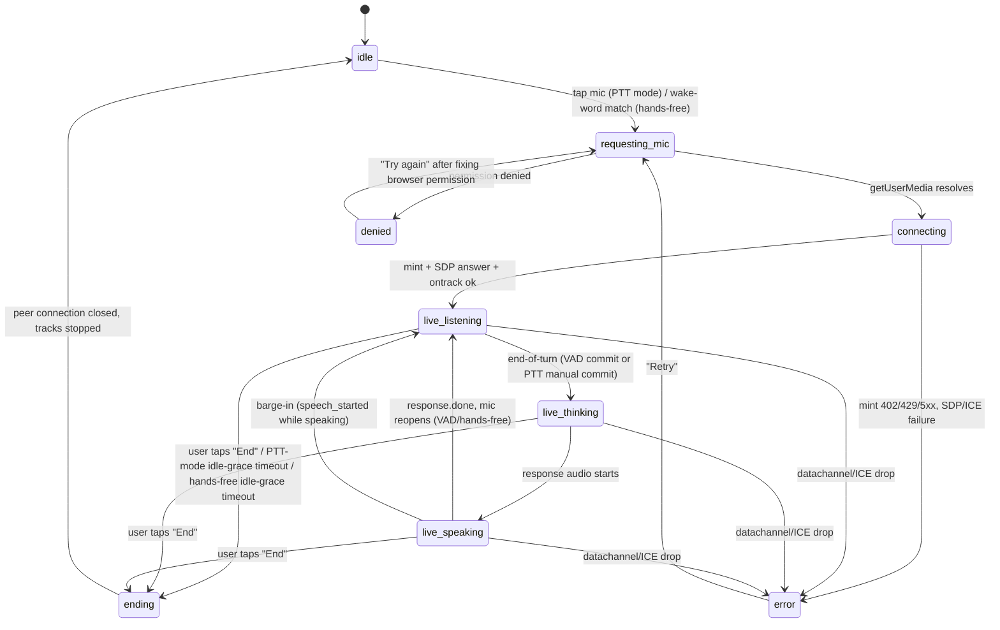

# Web Client (M3) — UI Flow Spec

**Status:** frozen for M3 implementation. This is the authors' contract for WS-D. Any
deviation (new field, new route, new control type) requires updating this file first.

**Inputs consulted:** `plan.md` M3 (§4, WS-D row §2), `contracts/api.md` (route inventory),
`contracts/settings.schema.json`, `mockups/web/01-landing-login.html`,
`mockups/web/02-conversation.html`, `mockups/web/03-wakeword-settings.html`,
`mockups/web/04-settings.html`, `internal/webapp/{api_routes,auth_routes,middleware}.go`,
`internal/store/store.go`.

**Design pass:** run inline below as four hats (UX-flow, product, accessibility, copy) per
screen, per the house "mandatory agentic design pass" rule. Findings are folded directly
into the field/state tables rather than kept as a separate transcript — this file *is* the
terse output of that pass.

**Scope note — mockups vs. this spec:** the mockups are visual/motion references only, not
literal contracts. Three deliberate departures, called out again inline where relevant:
1. Mockup voice names (Cove/Ember/Marlow/Sable) are placeholders — the real control is
   populated from `settings.schema.json#/properties/voice`'s 10-value enum via
   `GET /api/v1/realtime/voices`.
2. Mockup 04's "Assistant volume", "Speaking rate", and "Language" controls have **no
   corresponding field in `settings.schema.json`**. Adding them means an additive schema
   change, which is outside this design pass's authority. **Cut from M3.** Flagged here
   rather than silently dropped, per the "no stubs / no silent scope invention" rule.
3. Mockup 02's opening assistant bubble ("Good morning, Jeremy...") and all tool-result
   cards are demo dressing for a conversation that never happened — real empty state has
   **no fabricated transcript turns** (see §2.5).

---

## 0. Shared platform decisions (apply to all three screens)

- **Template engine:** Go `html/template` via Fiber's `html/v2` engine (not a second
  templating DSL) — `html/template`'s contextual auto-escaping is load-bearing for a page
  that embeds server-fetched settings JSON into a ``, alongside the fully
rendered initial control states (selected radio, slider position, etc.) computed
server-side in the template. Client JS hydrates from that inline JSON — **no client-side
`GET /api/v1/settings` fetch on first paint**, so there is no settings-page loading
skeleton state to design. Subsequent `PUT`s go through `fetch`. `GET /api/v1/settings` (the
JSON endpoint) still exists and is used by: the conversation page's persona/voice
quick-switch hydration, and this page's own conflict-recovery re-fetch (§3.6).

### 3.3 Fields / controls (every `settings.schema.json` field)

| Schema path | Control | Required | Default | Data source | Validation / error copy |
|---|---|---|---|---|---|
| `version` | hidden (not rendered) | yes | — | GET response | Never user-edited; held in a JS variable, sent back on every `PUT`. |
| `wakeWord` | combobox (searchable `<input role="combobox">` + listbox, per house rule for a small-but-growing enumerable set) | yes | `hey-live-ninja` | `GET /static/wakewords/catalog.json` (new static asset, §4 — built-in phrases only in M3; user-trained custom phrases are M6) | If the stored value isn't in the catalog (future/foreign value), show it as a disabled "Unknown (kept as-is)" option per the schema's forward-compat rule — never silently drop it. |
| `wakeEngine` | radio group, 3 options | yes | `openwakeword` | schema enum (static, finite, meaningful across surfaces) | `porcupine` row disabled, hint "Available on the Android app"; `wakenet` row disabled, hint "Available on M5Stack hardware"; only `openwakeword` selectable on web. |
| `sensitivity` | slider, 0–100 (displayed as %), stored as 0–1 float | yes | `0.5` (→ 50%) | schema `minimum`/`maximum` | No invalid range possible (native `<input type=range>` clamps); commits on `pointerup`/`change`, not every `input` tick. |
| `persona.presetId` | `<select>` | yes | `default` | `GET /api/v1/realtime/personas` (+ a client-appended literal `"custom"` option, always last) | — |
| `persona.systemInstructions` | `<textarea maxlength="4000">`, shown only when `presetId==="custom"` | conditionally (null otherwise) | `null` | user input | Live counter "N / 4000"; a paste that exceeds the limit is trimmed to 4000 with a toast ("Instructions were shortened to fit the 4000-character limit."), never a hard rejection. Selecting a non-custom preset clears this field and hides the textarea (progressive disclosure). |
| `voice` | radio group with inline preview button per row | yes | `cedar` | `GET /api/v1/realtime/voices` (10 rows, canonical enum order) | Preview button calls `POST /api/v1/fallback/tts {text: "<fixed sample line>", voice: "<row's id>"}` (existing endpoint, reused — no new backend surface needed) and plays the returned audio; only one preview plays at a time (stops any other on new click). |
| `turnDetection` | radio group, 2 options | yes | `semantic_vad` | schema enum (static) | Helper copy per option: "Semantic VAD — Live Ninja judges when you're done speaking from meaning, not just silence (recommended)." / "Server VAD — ends your turn after a fixed silence gap." |
| `theme` | segmented control, 3 options | yes | `system` | schema enum (static) | Applies instantly client-side (`data-theme` attribute + `localStorage` cache to avoid flash-of-wrong-theme on next load) *and* persists via `PUT`. |
| `micDeviceId` | `<select>` | no (nullable) | `null` ("System default") | `navigator.mediaDevices.enumerateDevices()` filtered to `kind==='audioinput'` | If device labels are empty (mic permission never granted in this browser), show one row: "Grant microphone access to see device names" — a button, not a dead dropdown — that calls `getUserMedia` once (immediately released) purely to unlock labels, then re-populates. If the previously-selected device id has since been unplugged, fall back to "System default" and show a one-time toast: "Your saved microphone isn't connected — using the system default." |
| `voiceEngine.*` | **no control in M3** (see 3.1) | yes | `{default:"openai-realtime", devices:{}}` | — | Round-tripped unedited on every `PUT` (client must echo back whatever it received on `GET`, per `additionalProperties:true` / forward-compat rule — never drop it because the UI doesn't expose it). |
| `privacy.storeAudio` | toggle | no | `false` | — | Off is the privacy-preserving default (PRD §10) — no code path in M3 currently honors "on" (no audio-store pipeline is built yet), so flip it on shows an inline note: "Audio storage isn't wired up yet in this build — this preference is saved for when it is." (Honest about current capability rather than silently pretending the toggle does something today.) |
| `privacy.storeTranscripts` | toggle | no | `true` | — | — |
| `privacy.retentionDays` | radio group, 4 options (`0/7/30/90`) | no | `30` | schema enum (static) | `0` row labeled "Don't keep transcripts" (not "0 days", clearer). |
| — (not a schema field) | "Sign out" button | — | — | — | `POST /auth/logout` (or `/api/v1/auth/logout`), then client-side redirect to `/`. |
| — (not a schema field) | "Sign out everywhere" button | — | — | — | `POST /api/v1/auth/logout-all` (`RequireAuth`) — destructive-but-recoverable (just re-login), so a lightweight `confirm()`-style inline confirmation ("This signs out every device, including this one.") is enough; does **not** need the typed-"DELETE" pattern reserved for irreversible data loss. |

### 3.4 Cut from M3 (flagged, not silently dropped)
- Mockup 04's **Assistant volume**, **Speaking rate**, **Language** controls — no
  corresponding `settings.schema.json` field. Needs a schema addition + explicit approval
  before any of these get built; not part of this design pass's authority.
- Mockup 03's full **wake-word management table** (add/edit/delete/train custom phrases,
  per-phrase sensitivity, mic test modal) — that whole surface is **M6** ("Programmable
  wake-word system"), which needs the training pipeline, `POST /v1/wakewords`, and content-
  addressed model distribution to exist first. M3 ships only a **read-select** combobox
  over the built-in catalog (`wakeWord` row above) plus the sensitivity slider for
  whichever phrase is active — no add/train/delete UI yet.
- Mockup 05 (Account & Devices full page: device table, pairing QR flow, per-device revoke)
  — separate route, separate milestone-adjacent surface; M3 only needs the two sign-out
  buttons on the Settings page per the task brief. `GET /v1/devices` /
  `DELETE /v1/devices/{id}` already exist server-side (`api_routes.go`) for whenever that
  page is built.

### 3.5 Empty / loading / error states
- **Loading:** none on first paint (§3.2, SSR-inlined). A field-level "Saving…" micro-state
  (small spinner or dimmed control) appears only on the specific field being written,
  never a full-page skeleton.
- **Error — save failure (network/5xx):** revert the optimistic UI value for that field
  back to its last-confirmed value; show a toast: "Couldn't save your changes — check your
  connection and try again." with a "Retry" action that resubmits the same `PUT`.
- **Error — version conflict (`409`):** see §3.6.
- **Empty state:** n/a — `GET /api/v1/settings` always returns a full document (defaults
  synthesized server-side if the row is absent, per the task brief), so there is never a
  genuinely empty settings page.

### 3.6 Autosave + optimistic-concurrency (shared logic, used by both Settings and the
conversation page's quick-switches)
1. On any field change, debounce 400ms (sliders/text) or fire immediately (radio/select/
   toggle/segmented — these are discrete, not continuous), then:
   `PUT /api/v1/settings {settings: <full merged document with the one field changed>,
   version: <last-known version>}`.
2. **200:** update the in-memory `version` to the response's new value; save-bar shows "All
   changes saved" with a timestamp.
3. **409 (version conflict):** another surface (Android/M5Stack) wrote first.
   Re-`GET /api/v1/settings`, diff against the in-flight local change:
   - If the *same field* also changed remotely, remote wins (last-write-wins is the
     documented reconciliation rule) — discard the local pending value, show: "Someone
     updated your settings from another device — refreshed." Re-render the affected
     control(s) from the fresh document.
   - If a *different* field changed remotely, re-apply the local pending change on top of
     the freshly-fetched document and retry the `PUT` once automatically (no user-visible
     interruption — this is the common case: two unrelated settings touched from two
     surfaces close in time).
4. Never blocks the user from continuing to edit other fields while a save is in flight —
   each field's write is independent.

### 3.7 Keyboard map
Standard form tab order top-to-bottom, section-by-section (wake word → persona → voice →
turn detection → appearance → privacy → account). Radio groups and the segmented control
use native arrow-key roving tab-index (free from `<input type=radio>`/native radio
grouping — no custom ARIA needed). Voice preview buttons are reachable via `Tab` after
their radio; `Enter`/`Space` activates. Danger-adjacent (sign-out) buttons are last in tab
order, consistent with "destructive actions subordinate" placement.

### 3.8 ARIA notes
- Every field has a persistent `<label for>`; radio/checkbox groups are wrapped in
  `<fieldset><legend>` (wake engine, voice, turn detection, retention days, theme).
- Disabled radio rows (Porcupine/WakeNet) carry `aria-disabled` plus the hint text
  associated via `aria-describedby` — never just a lower-opacity visual cue alone.
- Slider: native `<input type="range">` with `aria-valuetext` set to the formatted "72%"
  string (screen readers otherwise announce the raw 0–100 number, not the intended
  percentage framing already shown visually).
- Save-bar status line: `role="status" aria-live="polite"`.
- Delete-account confirm panel (existing danger-zone pattern, unchanged from the mockup):
  `aria-expanded`/`aria-controls` on the trigger button, focus moves into the panel on
  expand and returns to the trigger on cancel/collapse — already correct in the mockup,
  carry forward as-is.

---

## 4. New backend surface this spec requires (for the implementing agent, not prescriptive
   beyond what's already named in the task brief)

| Item | Kind | Notes |
|---|---|---|
| `internal/store/settings.go` | new file | `PK=USER#<uid>`, `SK=SETTINGS`; `GetSettings` (defaults-if-absent, voice default `cedar`), `PutSettings` (`ConditionExpression version = :expected`, `store.ErrVersionConflict` on failure mapped to `409`). |
| `internal/webapp/settings_routes.go` | new file | `GET /api/v1/settings`, `PUT /api/v1/settings`. Registered from `cmd/web/main.go` alongside `RegisterAPIRoutes`/`RegisterAuthRoutes`. |
| `GET /api/v1/realtime/voices` | new tiny handler | Returns the 10-entry `realtime.SupportedVoices` list with id + display label/description (static, no DB read). |
| `GET /api/v1/realtime/personas` | new tiny handler | Returns the persona catalog (id/name/description) the broker already resolves server-side; client never sees raw instructions for non-custom presets. |
| `static/wakewords/catalog.json` | new static asset | Built-in wake phrases only for M3 (e.g. `hey-live-ninja` default, `ok-ninja`, `ninja`) — the full user-training pipeline is M6; this file just needs to exist so the combobox in §3.3 has real, non-blind options. |

## 5. Definition of done for this spec
Every field in `contracts/settings.schema.json` has a named control, data source, default,
and validation rule above (or an explicit, reasoned cut). Every mic state in the DoD's
`idle→requesting-mic→connecting→live-listening⇄live-speaking→ending` chain plus
`error`/`denied` is transitioned into and out of by a named trigger. Every screen has a
loading, empty, and error state defined. Keyboard and ARIA behavior is specified per screen.
Implementers should treat any gap discovered during coding as a spec bug — fix this file in
the same change, don't silently improvise.
