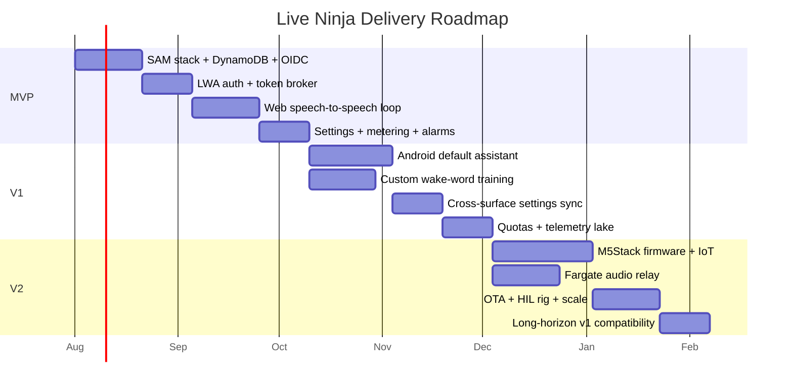
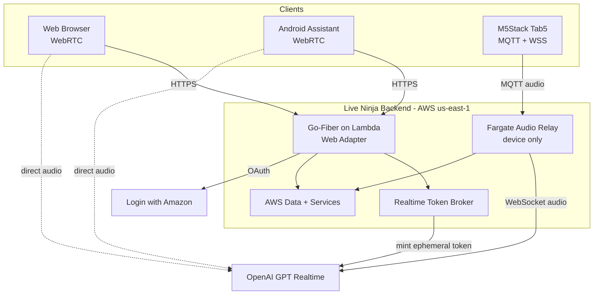
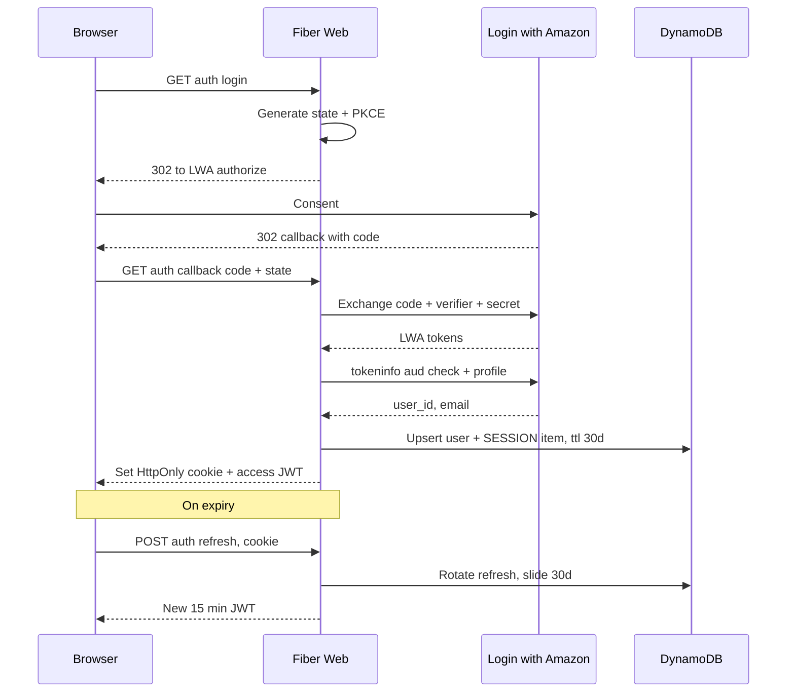
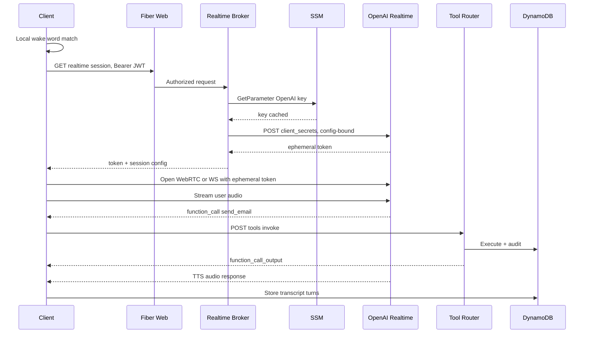
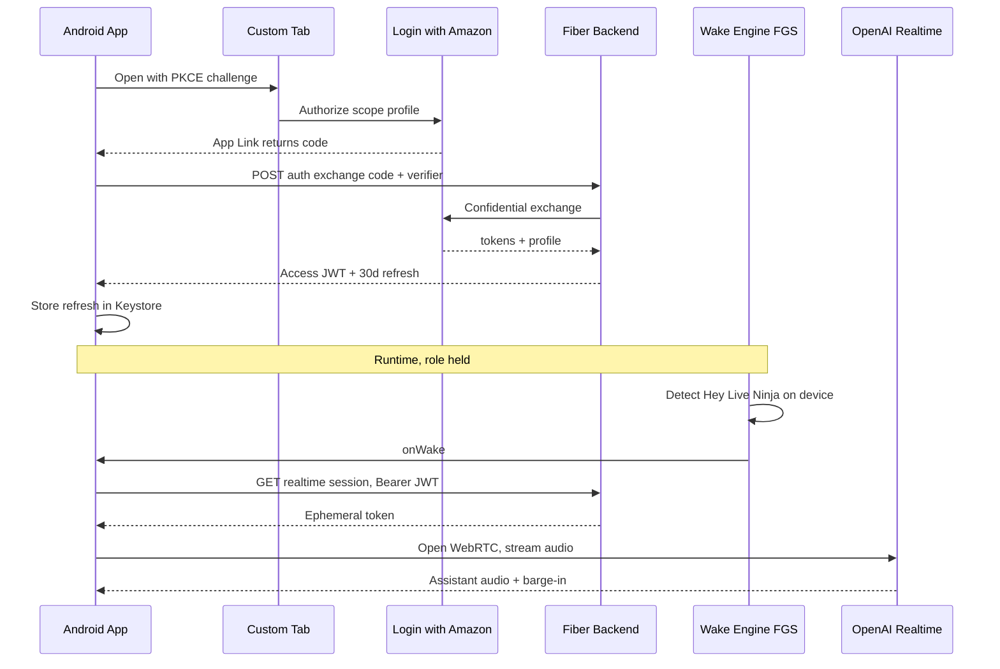
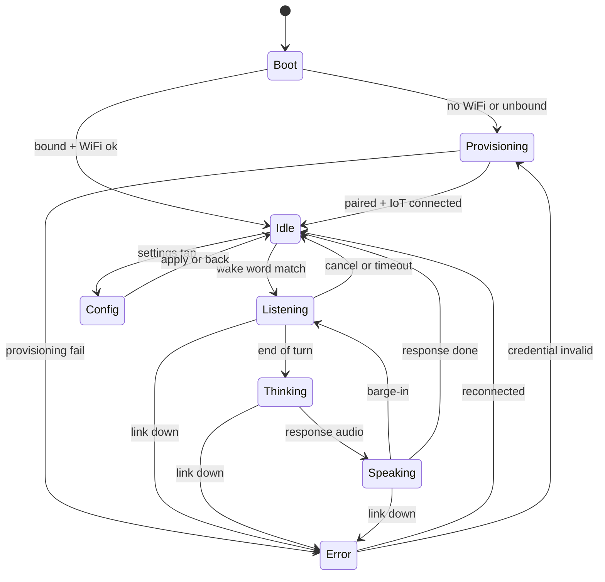
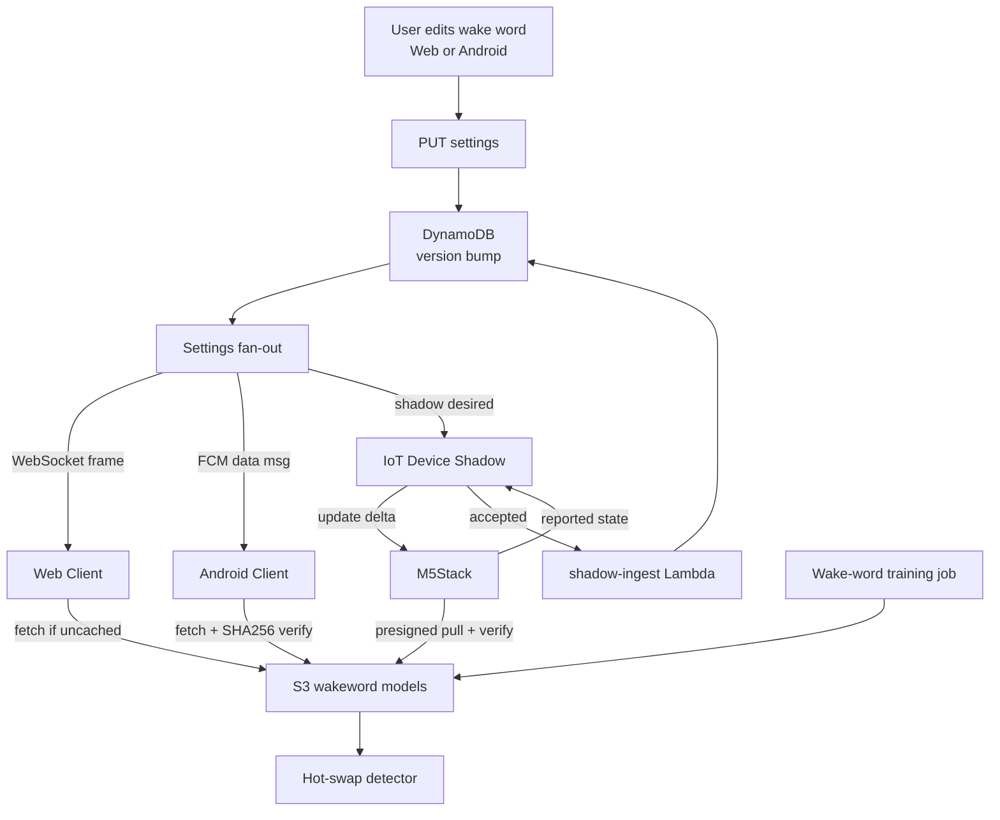

# Live Ninja — Implementation Plan

> **Status:** authoring / not yet started · **Owner:** jeremy · **Repo:** `JeremyProffittOrg/live-ninja`
> **Domain:** `live.jeremy.ninja` · **AWS account:** `759775734231` · **Region:** `us-east-1`
> **Stack:** AWS SAM · Go 1.22 on `provided.al2023` · **arm64/Graviton** · Go-Fiber via Lambda Web Adapter

Live Ninja is one AWS backend serving three LWA-gated client surfaces — a responsive **Web** app, an **Android** primary-assistant app, and an **M5Stack Tab5** embedded terminal — around OpenAI's GPT Realtime speech-to-speech engine. This document is the formal, self-updating implementation plan.

---

## 1. Overview & how to read this plan

This plan is organized into **parallel workstreams** executed by **agentic teams of subagents**, sequenced across **milestones M0–M8**. Each milestone has a **Definition of Done** and an ordered task list. Every milestone and task carries a **status marker** and a **model-routing** annotation. Tasks cross-reference **FR IDs** from the PRD where natural.

### 1.1 Status markers (updated in place as work proceeds)

| Marker | Meaning |
|---|---|
| `[ ]` | todo — not started |
| `[~]` | in progress |
| `[x]` | done |
| `[!]` | blocked (note the blocker inline) |

All milestones and tasks below start at `[ ]`.

### 1.2 Model-routing legend

Route each task to the **cheapest capable model** (per the machine-global Sub-Agents & Model Routing policy). If **Fable** is unavailable, promote to **Opus** — never drop to Sonnet.

| Tag | Model | Use for |
|---|---|---|
| **H** | **Haiku** | light / mechanical: scaffolding, boilerplate, config edits, doc stubs, wiring, renames |
| **S** | **Sonnet** | general engineering: handlers, CRUD, UI screens, tests, IaC of moderate complexity |
| **F** | **Fable** | hard reasoning: tricky protocol/state work, wake-word/audio pipelines, concurrency, sync/conflict logic |
| **O** | **Opus** | hardest reasoning / architecture: security-critical auth flows, cross-surface contracts, cost/consistency invariants, threat modeling |

### 1.3 Execution rules (from house style)

- **Built for autonomy.** Every decision, default, and fallback is baked in below; execution runs straight through milestones without check-ins. The only reason to pause is a genuine, un-pre-decided blocker.
- **Verbose implementation notes.** As work proceeds, append detailed notes inline under each task/milestone (decisions, files touched, commands, gotchas) — verbose enough for a fresh agent to resume from the plan alone. See §8.
- **Production-only shop.** No staging. `sam deploy` change-set previewed in logs; local Fiber smoke-test (LWA parity) pre-push; alarms catch regressions fast.
- **Deploy = push to `main`.** No local AWS deploys, no static keys, OIDC only. Secrets set by the user via `scripts/set-secret.sh` / manual `aws ssm put-parameter`; agents never see secret values.

---

## 2. Workstream map

Six workstreams run in parallel wherever dependencies allow. **WS-A (Platform/Infra)** is the critical path that unblocks everything; **WS-B (Auth)** and **WS-C (Realtime)** unblock the three client workstreams (**WS-D/E/F**); **WS-G (Platform Cross-Cut)** threads through all of them.

| WS | Name | Owns | Primary models | Depends on | Runs parallel with |
|---|---|---|---|---|---|
| **WS-A** | Platform & Infra | SAM stack, OIDC pipeline, DynamoDB single-table, SSM, S3, CloudFront/R53, tagging, IoT Core, Fargate relay infra | O (arch), S (IaC), H (config) | — | all (foundation) |
| **WS-B** | Identity & Auth | LWA OAuth (BFF), first-party JWT (KMS ES256) + rotating refresh, device 10-yr flow, authorizer | O (flows/threat), S (handlers) | WS-A (M0) | WS-C |
| **WS-C** | Realtime Voice | Token broker, session config, tool router, Fargate audio relay, fallback cascade, metering gate | O (broker/relay), F (audio), S (tools) | WS-A, WS-B | WS-B |
| **WS-D** | Web Client | Fiber SSR UI, WebRTC-to-OpenAI, transcript/visualizer, settings, PWA/SW, WASM wake word | S (UI), F (realtime.mjs) | WS-B, WS-C | WS-E, WS-F |
| **WS-E** | Android Client | VoiceInteractionService, ROLE_ASSISTANT flow, wake-word FGS, WebRTC, Custom Tabs LWA | F (assistant/wake), S (UI) | WS-B, WS-C | WS-D, WS-F |
| **WS-F** | M5Stack Firmware | ESP-IDF firmware, ESP-SR wake, IoT MQTT audio, device-hosted config/LWA, 10-yr cert, OTA | O (P4/C6 arch), F (audio/wake), S (LVGL UI) | WS-A, WS-B, WS-C relay | WS-D, WS-E |
| **WS-G** | Cross-Cut Platform | Settings schema/sync, wake-word training+distribution, privacy/retention, observability, cost/quota, versioning/compat, testing | O (contracts/quota), F (sync), S (tests) | WS-A | all |

### 2.1 CI/CD pipeline (WS-A)

```mermaid
flowchart LR
    DEV["Push to main"] --> GHA["GitHub Actions"]
    GHA --> CO["Checkout + setup-go"]
    CO --> BUILD["make build<br/>arm64 all funcs"]
    BUILD --> OIDC["Assume gha-deploy role<br/>via OIDC"]
    OIDC --> SB["sam build"]
    SB --> SD["sam deploy<br/>no-confirm-changeset"]
    SD --> CFN["CloudFormation<br/>update stack"]
    CFN --> PROD["Production<br/>Lambda + IoT + Fargate"]
    PROD --> WATCH["gh run watch<br/>+ CloudWatch alarms"]
```

### 2.2 Delivery roadmap (milestone gantt)

### 2.3 Milestone → workstream matrix

| Milestone | WS-A | WS-B | WS-C | WS-D | WS-E | WS-F | WS-G |
|---|:--:|:--:|:--:|:--:|:--:|:--:|:--:|
| **M0** Bootstrap/Infra | ● | | | | | | ○ |
| **M1** Auth | ○ | ● | | | | | |
| **M2** Realtime backend | | ○ | ● | | | | ○ |
| **M3** Web client | | | ○ | ● | | | ○ |
| **M4** Android client | | ○ | ○ | | ● | | ○ |
| **M5** M5Stack firmware+IoT | ○ | ○ | ○ | | | ● | ○ |
| **M6** Programmable wake + sync | | | | ○ | ○ | ○ | ● |
| **M7** Hardening/observability/cost/privacy | ○ | ○ | ○ | ○ | ○ | ○ | ● |
| **M8** Launch | ● | ○ | ○ | ○ | ○ | ○ | ● |

● = lead workstream · ○ = contributing

---

## 3. Architecture snapshot

**Locked decisions (see research briefs):** Lambda Web Adapter for the Fiber app (not proxy shims); **single-table DynamoDB** (`Query`/`GetItem` only, never `Scan` on a serving path); **direct client→OpenAI WebRTC/WS for audio** (browser/Android) with a **Fargate relay only for the M5Stack**; **SSM Parameter Store SecureString** for secrets (no Secrets Manager); **KMS ES256** JWT signing (private key non-extractable); GitHub Actions + OIDC as the only deploy path; six mandatory cost tags at stack level.

---

## 4. Milestones

> Each task line: `[status]` · **model** · task · _(FR refs / note)_.
> FR IDs reference the PRD's functional requirements; where the PRD numbering is not yet fixed, the bracketed area tag (e.g. `[AUTH]`, `[RT]`, `[WAKE]`) stands in and is reconciled during M0's contract pass.

### M0 — Bootstrap / Infrastructure  `[ ]`  (WS-A lead, WS-G support)

**Definition of Done:** An empty-but-real SAM stack deploys to `759775734231` via GitHub Actions + OIDC on push to `main`; the single-table DynamoDB (`live-ninja`) with both GSIs + TTL exists; all SSM parameter *slots* exist (values set out-of-band by the user); S3 buckets, CloudFront + Route 53 for `live.jeremy.ninja`, and the six cost tags are in place; `/healthz` returns 200 through CloudFront; the DynamoDB `ConsumedReadCapacityUnits` alarm and AWS Budgets ($20/$50/$100 on `Project=live-ninja`) are armed. **Cost Allocation Tags `Project`+`CostCenter` activated in Billing (non-retroactive — do early).**

Ordered tasks:
- `[ ]` **O** — Author `template.yaml` skeleton: HTTP API v2 + `web` Fiber Lambda (arm64, LWA layer), per-function least-privilege roles, `authorizer`, `realtime-broker`, `iot-ingest`, `usage-rollup`, `email-dispatch` function stubs wired but minimal. _(§2.1 backend brief)_
- `[ ]` **S** — DynamoDB `live-ninja` table: `pk`/`sk`, **GSI1** (`gsi1pk`/`gsi1sk`), **GSI2** (`gsi2pk`/`gsi2sk`), TTL on `ttl`, PAY_PER_REQUEST, PITR on. _(DynamoDB Data Model diagram)_
- `[ ]` **H** — `samconfig.toml` with stack tags `Project=live-ninja CostCenter=voice-ai Environment=prod ManagedBy=sam DeployedVia=github-actions Owner=jeremy`; arm64 defaults; artifact bucket `vars.CLOUDFORMATION_S3_BUCKET`. _(§12)_
- `[ ]` **H** — `Makefile` build targets: `GOOS=linux GOARCH=arm64 CGO_ENABLED=0 go build -tags lambda.norpc -o bootstrap ./cmd/<fn>` per function.
- `[ ]` **S** — `.github/workflows/deploy.yml` per `deploy.md`: OIDC `role-to-assume: vars.AWS_DEPLOY_ROLE_ARN`, `id-token: write`, `make build` → `sam build` → `sam deploy --no-confirm-changeset --no-fail-on-empty-changeset`.
- `[ ]` **H** — SSM SecureString/String parameter slots: `/live-ninja/prod/openai/api_key`, `/lwa/client_id`, `/lwa/client_secret`, `/session/jwt_signing_key` (or KMS key alias), `/device/cred_pepper`. Values set out-of-band by user. _(§8)_
- `[ ]` **O** — KMS CMKs: `alias/live-ninja-auth` (envelope-encrypt LWA refresh tokens) + `ECC_NIST_P256 SIGN_VERIFY` CMK for first-party JWT signing (private key never leaves KMS). _(Auth brief §2.3)_
- `[ ]` **S** — S3 buckets (block-public, SSE-S3, versioning on assets): `live-ninja-user-<acct>`, `-wakewords-<acct>`, `-assets-<acct>`, `-logs-<acct>`, `-analytics-<acct>`. _(§5 backend)_
- `[ ]` **S** — Edge: CloudFront distro for `live.jeremy.ninja` (ACM `vars.CERTIFICATE_ARN`), Route 53 alias (`vars.HOSTED_ZONE_ID`), cache `/static/*` immutable, pass `/api|/auth` no-cache; security headers (HSTS/CSP/X-CTO/Referrer).
- `[ ]` **H** — Fiber `/healthz` + minimal `internal/config` SSM loader (cached, 5-min TTL) and `internal/observ` slog JSON logger.
- `[ ]` **S** — IoT Core baseline: Thing Type `liveninja-tab5`, Thing Group fleet, provisioning template + claim-cert policy (empty policies scoped for M5). _(§10 backend, §5 M5 brief)_
- `[ ]` **S** — Alarms/Budgets: DynamoDB `ConsumedReadCapacityUnits`/`WriteCapacityUnits`/`ThrottledRequests`; AWS Budgets $20/$50/$100 on tag; `EstimatedCharges` backstop; SNS→SES notify. _(§13)_
- `[ ]` **H** — **User action gate:** document the one-time manual steps (SSM `put-parameter` values; activate Cost Allocation Tags). _(house rule: agents never see secret values)_
- `[ ]` **O** — **Contract freeze (WS-G):** publish the six integration-seam contracts (settings JSON-schema+`version`, shadow doc, wake-word manifest `GET /wakeword/<id>/model?platform=`, telemetry event schema, `X-LN-Client`/`X-LN-Server` headers, metering/quota gate) into `/contracts` and reconcile FR IDs. _(Crosscut §closing)_

### M1 — Auth (LWA BFF + first-party sessions)  `[ ]`  (WS-B lead)

**Definition of Done:** All three surfaces can complete Login with Amazon through the backend BFF; the backend mints a first-party **ES256 access JWT (15 min, KMS-signed)** + **opaque rotating refresh token (hash-only in Dynamo, reuse-detected)**; web gets a `__Host-` HttpOnly cookie (30-day sliding), Android gets JWT+refresh (30-day sliding), M5Stack gets the device 10-year credential lineage; the Lambda authorizer validates JWTs against JWKS with a `tokensValidAfter` kill-switch; logout + "log out everywhere" + device revoke all work; a new-sign-in SES alert fires. _(FR `[AUTH]`)_

Ordered tasks:
- `[ ]` **O** — `internal/auth/lwa.go`: authorize URL + PKCE, code exchange at `api.amazon.com/auth/o2/token`, **two-check validation** (`/tokeninfo` `aud == client_id` + `/user/profile`), `user_id` as canonical subject. _(Auth §2.2)_
- `[ ]` **O** — `internal/auth/session.go`: ES256 JWT via `kms:Sign`, JWKS at `/.well-known/jwks.json` (from `kms:GetPublicKey`, 24h cache), claims `iss/sub/aud/sid/did/iat/exp/jti/scope`. _(Auth §2.3)_
- `[ ]` **O** — Rotating refresh token: 256-bit random, SHA-256 hash stored, **`TransactWriteItems` rotate-on-use with reuse detection → family revoke + SES alert**. _(Auth §2.4)_
- `[ ]` **S** — `store/users.go` + `store/sessions.go`: User upsert via GSI1 `LWA#<amazonUserId>`; SESSION item (`refreshHash`, `surface`, `familyId`, `ttl`); GSI1 `SESS#<sessionId>` lookup; GSI2 active-session feed. _(DynamoDB model)_
- `[ ]` **O** — `authorizer` Lambda: verify JWT signature+`exp`+surface against JWKS, reject `iat < user.tokensValidAfter` (60s cached), inject `userId/deviceId/surface` context; public-route bypass. _(§9.3)_
- `[ ]` **S** — Web cookie flow: `/auth/lwa/login` + `/auth/lwa/callback`, `__Host-ln_rt` `Secure;HttpOnly;SameSite=Lax`, access JWT in JSON, OAuth state→verifier in Dynamo (TTL 10 min), CSRF double-submit. _(Web §4)_
- `[ ]` **S** — Android exchange: `POST /api/v1/auth/lwa/exchange {code, code_verifier}` → JWT + 30-day refresh. _(Android §6)_
- `[ ]` **O** — Device 10-yr flow (`internal/auth/device.go`): `PAIR#<nonce>` register, `/auth/device/callback` browser leg, `code_verifier` device-claim binding, `devices/pair` bind + IoT Thing/cert provision, 10-yr refresh family, silent 24h rotation. _(Auth §6, M5 §6)_
- `[ ]` **S** — Revocation surface: `/auth/logout`, "log out everywhere" (`tokensValidAfter=now`), `DELETE /devices/{id}` (revoke family + detach IoT cert). _(Auth §7)_
- `[ ]` **S** — `email-dispatch` + SES templates for `new-device-login`/`security-alert`; enqueue via SQS off request path; `IDEMP#` idempotency. _(§6 backend)_
- `[ ]` **F** — Auth tests: PKCE, `aud` substitution rejection, refresh reuse-detection, `tokensValidAfter` kill within 60s, cookie flags, device claim binding. `dynamodb-local` + mocked LWA. _(Crosscut §7)_

### M2 — Realtime voice backend (broker + tool-calling)  `[ ]`  (WS-C lead)

**Definition of Done:** An authenticated client can `GET /api/v1/realtime/session` and receive a **config-bound OpenAI ephemeral token** (~60s) plus the resolved persona/tool manifest; the OpenAI key lives only in SSM read by the broker's isolated role; server-side **tool router** (`POST /api/v1/tools/invoke`) executes tools re-authorized per call with idempotency; the **metering/quota gate** rejects over-cap mints pre-spend; the **fallback cascade** (retry → chained STT→LLM→TTS → text-only) is implemented; the **Fargate audio relay** service exists (for M5) even though no device connects yet. _(FR `[RT]`)_

Ordered tasks:
- `[ ]` **O** — `realtime-broker` Lambda (isolated IAM: `ssm:GetParameter` one ARN + `kms:Decrypt`): load persona/tools, mint `POST /v1/realtime/client_secrets` config-bound (`model gpt-realtime`, `voice`, `instructions`, `semantic_vad interrupt_response`, `tools`, `pcm16`). _(§7 backend, Voice §2/§6)_
- `[ ]` **O** — Quota/metering gate at mint: read `USAGE#<month>`+daily counter, per-user token-bucket (1 mint/5s burst 3), soft-cap warn / hard-cap 402/429; write session ledger stub. _(Crosscut §6, Voice §13)_
- `[ ]` **O** — `internal/realtime` session config + persona resolution (clients send persona **ID**, server resolves instructions — anti-injection). _(Web §2.1)_
- `[ ]` **S** — Tool router (`fn-tool-router` / `/api/v1/tools/invoke`): re-authorize LWA user per call, enumerated-arg schemas, idempotency keys; tool catalog `send_email` (SES `jeremy@jeremy.ninja` / Reply-To gmail, confirm-before-send external), `set_timer/reminder` (EventBridge Scheduler), `device_control` (owner-scoped MQTT), `get_weather/web_lookup`, `remember/recall_note`. _(Voice §7)_
- `[ ]` **F** — **Fargate audio relay** (Go arm64, ALB+WSS): validate device JWT, budget-gate, hold OpenAI WS, Opus↔PCM16@24k transcode, barge-in (`response.cancel`+`input_audio_buffer.clear`), tool-call intercept server-side, transcript/usage sink. ECS service+autoscaling in SAM. _(Voice §3.3/§3.4, M5 §4)_
- `[ ]` **F** — Fallback cascade `fn-fallback-turn`: 2× backoff retry → STT (`gpt-4o-transcribe`)→`gpt-4o-mini`→TTS (`gpt-4o-mini-tts`) → text-only → graceful hard-down (side-effects queued). _(Voice §12)_
- `[ ]` **S** — Transcript sink + usage rollup: `USER#<uid>/LOG#…` turns (TTL 90d), `usage-rollup` hourly EventBridge → daily/monthly rollups (Query only). _(§4, §13 backend)_
- `[ ]` **S** — EMF metrics: `SessionsBrokered`, `EphemeralTokenMintLatency`, `ToolInvocations`, per-surface counts; X-Ray on broker/authorizer/web. _(§13)_
- `[ ]` **F** — Broker/relay/tool tests: mocked OpenAI WS + REST, quota gate pre-spend enforcement, tool re-authz, confirm-before-send, relay Opus transcode + barge-in cancel. _(Crosscut §7)_

### M3 — Web client  `[ ]`  (WS-D lead)

**Definition of Done:** `live.jeremy.ninja` serves the Fiber SSR app; unauthenticated users get server-rendered login; authed users get a conversation view with **direct WebRTC to OpenAI**, live transcript, visualizer, barge-in, and click-to-talk; a schema-driven settings page (populated controls, WCAG AA both themes); PWA with network-first HTML service worker; CSP allows only OpenAI + self. Optional WASM wake word (off by default) with guaranteed click-to-talk fallback. _(FR `[WEB]`)_

Ordered tasks:
- `[ ]` **H** — Template structure (`layouts/base`, `partials/nav`+`audio_viz`, `pages/landing|conversation|settings|error`); fingerprinted static asset generator; `no-cache` HTML / `immutable` assets. _(Web §1)_
- `[ ]` **F** — `realtime.mjs`: `RTCPeerConnection`, mic track (AEC/NS/AGC), `oai-events` datachannel, SDP offer→`/v1/realtime/calls` with ephemeral secret, remote audio element. _(Web §2.2)_
- `[ ]` **F** — Barge-in: on `input_audio_buffer.speech_started` stop/attenuate assistant audio + `response.cancel`, flip mic state. _(Web §2.3)_
- `[ ]` **S** — Mic state machine + large primary control (`idle→requesting-mic→connecting→live-listening⇄live-speaking→ending`, `error/denied`); push-to-talk + hands-free. _(Web §2.5)_
- `[ ]` **S** — `transcript.mjs` (text-node incremental render, `role="log"`) + `visualizer.mjs` (`AnalyserNode`→canvas, `aria-hidden`, `prefers-reduced-motion`). _(Web §6)_
- `[ ]` **S** — Settings page (schema-driven, **mandatory agentic design pass first**): wake-word combobox, engine radio, sensitivity slider, persona select, voice radio+preview, turn-detection radio, theme segmented, mic-device select, sign-out/all-devices. _(Web §5.3, machine UI rules)_
- `[ ]` **S** — Tool client dispatch: client-safe tools in-browser; backend tools → `/api/tools/:name` → `function_call_output`. _(Web §2.4)_
- `[ ]` **F** — `wakeword.mjs`: openWakeWord WASM in AudioWorklet (default), Porcupine-web alt behind same interface, lazy-loaded, `unsupported`→click-to-talk. _(Web §3)_
- `[ ]` **S** — PWA: `manifest.webmanifest` + `sw.js` (network-first HTML, SWR assets, never cache `/api|/auth`/OpenAI, versioned cache purge on activate, `skipWaiting`/`clients.claim`). _(Web §8)_
- `[ ]` **S** — Playwright e2e (stubbed LWA + mock OpenAI WS): login, settings CRUD, wake-swap, session bootstrap; Lighthouse + axe WCAG AA. _(Crosscut §7)_

### M4 — Android client (assistant role + wake word)  `[ ]`  (WS-E lead)

**Definition of Done:** The app installs (sideload/internal-testing), completes LWA via Custom Tabs+PKCE (30-day sliding session in Keystore), runs its **own programmable wake-word engine** (Porcupine primary / openWakeWord fallback) in a `microphone` FGS with a persistent notification, acquires `ROLE_ASSISTANT` via the resilient OEM-aware guided flow (and works even without it), and on wake opens a **WebRTC** GPT-Realtime session with AEC-backed barge-in; locked-screen sessions gate sensitive actions behind biometric. _(FR `[AND]`)_

Ordered tasks:
- `[ ]` **H** — Gradle module layout (`:app`, `:core-audio`, `:core-realtime`, `:core-auth`, `:feature-*`, `:service-assistant`), minSdk 29/targetSdk 35, Hilt, Compose M3. _(Android §1)_
- `[ ]` **S** — LWA Custom Tabs + PKCE, `/api/v1/auth/lwa/exchange`, refresh in EncryptedSharedPreferences/Keystore, silent sliding refresh on foreground. _(Android §6)_
- `[ ]` **F** — `WakeWordEngine` interface; Porcupine primary (`.ppn` from backend/S3) + openWakeWord fallback; `AudioRecord` 16kHz + VAD pre-gate. _(Android §3.1)_
- `[ ]` **F** — `WakeWordService` (`foregroundServiceType=microphone`, persistent low-priority notification, BOOT_COMPLETED restart); battery strategy (VAD gate, no continuous wakelock, thermal/battery-saver duty-cycle, <2%/hr target). _(Android §3.2/§3.3)_
- `[ ]` **O** — `VoiceInteractionService`/`SessionService`/`Session` + `RecognitionService`; manifest contract; `RoleManager` request + **OEM-aware settings deep-link fallback walkthrough** + `isRoleHeld` polling; locked-session gating via `requestDismissKeyguard()`. _(Android §2)_
- `[ ]` **F** — WebRTC capture chain (google-webrtc vendored .aar behind `RealtimeTransport`), `MODE_IN_COMMUNICATION`, platform+WebRTC AEC/NS/AGC, ephemeral token from backend. _(Android §4)_
- `[ ]` **F** — Barge-in + playback (server-VAD, `response.cancel`, 30-50ms fade, jitter flush; half-duplex fallback on poor AEC). _(Android §4.3)_
- `[ ]` **S** — Onboarding wizard + Settings + Wake-word management + Live overlay (Compose, populated controls, TalkBack, WCAG AA). _(Android §7)_
- `[ ]` **S** — Permissions choreography + prominent mic disclosure/consent logging; offline/edge behavior. _(Android §5/§8)_
- `[ ]` **S** — Tests: JUnit/Robolectric, Espresso, VoiceInteractionService instrumented, wake-engine FRR@FAR harness gated in CI. _(Crosscut §7)_

### M5 — M5Stack firmware + IoT + on-device config / 10-yr login  `[ ]`  (WS-F lead)

**Definition of Done:** A Tab5 boots ESP-IDF firmware, onboards WiFi + Login-with-Amazon via its device-hosted config page, provisions an IoT Thing + on-chip-keypair X.509 cert (10-yr lineage, DS-peripheral-protected), does on-device ESP-SR wake detection, streams Opus audio over IoT MQTT through the Fargate relay to GPT-Realtime with instant local barge-in, renders the LVGL state-machine UI, syncs settings via device shadow, and updates via signed A/B IoT-Jobs OTA. Device recorded in `c:\dev\fleet\esp32.md`. _(FR `[M5]`)_

Ordered tasks:
- `[ ]` **O** — ESP-IDF v5.4+ project, pinned tag; P4/C6 `esp-hosted` link bring-up, netif/esp-tls/mqtt over hosted transport; task partition (`audio_rx`, `ww_infer`, `net_uplink/downlink`, `lvgl`, `ctrl`). _(M5 §1/§2)_
- `[ ]` **F** — Audio path: PDM mic → AFE (AEC/NS/VAD) → ESP-SR WakeNet "Hey Live Ninja" → Opus 16kHz 20ms uplink; downlink Opus decode → I2S with 60-100ms jitter buffer; local instant barge-in (stop DAC + control publish). _(M5 §3/§4)_
- `[ ]` **S** — IoT Core: Fleet Provisioning by Claiming Certificate, on-chip keypair (DS peripheral), per-device topic policy (`${iot:Connection.Thing.ThingName}`), topic map (`audio/up|down`, `control/up|down`, `telemetry`), classic+`config` shadows. _(M5 §5)_
- `[ ]` **O** — Device-hosted config: SoftAP captive portal (SSID scan-list-select, passphrase keyboard only), STA config page, **LWA PKCE brokered by backend**, bind token returned over IoT `control/down`. _(M5 §6)_
- `[ ]` **O** — 10-yr persistence: X.509 op-cert (10-yr, rotate at yr8), encrypted NVS bind record, flash encryption + Secure Boot v2 + NVS encryption; steady-state 24h mTLS refresh; realtime session request over HTTPS → relay. _(M5 §6, Auth §6)_
- `[ ]` **F** — `iot-ingest` Lambda: `SELECT * FROM 'liveninja/+/telemetry'` → DynamoDB `DEVICE#` lastSeen/telemetry (PutItem, GSI2 `DEVSEEN#`); IoT Rules routing audio/control to relay. _(§10 backend)_
- `[ ]` **S** — LVGL UI state machine (Idle/Listening/Speaking/Settings/Onboarding/Error), 720p PSRAM framebuffers + PPA dirty-rect, 48-64px targets, list-selects, "N of M", keyboard only for passphrase/name. _(M5 §7)_
- `[ ]` **F** — OTA: A/B partitions, `esp_https_ota`, Secure Boot v2 verify + anti-rollback eFuse, IoT Jobs canary→fleet, mark-valid-after-check-in, coordinated P4↔C6 version gate. _(M5 §8)_
- `[ ]` **S** — HIL rig scaffolding (bench Tab5, PlatformIO CI flash, serial+telemetry MQTT assert); record device in `c:\dev\fleet\esp32.md` (eFuse MAC, role, last COM). _(Crosscut §7, fleet rule)_

### M6 — Programmable wake-word system + settings sync  `[ ]`  (WS-G lead)

**Definition of Done:** A user can create a custom wake phrase on Web/Android; a backend training pipeline produces per-platform models to S3 (SHA-256 pinned); the canonical settings doc (`SETTINGS#v<n>`, optimistic-concurrency) syncs across all surfaces via WebSocket/FCM/IoT-shadow with higher-version-wins reconciliation; each client SHA-verifies and hot-swaps wake models; the M5 selects from curated flashable WakeNet + oWW-ESP fallback. _(FR `[WAKE]`, `[SETTINGS]`)_

Ordered tasks:
- `[ ]` **O** — Settings schema + `version` optimistic concurrency (`UpdateItem ConditionExpression`), `GET/PUT /settings`, `?since=<v>` reconcile, forward-compat unknown-field preservation. _(Crosscut §3)_
- `[ ]` **F** — Fan-out: Web WebSocket `settings.updated` frame; Android FCM data-message nudge; IoT `config` shadow desired publish. _(Crosscut §3.2)_
- `[ ]` **F** — `shadow-ingest` Lambda (IoT Rule on `.../shadow/name/config/update/accepted`) → Dynamo version bump; higher-version-wins push-down. _(Crosscut §3.2)_
- `[ ]` **F** — Training pipeline: `wakeword-train` validate (phoneme/profanity/collision), openWakeWord on AWS Batch (arm64, conc≤2, 20-min timeout, ≤3/day/user) → int8 `.onnx`; Porcupine Console API server-side per platform; output to S3, `WAKEWORD#<wwId>` `status=ready`, SES "ready". _(Crosscut §2.2)_
- `[ ]` **S** — Distribution: `GET /wakeword/<wwId>/model?platform=` → presigned/CloudFront-signed URL; catalog snapshot JSON on S3+CloudFront (no live table read on public path). _(Crosscut §2.3, backend §5)_
- `[ ]` **F** — Client hot-swap: Web/Android SHA-256 verify + live swap; M5 curated flashable WakeNet set + oWW-ESP fallback, shadow-driven model ref. _(Crosscut §2.4)_
- `[ ]` **S** — Wake-word management UIs on Web + Android wired to catalog + custom-phrase request flow. _(Web §5.3, Android §7.4)_
- `[ ]` **F** — Contract tests: settings schema round-trip, conflict 409 reconcile, shadow loop, wake manifest + SHA verify across client fixtures. _(Crosscut §7/§8)_

### M7 — Hardening / observability / cost / privacy  `[ ]`  (WS-G lead, all WS)

**Definition of Done:** Full observability (structured logs, EMF, X-Ray, `live-ninja-ops` dashboard, Athena telemetry lake); all cost/quota controls enforced pre-spend with anomaly auto-suspend; privacy posture complete (on-device-wake invariant + disclosures, retention TTLs, `DELETE /account`, ZDR requested); WAF rate rules; capability negotiation + `/compat`; load tests confirm `Query`-only under load; security review passed. _(FR `[OBS]`, `[COST]`, `[PRIV]`, `[SEC]`)_

Ordered tasks:
- `[ ]` **S** — Observability: `slog` JSON everywhere (requestId/userId/surface/route/latency, no PII), EMF metrics, X-Ray, `live-ninja-ops` dashboard; 30-day log retention. _(§13 backend, Crosscut §5)_
- `[ ]` **S** — Telemetry lake: `/telemetry` batched+sampled (Web/Android) + M5 MQTT → IoT Rule → Firehose → S3 → Athena; event schema only, no transcript content. _(Crosscut §5)_
- `[ ]` **O** — Cost/quota: pre-spend daily-minute + monthly-token caps, 10-min hard session cap (token TTL + server kill), per-user hourly-burn anomaly auto-suspend + alarm; per-user cost attribution rollups. _(Crosscut §6, Voice §13)_
- `[ ]` **S** — Alarms: Lambda Errors/Throttles/p99, broker mint error rate, HTTP 5xx, SES bounce/complaint, IoT heartbeat-gap, DynamoDB read-runaway; SNS→SES. _(§13)_
- `[ ]` **O** — Privacy: consent records (`CONSENT#`), retention TTLs (transcripts 30d default, audio off), `DELETE /account` Step Functions (Query+BatchWrite, S3 purge, IoT thing/cert delete, LWA revoke, SES confirm), OpenAI ZDR requested + documented. _(Crosscut §4)_
- `[ ]` **S** — WAF rate-based rules on API; per-user concurrent-session + session-rate limits; IoT telemetry throttle. _(Crosscut §6)_
- `[ ]` **S** — Versioning/compat: `/v1` path prefix, `X-LN-Client`/`X-LN-Server` headers, `GET /compat`, below-min "please update" states; content-addressed wake models with safe fallback. _(Crosscut §8)_
- `[ ]` **F** — Load tests (k6/Vegeta + synthetic-session generator): quota/rate limits hold, `ConsumedReadCapacityUnits` flat (no Scan), relay under connection load. _(Crosscut §7)_
- `[ ]` **O** — Security review pass over auth/broker/device/tool paths + threat-model checklist sign-off. _(Auth §9, all risk tables)_

### M8 — Launch  `[ ]`  (WS-A + WS-G lead, all WS)

**Definition of Done:** SES production access granted (out of sandbox); Cost Allocation Tags confirmed active; all three surfaces pass end-to-end smoke on production; distribution channels live (web at `live.jeremy.ninja`, Android signed APK + `assetlinks.json`/in-app updater, M5 firmware release + fleet provisioning enabled); alarms + budgets confirmed firing to email; runbook + `/v1` long-horizon compatibility commitment documented. _(FR `[LAUNCH]`)_

Ordered tasks:
- `[ ]` **H** — Request SES production access; verify DKIM `@jeremy.ninja` identity, bounce/complaint SNS suppression wired. _(§6 backend)_
- `[ ]` **H** — Confirm `Project`+`CostCenter` Cost Allocation Tags active in Billing; budgets alerting. _(§12)_
- `[ ]` **S** — Production end-to-end smoke: web voice turn, Android wake→WebRTC turn+tool call, M5 wake→relay turn+barge-in; verify one line via `gh run watch`. _(§14)_
- `[ ]` **S** — Distribution: web live; Android signed APK + `.well-known/assetlinks.json` + `GET /v1/app/android/latest` updater; M5 firmware channel + fleet provisioning claim enabled. _(Android §9, M5 §8)_
- `[ ]` **H** — Runbook + on-call: alarm→action mapping, credential-rotation steps (re-put SSM), device kill-switch, `/v1` compatibility lifetime commitment. _(Crosscut §8)_
- `[ ]` **O** — Launch go/no-go review against every risk table; sign off residual-risk acceptances. _(§7)_

---

## 5. Environments & deploy

- **Production-only.** No staging/dev. Every push to `main` is a production deploy. Verify before pushing; no destructive surprises.
- **Deploy path (only allowed one):** push/merge to `main` → GitHub Actions assumes `vars.AWS_DEPLOY_ROLE_ARN` via **OIDC** (`id-token: write`, no static keys) → `make build` (arm64) → `sam build` → `sam deploy --no-confirm-changeset --no-fail-on-empty-changeset`. No local `aws`/`sam deploy`/`sam sync`. If a deploy need has no pipeline, build the pipeline — never deploy by hand.
- **arm64 everywhere.** All Lambdas `provided.al2023`, `Architectures: [arm64]`, built `GOOS=linux GOARCH=arm64 CGO_ENABLED=0 -tags lambda.norpc -o bootstrap`. The Fargate relay is arm64. Flip architecture and build step together (never `Architectures:` alone).
- **Cost tags (stack-level, once, in `samconfig.toml`):** `Project=live-ninja CostCenter=voice-ai Environment=prod ManagedBy=sam DeployedVia=github-actions Owner=jeremy`. Activate `Project`+`CostCenter` as Cost Allocation Tags in Billing at M0 (non-retroactive).
- **Secrets:** SSM Parameter Store SecureString + KMS only — **no Secrets Manager/Vault**. Agents never see values; the user sets them via `scripts/set-secret.sh` (GitHub) / manual `aws ssm put-parameter` (SSM). Workflow reads only ARNs from `vars`. Broker holds the sole `ssm:GetParameter` on the OpenAI key ARN.
- **DynamoDB discipline:** `Query`/`GetItem` only on every serving path; `Scan` reserved for manual one-off migrations. Read-mostly catalogs served from S3/CloudFront snapshots. `ConsumedReadCapacityUnits` alarm armed.
- **GitHub Actions monitoring:** summarize `gh run watch` to one line; show detail only on failure.

---

## 6. Testing & verification strategy per milestone

| Milestone | Verification (definition-of-done gate) |
|---|---|
| **M0** | `sam deploy` succeeds via OIDC; `/healthz` 200 through CloudFront; table+GSIs+TTL present; buckets/edge exist; alarms+budgets armed; tags active. Local Fiber smoke (`:8080`) parity. |
| **M1** | `dynamodb-local` + mocked LWA: PKCE happy-path all surfaces; `aud`-substitution + refresh-reuse rejected; `tokensValidAfter` kill ≤60s; cookie flags correct; device-claim binding; new-sign-in SES fires (mock). |
| **M2** | Mocked OpenAI REST/WS: config-bound ephemeral mint; quota gate rejects over-cap **pre-spend**; tool router re-authz + confirm-before-send + idempotency; relay Opus↔PCM16 + barge-in cancel; fallback cascade degrades correctly. |
| **M3** | Playwright (stub LWA, mock OpenAI WS): login → conversation bootstrap, barge-in cut-through, transcript render, settings CRUD, wake-swap, click-to-talk fallback; Lighthouse + axe WCAG AA both themes; SW network-first HTML verified (no stale HTML). |
| **M4** | Robolectric/Espresso + instrumented VoiceInteractionService; wake-engine FRR@FAR corpus gated in CI (fail on regression); role-flow fallback across `Build.MANUFACTURER`; battery <2%/hr screen-off measured; barge-in AEC on-device. |
| **M5** | HIL rig: CI flashes bench Tab5 (PlatformIO), speaker plays positive/negative corpus, assert wake on `telemetry`; provisioning issues cert (key on-chip); relay round-trip audio; OTA canary→mark-valid→rollback-on-fail; shadow sync loop. |
| **M6** | Contract tests: settings schema round-trip + 409 reconcile; shadow accepted→Dynamo bump; wake manifest + SHA-256 verify across all-client fixtures; training job cost-bounded (conc≤2, timeout, ≤3/day). |
| **M7** | k6/Vegeta load: `ConsumedReadCapacityUnits` flat (proves no Scan), quota/rate limits hold, relay under connection load; `DELETE /account` purges all partitions (Query+BatchWrite); security-review checklist signed. |
| **M8** | Production end-to-end smoke on all three surfaces; alarms/budgets confirmed emailing; SES out of sandbox; distribution channels reachable; go/no-go against risk tables. |

Cross-cutting gates (all milestones): `golangci-lint` + `go vet` clean; unit tests `testify` table-driven; JSON-schema/contract validation in CI; deploy job gated on tests; every new UI form runs the **mandatory multi-persona design pass** before code.

---

## 7. Risks & mitigations (execution / sequencing)

| # | Execution risk | Mitigation (baked in) |
|---|---|---|
| 1 | **WS-A slips → everything blocks.** M0 is the critical path for all six workstreams. | Staff M0 with Opus+Sonnet; keep it minimal-but-real (deploy an empty stack day one). Contract freeze at M0 lets WS-B..G design against stable seams before infra is 100%. |
| 2 | **Shared contracts drift between surfaces** built in parallel (settings/shadow/wake-manifest/headers/quota). | Six contracts frozen in `/contracts` at M0 (WS-G, Opus); CI validates every client fixture against them; additive-only within `/v1`. |
| 3 | **Fargate relay (M2) blocks M5** — M5 audio depends on the relay existing. | Build the relay in M2 (before any device connects) so M5 firmware integrates against a live endpoint; relay tested with synthetic device JWT + mock device frames. |
| 4 | **Auth (M1) is on the critical path for M2–M5** and is the hardest/riskiest. | Opus-led; ES256+KMS + rotating-refresh machinery is shared identically across surfaces — build once in M1, reuse. Threat-model checklist gates M1 done. |
| 5 | **Production-only, no staging** — a bad deploy hits users. | Change-set previewed in CI logs; local Fiber LWA-parity smoke pre-push; feature flags via capability negotiation; alarms + fast SES alerting; additive-only API changes; canary IoT-Jobs for firmware. |
| 6 | **M5 firmware (M5) is long, hardware-gated, and last** — schedule tail risk. | Sequenced to V2 after web/Android prove the loop; HIL rig scaffolded early (M5 task); P4/C6 `esp-hosted` link is task-1 risk-front-loaded; device recorded in fleet registry. |
| 7 | **Wake-word training cost/latency** (M6) could blow up or stall. | AWS Batch arm64 conc≤2, 20-min timeout, ≤3/day/user; openWakeWord (free) as default engine so never blocked on Picovoice seats; async, off request path. |
| 8 | **Model-routing mis-assignment** wastes budget or under-powers hard tasks. | Routing column on every task; security/auth/contracts/architecture → Opus; audio/wake/sync → Fable (→Opus if unavailable, never Sonnet); mechanical → Haiku. |
| 9 | **Cross-surface settings-sync conflicts** (3 writers) corrupt state. | Monotonic `version` + `ConditionExpression` optimistic concurrency; Dynamo source of truth; IoT shadow transport for M5; higher-version-wins; contract tests for 409 reconcile in M6. |
| 10 | **DynamoDB Scan sneaks onto a serving path** during parallel dev. | "No Scan" is a review red flag; `ConsumedReadCapacityUnits` alarm from M0; load test in M7 proves flat read units; catalogs from S3 snapshots. |
| 11 | **Subagent stall/timeout** during autonomous execution. | Per house policy: 6-min inactivity / 30-min completion timeouts, auto-retry ≤2 (3 total), incorporate partial output on retry, escalate to user after 2 failed restarts. |
| 12 | **Long-lived M5 devices outrun API changes** (10-yr field life). | `/v1` kept alive for field lifetime; capability negotiation + `/compat`; forward-compatible settings schema (unknown fields preserved); signed IoT-Jobs OTA. |

---

## 8. Implementation Notes

> Per house style, append **verbose** notes here (and inline under each task/milestone) as work proceeds — decisions made, files touched, commands run, gotchas hit, blockers and how they were resolved. Keep it detailed enough that a fresh agent can resume from this plan alone. Update the status markers in §4 in place.

### M0 — Bootstrap / Infrastructure
_(no notes yet)_

### M1 — Auth
_(no notes yet)_

### M2 — Realtime voice backend
_(no notes yet)_

### M3 — Web client
_(no notes yet)_

### M4 — Android client
_(no notes yet)_

### M5 — M5Stack firmware + IoT
_(no notes yet)_

### M6 — Programmable wake-word + settings sync
_(no notes yet)_

### M7 — Hardening / observability / cost / privacy
_(no notes yet)_

### M8 — Launch
_(no notes yet)_