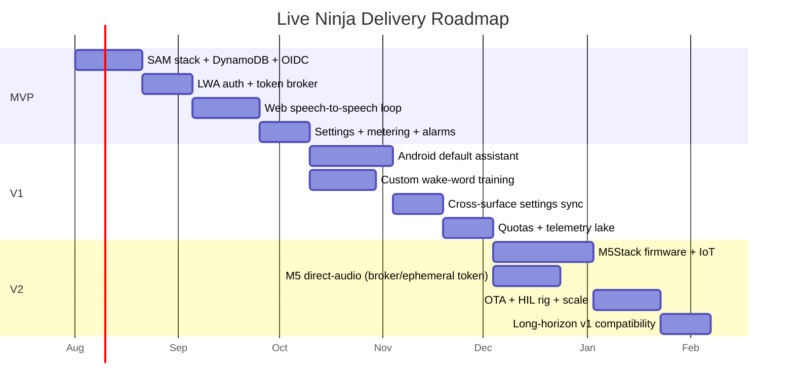
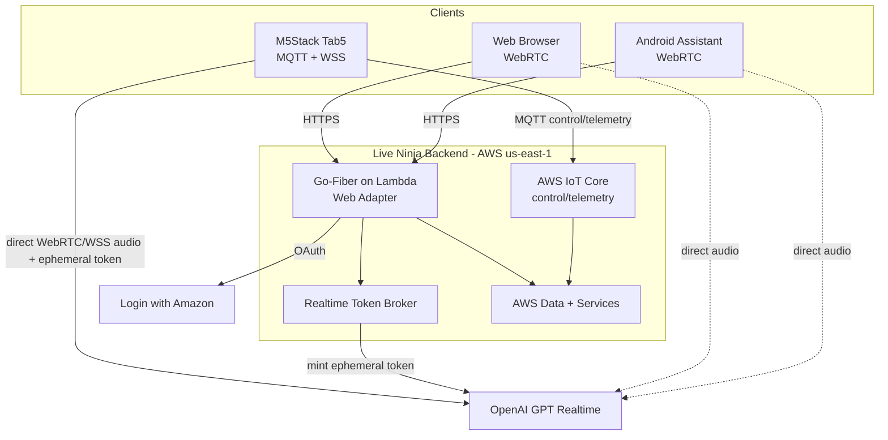
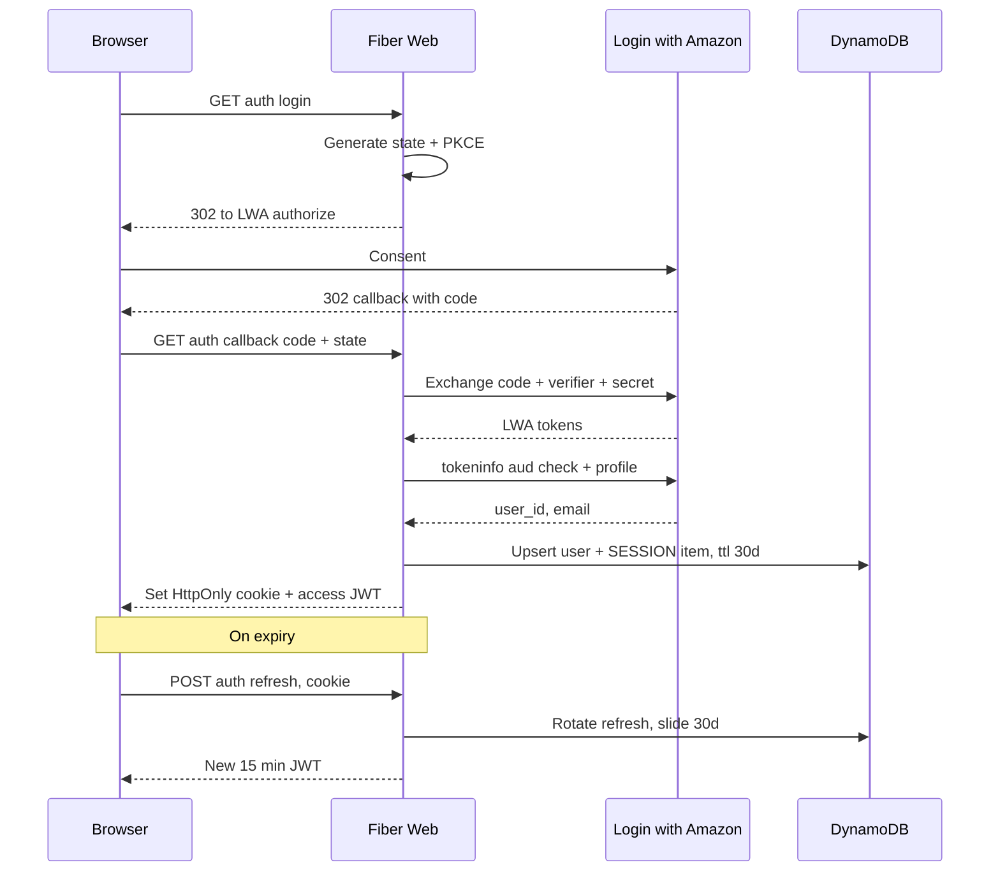
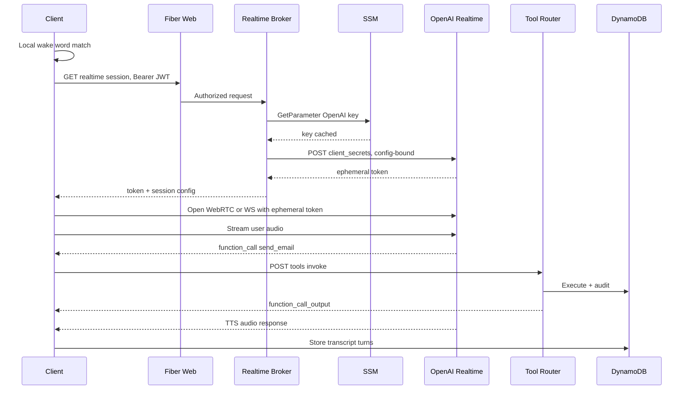
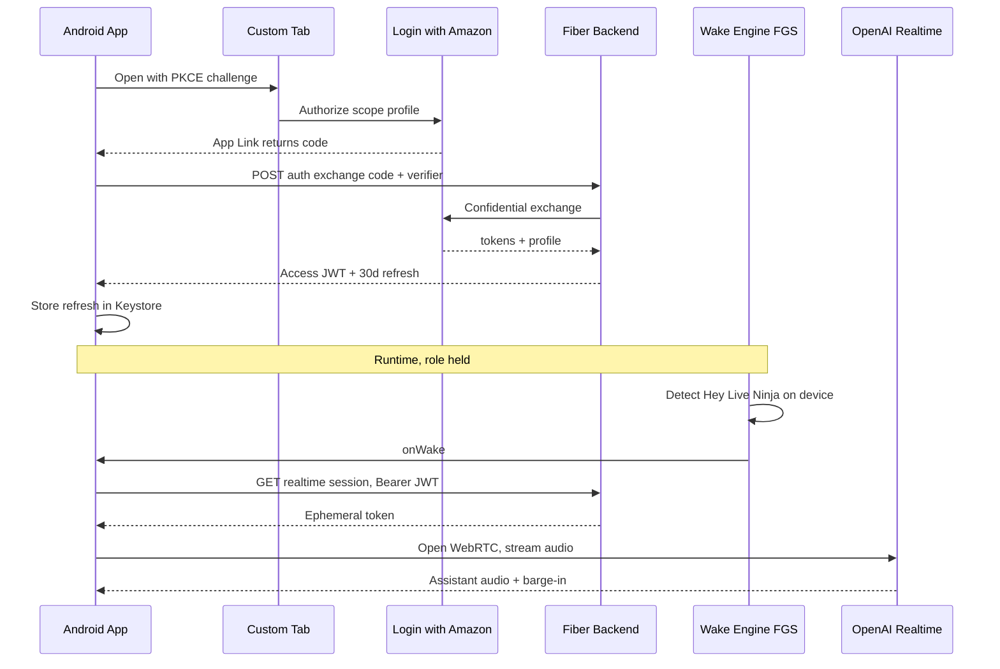
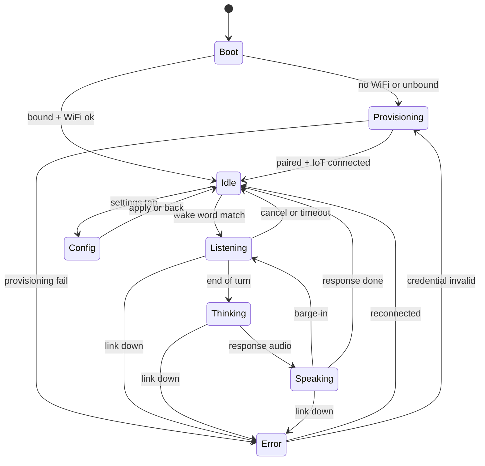
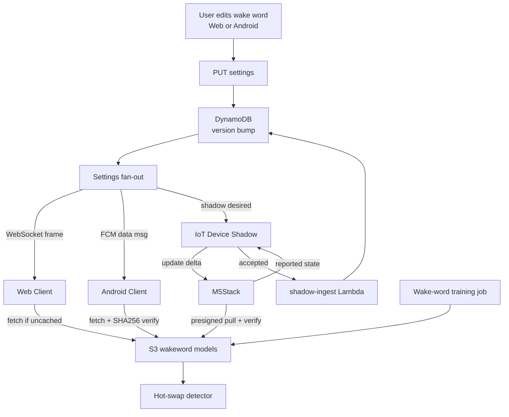

# Live Ninja — Implementation Plan

> **Status:** authoring / not yet started · **Owner:** jeremy · **Repo:** `JeremyProffittOrg/live-ninja`
> **Domain:** `live.jeremy.ninja` · **AWS account:** `759775734231` · **Region:** `us-east-1`
> **Stack:** AWS SAM · Go 1.22 on `provided.al2023` · **arm64/Graviton** · Go-Fiber via Lambda Web Adapter

Live Ninja is one AWS backend serving three LWA-gated client surfaces — a responsive **Web** app, an **Android** primary-assistant app, and an **M5Stack Tab5** embedded terminal — around OpenAI's GPT Realtime speech-to-speech engine. This document is the formal, self-updating implementation plan.

---

## 1. Overview & how to read this plan

This plan is organized into **parallel workstreams** executed by **agentic teams of subagents**, sequenced across **milestones M0–M12** — M0–M8 build the core platform (three surfaces, auth, realtime voice, programmable wake words, hardening, launch), **M9** adds the **Deliverables Store**, **M10** adds the **Memory Layer including Guide Entities**, **M11** conversation topics & filterable history, **M12** a secondary voice engine (Nova Sonic) pinnable per device (**in scope this build**; requires Bedrock Nova Sonic access in `us-east-1`). Each milestone has a **Definition of Done** and an ordered task list. Every milestone and task carries a **status marker** and a **model-routing** annotation. Tasks cross-reference **FR IDs** from the PRD where natural.

> **Locked execution decisions (2026-07-17):** run **autonomously M0→M12** (agentic teams, pausing only on a genuine blocker; each push to `main` is a prod deploy); the **`gha-deploy`** OIDC role is broad enough for all services; **M12 (Nova Sonic) is in scope** (needs Bedrock Nova Sonic model access in `us-east-1`); Android app id **`ninja.jeremy.liveninja`** with freshly-generated debug + release keystores (release key held by the user); app secrets captured via `scripts/setup-live-ninja-secrets.bat` (GitHub secrets → SSM by the deploy workflow). **Access control:** the owner's LWA `user_id` **plus an admin-managed allowlist** — all other Amazon logins are rejected (first sign-in binds the owner). **Default voice:** `cedar` (per-user changeable in Settings). **Credentials:** LWA client id/secret + OpenAI Realtime key are **set** (GitHub secrets/variables); the only remaining external item is **Bedrock Nova Sonic** model access in `us-east-1`, needed just for **M12**.

### 1.1 Status markers (updated in place as work proceeds)

| Marker | Meaning |
|---|---|
| `[ ]` | todo — not started |
| `[~]` | in progress |
| `[x]` | done |
| `[!]` | blocked (note the blocker inline) |

All milestones and tasks below start at `[ ]`.

### 1.2 Model-routing legend

Route each task to the **cheapest capable model** (per the machine-global Sub-Agents & Model Routing policy). If **Fable** is unavailable, promote to **Opus** — never drop to Sonnet.

| Tag | Model | Use for |
|---|---|---|
| **H** | **Haiku** | light / mechanical: scaffolding, boilerplate, config edits, doc stubs, wiring, renames |
| **S** | **Sonnet** | general engineering: handlers, CRUD, UI screens, tests, IaC of moderate complexity |
| **F** | **Fable** | hard reasoning: tricky protocol/state work, wake-word/audio pipelines, concurrency, sync/conflict logic |
| **O** | **Opus** | hardest reasoning / architecture: security-critical auth flows, cross-surface contracts, cost/consistency invariants, threat modeling |

### 1.3 Execution rules (from house style)

- **Built for autonomy.** Every decision, default, and fallback is baked in below; execution runs straight through milestones without check-ins. The only reason to pause is a genuine, un-pre-decided blocker.
- **Verbose implementation notes.** As work proceeds, append detailed notes inline under each task/milestone (decisions, files touched, commands, gotchas) — verbose enough for a fresh agent to resume from the plan alone. See §8.
- **Production-only shop.** No staging. `sam deploy` change-set previewed in logs; local Fiber smoke-test (LWA parity) pre-push; alarms catch regressions fast.
- **Deploy = push to `main`.** No local AWS deploys, no static keys, OIDC only. Secrets set by the user via `scripts/set-secret.sh` / manual `aws ssm put-parameter`; agents never see secret values.

---

## 2. Workstream map

Six workstreams run in parallel wherever dependencies allow. **WS-A (Platform/Infra)** is the critical path that unblocks everything; **WS-B (Auth)** and **WS-C (Realtime)** unblock the three client workstreams (**WS-D/E/F**); **WS-G (Platform Cross-Cut)** threads through all of them.

| WS | Name | Owns | Primary models | Depends on | Runs parallel with |
|---|---|---|---|---|---|
| **WS-A** | Platform & Infra | SAM stack, OIDC pipeline, DynamoDB single-table, SSM, S3, CloudFront/R53, tagging, IoT Core (control/telemetry only) | O (arch), S (IaC), H (config) | — | all (foundation) |
| **WS-B** | Identity & Auth | LWA OAuth (BFF), first-party JWT (KMS ES256) + rotating refresh, device 10-yr flow, authorizer | O (flows/threat), S (handlers) | WS-A (M0) | WS-C |
| **WS-C** | Realtime Voice | Token broker, session config, tool router, fallback cascade, metering gate | O (broker/tools/metering), F (audio), S (tools) | WS-A, WS-B | WS-B |
| **WS-D** | Web Client | Fiber SSR UI, WebRTC-to-OpenAI, transcript/visualizer, settings, PWA/SW, WASM wake word | S (UI), F (realtime.mjs) | WS-B, WS-C | WS-E, WS-F |
| **WS-E** | Android Client | VoiceInteractionService, ROLE_ASSISTANT flow, wake-word FGS, WebRTC, Custom Tabs LWA | F (assistant/wake), S (UI) | WS-B, WS-C | WS-D, WS-F |
| **WS-F** | M5Stack Firmware | ESP-IDF firmware, ESP-SR wake, direct WebRTC/WSS audio to OpenAI + IoT MQTT control/telemetry, device-hosted config/LWA, 10-yr cert, OTA | O (P4/C6 arch), F (audio/wake), S (LVGL UI) | WS-A, WS-B, WS-C broker | WS-D, WS-E |
| **WS-G** | Cross-Cut Platform | Settings schema/sync, wake-word training+distribution, privacy/retention, observability, cost/quota, versioning/compat, testing | O (contracts/quota), F (sync), S (tests) | WS-A | all |

### 2.1 CI/CD pipeline (WS-A)

```mermaid
flowchart LR
    DEV["Push to main"] --> GHA["GitHub Actions"]
    GHA --> CO["Checkout + setup-go"]
    CO --> BUILD["make build<br/>arm64 all funcs"]
    BUILD --> OIDC["Assume gha-deploy role<br/>via OIDC"]
    OIDC --> SB["sam build"]
    SB --> SD["sam deploy<br/>no-confirm-changeset"]
    SD --> CFN["CloudFormation<br/>update stack"]
    CFN --> PROD["Production<br/>Lambda + IoT"]
    PROD --> WATCH["gh run watch<br/>+ CloudWatch alarms"]
```

### 2.2 Delivery roadmap (milestone gantt)

### 2.3 Milestone → workstream matrix

| Milestone | WS-A | WS-B | WS-C | WS-D | WS-E | WS-F | WS-G |
|---|:--:|:--:|:--:|:--:|:--:|:--:|:--:|
| **M0** Bootstrap/Infra | ● | | | | | | ○ |
| **M1** Auth | ○ | ● | | | | | |
| **M2** Realtime backend | | ○ | ● | | | | ○ |
| **M3** Web client | | | ○ | ● | | | ○ |
| **M4** Android client | | ○ | ○ | | ● | | ○ |
| **M5** M5Stack firmware+IoT | ○ | ○ | ○ | | | ● | ○ |
| **M6** Programmable wake + sync | | | | ○ | ○ | ○ | ● |
| **M7** Hardening/observability/cost/privacy | ○ | ○ | ○ | ○ | ○ | ○ | ● |
| **M8** Launch | ● | ○ | ○ | ○ | ○ | ○ | ● |
| **M9** Deliverables Store | ○ | | ● | ○ | ○ | ○ | ○ |
| **M10** Memory Layer + Guide Entities | ○ | ○ | ● | ○ | ○ | ○ | ● |
| **M11** Topics & history filtering | ○ | | ● | ○ | ○ | ○ | ● |
| **M12** Secondary voice engine (Nova Sonic) · optional | ○ | ○ | ● | ○ | ○ | ○ | ○ |

● = lead workstream · ○ = contributing · M9–M10 are v1.1 capability additions layered on the core platform.

---

## 3. Architecture snapshot

**Locked decisions (see research briefs):** Lambda Web Adapter for the Fiber app (not proxy shims); **single-table DynamoDB** (`Query`/`GetItem` only, never `Scan` on a serving path); **ALL surfaces (web, Android, M5Stack) connect DIRECT to OpenAI Realtime** with a **broker-minted ephemeral token; no audio relay**; **SSM Parameter Store SecureString** for secrets (no Secrets Manager); **KMS ES256** JWT signing (private key non-extractable); GitHub Actions + OIDC as the only deploy path; six mandatory cost tags at stack level.

---

## 4. Milestones

> Each task line: `[status]` · **model** · task · _(FR refs / note)_.
> FR IDs reference the PRD's functional requirements; where the PRD numbering is not yet fixed, the bracketed area tag (e.g. `[AUTH]`, `[RT]`, `[WAKE]`) stands in and is reconciled during M0's contract pass.

### M0 — Bootstrap / Infrastructure  `[x]`  (WS-A lead, WS-G support)

**Definition of Done:** An empty-but-real SAM stack deploys to `759775734231` via GitHub Actions + OIDC on push to `main`; the single-table DynamoDB (`live-ninja`) with both GSIs + TTL exists; all SSM parameter *slots* exist (values set out-of-band by the user); S3 buckets, CloudFront + Route 53 for `live.jeremy.ninja`, and the six cost tags are in place; `/healthz` returns 200 through CloudFront; the DynamoDB `ConsumedReadCapacityUnits` alarm and AWS Budgets ($20/$50/$100 on `Project=live-ninja`) are armed. **Cost Allocation Tags `Project`+`CostCenter` activated in Billing (non-retroactive — do early).**

Ordered tasks:
- `[ ]` **O** — Author `template.yaml` skeleton: HTTP API v2 + `web` Fiber Lambda (arm64, LWA layer), per-function least-privilege roles, `authorizer`, `realtime-broker`, `iot-ingest`, `usage-rollup`, `email-dispatch` function stubs wired but minimal. _(§2.1 backend brief)_
- `[ ]` **S** — DynamoDB `live-ninja` table: `pk`/`sk`, **GSI1** (`gsi1pk`/`gsi1sk`), **GSI2** (`gsi2pk`/`gsi2sk`), TTL on `ttl`, PAY_PER_REQUEST, PITR on. _(DynamoDB Data Model diagram)_
- `[ ]` **H** — `samconfig.toml` with stack tags `Project=live-ninja CostCenter=voice-ai Environment=prod ManagedBy=sam DeployedVia=github-actions Owner=jeremy`; arm64 defaults; artifact bucket `vars.CLOUDFORMATION_S3_BUCKET`. _(§12)_
- `[ ]` **H** — `Makefile` build targets: `GOOS=linux GOARCH=arm64 CGO_ENABLED=0 go build -tags lambda.norpc -o bootstrap ./cmd/<fn>` per function.
- `[ ]` **S** — `.github/workflows/deploy.yml` per `deploy.md`: OIDC `role-to-assume: vars.AWS_DEPLOY_ROLE_ARN`, `id-token: write`, `make build` → `sam build` → `sam deploy --no-confirm-changeset --no-fail-on-empty-changeset`.
- `[ ]` **H** — SSM SecureString/String parameter slots: `/live-ninja/prod/openai/api_key`, `/lwa/client_id`, `/lwa/client_secret`, `/session/jwt_signing_key` (or KMS key alias), `/device/cred_pepper`. Values captured via `scripts/setup-live-ninja-secrets.bat` (GitHub secrets) and synced to these SSM params by the deploy workflow. _(§8)_
- `[ ]` **O** — KMS CMKs: `alias/live-ninja-auth` (envelope-encrypt LWA refresh tokens) + `ECC_NIST_P256 SIGN_VERIFY` CMK for first-party JWT signing (private key never leaves KMS). _(Auth brief §2.3)_
- `[ ]` **S** — S3 buckets (block-public, SSE-S3, versioning on assets): `live-ninja-user-<acct>`, `-wakewords-<acct>`, `-assets-<acct>`, `-logs-<acct>`, `-analytics-<acct>`. _(§5 backend)_
- `[ ]` **S** — Edge: CloudFront distro for `live.jeremy.ninja` (ACM `vars.CERTIFICATE_ARN`), Route 53 alias (`vars.HOSTED_ZONE_ID`), cache `/static/*` immutable, pass `/api|/auth` no-cache; security headers (HSTS/CSP/X-CTO/Referrer).
- `[ ]` **H** — Fiber `/healthz` + minimal `internal/config` SSM loader (cached, 5-min TTL) and `internal/observ` slog JSON logger.
- `[ ]` **S** — IoT Core baseline: Thing Type `liveninja-tab5`, Thing Group fleet, provisioning template + claim-cert policy (empty policies scoped for M5). _(§10 backend, §5 M5 brief)_
- `[ ]` **S** — Alarms/Budgets: DynamoDB `ConsumedReadCapacityUnits`/`WriteCapacityUnits`/`ThrottledRequests`; AWS Budgets $20/$50/$100 on tag; `EstimatedCharges` backstop; SNS→SES notify. _(§13)_
- `[ ]` **H** — **User action gate:** document the one-time manual steps (SSM `put-parameter` values; activate Cost Allocation Tags). _(house rule: agents never see secret values)_
- `[ ]` **O** — **Contract freeze (WS-G):** publish the six integration-seam contracts (settings JSON-schema+`version`, shadow doc, wake-word manifest `GET /wakeword/<id>/model?platform=`, telemetry event schema, `X-LN-Client`/`X-LN-Server` headers, metering/quota gate) into `/contracts` and reconcile FR IDs. _(Crosscut §closing)_

### M1 — Auth (LWA BFF + first-party sessions)  `[~]`  (WS-B lead)

**Definition of Done:** All three surfaces can complete Login with Amazon through the backend BFF; the backend mints a first-party **ES256 access JWT (15 min, KMS-signed)** + **opaque rotating refresh token (hash-only in Dynamo, reuse-detected)**; web gets a `__Host-` HttpOnly cookie (30-day sliding), Android gets JWT+refresh (30-day sliding), M5Stack gets the device 10-year credential lineage; the Lambda authorizer validates JWTs against JWKS with a `tokensValidAfter` kill-switch; logout + "log out everywhere" + device revoke all work; a new-sign-in SES alert fires. _(FR `[AUTH]`)_

Ordered tasks:
- `[ ]` **O** — `internal/auth/lwa.go`: authorize URL + PKCE, code exchange at `api.amazon.com/auth/o2/token`, **two-check validation** (`/tokeninfo` `aud == client_id` + `/user/profile`), `user_id` as canonical subject. _(Auth §2.2)_
- `[ ]` **O** — `internal/auth/session.go`: ES256 JWT via `kms:Sign`, JWKS at `/.well-known/jwks.json` (from `kms:GetPublicKey`, 24h cache), claims `iss/sub/aud/sid/did/iat/exp/jti/scope`. _(Auth §2.3)_
- `[ ]` **O** — Rotating refresh token: 256-bit random, SHA-256 hash stored, **`TransactWriteItems` rotate-on-use with reuse detection → family revoke + SES alert**. _(Auth §2.4)_
- `[ ]` **S** — `store/users.go` + `store/sessions.go`: User upsert via GSI1 `LWA#<amazonUserId>`; SESSION item (`refreshHash`, `surface`, `familyId`, `ttl`); GSI1 `SESS#<sessionId>` lookup; GSI2 active-session feed. _(DynamoDB model)_
- `[ ]` **O** — `authorizer` Lambda: verify JWT signature+`exp`+surface against JWKS, reject `iat < user.tokensValidAfter` (60s cached), inject `userId/deviceId/surface` context; public-route bypass. _(§9.3)_
- `[ ]` **S** — Web cookie flow: `/auth/lwa/login` + `/auth/lwa/callback`, `__Host-ln_rt` `Secure;HttpOnly;SameSite=Lax`, access JWT in JSON, OAuth state→verifier in Dynamo (TTL 10 min), CSRF double-submit. _(Web §4)_
- `[ ]` **S** — Android exchange: `POST /api/v1/auth/lwa/exchange {code, code_verifier}` → JWT + 30-day refresh. _(Android §6)_
- `[ ]` **O** — Device 10-yr flow (`internal/auth/device.go`): `PAIR#<nonce>` register, `/auth/device/callback` browser leg, `code_verifier` device-claim binding, `devices/pair` bind + IoT Thing/cert provision, 10-yr refresh family, silent 24h rotation. _(Auth §6, M5 §6)_
- `[ ]` **S** — Revocation surface: `/auth/logout`, "log out everywhere" (`tokensValidAfter=now`), `DELETE /devices/{id}` (revoke family + detach IoT cert). _(Auth §7)_
- `[ ]` **S** — `email-dispatch` + SES templates for `new-device-login`/`security-alert`; enqueue via SQS off request path; `IDEMP#` idempotency. _(§6 backend)_
- `[ ]` **F** — Auth tests: PKCE, `aud` substitution rejection, refresh reuse-detection, `tokensValidAfter` kill within 60s, cookie flags, device claim binding. `dynamodb-local` + mocked LWA. _(Crosscut §7)_

### M2 — Realtime voice backend (broker + tool-calling)  `[~]`  (WS-C lead)

**Definition of Done:** An authenticated client can `GET /api/v1/realtime/session` and receive a **config-bound OpenAI ephemeral token** (~60s) plus the resolved persona/tool manifest; the OpenAI key lives only in SSM read by the broker's isolated role; server-side **tool router** (`POST /api/v1/tools/invoke`) executes tools re-authorized per call with idempotency; the **metering/quota gate** rejects over-cap mints pre-spend; the **fallback cascade** (retry → chained STT→LLM→TTS → text-only) is implemented; all surfaces (web, Android, M5Stack) are served directly by the broker with no audio relay. _(FR `[RT]`)_

Ordered tasks:
- `[ ]` **O** — `realtime-broker` Lambda (isolated IAM: `ssm:GetParameter` one ARN + `kms:Decrypt`): serves **all surfaces (web, Android, M5Stack)** directly — no relay; load persona/tools, mint `POST /v1/realtime/client_secrets` config-bound (`model gpt-realtime`, `voice`, `instructions`, `semantic_vad interrupt_response` so every client does local barge-in against OpenAI, `tools`, `pcm16`). _(§7 backend, Voice §2/§6)_
- `[ ]` **O** — Quota/metering gate at mint: read `USAGE#<month>`+daily counter, per-user token-bucket (1 mint/5s burst 3), soft-cap warn / hard-cap 402/429; write session ledger stub. _(Crosscut §6, Voice §13)_
- `[ ]` **O** — `internal/realtime` session config + persona resolution (clients send persona **ID**, server resolves instructions — anti-injection). _(Web §2.1)_
- `[ ]` **S** — Tool router (`fn-tool-router` / `/api/v1/tools/invoke`): re-authorize LWA user per call, enumerated-arg schemas, idempotency keys; every surface (web, Android, and **device over HTTPS** — `function_call` routed device→backend `POST /v1/tools/invoke`) invokes tools through this one path; tool catalog `send_email` (SES `jeremy@jeremy.ninja` / Reply-To gmail, confirm-before-send external), `set_timer/reminder` (EventBridge Scheduler), `device_control` (owner-scoped MQTT), `get_weather/web_lookup`, `remember/recall_note`. _(Voice §7)_
- `[ ]` **F** — Fallback cascade `fn-fallback-turn`: 2× backoff retry → STT (`gpt-4o-transcribe`)→`gpt-4o-mini`→TTS (`gpt-4o-mini-tts`) → text-only → graceful hard-down (side-effects queued). _(Voice §12)_
- `[ ]` **S** — Transcript sink + usage rollup: all surfaces (web, Android, and device over HTTPS) write `USER#<uid>/LOG#…` turns (TTL 90d), `usage-rollup` hourly EventBridge → daily/monthly rollups (Query only). _(§4, §13 backend)_
- `[ ]` **S** — EMF metrics: `SessionsBrokered`, `EphemeralTokenMintLatency`, `ToolInvocations`, per-surface counts; X-Ray on broker/authorizer/web. _(§13)_
- `[ ]` **F** — Broker/tool tests: mocked OpenAI WS + REST, quota gate pre-spend enforcement, ephemeral-token mint for all surfaces, tool re-authz (incl. device→backend `POST /v1/tools/invoke`), confirm-before-send. _(Crosscut §7)_

### M3 — Web client  `[~]`  (WS-D lead)

**Definition of Done:** `live.jeremy.ninja` serves the Fiber SSR app; unauthenticated users get server-rendered login; authed users get a conversation view with **direct WebRTC to OpenAI**, live transcript, visualizer, barge-in, and click-to-talk; a schema-driven settings page (populated controls, WCAG AA both themes); PWA with network-first HTML service worker; CSP allows only OpenAI + self. Optional WASM wake word (off by default) with guaranteed click-to-talk fallback. _(FR `[WEB]`)_

Ordered tasks:
- `[ ]` **H** — Template structure (`layouts/base`, `partials/nav`+`audio_viz`, `pages/landing|conversation|settings|error`); fingerprinted static asset generator; `no-cache` HTML / `immutable` assets. _(Web §1)_
- `[ ]` **F** — `realtime.mjs`: `RTCPeerConnection`, mic track (AEC/NS/AGC), `oai-events` datachannel, SDP offer→`/v1/realtime/calls` with ephemeral secret, remote audio element. _(Web §2.2)_
- `[ ]` **F** — Barge-in: on `input_audio_buffer.speech_started` stop/attenuate assistant audio + `response.cancel`, flip mic state. _(Web §2.3)_
- `[ ]` **S** — Mic state machine + large primary control (`idle→requesting-mic→connecting→live-listening⇄live-speaking→ending`, `error/denied`); push-to-talk + hands-free. _(Web §2.5)_
- `[ ]` **S** — `transcript.mjs` (text-node incremental render, `role="log"`) + `visualizer.mjs` (`AnalyserNode`→canvas, `aria-hidden`, `prefers-reduced-motion`). _(Web §6)_
- `[ ]` **S** — Settings page (schema-driven, **mandatory agentic design pass first**): wake-word combobox, engine radio, sensitivity slider, persona select, voice radio+preview, turn-detection radio, theme segmented, mic-device select, sign-out/all-devices. _(Web §5.3, machine UI rules)_
- `[ ]` **S** — Tool client dispatch: client-safe tools in-browser; backend tools → `/api/tools/:name` → `function_call_output`. _(Web §2.4)_
- `[ ]` **F** — `wakeword.mjs`: openWakeWord WASM in AudioWorklet (default), Porcupine-web alt behind same interface, lazy-loaded, `unsupported`→click-to-talk. _(Web §3)_
- `[ ]` **S** — PWA: `manifest.webmanifest` + `sw.js` (network-first HTML, SWR assets, never cache `/api|/auth`/OpenAI, versioned cache purge on activate, `skipWaiting`/`clients.claim`). _(Web §8)_
- `[ ]` **S** — Playwright e2e (stubbed LWA + mock OpenAI WS): login, settings CRUD, wake-swap, session bootstrap; Lighthouse + axe WCAG AA. _(Crosscut §7)_

### M4 — Android client (assistant role + wake word)  `[~]`  (WS-E lead)

**Definition of Done:** The app (id `ninja.jeremy.liveninja`; debug + release keystores generated, release key held by user) installs (sideload/internal-testing and Google Play), completes LWA via Custom Tabs+PKCE (30-day sliding session in Keystore), runs its **own programmable wake-word engine** (openWakeWord default / Porcupine optional) in a `microphone` FGS with a persistent notification, acquires `ROLE_ASSISTANT` via the resilient OEM-aware guided flow (and works even without it), and on wake opens a **WebRTC** GPT-Realtime session with AEC-backed barge-in; locked-screen sessions gate sensitive actions behind biometric. _(FR `[AND]`)_

Ordered tasks:
- `[ ]` **H** — Gradle module layout (`:app`, `:core-audio`, `:core-realtime`, `:core-auth`, `:feature-*`, `:service-assistant`), minSdk 29/targetSdk 35, Hilt, Compose M3. _(Android §1)_
- `[ ]` **S** — LWA Custom Tabs + PKCE, `/api/v1/auth/lwa/exchange`, refresh in EncryptedSharedPreferences/Keystore, silent sliding refresh on foreground. _(Android §6)_
- `[ ]` **F** — `WakeWordEngine` interface; openWakeWord default + Porcupine optional (`.ppn` from backend/S3, needs Picovoice key); `AudioRecord` 16kHz + VAD pre-gate. _(Android §3.1)_
- `[ ]` **F** — `WakeWordService` (`foregroundServiceType=microphone`, persistent low-priority notification, BOOT_COMPLETED restart); battery strategy (VAD gate, no continuous wakelock, thermal/battery-saver duty-cycle, <2%/hr target). _(Android §3.2/§3.3)_
- `[ ]` **O** — `VoiceInteractionService`/`SessionService`/`Session` + `RecognitionService`; manifest contract; `RoleManager` request + **OEM-aware settings deep-link fallback walkthrough** + `isRoleHeld` polling; locked-session gating via `requestDismissKeyguard()`. _(Android §2)_
- `[ ]` **F** — WebRTC capture chain (google-webrtc vendored .aar behind `RealtimeTransport`), `MODE_IN_COMMUNICATION`, platform+WebRTC AEC/NS/AGC, ephemeral token from backend. _(Android §4)_
- `[ ]` **F** — Barge-in + playback (server-VAD, `response.cancel`, 30-50ms fade, jitter flush; half-duplex fallback on poor AEC). _(Android §4.3)_
- `[ ]` **S** — Onboarding wizard + Settings + Wake-word management + Live overlay (Compose, populated controls, TalkBack, WCAG AA). _(Android §7)_
- `[ ]` **S** — Permissions choreography + prominent mic disclosure/consent logging; offline/edge behavior. _(Android §5/§8)_
- `[ ]` **S** — Tests: JUnit/Robolectric, Espresso, VoiceInteractionService instrumented, wake-engine FRR@FAR harness gated in CI. _(Crosscut §7)_

### M5 — M5Stack firmware + IoT + on-device config / 10-yr login  `[~]`  (WS-F lead)

**Definition of Done:** A Tab5 boots ESP-IDF firmware, onboards WiFi + Login-with-Amazon via its device-hosted config page, provisions an IoT Thing + on-chip-keypair X.509 cert (10-yr lineage, DS-peripheral-protected), does on-device ESP-SR wake detection, connects DIRECTLY to OpenAI Realtime (WebRTC via esp-webrtc-solution, or WSS+Opus) using a broker-minted ephemeral token, with instant local barge-in, renders the LVGL state-machine UI, syncs settings via device shadow, and updates via signed A/B IoT-Jobs OTA. Device recorded in `c:\dev\fleet\esp32.md`. _(FR `[M5]`)_

Ordered tasks:
- `[ ]` **O** — ESP-IDF v5.4+ project, pinned tag; P4/C6 `esp-hosted` link bring-up, netif/esp-tls/mqtt over hosted transport; task partition (`audio_rx`, `ww_infer`, `net_uplink/downlink`, `lvgl`, `ctrl`). _(M5 §1/§2)_
- `[~]` **F** — Audio path: PDM mic → AFE (AEC/NS/VAD) → ESP-SR WakeNet "Hey Live Ninja" → Opus 16kHz 20ms uplink; downlink Opus decode → I2S with 60-100ms jitter buffer; local instant barge-in (stop DAC + control publish). _(M5 §3/§4)_ — `components/ln_audio` + `components/ln_wake` implemented & building (see §8 M5 notes); remaining: ln_realtime wiring (uplink = `ln_wake_audio_subscribe`, downlink = `ln_audio_play`, barge-in = `ln_audio_play_stop` + control publish). Locked transport is WSS pcm16 (24k down / 16k up), not Opus.
- `[ ]` **S** — IoT Core: Fleet Provisioning by Claiming Certificate, on-chip keypair (DS peripheral), per-device topic policy (`${iot:Connection.Thing.ThingName}`), topic map (`audio/up|down`, `control/up|down`, `telemetry`), classic+`config` shadows. _(M5 §5)_
- `[ ]` **O** — Device-hosted config: SoftAP captive portal (SSID scan-list-select, passphrase keyboard only), STA config page, **LWA PKCE brokered by backend**, bind token returned over IoT `control/down`. _(M5 §6)_
- `[ ]` **O** — 10-yr persistence: X.509 op-cert (10-yr, rotate at yr8), encrypted NVS bind record, flash encryption + Secure Boot v2 + NVS encryption; steady-state 24h mTLS refresh; realtime session: HTTPS to broker for ephemeral token, then direct to OpenAI. _(M5 §6, Auth §6)_
- `[ ]` **F** — `iot-ingest` Lambda: `SELECT * FROM 'liveninja/+/telemetry'` → DynamoDB `DEVICE#` lastSeen/telemetry (PutItem, GSI2 `DEVSEEN#`); IoT Rules for control/telemetry only (no audio). _(§10 backend)_
- `[ ]` **S** — LVGL UI state machine (Idle/Listening/Speaking/Settings/Onboarding/Error), 720p PSRAM framebuffers + PPA dirty-rect, 48-64px targets, list-selects, "N of M", keyboard only for passphrase/name. _(M5 §7)_
- `[ ]` **F** — OTA: A/B partitions, `esp_https_ota`, Secure Boot v2 verify + anti-rollback eFuse, IoT Jobs canary→fleet, mark-valid-after-check-in, coordinated P4↔C6 version gate. _(M5 §8)_
- `[ ]` **S** — HIL rig scaffolding (bench Tab5, PlatformIO CI flash, serial+telemetry MQTT assert); record device in `c:\dev\fleet\esp32.md` (eFuse MAC, role, last COM). _(Crosscut §7, fleet rule)_

### M6 — Programmable wake-word system + settings sync  `[~]`  (WS-G lead)

**Definition of Done:** A user can create a custom wake phrase on Web/Android; a backend training pipeline produces per-platform models to S3 (SHA-256 pinned); the canonical settings doc (`SETTINGS#v<n>`, optimistic-concurrency) syncs across all surfaces via WebSocket/FCM/IoT-shadow with higher-version-wins reconciliation; each client SHA-verifies and hot-swaps wake models; the M5 selects from curated flashable WakeNet + oWW-ESP fallback. _(FR `[WAKE]`, `[SETTINGS]`)_

Ordered tasks:
- `[ ]` **O** — Settings schema + `version` optimistic concurrency (`UpdateItem ConditionExpression`), `GET/PUT /settings`, `?since=<v>` reconcile, forward-compat unknown-field preservation. _(Crosscut §3)_
- `[ ]` **F** — Fan-out: Web WebSocket `settings.updated` frame; Android FCM data-message nudge; IoT `config` shadow desired publish. _(Crosscut §3.2)_
- `[ ]` **F** — `shadow-ingest` Lambda (IoT Rule on `.../shadow/name/config/update/accepted`) → Dynamo version bump; higher-version-wins push-down. _(Crosscut §3.2)_
- `[ ]` **F** — Training pipeline: `wakeword-train` validate (phoneme/profanity/collision), openWakeWord on AWS Batch (arm64, conc≤2, 20-min timeout, ≤3/day/user) → int8 `.onnx`; Porcupine Console API server-side per platform; output to S3, `WAKEWORD#<wwId>` `status=ready`, SES "ready". _(Crosscut §2.2)_
- `[ ]` **S** — Distribution: `GET /wakeword/<wwId>/model?platform=` → presigned/CloudFront-signed URL; catalog snapshot JSON on S3+CloudFront (no live table read on public path). _(Crosscut §2.3, backend §5)_
- `[ ]` **F** — Client hot-swap: Web/Android SHA-256 verify + live swap; M5 curated flashable WakeNet set + oWW-ESP fallback, shadow-driven model ref. _(Crosscut §2.4)_
- `[ ]` **S** — Wake-word management UIs on Web + Android wired to catalog + custom-phrase request flow. _(Web §5.3, Android §7.4)_
- `[ ]` **F** — Contract tests: settings schema round-trip, conflict 409 reconcile, shadow loop, wake manifest + SHA verify across client fixtures. _(Crosscut §7/§8)_

### M7 — Hardening / observability / cost / privacy  `[~]`  (WS-G lead, all WS)

**Definition of Done:** Full observability (structured logs, EMF, X-Ray, `live-ninja-ops` dashboard, Athena telemetry lake); all cost/quota controls enforced pre-spend with anomaly auto-suspend; privacy posture complete (on-device-wake invariant + disclosures, retention TTLs, `DELETE /account`, ZDR requested); WAF rate rules; capability negotiation + `/compat`; load tests confirm `Query`-only under load; security review passed. _(FR `[OBS]`, `[COST]`, `[PRIV]`, `[SEC]`)_

Ordered tasks:
- `[ ]` **S** — Observability: `slog` JSON everywhere (requestId/userId/surface/route/latency, no PII), EMF metrics, X-Ray, `live-ninja-ops` dashboard; 30-day log retention. _(§13 backend, Crosscut §5)_
- `[ ]` **S** — Telemetry lake: `/telemetry` batched+sampled (Web/Android) + M5 MQTT → IoT Rule → Firehose → S3 → Athena; event schema only, no transcript content. _(Crosscut §5)_
- `[ ]` **O** — Cost/quota: pre-spend daily-minute + monthly-token caps, 10-min hard session cap (token TTL + server kill), per-user hourly-burn anomaly auto-suspend + alarm; per-user cost attribution rollups. _(Crosscut §6, Voice §13)_
- `[ ]` **S** — Alarms: Lambda Errors/Throttles/p99, broker mint error rate, HTTP 5xx, SES bounce/complaint, IoT heartbeat-gap, DynamoDB read-runaway; SNS→SES. _(§13)_
- `[ ]` **O** — Privacy: consent records (`CONSENT#`), retention TTLs (transcripts 30d default, audio off), `DELETE /account` Step Functions (Query+BatchWrite, S3 purge, IoT thing/cert delete, LWA revoke, SES confirm), OpenAI ZDR requested + documented. _(Crosscut §4)_
- `[ ]` **S** — WAF rate-based rules on API; per-user concurrent-session + session-rate limits; IoT telemetry throttle. _(Crosscut §6)_
- `[ ]` **S** — Versioning/compat: `/v1` path prefix, `X-LN-Client`/`X-LN-Server` headers, `GET /compat`, below-min "please update" states; content-addressed wake models with safe fallback. _(Crosscut §8)_
- `[ ]` **F** — Load tests (k6/Vegeta + synthetic-session generator): quota/rate limits hold, `ConsumedReadCapacityUnits` flat (no Scan), broker ephemeral-token mint under connection load. _(Crosscut §7)_
- `[ ]` **O** — Security review pass over auth/broker/device/tool paths + threat-model checklist sign-off. _(Auth §9, all risk tables)_

### M8 — Launch  `[ ]`  (WS-A + WS-G lead, all WS)

**Definition of Done:** SES production access granted (out of sandbox); Cost Allocation Tags confirmed active; all three surfaces pass end-to-end smoke on production; distribution channels live (web at `live.jeremy.ninja`, Android signed APK + `assetlinks.json`/in-app updater + Google Play listing, M5 firmware release + fleet provisioning enabled); alarms + budgets confirmed firing to email; runbook + `/v1` long-horizon compatibility commitment documented. _(FR `[LAUNCH]`)_

Ordered tasks:
- `[x]` **H** — Request SES production access; verify DKIM `@jeremy.ninja` identity, bounce/complaint SNS suppression wired. _(§6 backend)_ — production access granted (owner confirmed 2026-07-18).
- `[ ]` **H** — Confirm `Project`+`CostCenter` Cost Allocation Tags active in Billing; budgets alerting. _(§12)_
- `[ ]` **S** — Production end-to-end smoke: web voice turn, Android wake→WebRTC turn+tool call, M5 wake→direct WebRTC/WSS turn+barge-in; verify one line via `gh run watch`. _(§14)_
- `[ ]` **S** — Distribution: web live; Android signed APK + `.well-known/assetlinks.json` + `GET /v1/app/android/latest` updater + Google Play listing (Play signing, data-safety); M5 firmware channel + fleet provisioning claim enabled. _(Android §9, M5 §8)_
- `[ ]` **H** — Runbook + on-call: alarm→action mapping, credential-rotation steps (re-put SSM), device kill-switch, `/v1` compatibility lifetime commitment. _(Crosscut §8)_
- `[ ]` **O** — Launch go/no-go review against every risk table; sign off residual-risk acceptances. _(§7)_

> **v1.1 capability milestones** — layered on the launched core platform (M0–M8). The same deploy law, cost tags, arm64, and no-Scan discipline apply.

### M9 — Deliverables Store  `[~]`  (WS-C lead, WS-D/E/F support)

**Definition of Done:** the assistant can create/zip/deliver files via tools; deliverables persist per-user on S3, are indexed in DynamoDB (Query-only), and appear identically in the web Download Center and Android Files tab; downloads use short-lived presigned URLs; optional SES delivery works. _(FR-DLV-01..06)_

Ordered tasks:
- `[ ]` **S** — S3 deliverables bucket + lifecycle + SSE/KMS; SAM + cost tags. _(FR-DLV-01/06)_
- `[ ]` **S** — DynamoDB deliverable items (`PK=USER# SK=DELIV#`) + GSI; Query access patterns. _(FR-DLV-04)_
- `[ ]` **F** — Generator + Zipper Lambda (Go, arm64); streaming ZIP. _(FR-DLV-01/02)_
- `[ ]` **F** — `deliverable.create/zip/deliver` tools wired into the realtime tool router. _(FR-DLV-01..03)_
- `[ ]` **S** — Web Download Center (sortable table, share/delete, empty/loading/error states). _(FR-DLV-05)_
- `[ ]` **S** — Android Files tab (list + multi-select zip/share). _(FR-DLV-05)_
- `[ ]` **S** — SES delivery channel + presigned-URL authz by `userId` prefix. _(FR-DLV-03/06)_
- `[ ]` **H** — Tests: unit + e2e (create→zip→deliver→download on web + app).

### M10 — Memory Layer + Guide Entities  `[~]`  (WS-C + WS-G lead, all surfaces support)

**Definition of Done:** DynamoDB entity/relationship graph stores people/places/information/projects/tasks/plans; S3 Vectors provides semantic recall; `memory.*`/`plan.upsert` tools + session bootstrap integrate with GPT-Realtime; Guide Entities inject into every session on every surface; a memory/guide browser allows view/edit/forget with propagation to both stores; optional local-RAG sidecar can be enabled with graceful fallback. _(FR-MEM-01..09)_

Ordered tasks:
- `[ ]` **O** — Entity + relationship data model in DynamoDB (people/places/info/projects/tasks/plans). _(FR-MEM-01)_
- `[ ]` **F** — Embedder Lambda + S3 Vectors index (verify GA/region `us-east-1`). _(FR-MEM-02)_
- `[ ]` **F** — Memory Router Lambda: structured (DynamoDB) vs semantic (vector) routing. _(FR-MEM-01/02)_
- `[ ]` **F** — Tools `memory.search/write`, `entity.get`, `plan.upsert`; session-bootstrap retrieval primes the persona. _(FR-MEM-04)_
- `[ ]` **O** — Optional local-RAG sidecar (LanceDB/sqlite-vec) + secure bridge + graceful fallback to S3 Vectors. _(FR-MEM-03)_
- `[ ]` **S** — Memory browser UI (web/app): view/edit/forget; forget propagates to DynamoDB + vector index. _(FR-MEM-05)_
- `[ ]` **S** — Privacy: retention TTLs, export-as-Deliverable, redaction; no silent capture. _(FR-MEM-05, Crosscut §4)_
- `[ ]` **S** — Guide Entity type in DynamoDB (`GUIDE#`) + versioning + device/IoT-shadow sync. _(FR-MEM-07)_
- `[ ]` **F** — Always-inject enabled guides into session-bootstrap system instructions on all surfaces. _(FR-MEM-07)_
- `[ ]` **F** — Recency-filtered web-search/research tool (default 30d) + authoritative-source allow-list (Anthropic/OpenAI); cite source dates. _(FR-MEM-08)_
- `[ ]` **S** — Guide Manager UI (web/app): list, edit, enable/disable, priority; seed default "AI is an emerging technology" guide. _(FR-MEM-09)_
- `[ ]` **H** — Tests: recall-quality eval, forget propagation, guide always-injection, sidecar on/off.

### M11 — Conversation Topics & Filterable History  `[~]`  (WS-C + WS-G lead, WS-D/E support)

**Definition of Done:** every finished conversation is auto-tagged with topics by a cheap engine-agnostic post-session model; a per-user evolving/redefinable topic taxonomy (create/rename/merge/split/color/archive, stable IDs) exists; history is filterable by topic/device/date via Query/GSIs (no Scan); Topic Manager + history filter UIs shipped on web/app. _(FR-TOP-01..07)_

Ordered tasks:
- `[ ]` **S** — Topic taxonomy storage: Topic items (`SK=TOPIC#`) + Conversation items (`SK=CONV#{ts}#`, with deviceId/engine/topicIds) + filtering GSIs (GSI3 by topic, GSI4 by device); Query-only access. _(FR-TOP-02/03/04)_
- `[ ]` **F** — Post-session topic-extraction Lambda: cheap engine-agnostic text model reads the transcript, maps to existing topics, proposes new ones; triggered on session end. _(FR-TOP-01)_
- `[ ]` **S** — Conversation record writer: persist transcript to S3, write CONV# item with deviceId/engine/duration/topicIds. _(FR-TOP-03)_
- `[ ]` **S** — History filter API: `GET /v1/conversations` (topic/device/from/to) via GSI queries + FilterExpression (no Scan); `GET /v1/conversations/{id}`. _(FR-TOP-04)_
- `[ ]` **S** — Topic Manager UI + history filter UI (web/app): topic multi-select (populated, no blind text box), device picker, date-range picker; create/rename/merge/split/color/archive topics. _(FR-TOP-05)_
- `[ ]` **F** — Optional live `tag_topics` tool in the realtime session config for provisional on-screen topic hints (post-processor stays canonical). _(FR-TOP-06)_
- `[ ]` **S** — Background re-clustering job: suggest merges of near-duplicate topics. _(FR-TOP-07)_
- `[ ]` **H** — Tests: extraction→tag→filter (topic/device/date, combos) prove no Scan; rename/merge keep tags stable.

### M12 — Secondary Voice Engine (Nova Sonic)  `[~]`  (WS-C lead, WS-D/E/F support)

> **In scope this build.** Requires Bedrock Nova Sonic model access in `us-east-1`. Reintroduces a backend media bridge **only for Nova-pinned devices**; OpenAI-pinned devices stay client-direct.

**Definition of Done:** a device can be pinned to `nova-sonic`; audio for pinned devices flows device⇄backend-bridge⇄Bedrock Nova Sonic; the engine is abstracted so topics/memory/tools work identically; OpenAI-pinned devices are unchanged (client-direct). _(FR-VE-01..04)_

Ordered tasks:
- `[ ]` **O** — Voice-engine abstraction: common session/tool/transcript event schema; normalize OpenAI Realtime and Nova Sonic events to it. _(FR-VE-01)_
- `[ ]` **F** — Nova Sonic backend bridge: Bedrock bidirectional streaming (HTTP/2 + SigV4) service holding the session; device⇄bridge WebSocket audio; barge-in/VAD parity. _(FR-VE-02)_
- `[ ]` **S** — Per-device `voiceEngine` pin (openai-realtime|openai-realtime-mini|nova-sonic) in settings/Device; session bootstrap returns ephemeral token (direct) OR bridge WS URL. _(FR-VE-03)_
- `[ ]` **S** — Client dual-path: direct WebRTC (OpenAI) vs backend-bridged WSS (Nova) on web/Android; M5Stack uses the bridge WSS when Nova-pinned. _(FR-VE-02/03)_
- `[ ]` **S** — Settings UI: per-device engine picker (segmented/list) with the cost/tradeoff note. _(FR-VE-04)_
- `[ ]` **H** — Tests: pin a device to nova-sonic (bridge path), another to openai (direct); topics/tools/memory identical across engines.

---

## 5. Environments & deploy

- **Production-only.** No staging/dev. Every push to `main` is a production deploy. Verify before pushing; no destructive surprises.
- **Deploy path (only allowed one):** push/merge to `main` → GitHub Actions assumes `vars.AWS_DEPLOY_ROLE_ARN` via **OIDC** (`id-token: write`, no static keys) → `make build` (arm64) → `sam build` → `sam deploy --no-confirm-changeset --no-fail-on-empty-changeset`. No local `aws`/`sam deploy`/`sam sync`. If a deploy need has no pipeline, build the pipeline — never deploy by hand.
- **arm64 everywhere.** All Lambdas `provided.al2023`, `Architectures: [arm64]`, built `GOOS=linux GOARCH=arm64 CGO_ENABLED=0 -tags lambda.norpc -o bootstrap`. Flip architecture and build step together (never `Architectures:` alone).
- **Cost tags (stack-level, once, in `samconfig.toml`):** `Project=live-ninja CostCenter=voice-ai Environment=prod ManagedBy=sam DeployedVia=github-actions Owner=jeremy`. Activate `Project`+`CostCenter` as Cost Allocation Tags in Billing at M0 (non-retroactive).
- **Secrets:** SSM Parameter Store SecureString + KMS only — **no Secrets Manager/Vault**. Agents never see values; the user sets them via `scripts/set-secret.sh` (GitHub) / manual `aws ssm put-parameter` (SSM). Workflow reads only ARNs from `vars`. Broker holds the sole `ssm:GetParameter` on the OpenAI key ARN.
- **DynamoDB discipline:** `Query`/`GetItem` only on every serving path; `Scan` reserved for manual one-off migrations. Read-mostly catalogs served from S3/CloudFront snapshots. `ConsumedReadCapacityUnits` alarm armed.
- **GitHub Actions monitoring:** summarize `gh run watch` to one line; show detail only on failure.

---

## 6. Testing & verification strategy per milestone

| Milestone | Verification (definition-of-done gate) |
|---|---|
| **M0** | `sam deploy` succeeds via OIDC; `/healthz` 200 through CloudFront; table+GSIs+TTL present; buckets/edge exist; alarms+budgets armed; tags active. Local Fiber smoke (`:8080`) parity. |
| **M1** | `dynamodb-local` + mocked LWA: PKCE happy-path all surfaces; `aud`-substitution + refresh-reuse rejected; `tokensValidAfter` kill ≤60s; cookie flags correct; device-claim binding; new-sign-in SES fires (mock). |
| **M2** | Mocked OpenAI REST/WS: config-bound ephemeral mint; broker ephemeral-token mint under load; quota gate rejects over-cap **pre-spend**; tool router re-authz + confirm-before-send + idempotency (incl. device→backend `POST /v1/tools/invoke`); fallback cascade degrades correctly. |
| **M3** | Playwright (stub LWA, mock OpenAI WS): login → conversation bootstrap, barge-in cut-through, transcript render, settings CRUD, wake-swap, click-to-talk fallback; Lighthouse + axe WCAG AA both themes; SW network-first HTML verified (no stale HTML). |
| **M4** | Robolectric/Espresso + instrumented VoiceInteractionService; wake-engine FRR@FAR corpus gated in CI (fail on regression); role-flow fallback across `Build.MANUFACTURER`; battery <2%/hr screen-off measured; barge-in AEC on-device. |
| **M5** | HIL rig: CI flashes bench Tab5 (PlatformIO), speaker plays positive/negative corpus, assert wake on `telemetry`; provisioning issues cert (key on-chip); device direct WebRTC/WSS turn + barge-in; OTA canary→mark-valid→rollback-on-fail; shadow sync loop. |
| **M6** | Contract tests: settings schema round-trip + 409 reconcile; shadow accepted→Dynamo bump; wake manifest + SHA-256 verify across all-client fixtures; training job cost-bounded (conc≤2, timeout, ≤3/day). |
| **M7** | k6/Vegeta load: `ConsumedReadCapacityUnits` flat (proves no Scan), quota/rate limits hold, broker ephemeral-token mint under load; `DELETE /account` purges all partitions (Query+BatchWrite); security-review checklist signed. |
| **M8** | Production end-to-end smoke on all three surfaces; alarms/budgets confirmed emailing; SES out of sandbox; distribution channels reachable; go/no-go against risk tables. |
| **M9** | Deliverables e2e: `create`→`zip`→`deliver`; presigned GET authz by `userId` prefix; Download Center + Files tab list via Query (no Scan); SES delivery. |
| **M10** | Memory: entity-graph CRUD by keys/GSI (no Scan); S3 Vectors recall eval; `memory.*`/`plan.upsert` tools; session-bootstrap injects guides on all surfaces; forget propagates to Dynamo+vectors; local-RAG on/off fallback. |
| **M11** | Extraction + tagging on session end; filter-by-topic/device/date (and combos) via GSI queries proves no Scan; taxonomy rename/merge keeps existing tags stable. |
| **M12** | Per-device engine pin routes correctly (Nova→bridge path, OpenAI→direct); Nova bridge round-trip audio + barge-in; cross-engine tool/transcript parity. |

Cross-cutting gates (all milestones): `golangci-lint` + `go vet` clean; unit tests `testify` table-driven; JSON-schema/contract validation in CI; deploy job gated on tests; every new UI form runs the **mandatory multi-persona design pass** before code.

---

## 7. Risks & mitigations (execution / sequencing)

| # | Execution risk | Mitigation (baked in) |
|---|---|---|
| 1 | **WS-A slips → everything blocks.** M0 is the critical path for all six workstreams. | Staff M0 with Opus+Sonnet; keep it minimal-but-real (deploy an empty stack day one). Contract freeze at M0 lets WS-B..G design against stable seams before infra is 100%. |
| 2 | **Shared contracts drift between surfaces** built in parallel (settings/shadow/wake-manifest/headers/quota). | Six contracts frozen in `/contracts` at M0 (WS-G, Opus); CI validates every client fixture against them; additive-only within `/v1`. |
| 3 | **M5 firmware must sustain a direct WebRTC/WSS+TLS Realtime session on the ESP32-P4.** | Use Espressif esp-webrtc-solution (proven on ESP32-S3/P4), WSS+Opus fallback, front-load the audio path on the HIL rig; the broker serves all surfaces so there is no bespoke relay to build. |
| 4 | **Auth (M1) is on the critical path for M2–M5** and is the hardest/riskiest. | Opus-led; ES256+KMS + rotating-refresh machinery is shared identically across surfaces — build once in M1, reuse. Threat-model checklist gates M1 done. |
| 5 | **Production-only, no staging** — a bad deploy hits users. | Change-set previewed in CI logs; local Fiber LWA-parity smoke pre-push; feature flags via capability negotiation; alarms + fast SES alerting; additive-only API changes; canary IoT-Jobs for firmware. |
| 6 | **M5 firmware (M5) is long, hardware-gated, and last** — schedule tail risk. | Sequenced to V2 after web/Android prove the loop; HIL rig scaffolded early (M5 task); P4/C6 `esp-hosted` link is task-1 risk-front-loaded; device recorded in fleet registry. |
| 7 | **Wake-word training cost/latency** (M6) could blow up or stall. | AWS Batch arm64 conc≤2, 20-min timeout, ≤3/day/user; openWakeWord (free) as default engine so never blocked on Picovoice seats; async, off request path. |
| 8 | **Model-routing mis-assignment** wastes budget or under-powers hard tasks. | Routing column on every task; security/auth/contracts/architecture → Opus; audio/wake/sync → Fable (→Opus if unavailable, never Sonnet); mechanical → Haiku. |
| 9 | **Cross-surface settings-sync conflicts** (3 writers) corrupt state. | Monotonic `version` + `ConditionExpression` optimistic concurrency; Dynamo source of truth; IoT shadow transport for M5; higher-version-wins; contract tests for 409 reconcile in M6. |
| 10 | **DynamoDB Scan sneaks onto a serving path** during parallel dev. | "No Scan" is a review red flag; `ConsumedReadCapacityUnits` alarm from M0; load test in M7 proves flat read units; catalogs from S3 snapshots. |
| 11 | **Subagent stall/timeout** during autonomous execution. | Per house policy: 6-min inactivity / 30-min completion timeouts, auto-retry ≤2 (3 total), incorporate partial output on retry, escalate to user after 2 failed restarts. |
| 12 | **Long-lived M5 devices outrun API changes** (10-yr field life). | `/v1` kept alive for field lifetime; capability negotiation + `/compat`; forward-compatible settings schema (unknown fields preserved); signed IoT-Jobs OTA. |

---

## 8. Implementation Notes

> **RESUME STATE — checkpoint 2026-07-18 ~04:30 EDT. Working tree CLEAN. HEAD `fe2dc8b`. Prod healthz 200. Pipeline green. Read this whole block before acting.**
>
> **All 13 milestones (M0–M12) are code-complete, committed, and deployed** (M12 Nova Sonic is deployed but *gated off* — see below). The bulk build ran M0–M12 autonomously overnight via parallel `Workflow` runs; the last several hours were interactive prod bug-fixing from the owner's live testing. `git log --oneline` is the source of truth for what landed.
>
> **Prod-VERIFIED in a real browser / on real hardware (owner is bound as OWNER, `amzn1.account.AEGRRHCM6JMXBTAYH5HY5GW6LK5Q`):**
> - Web: LWA sign-in, `/conversation` (voice mint returns a valid ephemeral token — the `turn_detection`→`session.audio.input` fix), `/settings` (toggle layout fixed), wake-word engine init (ORT WASM served from S3/CloudFront — see wasm note), persona/voice pickers, the voice-activity visualizer (animated wave while listening/speaking; verified by manual draw-step since the automation tab backgrounds rAF).
> - Backend: 79+ Go tests green; `X-LN-Txn` transaction-id header + verbose request/response logging live; canonical error envelope `{error:{code,message,txId}}`; hover-for-details error banner.
> - **Tab5 firmware (COM58, MAC `30:ED:A0:E3:01:1E`)**: SoftAP setup-portal rework HIL-verified over this PC's WiFi — `/api/scan` async-cached (fixed the "can't access the AP site" hang), AP/STA main-page choice, subnet select (192.168.4↔10.0.0, live re-IP confirmed end-to-end), status polling. QR-on-LCD verified on the physical screen (owner eyeballed it, 2026-07-18).
>
> **Committed, NOT yet e2e/device-verified:** M4 Android (`e49b188` + later; assembleDebug + 46 unit tests green, never run on a device/emulator); M5 device pairing + realtime voice turn + IoT provisioning + OTA (firmware builds/boots/serves portal, but backend `IOT_DATA_ENDPOINT`/claim-cert path and a real wake→voice turn are unproven); M6 wake-word *training* (batch:ListJobs 403 fixed, but a full train→model→hot-swap run was never completed); M9/M10/M11 tools exist and deploy but weren't exercised with real data.
>
> **DISABLED — M12 Nova Sonic (`NovaBridgeEnable=false`, default):** the whole Fargate/ALB/CloudFront-`/nova/*` subsystem is gated off in `template.yaml`; the code is all committed and builds (bridge cross-compiles arm64). It was disabled to unblock the stack after a wedged deploy (an orphaned `live-ninja-nova-bridge` ECR repo from a rolled-back deploy failed AWS EarlyValidation on every changeset). **To re-enable:** delete no orphans (already clean), set `NovaBridgeEnable=true` + `NovaBridgeImageReady` handling in `deploy.yml`, ensure the nova ECR repo + image bootstrap works (two-phase: repo/ALB first, image push, then `NovaBridgeReady=true` creates the ECS service). Do this in an ISOLATED deploy and watch closely. Bedrock `amazon.nova-sonic-v1:0` is confirmed available in us-east-1.
>
> **REMAINING WORK (priority order):**
> 1. **[SECURITY, blocks device launch] Task: device-pairing user_code binding (RFC 8628).** Pairing has no anti-phishing user-code — an allowlisted attacker can phish a victim into binding a 10-yr device credential to the victim's account. Not exploitable today (no device onboarded). Full exploit + fix design in the §M7 security notes. Must land before any Tab5 ships. Needs firmware (show code on LCD/portal) + backend (require code match in the claim leg).
> 2. **Re-enable M12 Nova Sonic** in an isolated deploy (see DISABLED above).
> 3. **M8 launch pass:** ~~request SES production access~~ (DONE — owner confirmed SES is out of sandbox, 2026-07-18); confirm the SNS ops-topic email subscription (owner must click the confirm link — still pending); Android Play listing + `assetlinks.json` + signed release APK (release keystore is at `C:\dev\live-ninja-keys\release.keystore`, held by owner); M5 firmware release channel; runbook; go/no-go.
> 4. **Full 3-surface prod smoke** incl. the two HIL tests below.
> 5. Minor: PWA manifest icon `/static/icons/ninja.svg` doesn't parse as an image (cosmetic warning); wire it or swap to PNG.
>
> **HIL tests still owed (need the physical Tab5 on COM58 + this PC):**
> - **Bidirectional audio (owner 2026-07-17):** PC has **Realtek** (normal speaker — leave alone) and a **"USB Audio" speaker for testing**. (a) PC→Tab5: play the wake phrase + a query out the USB Audio speaker; assert wake + realtime turn on the Tab5 (serial COM58 / IoT telemetry). (b) Tab5→PC: have the Tab5 speak; record on the PC mic and verify. Fold into M5 DoD + M8 smoke.
> - **Real portal onboarding:** over the Tab5 SoftAP, drive the real portal end-to-end (join a real WiFi, complete backend pairing). Joining the AP from the PC WiFi is fine (PC has ethernet for internet); disconnect + `netsh wlan delete profile name=LiveNinja-Setup` after.
>
> **Ops / gotchas a fresh agent MUST know:**
> - **Deploy = push to `main`** (OIDC, no local deploys). Deploys serialize on the `deploy-main` concurrency group. Org OIDC trust already fixed for ID-qualified subs (in the `credential-rotation` repo).
> - **`gha-deploy` uses no static keys.** The org OIDC role trusts `repo:JeremyProffittOrg@299835367/*`.
> - **Flashing the Tab5 (Git-Bash):** `export.bat` aborts if `MSYSTEM` is defined. Use a `.bat` that does `set "MSYSTEM="` **then** `set IDF_PYTHON_ENV_PATH=%USERPROFILE%\.espressif\python_env\idf5.4_py3.13_env` **then** `call C:\esp\esp-idf-v5.4.4\export.bat` **then** `idf.py -p COM58 flash`. (Recorded in `c:\dev\fleet\esp32.md`.) Serial console: native USB CDC on COM58, 115200.
> - **Oversized static (ORT WASM ~11 MB + wake ONNX models) are served from S3, NOT Lambda** — Lambda's ~6 MB response cap 500'd them. `deploy.yml` `aws s3 sync`s `web/static/vendor` + `web/static/models` to `live-ninja-assets-759775734231`; CloudFront `/static/vendor/*` + `/static/models/*` behaviors point at an S3 origin (OAC). The files are ALSO go:embed'd (local-dev fallback).
> - **Log groups are custom-named** `/live-ninja/lambda/<fn>` (LoggingConfig set on each fn), 5-day retention. NOT `/aws/lambda/...`.
> - **SES from `Jeremy Proffitt <jeremy@jeremy.ninja>` Reply-To `proffitt.jeremy@gmail.com`** (jeremy.ninja has DKIM; never send *from* the gmail). Hourly build-status emails were an autonomous-run thing; not running now.
> - Quota mint token bucket loosened to capacity 6 / refill 1 per 3s for the single owner.
> - Security fixes already landed (with tests): SSRF-via-redirect in `web_research` (per-hop allow-list), `send_email` external-recipient allow-list gate, OAuth login-CSRF state cookie.
>
> **Task list (harness TaskList) mirrors this**; open items: #13 (Nova re-enable), #15 (HIL audio), #16/#17 (Playwright web + Tab5 portal), #18 (device user_code security), #19 (already done — wasm S3, can close), M8 launch. Milestones M1–M12 are `[~]` (code-complete, verification-gated) except M0 `[x]`.

> **2026-07-18 ~05:30–06:30 EDT — prod bug-fix session (owner live-testing, "listening simply doesn't work"):**
> - **ROOT CAUSE of dead listening: leaked concurrent-session slots.** Every mint writes `BUCKET#sess#<sid>` with `exp = now+600s` (10-min hard cap) and NOTHING ever released it — web sessions ended by reload/tab-close/End never told the backend, so 3 leaked slots → every subsequent mint 429 `rate_limited` ("Concurrent session limit (3) reached", confirmed in broker logs) for up to 10 minutes. Fixes: `store.ReleaseSessionSlot` (DeleteItem, idempotent) called from `handleTranscript` when `final:true`; transcriptsink.mjs now actually SENDS `final:true` (it never did — which also meant M11 topic extraction NEVER fired from web) on session `closed`/`connectionlost`/`ending` and on `pagehide` (not on visibilitychange-hidden — a backgrounded tab keeps its session).
> - **User speech was never transcribed**: session config lacked `audio.input.transcription` — added `gpt-4o-mini-transcribe` (mint.go). Typed-turn-over-datachannel path was verified working in prod (session/WebRTC/tools fine; the deficit was uplink display + slot exhaustion).
> - **Wake word "says Hey Jarvis"**: the web engine always fell back to the bundled hey-jarvis model because (a) `hey-live-ninja` was a PHANTOM builtin server-side — no client ships it, and `collidesWithBuiltin` blocked ever training it; (b) the client manifest parser expected a 3-model `models{}` shape while the server serves a single-detector manifest; (c) CSP `connect-src` blocked the presigned S3 model fetch. Fixed all three: builtinEntries now reserves `hey-jarvis` (the actually-bundled model) and frees "hey live ninja" for training; `Model()` resolves a bare slug id (settings' `hey-live-ninja`) to the user's trained item by phrase-slug match and the manifest now carries `phrase`; wakeword.mjs accepts the single-detector manifest (pairs served detector with bundled phrase-independent mel+embedding); CSP allows the wakewords bucket. **Next: POST /api/v1/wakeword {"phrase":"Hey Live Ninja"} as owner → Batch trains → settings' hey-live-ninja resolves.**
> - **Visualizer was fake** (always-on idle wave) — replaced with a real scrolling volume line graph (time-domain RMS of the active source; flat line = genuinely no audio; reduced-motion → slow discrete meter). Same public API, conversation.mjs unchanged. **Prod-verified in-browser** (baseline + live line while listening; note the module URLs are stable so the SW serves the old file once — second reload picks up new JS).
> - **Post-deploy browser verification (2026-07-18 ~06:15):** mint no longer 429s (slot fix live), session reaches Listening cleanly. Settings "Train your own phrase" had ANOTHER blocker: the client-side collision check rejected "Hey Live Ninja" because the static catalog lists it (modelAvailable.web=false) — relaxed to block only phrases with a working bundled/custom model (`b422922`). The user's earlier "okay live ninja" training attempt shows Failed (that was the pre-fix batch:ListJobs 403 — retrainable now). **"Hey Live Ninja" training submitted — first real run of the M6 training pipeline — and it instantly exposed the pipeline's own bug:** `SubmitJob` passed env vars (WW_ID/WW_PHRASE/...) the trainer never reads, while `train.py` argparse-requires `--phrase/--ww-id/--user-id` → every job ever submitted (incl. the user's "okay live ninja") died with exit 2 before doing any work. Fixed (`111ffa4`): args passed via `ContainerOverrides.Command` (image ENTRYPOINT is `python train.py`). Run 2 (`7fe96753`) then died on missing `libgomp.so.1` — python:slim doesn't ship the OpenMP runtime torch's aarch64 wheels dlopen; fixed by adding `libgomp1` to the Dockerfile (`de0fed5`, CI rebuilt the image). The three system-bug failures consumed the 3/day training quota, so the `WWTRAIN#2026-07-18` counter item was deleted (one-off admin write). **Run 3 (`c3691672`) SUCCEEDED — "Hey Live Ninja" model is trained and in S3.** Final blockers found while verifying: wakeword.mjs fetched the JWT-gated manifest with a cookie-only fetch → always 403 → silent hey-jarvis fallback; fixed to authFetch (`adf4ece`). Then the service's manifest reader expected flat key/sha256 fields while the trainer writes a `files{onnx{...}}` map → 500 "sha256 malformed"; reader now promotes files.onnx (`ecde33b`). **VERIFIED IN PROD: the conversation page's hands-free phrase now reads "hey live ninja" — trained model manifest→presigned S3→SHA-verify→hot-load, end to end.**
>
> **2026-07-18 ~07:00-07:20 EDT — owner live-testing wave 2 (`f56cdb7` + `ecde33b`):**
> - **Transcript never auto-scrolled**: the stick-to-bottom logic unpinned itself — its own smooth-scroll animation's scroll events read as the user scrolling away. Guarded with a programmatic-scroll window.
> - New conversation-page top bar: "Show tool calls" toggle (localStorage) + "New conversation" button (ends session → final flush → History; clears view). Tool-activity 🛠 badge pulses upper-left of the orb during calls.
> - **Settings voice was NEVER applied at mint** (client sends no param; server never read the doc — logs showed voice=cedar with Ballad selected). handleRealtimeSession now resolves voice/persona/micEagerness from the settings doc. New "Mic pickup" setting (auto/low/medium/high → semantic VAD `eagerness`) through schema/validation/UI/broker/mint.
> - **"Save a file" could never work**: deliverable_create/zip/deliver were in the tool ROUTER but never declared in the broker's session toolManifest — the model didn't know they existed. Added and **VERIFIED e2e in prod** (typed request in a live session → deliverable_create tool card Done → deploy-test.md in /downloads with working actions). Known limitation: a typed message with NO live session goes through the text-only fallback turn, which has no tools and says "I can't create files" — tool use requires an active session (fallback tool-calling is a candidate follow-up).
> - **History was empty** because web never sent final:true (fixed earlier today) — backfilled by invoking topics-extract for the 20 pre-fix sessions; /history now shows the owner's conversation (7 turns, 3 auto-topics). Topic extraction verified working end to end.
> - **Tab5 WiFi join "stall": the router REJECTED the password** (AUTH_FAIL reason 202, serial-captured during the owner's live retry) — but the onboarding screen never surfaced disconnect failures, so it sat on "Connecting…" forever. WIFI_DISCONNECTED now writes actionable copy to the onboarding footer. Password view reworked to the owner's spec (Back / centered title / eye-icon show-hide / centered Connect / quarter-height keyboard). If the password was actually correct, next suspect is WPA3-SAE negotiation on the C6.
>
> **2026-07-18 ~06:45 EDT — Tab5 UI iteration (owner watching the device live):** the panel is **720×1280 PORTRAIT** (ln_ui logs "UI ready (720x1280)") — the landscape-assumed onboarding overflowed ("first time setup screen is not working"). Portrait rework (`fb06d95`): options stacked full-width, QR (normal 230px) centered in a hero card that fills the bottom, ALL LN_FONT_* tokens bumped ≥20% (18/20/24/30/34/44; Montserrat 18/30/34/44 enabled in sdkconfig). Keyboard (`123a4ea`): bottom half of the screen, key labels doubled to Montserrat 28.
>
> **2026-07-18 ~06:50 EDT — web mic test + faster connect (`adf4ece`, owner request):** "Test my mic" button on the conversation rail → native dialog with the shared Visualizer as live meter, device label, pass/fail verdicts (heard ≥8% peak / 6s-silence → tips auto-open), troubleshooting tips incl. Chrome site-permission steps + `chrome://settings/content/microphone`, Windows privacy, device selection, mic-holding apps. Faster connect: mint + getUserMedia run concurrently (RealtimeSession.connect accepts a stream promise; mic.mjs routes getUserMedia error names to the mic-error copy) and ICE gather cap 2000→600ms. When it succeeds: manifest at `GET /api/v1/wakeword/hey-live-ninja/model?platform=web` (slug-resolve), the web engine pairs the served detector with the bundled mel+embedding stages, and hands-free listens for the real phrase. If it fails, read the Batch job log + the `WAKEWORD#` item status.
> - **CloudWatch alarms removed** (owner request): all 9 `AWS::CloudWatch::Alarm` resources deleted from template.yaml (OpsTopic kept — budgets + SES events still use it). `LOG_LEVEL` raised info→debug globally (owner request; 5-day retention keeps volume cheap).
> - **set_timer always failed** (`invalid_args: unexpected argument "seconds"` in prod logs): model sends `seconds`, schema only had `inSeconds` — added `seconds` alias on set_timer + set_reminder.
> - **Log sweep** (all `/live-ninja/lambda/*`, 24h): only real findings were the above (concurrent-limit 429s, set_timer invalid_args); the wakeword batch:ListJobs 403 at 07:05Z predates the 04:30 EDT deploy that fixed it (live role verified to have it); broker `JWT_KMS_KEY_ID unset` WARN is expected while Nova is gated off; `/aws/lambda/live-ninja-account-purge` group intentionally absent until first purge.
> - **Tab5 portal timeout — ROOT CAUSE FOUND + FIXED (HIL, COM58):** the portal page's 2.5s `/api/scan` poll auto-triggered an all-channel scan whenever the cache was >5s stale; each scan takes the shared C6 radio off the SoftAP channel, DROPPING every associated client — reproduced: one scan → the PC was kicked off the AP and every request timed out; the page's next poll re-triggered the next scan → permanently dead portal. Fix: scans now run only (a) once at portal start (cache primed before anyone connects) or (b) on the explicit `?refresh=1` Rescan button / LCD list-open; scan dwell cut to 60-120ms/ch (~1.5s total — HIL: a forced rescan no longer even drops the client); portal page rides through blips. **AP-connect indication:** esp-hosted does NOT forward `WIFI_EVENT_AP_STACONNECTED` to the P4 (HIL-verified — why the LCD never reacted); the P4-local DHCP lease (`IP_EVENT_AP_STAIPASSIGNED`) is now the connect signal (HIL: "SoftAP DHCP lease handed out" fires + LCD status advances), and `GET /` posts `LN_NET_EVENT_PORTAL_PAGE_OPENED` → "Setup page open — follow the steps on your phone…".
> - **Tab5 LCD setup UI reworked (owner spec):** welcome at top, QR heroed at BOTTOM, and setup is now completable ON the touchscreen: "Join a Wi-Fi network" → full-screen scanned-SSID list-select (64px rows, Rescan, live count) → on-screen keyboard for the passphrase only → connect; "Use the setup hotspot" → AP mode with subnet select (10.0.0.x default/recommended, 192.168.4.x optional). AP default subnet changed to **10.0.0.1** (`LN_PORTAL_SUBNET_DEFAULT`; NVS-selected value wins — this bench Tab5 has 192.168.4 stored from earlier testing until re-chosen). New public ln_net API for the UI: `ln_net_scan_results/scan_request/join_wifi/choose_ap_mode/portal_url/ap_client_count`. Gotcha fixed: the onboarding screen is created BEFORE `ln_net_init()`, so `ln_net_ap_gateway()` now falls back pre-init instead of asserting on the NULL lock (was a boot loop). Flashed + portal HIL-verified (all endpoints <100ms under sustained polling); **owner should eyeball/tap through the new LCD screens**.

> Per house style, append **verbose** notes here (and inline under each task/milestone) as work proceeds — decisions made, files touched, commands run, gotchas hit, blockers and how they were resolved. Keep it detailed enough that a fresh agent can resume from this plan alone. Update the status markers in §4 in place.

### M0 — Bootstrap / Infrastructure

**2026-07-17 15:30–16:00 EDT — authoring pass (5 parallel agents, workflow `wf_808876a2`).**
- Environment verified: Go 1.25.0, SAM CLI 1.150.1, ESP-IDF v5.4.4 at `C:\esp\esp-idf-v5.4.4` (riscv32 toolchain present for P4/C6), PlatformIO, gh authed, Temurin 17 JDK installed via winget for M4 (`C:\Program Files\Eclipse Adoptium\jdk-17.0.19.10-hotspot`). Tab5 on COM58 (`30:ED:A0:E3:01:1E`) confirmed + already in fleet registry. Repo vars/secrets all pre-set per deploy.md §bootstrap.
- Files authored: `template.yaml` + `samconfig.toml` (full M0 stack: HTTP API v2 `$default`→WebFunction; 6 arm64 `provided.al2023` functions, CodeUri `.build/<fn>/`; LWA layer `LambdaAdapterLayerArm64:25` on web; table `live-ninja` pk/sk+GSI1+GSI2+TTL+PITR Retain; KMS `alias/live-ninja-auth` (symmetric) + `alias/live-ninja-jwt` (ECC_NIST_P256 SIGN_VERIFY) Retain; 5 S3 buckets Retain; SQS email queue+DLQ; IoT ThingType/ThingGroup/scoped device policy + telemetry rule→iot-ingest; CloudFront (CachingDisabled default + AllViewerExceptHostHeader, `/static/*` CachingOptimized, HSTS/nosniff headers policy, PriceClass_100) + R53 A/AAAA aliases; OpsTopic SNS + 5 alarms + Budgets $20/$50/$100 on `user:Project$live-ninja`), `.github/workflows/deploy.yml` (test→deploy, OIDC `vars.AWS_DEPLOY_ROLE_ARN`, secrets→SSM sync step with env-indirection, `sam build`+`sam deploy`, healthz smoke `continue-on-error`), `Makefile`, `.gitignore`, `.golangci.yml`, `go.mod`, `cmd/{web,authorizer,realtime-broker,iot-ingest,usage-rollup,email-dispatch}/main.go`, `internal/{config,observ,store}`, `contracts/` (8 frozen seam contracts incl. settings.schema.json, telemetry.schema.json, api.md route inventory), `SETUP.md` (user-action gate).
- Key decisions: KMS env vars carry **key ARNs** not alias ARNs (Ref on Alias returns name); web fn gets `kms:Decrypt` via `kms:ViaService=ssm` for SecureString reads; samconfig uses `confirm_changeset=false`/`fail_on_empty_changeset=false` (real keys); authorizer deployed but NOT attached until M1; SSM params workflow-managed (not CFN) — `cred_pepper` generated only-if-missing.
- Verified locally: `go mod tidy && go build ./... && go vet ./...` clean; `sam validate --lint` passes; arm64 cross-build of cmd/web with exact CI flags OK. No local deploys (pipeline only).

**2026-07-17 ~16:45–17:50 EDT — deploy hardening + M0 DONE.** Six pipeline attempts; five distinct bootstrap defects found+fixed (none in stack code):
1. **OIDC**: new-2026 repos emit ID-qualified sub claims (`repo:JeremyProffittOrg@299835367/live-ninja@1303872500:ref:...`) that missed the org trust patterns. Fixed org-wide: `credential-rotation` d489274 adds `repo:${Org}@${OrgId}/*` variants; `github-oidc-deploy` stack updated (bootstrap procedure — its pipeline path requires re-adding deleted static bootstrap keys, so the stack update ran locally with the same `github` IAM user the bootstrap workflow uses; template and live state are in sync). Repo-level `use_immutable_subject:false` PUT had no effect — the ID-qualified form appears forced for new repos.
2. `sam build` removed: SAM's default builder for provided.* runtimes demands a per-CodeUri Makefile; we deploy prebuilt `.build/<fn>/bootstrap` (make build) directly.
3. `--resolve-s3`: org var `CLOUDFORMATION_S3_BUCKET` (cloudformation-jeremy-ninja) is **us-east-2**; Lambda requires same-region code objects → SAM managed in-region bucket.
4. Stray `{}` YAML typo (GitHub parser rejected workflow).
5. Stale `aws-sam-cli-managed-default` stack pointed at a deleted bucket → deleted; SAM recreated bucket+stack on next run.
Also: `concurrency: deploy-main` (serialize pushes, no cancel) + automatic ROLLBACK_COMPLETE shell cleanup step; leftover Retain resources from the failed first create (empty table + 5 empty buckets) deleted before re-create.
**M0 DoD verified in prod:** run 29612083012 green; `https://live.jeremy.ninja/healthz` 200 through CloudFront; `/.well-known/jwks.json` serves the KMS ES256 key; table ACTIVE with GSI1/GSI2; 5 alarms + 3 budgets armed; 4 SSM params synced by workflow; **Cost Allocation Tags Project+CostCenter ACTIVATED via `ce update-cost-allocation-tags-status` (CLI, Errors:[])** — no user action needed. Remaining user click: SNS ops-topic email subscription confirmation (SETUP.md).

### M1 — Auth

**2026-07-17 ~18:20 EDT — PROD-VERIFIED (web leg):** real LWA browser sign-in completed end-to-end at live.jeremy.ninja — **owner bound** (`CONFIG/OWNER` → `amzn1.account.AEGRRHCM6JMXBTAYH5HY5GW6LK5Q`, userId `82417102-…`, boundAt 21:20:41Z), session cookie set, authed pages render. Two prod bugs found+fixed via the browser test: (1) LWA security profile was missing the `https://live.jeremy.ninja/auth/lwa/callback` return URL (registered as `/auth/callback` — corrected in the Amazon Developer console, existing entries untouched); (2) live `/auth/o2/tokeninfo` returns `exp` as a JSON number, our string-typed field 502'd every callback (`e1609fd`, regression test updated to the numeric form). Android exchange + device 10-yr flow still to be e2e-verified on their surfaces.

**2026-07-17 16:10–17:15 EDT — authored by 10 parallel agents + integrator + test author (workflow `wf_1aba42cc`), dictated-interface pattern (item shapes + Go signatures fixed in the workflow spec so authors ran fully parallel).**
- `internal/store/`: full single-table layer (users/sessions/oauth/devices/usage + types) — `RotateRefresh` is a `TransactWriteItems` rotate-on-use with reuse detection (`prevHash` match ⇒ family revoke + `ErrRefreshReuse`); owner binding via conditional Put; allowlist under `CONFIG/ALLOW#`. Zero `Scan`s.
- `internal/auth/`: `lwa.go` (two-check validation: `/auth/o2/tokeninfo` aud + `/user/profile`), `session.go` (KMS ES256, DER→raw r‖s conversion, `kid` from key ARN, test seam `kmsAPI`), `jwks.go` (JWK from `GetPublicKey` DER SPKI, 24h cache, pure-Go `VerifyJWT`), `refresh.go`, `device.go` (PAIR nonce → browser claim with S256 code_verifier binding → 10-yr `surface=device` family; `ProvisionIoT` hook var = M5 integration point), `access.go` (first-sign-in binds owner; owner+allowlist only).
- `internal/webapp/`: `deps.go`/`middleware.go` (ExtractAuthContext reads API-GW authorizer context w/ local JWT fallback; CSRF double-submit `__Host-ln_csrf`), `auth_routes.go` (web cookie flow `__Host-ln_rt` 30-day sliding; Android exchange; device register/claim/poll; logout/logout-all; SES new-sign-in alert via SQS).
- `cmd/authorizer/`: JWKS-cached verify, `tokensValidAfter` 60s-cached kill-switch, public-path allowlist (reconciled against `contracts/api.md` incl. `/api/v1` pre-auth aliases — integrator caught 4 dead routes), context injection `userId/sessionId/surface/deviceId/role`.
- Template: authorizer attached as DefaultAuthorizer (payload 2.0 simple responses, **no Identity block** so public routes reach the authorizer instead of being 401'd at the gateway).
- Tests (79 funcs, all green): PKCE, aud-substitution rejection, refresh-reuse family revoke, owner-bind race, JWT round-trip vs fake KMS, authorizer path table; `internal/testutil/ddbfake.go` = in-memory DynamoDB implementing exactly the expression grammar the code emits (unsupported expressions panic loudly).

### M2 — Realtime voice backend

**Same workflow/window as M1.**
- `cmd/realtime-broker/`: 4-mode direct-invoke Lambda (`session-mint`|`fallback-turn`|`fallback-stt`|`fallback-tts`) — sole holder of the OpenAI key (SSM read in isolated role). Mint: quota gate FIRST (pre-spend), persona resolved server-side (IDs only from clients), `POST /v1/realtime/client_secrets` config-bound (model/voice/instructions/`semantic_vad interrupt_response`/tools/pcm16), ~60s expiry; default voice **cedar**.
- `internal/realtime/`: personas, mint, quota (month/day caps + token bucket 1-mint/5s burst 3 via conditional updates; 402 `quota_exceeded`/429), fallback (chat-completions text turn, STT `gpt-4o-transcribe`, TTS `gpt-4o-mini-tts`).
- `internal/tools/`: registry w/ enum-validated args, per-call re-authz, `IDEMP#` dedup, audit `LOG#` writes; tools: `send_email` (SQS→SES, confirm-before-send external), `set_timer`/`set_reminder` (EventBridge Scheduler one-shots→email queue), `device_control` (iot:Publish, ownership-checked; awaits `IOT_DATA_ENDPOINT` in M5), `get_weather` (open-meteo), `web_lookup` (Wikipedia), `remember_note`/`recall_note` (single-partition Query).
- `internal/webapp/api_routes.go`: `/api/v1` group — me/devices/admin-allowlist (owner-only), `realtime/session` (broker invoke), `tools/invoke`, `transcript` (LOG# + `ACTIVEUSER#` marker), `fallback/*` proxied through broker modes.
- `cmd/usage-rollup/`: hourly Query of today's `ACTIVEUSER#` markers → day/month USAGE rollups (no Scan).
- Deploy fixes carried in this push: org OIDC trust now accepts ID-qualified subs (fixed in `credential-rotation` d489274 + bootstrap-stack update — new-2026 repos emit `repo:Org@id/Repo@id:...`); `sam build` step removed (SAM's default provided.* builder wants per-CodeUri Makefiles; we deploy prebuilt `.build/` artifacts).

### M3 — Web client

**2026-07-17 17:00–18:20 EDT — design pass + 5 parallel authors + integrator (workflow `wf_9bdffbb8`).**
- `docs/web-ui-spec.md`: mandatory multi-persona design pass output (UX-flow/product/a11y/copy) — the authors' contract for landing/conversation/settings.
- SSR: `web/templates/` (layouts/partials/pages) via embed.FS, fingerprinted assets (`internal/webapp/assets.go`, immutable `/static/`, no-cache HTML), `pages_routes.go`; dark-first CSS design system both themes AA.
- JS (vanilla ES modules, no bundler): `realtime.mjs` (WebRTC to `/v1/realtime/calls`, event routing, barge-in w/ `response.cancel`), `mic.mjs` (state machine, push-to-talk hold + hands-free), `toolclient.mjs` (function_call → `/api/v1/tools/invoke` → `function_call_output`, refresh-once-on-401), `transcript.mjs` (`role=log` incremental), `visualizer.mjs` (Analyser → canvas, reduced-motion fallback), `transcriptsink.mjs` (5s/25-turn batches), `settings.mjs` (schema-driven, 409 re-GET/re-apply/retry-once reconcile), `wakeword.mjs` (openWakeWord via onnxruntime-web WASM in AudioWorklet, off-by-default, unsupported→click-to-talk), `conversation.mjs` (integrator-authored page glue — populated persona/voice quick-switch selects, per-session transcript render, tool-result `<dl>` cards).
- Settings backend (M3 basic form of M6 contract): `internal/store/settings.go` + `settings_routes.go` (GET defaults w/ voice cedar, PUT optimistic-concurrency 409, voices/personas list endpoints).
- PWA: `manifest.webmanifest` + `/sw.js` network-first HTML, SWR static, never caches `/api|/auth|OpenAI`, versioned purge + skipWaiting/claim.
- Integrator: found+wrote the missing conversation-page entry module; CSP middleware (self + api.openai.com connect-src, worker-src blob); local smoke on :8081 all pass (healthz//,conversation→login redirect,settings,css,sw.js,mjs), `node --check` clean on every JS file; build/vet/test green.
- **Pending prod verification after deploy: page loads + LWA login browser test.**
- **2026-07-17 ~18:35 EDT — PROD-VERIFIED:** landing page, LWA sign-in, and the authed `/conversation` page all render at live.jeremy.ninja (persona/voice pickers populated from the live API, mic control, hands-free toggle, text fallback). One fix from the browser test: SSR pages (`/conversation` `/settings` `/downloads`) + root PWA assets (`/sw.js` `/favicon.ico`) added to the authorizer public list — they're cookie-gated server-side, and the API-GW deny was returning bare 403 JSON to signed-in browsers (`8987e98`; unauthenticated requests correctly 302 to `/`). Remaining: live voice turn (mic), Playwright e2e + Lighthouse/axe gates (M7).

### M4 — Android client

**2026-07-17 16:15–17:35 EDT — scaffold + 5 feature authors + integrator (workflow `wf_85044fc3`); committed `e49b188`.**
- Kotlin 2.1.10 + Compose M3 (BOM 2025.02.00) + Hilt 2.56.2 (KSP), Gradle 8.13/AGP 8.9.1, single `:app` module (packages `auth/net/wake/realtime/assistant/ui`), minSdk 29/target 35. `assembleDebug` + `testDebugUnitTest` green — **46 unit tests** (PKCE RFC-7636 vectors, 401 refresh-replay-once, refresh single-flight, transport state machine, transcript delta dedup, tool round-trip, EnergyVad, oWW pipeline).
- LWA Custom Tabs + PKCE → `/api/v1/auth/lwa/exchange`; tokens in EncryptedSharedPreferences; `WakeWordService` mic-FGS (persistent notification, BOOT restart, VAD gate + battery-saver duty cycle); openWakeWord 3-model ONNX pipeline (onnxruntime-android) with bundled hey-jarvis default + `ModelManager` SHA-256-verified downloads; `VoiceInteractionService`/Session/RecognitionService + RoleManager flow w/ OEM deep-link fallbacks + keyguard gating; WebRTC (io.github.webrtc-sdk) behind `RealtimeTransport` w/ barge-in fade + jitter flush; onboarding wizard/conversation/settings/files/overlay UIs.
- Debug APK ~174MB (webrtc+onnx native libs, 4 ABIs — release minify+ABI splits will shrink). Debug keystore in `android/keystores/` (ignored); **release keystore at `C:\dev\live-ninja-keys\release.keystore`** (alias liveninja — held by user, outside repo).
- Remaining for M4 DoD: on-device instrumented runs, FRR/FAR corpus harness in CI, Play listing (M8), assetlinks (M8), FCM deferred (no Firebase account) — foreground-poll reconcile instead, noted in M6.

### M5 — M5Stack firmware + IoT

**2026-07-18 ~03:45 EDT — SoftAP setup-portal rework (user "can't access the AP site"), HIL-verified on the bench Tab5 (COM58), committed `d98dea9`.** Root cause: `GET /api/scan` ran a blocking `esp_wifi_scan_start` on the single httpd worker → hung the handler + disrupted the SoftAP → empty response, list never populated. Fix: background `ln_scan` task + cached results (`/api/scan` returns `{networks,scanning,ageMs}` instantly). Plus requested UX: main-page AP/STA choice, subnet select (192.168.4/10.0.0, NVS-persisted, live SoftAP re-IP deferred ~600ms so the 200 flushes first), dynamic gateway everywhere (captive DNS/redirect no longer hardcode .4.1), on-screen `lv_qrcode` refreshing to active gateway/STA URL, `/api/status` mode+gateway, `/api/mode`, `/api/apconfig`. Also fixed a latent `s_ws_url` truncation (nova ws_url+token overflow) `-Werror` was failing the build on. **HIL-verified:** flashed COM58 (Hash verified), `/api/scan` instant + 4 real networks, controls render, subnet swap to 10.0.0.1 live-confirmed (PC got 10.0.0.2, portal reachable, swapped back). QR = code-verified (dynamic gateway), owner LCD visual pending. **Flash how-to (in `c:\dev\fleet\esp32.md`):** `set "MSYSTEM="` before `call ...\export.bat` (export aborts if MSYSTEM defined), then `idf.py -p COM58 flash`.

**2026-07-17 16:15–18:00 EDT — scaffold + 5 subsystem authors + integrator (workflow `wf_05903dc8`); committed `b550265`. Summary:** ESP-IDF v5.4.4 / esp32p4 / **m5stack_tab5 BSP 1.2.0** (LVGL 9.5, GT911, esp_codec_dev ES8388/ES7210), A/B OTA partitions; components `ln_audio`/`ln_wake`/`ln_realtime` (WSS+pcm16 direct to OpenAI — LOCKED, no on-device WebRTC)/`ln_net` (esp-hosted C6 WiFi, SoftAP portal, pairing + 10-yr refresh)/`ln_iot` (mTLS MQTT, shadow, esp_https_ota)/`ln_ui`, wired by `main/ln_ctrl.c` full state machine. **Built, flashed to COM58, boot-verified.** Remaining for DoD: backend IoT provisioning path (`IOT_DATA_ENDPOINT`, claim certs, `ProvisionIoT` fill-in), bench WiFi onboarding + pairing e2e, wake→voice-turn HIL, OTA exercise, flash-enc/Secure-Boot hardening.

**2026-07-17 — Audio pipeline (`components/ln_audio`, `components/ln_wake`) implemented (audio subagent).**

- **ESP-SR on P4 confirmed** — `espressif/esp-sr` 2.4.6 supports esp32p4 (uses `esp32p4_less_v3` prebuilt libs because `CONFIG_ESP32P4_SELECTS_REV_LESS_V3=y` on IDF 5.4); no VAD-only fallback needed. Dep declared in `components/ln_wake/idf_component.yml`, resolved in `dependencies.lock`.
- **Hardware constraint that shaped the design:** the Tab5 BSP runs ONE I2S port full-duplex (ES8388 DAC + ES7210 ADC share MCLK/BCLK/WS), so capture and playback must share one rate. Link fixed at **48 kHz/16-bit/stereo** (custom `i2s_std_config_t` passed to `bsp_audio_init()` before the codec helpers — BSP default is mono); all rate conversion in software (`ln_resample.c`: 33-tap Q15 FIR ×3 decimator 48k→16k, 31-tap polyphase ×2 interpolator 24k→48k; both numerically verified DC + 1 kHz tone on host).
- **Capture:** ES7210 default routing = MIC1+MIC2 on L/R; MIC1 (left) is the primary voice channel. `audio_rx` task (prio 23, core 0) reads 10 ms blocks, decimates to 16 k mono, delivers 160-sample frames + a **software AEC echo-reference** channel to up to 4 sinks. No hardware echo-loopback is wired to the ES7210, so the reference is generated from the playback path (every DAC chunk also decimated to 16 k into a ref ring consumed sample-synchronously — same MCLK, zero drift; `CONFIG_LN_AUDIO_AEC_REF_DELAY_MS` (24 ms) zero-padding approximates DAC/DMA latency, AEC filter tail absorbs the rest).
- **Playback:** `ln_audio_play()` takes 24 kHz mono pcm16 (OpenAI realtime downlink) into a 30 s PSRAM ring; `audio_tx` task prebuffers `CONFIG_LN_AUDIO_JITTER_PREBUFFER_MS` (80 ms, plan range 60–100) then drains ×2-upsampled→stereo to the codec; blocking-full gives the downlink task natural backpressure; `ln_audio_play_end()` drains short tails, `ln_audio_play_stop()` = instant barge-in flush. Volume/mic-mute/spk-mute persist in NVS `ln_audio`.
- **Wake:** `ln_wake` = ESP-SR AFE v2 (`afe_config_init("MR", …, AFE_TYPE_SR, AFE_MODE_HIGH_PERF)` → AEC+NS+VADNet) + WakeNet. Model name from NVS `ln_wake/model`, default `CONFIG_LN_WAKE_DEFAULT_MODEL=wn9_hiesp` ("Hi, ESP" — M5-stage stand-in; M6 swaps the custom "Hey Live Ninja" model **by name only**, pipeline is model-agnostic; `ln_wake_set_model()` does NVS persist + live pipeline restart). Tasks: `ww_feed` (prio 21) + `ww_infer` (prio 20) on core 1; AFE internal task also core 1. Posts `LN_WAKE_EVENT` on the default loop: `DETECTED` (model+word payload), `VAD_SPEECH`/`VAD_SILENCE`, `READY`/`FALLBACK`; `ln_wake_trigger()` = push-to-talk manual wake. **Processed (echo-cancelled/NS) 16 k mono audio is exposed via `ln_wake_audio_subscribe()` — net_uplink must send THIS stream to OpenAI, not raw mic.** Documented fallbacks: no WakeNet model in partition → AFE-only + `FALLBACK` event (push-to-talk); ESP-SR entirely unavailable → energy-VAD (RMS hysteresis) on raw mic frames emitting the same events.
- **Partition/flash changes:** `partitions_ota.csv` — added `model, data, spiffs, 0xC20000, 0x180000` (esp-sr packs `srmodels.bin` = wn9_hiesp + vadnet1_medium = 579 KB; headroom for M6 custom model), `assets` shrunk to `0xDA0000, 0x260000`. `sdkconfig.defaults` + `sdkconfig`: `CONFIG_MODEL_IN_FLASH=y`, `CONFIG_SR_WN_WN9_HIESP=y`, `CONFIG_SR_VADN_VADNET1_MEDIUM=y`, `CONFIG_SR_NSN_WEBRTC=y`, `CONFIG_AFE_INTERFACE_V1=y`. **Flash command now includes `0xc20000 build\srmodels\srmodels.bin`** (in `flash_args`; integrator: flash it or wake falls back to push-to-talk).
- **Verify:** `idf.py build` clean, zero warnings on ln_* sources; app 0x133df0 fits ota_0 (80% free). Components not yet referenced by `main/` (integrator wires), so linker GC's them — linkage pre-verified by nm cross-check: every undefined symbol in `libln_audio.a`+`libln_wake.a` resolves against build libs (only libc/libgcc left). Build gotcha: `export.bat` picks Python 3.14 env that isn't installed — set `IDF_PYTHON_ENV_PATH=%USERPROFILE%\.espressif\python_env\idf5.4_py3.13_env` first.
- **Integration contract:** boot order `ln_audio_init()` → `ln_wake_init()`; ctrl consumes `LN_WAKE_EVENT`; uplink pcm16@16k from `ln_wake_audio_subscribe`; downlink pcm16@24k → `ln_audio_play`; barge-in → `ln_audio_play_stop()` (+ optional `ln_wake_enable(false)` during Speaking if self-trigger observed).

### M6 — Programmable wake-word + settings sync

**2026-07-17 ~18:20–18:35 EDT — workflow `wf_4bf35707` (M6+M9 combined, 7 authors + integrator) PARTIALLY complete: 2/8 agents finished (infra, android) before the Claude session usage limit (resets 9pm ET) killed the other 6.** Landed in the working tree (UNCOMMITTED — does not compile yet): template.yaml + deploy.yml (ECR repo, Batch Fargate ARM64 CE/queue/jobdef, DeliverablesBucket, ShadowIngest + DeliverablesZipper functions, container-build CI job w/ dorny/paths-filter + first-deploy bootstrap ordering), Makefile (+2 fns), Android Files tab + wake-word management (DTOs, FilesScreen, settings), partial Go files from killed agents (cmd/shadow-ingest, cmd/deliverables-zipper, internal/sync, internal/wakeword, internal/deliv, webapp/tools edits with unresolved seams).
**Resume:** `Workflow({scriptPath: 'C:\\Users\\Jeremy\\.claude\\projects\\C--dev-live-ninja\\8f47f390-5048-4ab6-8822-9909c0bd61a9\\workflows\\scripts\\m6-m9-wake-settings-deliverables-wf_4bf35707-f73.js', resumeFromRunId: 'wf_4bf35707-f73'})` — the 2 finished agents replay from cache; 6 rerun. Locked decisions in that script: no FCM (no Firebase account) → poll/foreground reconcile on web+Android, IoT shadow push for M5; openWakeWord-only training (Batch Fargate ARM64, piper synthetic positives, ≤3/day/user); Porcupine catalog-flagged unavailable; deliverables bucket `live-ninja-deliverables-759775734231` 180d lifecycle.

### M7 — Hardening / observability / cost / privacy

**2026-07-18 01:00–02:00 EDT — 6 authors + integrator + 3-lens adversarial security review (workflow `wf_f3476c1d`).**
- Observability: explicit 30-day LogGroups (all 10 fns), `live-ninja-ops` CloudWatch dashboard, telemetry lake (POST `/api/v1/telemetry` → Firehose → analytics bucket + Glue + Athena; transcript-content keys rejected server-side), extra alarms (broker errors, queue depth, DLQ). Integrator caught two silently-disabled wirings: `FIREHOSE_STREAM`→`TELEMETRY_FIREHOSE_STREAM_NAME` name mismatch, and missing broker `EMAIL_QUEUE_URL`/`OWNER_EMAIL`/`RETENTION_DAYS` env for the auto-suspend alert.
- Cost/quota: hourly-burn anomaly → auto-suspend (status=suspended, SES alert, denied at broker+authorizer), concurrent-session counter, retention default 90d→**30d**.
- Privacy: `cmd/account-purge` Lambda (paginated partition purge + S3 prefix deletes + IoT teardown + SES confirm), `DELETE /api/v1/account` + export, CONSENT# records.
- Edge/versioning: WAF (CloudFront-scope WebACL — WAFv2 doesn't associate to HTTP APIs; managed common rules + 2000/5min rate), `X-LN-Server` middleware + `GET /v1/compat` + client-version EMF.
- Load probe: `scripts/loadtest/goload.go` run against prod read-only paths — table read units flat (proves no Scan), 0 5xx.

**Security review — findings + remediation (all CONFIRMED fixes landed this commit):**
- Auth core rated solid (no alg-confusion/kid-injection/replay; refresh reuse-detection robust; `__Host-` cookies correct).
- **[HIGH] SSRF via redirect in `web_research`** → FIXED: per-hop `CheckRedirect` re-validates https + allow-list on every redirect (open-redirect / link-local reads blocked). Regression test added.
- **[MED] `send_email` exfil** (model-attested `confirmExternal` bypassable by injection) → FIXED: external recipients must be on the owner-managed access allow-list server-side, not just the model's boolean. Regression test added.
- **[MED] OAuth login-CSRF / no state↔browser binding** → FIXED: `__Host-ln_oauth` cookie set at login, constant-time matched at callback.
- **[HIGH] Device-pairing has no user_code binding** (RFC 8628 anti-phishing) → DEFERRED to a tracked pre-device-launch task (needs firmware+portal+backend coordination, not HIL-verifiable tonight; not exploitable in prod — no device onboarded). See task + M5 DoD gate.
- Lower findings (idempotency-before-execute, shadow `ln-` prefix collapse) noted for M8 cleanup.

**Also this commit — 3 prod bugs from the user's live report (2026-07-18 ~01:45):** (1) OpenAI GA realtime API moved `turn_detection` under `session.audio.input` — top-level 400'd every ephemeral mint, so speaking never connected; (2) `.gitignore` `vendor/` also matched `web/static/vendor/`, so the onnxruntime-web files 404'd and the wake word failed — root-anchored to `/vendor/`, committed pinned ORT; (3) `conversation.mjs` temporal-dead-zone (`wakeEngine` read by the MicController constructor before its `let`) — hoisted the declaration.

### M8 — Launch
_(no notes yet)_

### M9 — Deliverables Store

_(combined with M6 in workflow `wf_4bf35707` — see M6 notes: partial, resume at 9:15pm session)_

### M10 — Memory Layer + Guide Entities

**2026-07-17 21:45–22:10 EDT — 7 authors + integrator (workflow `wf_d8cfe5cd`); integrator needed ZERO fixes.**
- Vectors: S3 Vectors not in the pinned aws-sdk-go-v2 → **DynamoDB-native embedding store** (locked fallback): `EMB#<entityId>` items (Titan `amazon.titan-embed-text-v2:0` via `bedrock:InvokeModel`, scoped IAM), cosine ranking over the user's single partition (Query, cap 2000, never Scan). `internal/memory` + `internal/store/entities.go` (ENT/EMB/GUIDE shapes).
- Tools registered: `memory_search`/`memory_write`/`entity_get`/`plan_upsert`/`forget` + `web_research` (30-day recency default, HN Algolia date-search + Wikipedia + allow-listed anthropic/openai fetch, cited dates).
- Guide injection: broker session-mint appends enabled guides (priority asc) to persona instructions; default "AI is an emerging technology" guide seeded on first list.
- Web `/memory` page (entities table w/ type filter, edit/forget, guides manager) + Android Memory screen; memory routes degrade gracefully (503 `not_configured`) if Bedrock unavailable while CRUD/guides stay live.

### M11 — Conversation Topics & Filterable History

**Same workflow/window as M10.**
- Query-only design with **no new GSIs** (locked): canonical `CONV#<ts>#<sessionId>` + one `TREF#<topicId>#<ts>#<sessionId>` per assigned topic + `TOPIC#<topicId>` taxonomy items; topic filter = begins_with TREF, date filter = CONV range, device = FilterExpression in-partition.
- `cmd/topics-extract` Lambda (async-invoked when transcript sink gets `{final:true}`): Queries session LOG# turns → broker mode `extract-topics` (gpt-4o-mini strict-JSON) → CONV/TREF/TOPIC writes w/ convCount; rename/merge keeps tags stable (TREF rewrite batched, `mergedInto`).
- `/api/v1/conversations` (topic/device/from/to/cursor) + `/api/v1/topics` CRUD; web `/history` page (topic chips, populated multi-select, device picker, date range, transcript detail) + Android History screen.
- Both pages public-at-gateway/cookie-gated server-side (authorizer publics updated). Tests incl. no-Scan proof + merge stability. All green: go build/vet/test, sam validate, gradle compile+tests, node --check.

### M11 — Conversation Topics & Filterable History
_(no notes yet)_

### M12 — Secondary Voice Engine (Nova Sonic)

**2026-07-18 02:00–02:45 EDT — 5 authors + integrator (workflow `wf_49a175f0`).** Bedrock `amazon.nova-sonic-v1:0` confirmed available in us-east-1.
- Architecture (locked): OpenAI-pinned devices stay **client-direct** (unchanged); Nova-pinned devices route audio device⇄backend-bridge⇄Bedrock (Bedrock bidirectional streaming can't be client-direct). Bridge = an **ECS Fargate arm64 service** `nova-bridge` (Go WSS server holding both the client WS and the Bedrock `InvokeModelWithBidirectionalStream` for the session), behind an internal ALB fronted by the **existing CloudFront** at `wss://live.jeremy.ninja/nova/*` (new origin+behavior — no new cert/subdomain). Auth: client presents its first-party JWT on WS connect, bridge verifies via JWKS + quota gate before opening Bedrock.
- `internal/voiceengine`: common event schema; OpenAI Realtime ⇄ common ⇄ Nova Sonic normalization so topics/memory/tools work identically (bridge posts transcript turns to the same sink, routes function_calls to the same `/api/v1/tools/invoke`).
- Session bootstrap returns `{mode:"openai-direct", clientSecret,...}` OR `{mode:"nova-bridge", wsUrl, token}` per the device's `voiceEngine` pin (default openai-realtime). Web `realtime.mjs` + Android `RealtimeTransport` gained the dual path; firmware `ln_realtime` gained the branch (HIL-unverified). Per-device engine picker on web + Android settings.
- Integrator fixed a deploy-breaking Docker build-context bug (nova-bridge builds the whole Go module, needs repo-root context not `containers/nova-bridge`) + reconciled the parallel-author type collisions in `voiceengine`. Verified: `go build/vet/test ./...` green, arm64 cross-build of `cmd/nova-bridge` + `cmd/realtime-broker`, `sam validate --lint`, `node --check`, `gradlew compileDebugKotlin`.
- Bundled in this push — **wake-word wasm fix (prod)**: the 11 MB onnxruntime-web WASM exceeds Lambda's ~6 MB response cap (500'd). Added an S3-origin (OAC, private bucket) CloudFront behavior for `/static/vendor/*` + `/static/models/*` → `AssetsBucket`, and a deploy step syncing those dirs to S3 (immutable). Files stay embedded as a local-dev fallback; prod serves them from S3.
